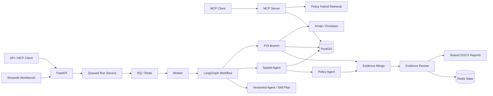

# GIS Agent 选址分析系统

这是一个面向商场与物流园场景的可审计选址分析项目。系统把项目受理、空间数据校验、GIS 分析、POI 检索与软评分、规则评估、证据审查、人工复核、报告生成和运行状态串成一条可复现链路。

当前版本是求职作品集与工程学习项目，不是生产选址系统。仓库内的空间图层、POI、政策和规则均为合成 Fixture，只用于演示接口、证据链、异常处理和测试，不代表真实世界覆盖率、合规结论或选址推荐。

## 系统能力

- 支持 `shopping_mall` 和 `logistics_park` 两类项目 Profile。
- 对候选地、数据清单、CRS、几何和必需字段执行 fail-closed 前置校验。
- 通过 GeoPandas 或 PostGIS 计算面积、空间相交、缓冲关系和最近距离。
- 支持 Fixture、高德与 Overpass POI Adapter，包含显式坐标转换、限流、重试、熔断和可审计降级。
- 依据版本化配置生成 POI 软评分和 GIS+POI 综合软评分。
- 使用规则包生成结构化规则发现；规则命中进入人工复核，未命中也不等于整体合规。
- 使用 BM25、向量检索和 RRF 生成带政策出处、条款、页码及引用片段的检索结果。
- 使用 LangGraph 并行执行 POI 与空间分支，再汇合到规则评估和证据审查。
- 使用版本化 Agent/Skill DAG 约束节点依赖、并行组、输出契约和 LLM 权限，并返回节点级执行 Trace。
- 明确标记 POI 实际返回数、查询可用数和截断状态；截断与合成来源自动进入证据质量门禁。
- 使用 Redis 保存运行状态、幂等键、POI 缓存和事件流，并为每类数据设置 TTL。
- 使用 RQ 将长时间运行的分析交给独立 Worker，支持排队、取消、超时和失败回调。
- 通过 FastAPI、MCP 和 Streamlit Workbench 提供 HTTP、工具调用和人工演示入口。
- 输出 DOCX 报告、SHA-256 摘要、阶段耗时和人工确认审计事件。
- 提供 24 条冻结评测，其中 4 条为 POI 故障场景。

## 安全边界

这些边界是系统行为的一部分，而不是文档免责声明：

- 默认运行时未配置时关闭分析能力，不静默使用演示配置。
- `GCJ-02` 不会被标记为 `EPSG:4326`；在线高德记录先显式转换为 WGS84。
- SQL 业务值使用参数化查询，表名等标识符只允许来自受控配置。
- 在线 POI 响应格式错误不会被 Fixture 降级掩盖；只有可用性错误允许显式降级。
- Fixture 降级会记录原始 Provider 与失败类型，并触发人工复核。
- 人工“确认已阅”只改变审计状态，永远不等于合规批准。
- LLM 只解释已完成的结构化证据，不改变规则结果、评分或排序。
- API 和运行状态中的未知异常只暴露清洗后的异常类型，不泄露密钥或上游响应。

## 架构概览



完整的组件职责、调用顺序和故障边界见 [架构文档](docs/architecture.md)。字段与存储结构见 [数据字典](docs/data-dictionary.md)，已知失败模式见 [Bad Case 报告](docs/bad-cases.md)。

需要逐文件理解 Agent/Skill DAG、函数调用链、状态机、POI 可信度和调试入口时，阅读 [GIS Agent 实现详解与源码导读](docs/agent-implementation-guide.md)。

## 目录结构

```text
app/                          FastAPI 路由、Schema、应用服务与运行时装配
practice/site_selection/      领域模型、工作流、GIS、POI、RAG、规则与存储
practice/site_selection/spatial/   空间校验、查询引擎和数据网关
practice/site_selection/storage/   PostGIS Repository 与 Redis Store
data/fixtures/                合成 POI、政策、规则和空间图层
deploy/                       PostGIS 初始化与迁移
scripts/                      迁移、Smoke、MCP、评测和性能脚本
workbench/                    Streamlit 人工操作台
evals/                        Day 26 冻结案例、协议与本地结果
docs/                         架构、数据字典、性能和 Bad Cases
tests/                        单元、集成、容器契约和端到端测试
notes/                        按日期记录的学习与实现说明
```

## 本地环境

需要：

- Windows 10/11 与 PowerShell
- Python 3.12
- Docker Desktop
- Git

创建并激活虚拟环境：

```powershell
python -m venv .venv
Set-ExecutionPolicy -Scope Process -ExecutionPolicy RemoteSigned
& .\.venv\Scripts\Activate.ps1
python -m pip install -r .\requirements.txt
```

复制环境变量模板并填写本地值：

```powershell
Copy-Item .\.env.example .\.env
```

不要提交 `.env`。Fixture Compose 需要 PostgreSQL、Redis 和 LLM 配置；LLM 解释失败不会改变已经完成的分析结果。

## 启动完整演示

```powershell
docker desktop start
docker compose up -d --build --wait
docker compose ps
python .\scripts\apply_postgis_migrations.py
python .\scripts\smoke_day24_fixture_runtime.py
python .\scripts\smoke_day27_async_runtime.py
```

Compose 默认以异步模式运行。`POST /site-selection/runs` 返回 `202 Accepted` 和 `run_id` 只表示任务已入队；Workbench 每 2 秒自动读取 `queued/running/completed` 状态，进入终态后自动展示结果，也可以取消尚未结束的任务。`POST /site-selection/analyses` 仍保留为显式同步分析接口。

入口：

- Workbench: <http://localhost:8501/>
- FastAPI Swagger: <http://localhost:8000/docs>
- Health: <http://localhost:8000/health>
- MCP Streamable HTTP: <http://localhost:8001/mcp>

Workbench 使用分层地图：候选地为带编号标签的红色大标记，POI 为按类别着色的小标记；两类点位都支持悬浮查看来源和指标。

`Agent 运行`页签展示本次使用的执行计划、每个 Agent/Skill 节点的状态与耗时，以及 Evidence Review 质量门禁。POI 达到查询上限时，页面明确提示数量和密度只是下界；合成 Fixture 和在线来源不会静默混写成同一可信度。

## 自动加载 POI

默认 `SITE_SELECTION_POI_PROVIDER=fixture`，用于离线演示和确定性测试。要在每次分析中自动查询在线 POI，可在 `.env` 选择：

```dotenv
# 无 Key 时使用 Overpass；配置 AMAP_API_KEY 后优先高德
SITE_SELECTION_POI_PROVIDER=auto
AMAP_API_KEY=
SITE_SELECTION_POI_FALLBACK_ENABLED=true
SITE_SELECTION_POI_PERSIST_ENABLED=true
```

也可以显式设置为 `overpass` 或 `amap`。在线查询包含速率限制、有界重试、熔断和 Redis TTL 缓存；首次成功返回会按 `source + source_id` 参数化 upsert 到 PostGIS。可用性错误允许显式回退 Fixture，格式错误不会被回退掩盖。API 与 Worker 必须使用相同配置，Compose 已统一透传这些变量。

停止服务：

```powershell
docker compose stop
```

## 主要 API

| 方法 | 路径 | 作用 |
|---|---|---|
| `GET` | `/health` | 服务健康检查 |
| `POST` | `/site-selection/preflight` | 对不完整输入执行前置检查 |
| `POST` | `/site-selection/analyses` | 同步执行选址分析 |
| `POST` | `/site-selection/runs` | 幂等创建运行；异步模式返回 `202 queued` |
| `GET` | `/site-selection/runs/{run_id}` | 读取运行状态、分析、解释与阶段 Trace |
| `POST` | `/site-selection/runs/{run_id}/cancel` | 取消 queued/running 任务 |
| `POST` | `/site-selection/runs/{run_id}/human-review/acknowledge` | 记录人工已阅，不作合规批准 |
| `GET` | `/site-selection/runs/{run_id}/events` | 读取审计事件 |
| `GET` | `/site-selection/runs/{run_id}/report` | 下载 DOCX 报告 |
| `POST` | `/site-selection/poi/preview` | 查询 POI，支持 Redis 缓存与显式刷新 |

MCP 暴露六个工具：`gis_feature_area`、`gis_intersection_count`、`gis_nearest_distance`、`poi_nearby`、`poi_metrics` 和 `policy_search`。

## 运行测试

全部测试：

```powershell
python -m pytest -q --basetemp .\.venv\pytest-tmp
```

Day 26 完成后的全量回归结果是 `430 passed in 8.39s`。该数字来自 2026-08-19 的 Windows/Python 3.12 本机运行，只用于当前版本回归，不代表生产性能。

运行冻结评测：

```powershell
python .\scripts\run_day26_evaluations.py
```

输出写入 `evals/results/day26-summary.json`。脚本只使用本地合成 Fixture，不访问在线 POI。

记录本机性能：

```powershell
python .\scripts\benchmark_day26.py --samples 7 --warmup-runs 2
```

输出写入 `evals/results/day26-performance.json`。这些结果仅表示当前机器上的 Fixture 基线，不是生产容量、在线服务 SLA 或真实 POI 覆盖率。

## Fixture 与真实数据

`data/fixtures/candidates.json` 当前为商场和物流园各提供 6 个候选，共 12 个候选场景；`data/fixtures/poi.json` 包含围绕这些候选生成的 478 条合成 POI、25 个类别。候选覆盖轨交餐饮核心、办公门户、成熟居住区、竞争饱和区、成长外围、高速门户、铁路产业、港口仓储、城市配送和航空联运等差异化画像，能够验证多候选比较、分类、半径、指标、排序和异常路径。

这些数据由 `scripts/generate_rich_fixtures.py` 确定性生成，可复现但不等于真实。接口、Workbench 和报告同时展示查询命中数、数据集总量、`is_synthetic` 与质量说明，禁止把 478 条局部场景数据解释为城市覆盖率。详细边界见 `docs/fixture-data-quality.md`。在线 Provider 已可自动加载，但用于真实决策前仍必须完成 API 授权、分页完整性、数据新鲜度、行政区覆盖率、坐标转换精度、类别映射抽检和成本评估。

政策、规则和空间图层也都是合成测试数据。任何演示输出都只能表述为“系统流程与证据链已执行”，不能表述为“地块合规”或“推荐选址”。
