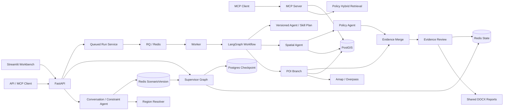
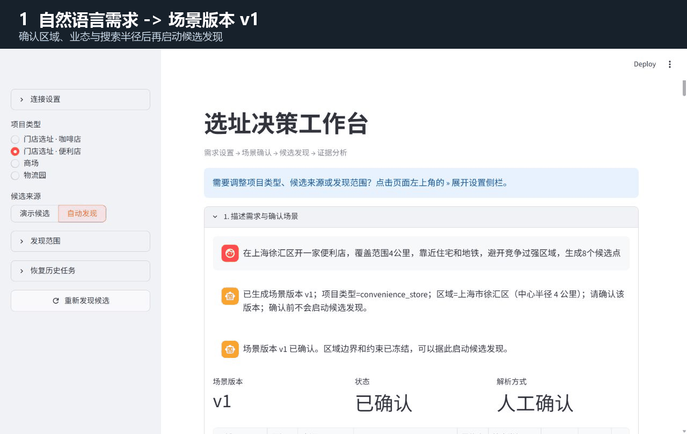

# GIS Agent 选址分析系统

这是一个面向门店、商场与物流园场景的可审计选址分析项目。系统把项目受理、空间数据校验、GIS 分析、POI 检索与软评分、规则评估、证据审查、人工复核、报告生成和运行状态串成一条可复现链路。

当前版本是求职作品集与工程学习项目，不是生产选址系统。仓库内的空间图层、POI、政策和规则均为合成 Fixture，只用于演示接口、证据链、异常处理和测试，不代表真实世界覆盖率、合规结论或选址推荐。

咖啡店和便利店现支持按范围自动发现候选，并按“登记用地 → 商业用地代理 → 市场探索”三级策略安全降级。缺少用地不再阻断商业选址分析：系统继续完成 POI、交通、需求代理、竞品评分和候选对比，但把 GIS、政策与用地合规状态标记为待核验；只有完整用地结果可以执行合规审查。详见 [候选位置自动发现](docs/candidate-discovery.md)。

Workbench 直接按用户输入区域运行商业选址分析，不要求用户切换到演示范围，也不会伪造地块。需要展示完整 GIS/规则链时，仍可在“演示与开发选项”中主动使用版本化合成用地；演示结果明确标记合成数据，不代表真实规划许可。

## 系统能力

- 支持 `coffee_shop`、`convenience_store`、`shopping_mall` 和 `logistics_park` 四类项目 Profile。
- 咖啡店与便利店分别使用独立的需求代理、交通、互补业态和同业竞争模型；竞争组按“数量越少、最近竞品越远越好”评分。
- 对候选地、数据清单、CRS、几何和必需字段执行 fail-closed 前置校验。
- 支持“任意区域商业选址分析”“显式合成用地全流程演示”和“真实用地合规审查”三条证据路径，默认不把演示范围覆盖用户输入。
- 通过 GeoPandas 或 PostGIS 计算面积、空间相交、缓冲关系和最近距离。
- 支持 Fixture、高德与 Overpass POI Adapter，包含显式坐标转换、限流、重试、熔断和可审计降级。
- 候选发现与正式分析复用同一份 POI 证据快照；完整评分组本地裁剪，只有不完整组才按候选点服务半径联网补查。
- 提供候选级覆盖诊断和评分组级横向可比性诊断，不把真实密度差异、网络失败和 Fixture 降级混成同一种“POI 少”。
- 依据版本化配置生成 POI 软评分和 GIS+POI 综合软评分。
- 使用规则包生成结构化规则发现；规则命中进入人工复核，未命中也不等于整体合规。
- 使用 BM25、向量检索和 RRF 生成带政策出处、条款、页码及引用片段的检索结果。
- 使用 LangGraph 并行执行 POI 与空间分支，再汇合到规则评估和证据审查。
- 使用版本化 Agent/Skill DAG 约束节点依赖、并行组、输出契约和 LLM 权限，并返回节点级执行 Trace。
- 使用 Supervisor Graph 组合候选发现、可恢复人工确认和异步分析；根据证据自动路由 `market_selection` 或 `full_compliance`，Postgres 保存 checkpoint，Redis 管理会话 TTL、通用转换锁、RunState 和审计事件。
- 支持自然语言场景对话：把项目类型、区域、搜索半径、候选数量和间距转成待确认约束；确认后形成不可变 `ScenarioVersion` 并把边界交给候选发现。
- 支持离线演示目录与高德行政区解析；区域只转换为受 20 公里安全门禁约束的中心搜索窗口，并披露 Provider、置信度和非权威边界警告。
- 明确标记 POI 实际返回数、查询可用数和截断状态；截断与合成来源自动进入证据质量门禁。
- 使用 Redis 保存运行状态、幂等键、POI 缓存、候选发现证据快照和事件流，并为每类数据设置 TTL。
- 使用 RQ 将长时间运行的分析交给独立 Worker，支持排队、取消、超时和失败回调。
- 正式 POI 查询最多 4 路有界并发且保持结果顺序；RQ 超时回调与 API 陈旧状态对账共同保证 Run 最终进入明确终态。
- 通过 FastAPI、MCP 和 Streamlit Workbench 提供 HTTP、工具调用和人工演示入口。
- 输出 DOCX 报告、SHA-256 摘要、阶段耗时和人工确认审计事件。
- 提供 24 条冻结评测，其中 4 条为 POI 故障场景。

## 安全边界

这些边界是系统行为的一部分，而不是文档免责声明：

- 默认运行时未配置时关闭分析能力，不静默使用演示配置。
- `GCJ-02` 不会被标记为 `EPSG:4326`；在线高德记录先显式转换为 WGS84。
- SQL 业务值使用参数化查询，表名等标识符只允许来自受控配置。
- 在线 POI 响应格式错误不会被 Fixture 降级掩盖；只有可用性错误允许显式降级。
- Fixture 降级会记录原始 Provider 与失败类型，并触发人工复核。
- 人工“确认已阅”只改变审计状态，永远不等于合规批准。
- LLM 只解释已完成的结构化证据，不改变规则结果、评分或排序。
- 对话 LLM 只允许提出 `add / replace / remove` 约束动作；Schema、冲突、数据就绪、区域边界和版本确认由确定性代码裁决。
- API 和运行状态中的未知异常只暴露清洗后的异常类型，不泄露密钥或上游响应。

## 架构概览



完整的组件职责、调用顺序和故障边界见 [架构文档](docs/architecture.md)。字段与存储结构见 [数据字典](docs/data-dictionary.md)，已知失败模式见 [Bad Case 报告](docs/bad-cases.md)。

需要逐文件理解 Agent/Skill DAG、函数调用链、状态机、POI 可信度和调试入口时，阅读 [GIS Agent 实现详解与源码导读](docs/agent-implementation-guide.md)。

## 目录结构

```text
app/                          FastAPI 路由、Schema、应用服务与运行时装配
practice/site_selection/      领域模型、工作流、GIS、POI、RAG、规则与存储
practice/site_selection/spatial/   空间校验、查询引擎和数据网关
practice/site_selection/storage/   PostGIS Repository 与 Redis Store
data/fixtures/                合成 POI、政策、规则和空间图层
deploy/                       PostGIS 初始化与迁移
scripts/                      迁移、Smoke、MCP、评测和性能脚本
workbench/                    Streamlit 人工操作台
evals/                        冻结案例、协议与本地结果
docs/                         架构、数据字典、性能和 Bad Cases
tests/                        单元、集成、容器契约和端到端测试
notes/                        记录的学习与实现说明
```

## 本地环境

需要：

- Windows 10/11 与 PowerShell
- Python 3.12
- Docker Desktop
- Git

创建并激活虚拟环境：

```powershell
python -m venv .venv
Set-ExecutionPolicy -Scope Process -ExecutionPolicy RemoteSigned
& .\.venv\Scripts\Activate.ps1
python -m pip install -r .\requirements.txt
```

复制环境变量模板并填写本地值：

```powershell
Copy-Item .\.env.example .\.env
```

不要提交 `.env`。Fixture Compose 需要 PostgreSQL、Redis 和 LLM 配置；LLM 解释失败不会改变已经完成的分析结果。

## 启动完整演示

```powershell
docker desktop start
docker compose up -d --build --wait
docker compose ps
python .\scripts\apply_postgis_migrations.py
python .\scripts\smoke_fixture_runtime.py
python .\scripts\smoke_async_runtime.py
```

Compose 默认以异步模式运行。`POST /site-selection/runs` 返回 `202 Accepted` 和 `run_id` 只表示任务已入队；Workbench 每 2 秒自动读取 `queued/running/completed` 状态，进入终态后自动展示结果，也可以取消尚未结束的任务。`POST /site-selection/analyses` 仍保留为显式同步分析接口。

零售自动发现走 Supervisor session：发现后停在人工确认，session ID 写入页面 URL；刷新后从 Postgres checkpoint 恢复，确认请求通过 checkpoint 版本和 Redis 锁防止重复提交。确认成功只把正式分析提交到现有 RQ 队列并返回 `202 awaiting_analysis`，不会占用 API 请求等待 GIS、解释和报告。Worker 把 Run 推进到完成、失败、取消或超时后恢复同一个 Supervisor checkpoint；若回调暂时失败，后续 GET 会按 RunState 幂等对账。Workbench 每 2 秒轮询 Supervisor，终态后读取关联 Run，因此自动发现路径同样保留 DOCX、LLM 解释和完整阶段 Trace。

入口：

- Workbench: <http://localhost:8501/>
- FastAPI Swagger: <http://localhost:8000/docs>
- Health: <http://localhost:8000/health>
- MCP Streamable HTTP: <http://localhost:8001/mcp>

Workbench 使用分层地图：候选地为带编号标签的红色大标记，POI 为按类别着色的小标记；两类点位都支持悬浮查看来源和指标。

`Agent 运行`页签展示本次使用的执行计划、每个 Agent/Skill 节点的状态与耗时，以及 Evidence Review 质量门禁。POI 达到查询上限时，页面明确提示数量和密度只是下界；合成 Fixture 和在线来源不会静默混写成同一可信度。

LLM 证据解释是确定性分析之后的非关键增强。Compose 默认将单次解释限制为 15 秒并关闭 SDK 自动重试；连接或模型不可用时解释标记为 `failed`，GIS、POI、规则、评分和报告结果仍保持 `completed`，不会再为同一个失败请求等待数分钟。

## 自动加载 POI

Docker Compose 默认 `SITE_SELECTION_POI_PROVIDER=auto`：存在高德 Key 时使用高德，否则使用 Overpass；在线不可用时显式降级到 Fixture。需要完全离线、确定性演示时，可在 `.env` 选择：

```dotenv
# 完全离线演示；删除此覆盖项即可恢复 auto
SITE_SELECTION_POI_PROVIDER=fixture
AMAP_API_KEY=
SITE_SELECTION_POI_FALLBACK_ENABLED=true
SITE_SELECTION_POI_PERSIST_ENABLED=true
```

也可以显式设置为 `overpass` 或 `amap`。高德与 Overpass 都按业态评分组和最多三类的小批次均衡加载，避免一次超大范围、多类别请求拖垮公共服务；Fixture 仍可在离线测试中批量返回。首轮评分组发生在线降级、截断或缺类别时，候选发现会对整个范围执行有界 2x2 分区补查，只合并真实在线结果后重新评分。一个 Profile 最多产生 24 个分区补查任务，由最多 4 个 Worker 交错执行；正式分析的候选局部补查也最多 4 路并发，并使用有序收集保证评分输出稳定。两条链路共享线程安全的全局 Provider 限速器，默认每秒只启动 1 个请求。

当前在线稳定性默认值为：单次请求 `15s`、每组最多 `2` 次尝试、连续失败阈值 `12`、指数退避 `2s` 到 `8s`；高德每批最多 2 页。并发只用于重叠网络等待，不绕过全局 1 QPS 限速。只有成功且结构有效的在线结果写入 Redis TTL 缓存，超时、限流、格式错误和 Fixture 降级不会占用在线成功缓存键。Provider cache token 进入缓存作用域，配置升级不会复用旧版本结果。来源元数据用 `cache_hit`、`fallback_from`、`fallback_reason`、补查状态和分区修复字段区分冷查询、命中、降级与剩余缺口；首次成功返回会按 `source + source_id` 参数化 upsert 到 PostGIS。格式错误不会被回退掩盖。API 与 Worker 必须使用相同配置，Compose 已统一透传这些变量。

如果宿主机通过代理访问外网，容器内不能使用 `127.0.0.1` 指向宿主机。可在 `.env` 配置 `SITE_SELECTION_POI_PROXY_URL=http://host.docker.internal:7897`，然后重建 API 和 Worker。没有高德 Key 且 Overpass 不可达时，`auto` 只能显式降级到演示 Fixture，不能把少量合成数据解释为城市完整 POI。

零售候选发现会把用于评分的宽域 POI 冻结为 Redis 证据快照，默认 TTL 为 2 小时。用户确认候选后，正式分析通过 `poi_evidence_snapshot_id` 在本地按候选、类别和 Profile 半径裁剪并重算指标；完整评分组不重复联网，宽域快照被 Provider 截断、缺组、缺类别、使用合成来源或发生在线降级时，才按受影响候选的实际服务半径补查。只有真实 Provider 响应才算补查成功；补查再次降级到 Fixture 时保留已有快照切片并记录失败，不用少量合成点覆盖原证据。快照过期或候选位置被替换时返回 `409`，要求重新发现；来源中的 `evidence_snapshot_id`、`evidence_reused`、`evidence_supplemented`、补查原因和失败原因可用于核验实际证据路径。Workbench 同时展示候选覆盖和评分组 cohort 可比性；只有同组所有候选都是真实、非截断且无补查失败时，数量差异才标记为可横向比较。

## 自动加载真实公开用地

Compose 默认 `SITE_SELECTION_LAND_USE_PROVIDER=auto`，通过与 POI 相同的代理配置查询 Overpass 中的 `landuse=commercial/retail` 和商业建筑多边形。候选发现的用地优先级为：经治理的权威 PostGIS 图层、OSM 公开用地观察、现有商业代理、市场网格。OSM 候选使用真实多边形的质心和投影面积，不再是规则网格；结果记录数据集、查询时间、ODbL 许可、缓存命中和 `public_observation` 证据等级。它可以支持商业初筛，但不能证明法定用途、产权或经营许可，因此仍只运行 `market_selection`，完整合规分析保持阻断。

只读验证示例：

```powershell
python .\scripts\smoke_land_use_provider.py `
  --west 121.29 --south 31.14 --east 121.37 --north 31.19 `
  --project-type coffee_shop
```

在该上海示例范围的真实探测返回 181 个质心位于边界内的 OSM 商业/零售用地或商业建筑多边形。该数字只证明当次公开数据有覆盖，不代表法定用地完整率。查询成功结果按范围、项目类型和 Provider 版本写入 Redis，默认 TTL 为 1 小时；网络失败和错误响应不缓存。若 Overpass 不可用，`strict` 请求关闭失败，其他模式按既有代理/市场策略降级，并继续把用地合规标记为待核验。

取得自然资源或规划部门授权图层后，可先导入 PostGIS：

```powershell
python .\scripts\import_authoritative_land_use.py .\data\land\official.gpkg `
  --layer-id shanghai-official-land-2026 `
  --name "上海法定用地 2026" `
  --version 2026-08 `
  --source-uri "主管部门数据目录或内部登记号" `
  --license "授权说明" `
  --analysis-crs EPSG:32651
```

源文件必须提供可映射为 `parcel_id/name/land_use_class/suitability` 的字段；面积缺失时按米制投影计算。导入脚本保存来源、许可、版本、哈希和 `authoritative` 标记。随后在 `.env` 设置 `SITE_SELECTION_AUTHORITATIVE_LAND_LAYER_ID=shanghai-official-land-2026` 并重建 API/Worker。启动时会拒绝 Fixture、缺字段、地理坐标分析 CRS、缺来源或缺许可的伪权威图层。

停止服务：

```powershell
docker compose stop
```

## 主要 API

| 方法 | 路径 | 作用 |
|---|---|---|
| `GET` | `/health` | 服务健康检查 |
| `POST` | `/chat` | 创建或续接自然语言场景，返回待确认 `ScenarioVersion` |
| `GET` | `/chat/{session_id}` | 恢复场景版本与对话历史 |
| `POST` | `/chat/{session_id}/confirm` | 确认不可变场景版本并生成候选发现请求 |
| `POST` | `/site-selection/preflight` | 对不完整输入执行前置检查 |
| `POST` | `/site-selection/candidates/discover` | 按范围、用地与 POI 自动发现零售候选并冻结评分证据 |
| `POST` | `/site-selection/supervisor/sessions` | 创建可恢复选址 session，并停在候选确认 |
| `GET` | `/site-selection/supervisor/sessions/{session_id}` | 恢复 Supervisor 当前状态 |
| `POST` | `/site-selection/supervisor/sessions/{session_id}/confirm` | 按 checkpoint 版本确认候选并异步提交正式分析；等待时返回 202 |
| `GET` | `/site-selection/supervisor/sessions/{session_id}/events` | 读取 Supervisor 审计事件 |
| `POST` | `/site-selection/analyses` | 同步执行选址分析 |
| `POST` | `/site-selection/runs` | 幂等创建运行；异步模式返回 `202 queued` |
| `GET` | `/site-selection/runs/{run_id}` | 读取运行状态、分析、解释与阶段 Trace |
| `POST` | `/site-selection/runs/{run_id}/cancel` | 取消 queued/running 任务 |
| `POST` | `/site-selection/runs/{run_id}/human-review/acknowledge` | 记录人工已阅，不作合规批准 |
| `GET` | `/site-selection/runs/{run_id}/events` | 读取审计事件 |
| `GET` | `/site-selection/runs/{run_id}/report` | 下载 DOCX 报告 |
| `POST` | `/site-selection/poi/preview` | 查询 POI，支持 Redis 缓存与显式刷新 |

MCP 暴露六个工具：`gis_feature_area`、`gis_intersection_count`、`gis_nearest_distance`、`poi_nearby`、`poi_metrics` 和 `policy_search`。

## 运行测试

全部测试：

```powershell
python -m pytest -q --basetemp .\.venv\pytest-tmp
```

最近完整回归基线为 `577 passed`，冻结评测为 `24/24`；本轮 POI 可比性、正式并发和超时收敛扩展回归为 `69 passed in 3.97s`。这些数字只用于代码回归，不代表生产性能、真实数据覆盖率或公网 Provider SLA。真实 Docker 已安装 `langgraph-checkpoint-postgres 3.1.2`，此前六服务健康、API 重启恢复和新会话端到端运行均已验证；旧 Run 不会重算历史快照，验收新逻辑时必须创建新 Supervisor session。

运行冻结评测：

```powershell
python .\scripts\run_evaluations.py
```

输出写入 `evals/results/summary.json`。脚本只使用本地合成 Fixture，不访问在线 POI。

记录本机性能：

```powershell
python .\scripts\benchmark.py --samples 7 --warmup-runs 2
```

输出写入 `evals/results/performance.json`。这些结果仅表示当前机器上的 Fixture 基线，不是生产容量、在线服务 SLA 或真实 POI 覆盖率。

## Fixture 与真实数据

`data/fixtures/candidates.json` 当前为咖啡店、便利店、商场和物流园各提供 6 个候选，共 24 个候选场景；`data/fixtures/poi.json` 包含围绕这些候选生成的 1,157 条合成 POI、30 个类别。门店候选覆盖轨交办公、成熟社区、文化休闲、同业饱和、学校生活圈和车辆服务等画像，建设项目候选继续覆盖商业、物流与空间约束场景，能够验证多候选比较、分类、半径、指标、排序和异常路径。

这些数据由 `scripts/generate_rich_fixtures.py` 确定性生成，可复现但不等于真实。接口、Workbench 和报告同时展示查询命中数、数据集总量、`is_synthetic` 与质量说明，禁止把 1,157 条局部场景数据解释为城市覆盖率或真实客流。详细边界见 `docs/fixture-data-quality.md` 和 `docs/retail-site-selection.md`。在线 Provider 已可自动加载，但用于真实决策前仍必须完成 API 授权、分页完整性、数据新鲜度、行政区覆盖率、坐标转换精度、类别映射抽检和成本评估。

政策、规则和空间图层也都是合成测试数据。任何演示输出都只能表述为“系统流程与证据链已执行”，不能表述为“地块合规”或“推荐选址”。

## Demo



本次演示覆盖自然语言需求解析、场景确认、候选自动发现、
POI 证据快照、候选局部补查、异步分析、人工复核和报告生成。

- [查看完整演示说明](demo/README.md)
- [下载便利店选址分析样例报告](demo/convenience-store-analysis-report.docx)
