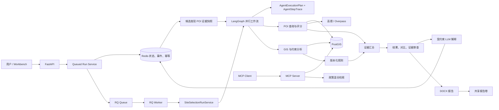
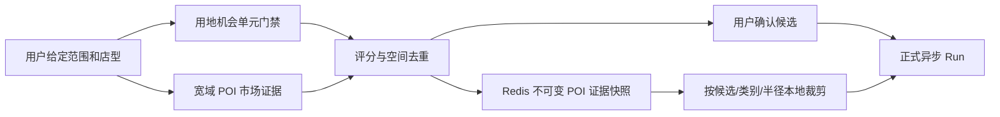
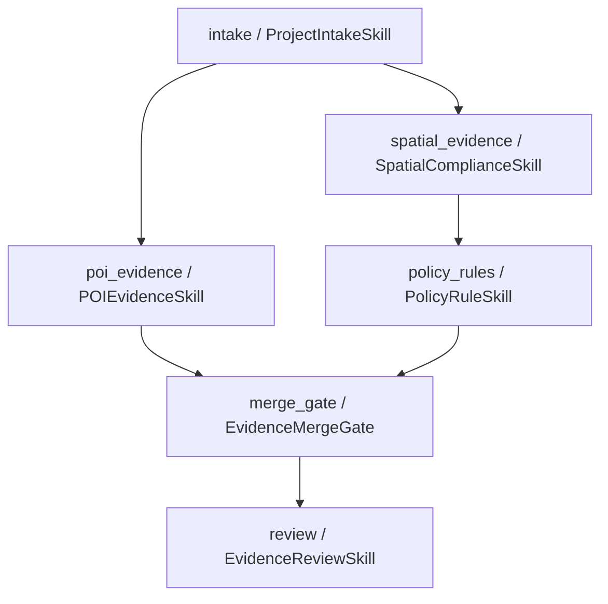
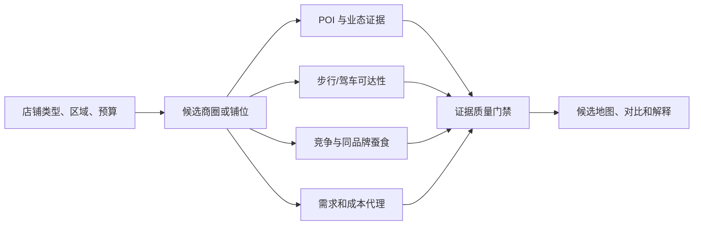
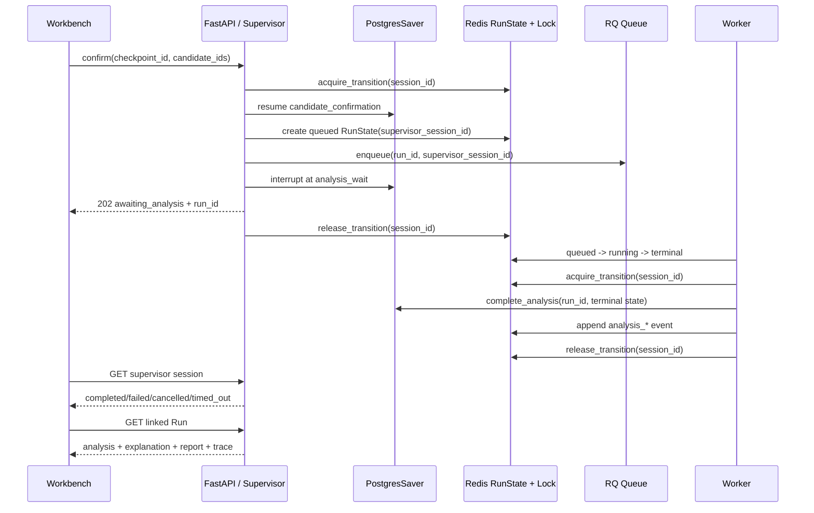

# GIS Agent 实现详解与源码导读

> 对应能力基线：自然语言场景与不可变 ScenarioVersion、区域转换、Plan 驱动 Agent DAG、六节点异步 Supervisor Graph、双可恢复停点、RQ Worker 终态恢复、零售 Profile、候选自动发现、丰富 POI、用地门禁与候选发现 POI 证据快照
>
> 最近完整回归基线：`577 passed`，冻结评测 `24/24`。本轮 POI 可比性、正式并发和超时收敛扩展回归为 `69 passed in 3.97s`；它是相关模块回归，不是新的全量回归或生产 SLA。

> 新增候选发现能力：咖啡店和便利店可在给定范围内自动加载 POI，并从带地块几何与用地属性的机会单元池中筛选候选。发现阶段使用独立可审计 DAG，用地硬门禁与 POI 市场证据并行，排序后停在人工确认点；详见 [候选位置自动发现](candidate-discovery.md)。

> 用地不足时按登记用地、商业用地代理、市场探索三级策略降级。`formal_analysis_allowed=false` 仍阻断 GIS/政策合规子图，但不再阻断零售商业选址分析；Supervisor 自动路由到 `market_selection`，继续运行候选局部 POI 补采、评分、排序、审查与报告，并将用地合规标记为待核验。

> 候选发现与正式分析现在共用一份 Redis POI 证据快照。发现阶段冻结用于评分的宽域 POI，正式分析按候选、类别和 Profile 半径本地裁剪，避免“上图 POI 很多、下方分析因第二次联网失败只剩少量 Fixture”的证据漂移，也把多候选重复在线查询缩减为一次发现加载加本地计算。

> 最近两轮故障治理详见第 39、40 节：合成或降级快照必须尝试候选局部真实补查，Fixture 再降级不得覆盖已有切片；候选级覆盖与评分组级 cohort 共同判断能否横向比较。正式 POI 执行最多 4 路有界并发并保留顺序，RQ 180 秒主预算再加 30 秒陈旧状态收敛，避免 Run 永久停在 `running`。

本文是对现有架构说明的补充，面向需要真正读懂、调试和继续开发本项目的人。它回答以下问题：

- 当前系统到底完成了什么；
- 所谓 Agent 分别由哪些类和工作流节点实现；
- 一次选址请求如何经过 API、Redis、RQ Worker、LangGraph、PostGIS、POI、规则、审查、LLM 和报告；
- 每个核心文件负责什么，主要类和函数怎样协作；
- 哪些能力已经接入当前演示，哪些只是实现并测试、尚未生产装配；
- 当前结果为什么不能被表述为真实合规结论或自动选址推荐。

## 1. 当前完成情况

系统目前已经形成一条可运行、可测试、可追踪的 GIS 选址证据链，而不再只是一个聊天接口或单文件算法示例。

| 能力域 | 已完成内容 | 当前使用方式 |
|---|---|---|
| 项目受理 | 四类 Profile、自然语言约束动作、区域转换、不可变场景版本、输入完整性检查 | Chat HTTP、Workbench、领域服务 |
| Agent 编排 | 正式分析、候选发现、Supervisor 三层版本化 Plan；Handler 白名单、图编译、节点 Trace、人工与异步分析双中断 | 三层均已接入；API 与 Worker 共享 Supervisor 工厂 |
| 并行执行 | POI 与 Spatial 同组并行，Policy 依赖 Spatial，Merge 同时等待 POI 与 Policy | `AgentExecutionPlan` 生成真实图边与 fan-in |
| GIS | CRS、单位、几何、字段校验；面积、相交、缓冲、最近距离 | GeoPandas 与 PostGIS |
| 空间存储 | 项目、图层、要素的 PostGIS Schema、迁移、Repository、空间索引 | Fixture 启动时写入并读取 |
| POI | 24 个 Fixture 候选、1,157 条合成 POI、30 类；Fixture/高德/Overpass；缓存、快照、候选局部补查、可比性诊断、重试、熔断、降级、去重入库 | Compose 可选 `fixture/auto/amap/overpass` |
| 坐标治理 | WGS84 与 GCJ-02 显式转换；禁止把 GCJ-02 冒充 EPSG:4326 | 在线高德 Adapter 边界 |
| 规则 | YAML/JSON 规则包、有效期、版本冲突检查、空间观察映射 | 四类 Fixture 规则包 |
| 政策检索 | BM25、向量相似度、RRF 融合、来源引用 | MCP `policy_search` 工具 |
| 证据审查 | 检查 GIS、POI、政策、评分、来源、截断和合成数据边界 | 工作流完成前强制执行 |
| 人工复核 | 结果复核 `not_required/pending/acknowledged`；Supervisor 候选确认使用 LangGraph interrupt | 已接 API/Workbench 和持久化装配；reviewer 与认证身份尚未绑定 |
| LLM | 可选提取约束动作、解释已完成证据；不改 GIS、分数和规则结果 | OpenAI 兼容接口，均有确定性边界 |
| 报告 | DOCX、来源、规则、评分、复核边界、SHA-256 | Worker 生成，共享卷下载 |
| 运行态 | Redis 状态、事件、幂等键、场景会话、POI 缓存、候选发现证据快照、TTL | API 与 Worker 共享 |
| 异步任务 | RQ 入队、独立 Worker、取消、180 秒超时、失败回调、原子状态转换、Worker 终态恢复 Supervisor | Compose 默认异步；GET 在 30 秒宽限后收敛陈旧 `running` 并提供幂等对账 |
| 接口 | FastAPI、MCP、Streamlit Workbench | 8000、8001、8501 |
| 质量保障 | 单元、集成、契约、Smoke、冻结评测、性能记录 | 最近完整回归 577 tests；本轮相关扩展回归 69 tests |

最近完整回归基线是 `577 passed`、冻结评测 `24/24`；本轮 POI/RQ 相关扩展回归为 `69 passed in 3.97s`。真实 Docker/RQ Smoke 已验证 HTTP `202`、Worker 消费、Redis 事件链、共享 DOCX 报告；浏览器已验证任务自动从 `queued -> running -> completed`、候选标记、分类 POI、候选覆盖与评分组可比性诊断。此前真实 Docker 还验证了 `langgraph-checkpoint-postgres 3.1.2`、六服务健康及 API 重启后同一 session 恢复。测试数量只表示当前代码回归范围，不代表真实数据覆盖率、生产容量或公网 Provider SLA。

## 2. 这个项目中的 Agent 到底是什么

这里的 Agent 不是一个大模型拿到问题后自由选择所有动作。系统采用的是“结构化 Agent + 确定性工作流”：

1. 输入输出由 Pydantic 模型约束；
2. 每个 Agent 只承担一个清晰职责；
3. LangGraph 决定节点依赖、并行和失败路由；
4. GIS、POI 指标、评分和规则全部由普通 Python/PostGIS 代码计算；
5. LLM 只在分析完成后解释证据，不参与硬规则判断；
6. 任何关键证据缺失都会 fail-closed，而不是让模型猜测。

### 2.1 五类 Agent 角色与六个 Skill 节点

| Agent 角色 | 当前实现 | 输入 | 输出 | 不负责什么 |
|---|---|---|---|---|
| Orchestrator | `OrchestratorAgent` | 可能不完整的 `SiteSelectionDraft` | `PreflightDecision` | 不访问 GIS、POI、数据库或 LLM |
| POI | `POIEvidenceSkill`（由查询与评分函数组成） | Profile 生成的 `POIQuery[]` | `POIEvidence[]` | 不判断政策合规，不把合成数据伪装为真实数据 |
| Spatial | `SpatialAgent` | 带 Manifest 的 `AgentState` | GIS 指标和空间约束观察 | 不做政策合规结论 |
| Policy | `PolicyAgent` | 已有 READY GIS 证据的状态 | 版本化 `PolicyEvidence` | 不检索或编造规则，不更改 GIS 数据 |
| Review | `ReviewAgent` | POI、GIS、Policy 均已汇合的状态 | 结果、候选对比、证据审查 | 不把最高分变成自动推荐 |

执行计划中共有六个节点：`intake`、`poi_evidence`、`spatial_evidence`、`policy_rules`、`merge_gate`、`review`。角色数、类数和节点数不是同一概念：POI 角色有独立输入输出和失败边界，但当前没有为了形式增加一个只做代理调用的 `POIAgent` 类；Orchestrator 则同时承担 Intake 路由和 Merge Gate 两个节点。

### 2.2 版本化计划如何约束 Agent

`agent_orchestration.py` 把业务图从“代码里隐含的调用顺序”提升为可返回、可校验的契约：

- `AgentSkillManifest`：声明 `node_id`、角色、Skill 名称/版本、依赖、并行组、关键性、LLM 权限和输出契约；
- `AgentExecutionPlan`：保存 `plan_id`、版本和全部节点，启动时拒绝重复节点、未知依赖、循环依赖和非拓扑顺序；
- `AgentStepTrace`：记录每个实际节点的状态、耗时和脱敏异常类型；
- `order_agent_traces()`：按计划顺序整理异步完成的 Trace，并拒绝计划外节点或 Skill 版本不一致。

`agent_graph_runtime.py` 进一步让这份计划成为正式分析图的结构唯一来源。`compile_agent_plan_graph()` 要求每个计划节点恰好配置一个 Handler：缺少 Handler 会拒绝启动，额外的隐藏 Handler 也会拒绝启动。根节点自动连接 `START`，单依赖自动串联，多依赖使用 LangGraph 的列表边形成一次性 fan-in，未被其他节点依赖的终点自动连接 `END`。因此节点、依赖、并行和汇合不再同时手写在 Manifest 与 LangGraph 两处。

正式分析图、候选发现图和上层 Supervisor 现在都由同一个编译器生成。候选发现的 `land_use_gate` 与 `poi_market_evidence` 是 LangGraph 原生并行节点，`rank_diversify` 是双依赖 fan-in，`discovery_review` 负责生成快照和确认前报告。Supervisor 组合“候选发现 -> 人工确认 interrupt -> RQ 提交 -> 分析完成 interrupt -> 终态门禁”，并要求 Checkpointer 才能编译。API 与 Worker 通过共享工厂构造同一张 Supervisor 图；Compose 使用官方 PostgresSaver 保存图状态，Redis 保存 session 租约、通用转换锁、RunState 和审计事件。测试继续使用 `InMemorySaver`，不会在生产配置失败时静默退回内存。

当前全部业务节点均为 `llm_allowed=false`。这不是说系统不用 LLM，而是明确禁止 LLM 进入面积、距离、POI 指标、规则命中和排序的事实计算链。

### 2.3 LLM 的真实位置

`OpenAISiteSelectionEvidenceExplainer` 在核心工作流完成之后运行。它收到的是经过压缩的结构化证据，不是数据库连接、原始密钥或任意文件。返回结果还要经过以下检查：

- 候选地编号必须存在；
- 引用必须属于允许的证据引用集合；
- 不能生成新的评分、排序、政策发现或推荐；
- 解释失败只把 explanation 标为 `failed`，不会把已经完成的分析改掉。

因此这个项目的主要工程价值是可验证证据编排，LLM 是受约束的展示增强，而不是事实来源。

## 3. 总体架构



### 3.1 六个 Compose 服务

| 服务 | 端口 | 作用 |
|---|---:|---|
| `api` | 8000 | 校验请求、创建运行、入队、查询状态、下载报告 |
| `worker` | 无外部端口 | 从 RQ 取任务，执行完整工作流、解释和报告 |
| `mcp` | 8001 | 暴露 GIS、POI 和政策检索工具 |
| `workbench` | 8501 | Streamlit 人工操作与证据展示 |
| `postgis` | 5432 | 项目、空间图层、要素和 POI 持久化 |
| `redis` | 6379 | 运行状态、幂等、缓存、事件以及 RQ 队列 |

API 和 Worker 使用同一套业务代码，但启动模式不同：API 的 `SITE_SELECTION_RUN_MODE=async`，Worker 强制 `sync`，避免 Worker 执行任务时再次把自己入队。

## 4. 一次异步选址请求的完整调用过程

在零售自动发现模式中，正式 Run 之前还有一条候选发现链：



关键不是简单把候选坐标传到下一步，而是同时传递 `poi_evidence_snapshot_id`。它把“发现时看到的市场证据”和“正式分析使用的评分证据”绑定在一起；快照不存在、过期、项目类型不一致、候选 ID/坐标/空间数据集被替换时，Run 在入队前返回 `409 analysis_blocked`。

### 4.1 Workbench 生成请求

`workbench/app.py` 把项目类型和候选地表格转换为：

```json
{
  "project_type": "coffee_shop",
  "poi_evidence_snapshot_id": "poi-snapshot-...",
  "candidate_parcels": [
    {
      "parcel_id": "COFFEE-DISC-01",
      "name": "咖啡店自动发现候选 A",
      "longitude": 121.47,
      "latitude": 31.23,
      "geometry_dataset_id": "demo-coffee-discovery-pool"
    }
  ]
}
```

`SiteSelectionAPIClient.create_run()` 向 `/site-selection/runs` 发送请求，并生成新的 `Idempotency-Key`。手工候选模式不携带快照 ID，继续使用正常 Provider；自动发现模式必须携带本次报告的快照 ID，不能跨报告拼接候选。

### 4.2 FastAPI 校验与创建运行

`SiteSelectionAnalysisCreate` 完成第一层 Schema 校验：

- 项目类型只能是已定义枚举；
- 至少包含一个候选地；
- `parcel_id` 不能重复；
- 经纬度必须在合法范围；
- 请求不能包含未声明字段。

路由调用 `QueuedSiteSelectionRunService.create_run()`：

1. `SiteSelectionRunService.prepare_run()` 解析 Runtime；
2. 对规范化请求计算 SHA-256 指纹；
3. Redis 原子声明幂等键；
4. 写入 `queued` 状态和 `created` 事件；
5. 生成确定性 Job ID：`site-selection-{run_id}`；
6. 写入 `enqueued` 事件；
7. 把 `run_id` 和业务命令放入 RQ；
8. 返回 HTTP `202 Accepted`。

任务载荷不包含 Redis 密码、数据库 URL、LLM Key 或其他凭据。

### 4.3 Worker 恢复运行环境

`scripts/run_site_selection_worker.py` 启动 RQ Worker。收到任务后，RQ 调用 `execute_site_selection_job()`：

1. 复制 Worker 自身环境变量；
2. 把运行模式强制改为 `sync`；
3. 调用 `build_site_selection_bootstrap_from_environment(include_mcp=False)`；
4. 连接 PostGIS 和 Redis；
5. 装配四类 Fixture Runtime、报告存储和可选 LLM Explainer；
6. 重新用 `SiteSelectionAnalysisCreate` 校验队列载荷；
7. 调用 `SiteSelectionRunService.execute_run()`。

Worker 不构建 MCP Server，因为分析任务不需要再次启动工具服务。

### 4.4 LangGraph 执行业务图

默认执行器是 `run_parallel_site_selection_workflow()`。它先构造 `site-selection-agent-dag@2026.08-agent-v1`，再执行与计划一致的 LangGraph：



POI 与 Spatial 都属于 `evidence_collection` 并行组，使用 `asyncio.gather()` 执行；Policy 不能与 Spatial 并行，因为政策规则依赖空间约束观察。Merge 内部继续执行可选 GIS+POI 组合评分；Review 内部完成结果组装、候选比较和证据审查。

成功时六个节点均写 `succeeded`。如果 Spatial 失败，POI 仍可能完成，但 `policy_rules=skipped`、`merge_gate=failed`、`review=skipped`，最终结果为空。异常正文不会进入 Trace，只保留例如 `SpatialAgentBlockedError` 的类型名。

### 4.5 POI 分支

1. `ProjectIntakeSkill` 根据 Profile，为每个地块的每个 POI 分组生成 `POIQuery`；
2. `execute_poi_queries()` 调用 Provider 无关的 `POIGateway.search()`；运行时根据 `SITE_SELECTION_POI_PROVIDER` 选择 Fixture、高德或 Overpass；
3. Adapter 返回标准化 `POIFeatureSet`；
4. `calculate_poi_metrics()` 计算数量、密度、最近距离、平均距离；
5. `score_poi_state()` 按版本化配置把指标归一化到软分；
6. 来源元数据保留 Provider、数据集版本、查询时间、CRS、降级原因、实际返回数、查询可用数和截断状态；
7. 在线结果可进入 Redis TTL 缓存，并按 `source + source_id` 参数化 upsert 到 PostGIS。

自动发现模式会在第 2 步前注入 `SnapshotReusingPOIGateway`。它先按 `group_key` 找到发现阶段的宽域评分证据，再按正式查询的候选中心、类别、半径和 `limit` 本地过滤并重新计算距离与指标。只有 Profile 新增了快照中不存在的评分组时才允许调用原 Gateway；快照本身缺失或候选错配不会静默降级。每个复用来源写入 `evidence_snapshot_id` 和 `evidence_reused=true`，Run 只有在工作流完成且实际结果包含复用来源时才把顶层 `poi_evidence_snapshot_reused` 标为真。

以商场 Profile 为例，每个地块会生成公共交通、住宅、办公、餐饮、公共服务和竞争设施六组查询。物流园使用高速入口、货运枢纽、物流服务、产业仓储、车辆服务和敏感目标六组查询。

Provider 装配顺序是：在线 Adapter -> 有界重试/熔断 -> 可选 Fixture 降级 -> 可选 PostGIS 持久化 -> Redis 缓存。缓存层只保存成功在线响应，不保存 Fixture 降级，并用 Provider cache token 隔离配置版本。`auto` 模式在存在 `AMAP_API_KEY` 时选择高德，否则选择 Overpass。只有上游可用性错误允许降级；响应结构畸形会直接失败，避免用 Fixture 掩盖数据契约错误。

`record_count` 是实际返回数，`available_record_count` 是应用 `limit` 前已确认的可用数。当后者更大时必须 `is_truncated=true`。零售 Profile 的正式查询上限已统一提高到 `1000`；即便如此，上游本身被截断时，本地快照切片仍保留“完整性未知”，不会把局部命中数伪装成完整总量。

### 4.6 Spatial 分支

`SpatialAgent.run()` 顺序执行：

1. `collect_gis_evidence()` 根据候选地的 `geometry_dataset_id` 查找 Manifest；
2. Gateway 加载 GeoDataFrame；
3. `validate_spatial_dataset()` 校验 CRS、投影单位、字段和几何；
4. `run_gis_analysis()` 计算面积、周长、缓冲区面积等指标；
5. `run_spatial_constraint_analysis()` 加载约束图层；
6. 对相交或距离阈值生成 `ConstraintObservation`。

如果缺少 Manifest、图层、CRS、必需字段、有效几何或米制投影，证据不会被伪装成 READY，工作流将被阻断。

### 4.7 Policy 分支

`PolicyAgent.run()` 调用 `evaluate_policy_rules()`：

1. 选择项目类型匹配、已启用且在有效期内的规则；
2. 阻止同一 `rule_id` 同时存在多个有效版本；
3. 检查每个规则引用的空间约束观察都存在；
4. 把观察值与 `expected_triggered` 比较；
5. 生成带规则版本、政策条款、管辖区、来源 URI 和数据版本的 `PolicyFinding`。

没有命中规则时只记录“当前已评估规则未命中”，不会生成“整体合规”。

### 4.8 汇合、评分与审查

`ReviewAgent` 负责三件事：

1. `assemble_analysis_results()`：按地块合并 GIS、POI、Policy 和组合评分；
2. `compare_candidate_results()`：只按版本化软评分排序，同时并列展示政策结果；
3. `review_site_selection_evidence()`：检查证据来源、规则、评分、降级、合成来源和 POI 截断信息是否完整。

Evidence Review 的 blocker 会让运行失败；warning 会让 `HumanReviewState` 进入 `pending`。`poi_synthetic_source` 提醒当前证据不能代表真实城市现状，`poi_result_truncated` 提醒数量、密度和相关评分输入只能解释为下界。人工确认只能变成 `acknowledged`，不存在 `approved` 状态。

### 4.9 解释、报告和终态

核心分析完成后，`SiteSelectionRunService.execute_run()`：

1. 创建人工复核状态；
2. 调用可选 LLM Explainer；
3. 生成 DOCX 报告；
4. 计算报告 SHA-256；
5. 写入阶段 Trace；
6. 用 Redis 原子状态转换写入 `completed`；
7. 追加 `completed` 事件。

Workbench 每 2 秒通过 `GET /site-selection/runs/{run_id}` 自动轮询。只有状态为 `completed` 且 `analysis` 非空时才渲染结果标签页。`Agent 运行`页签分别展示执行计划、节点轨迹和质量门禁；地图用红色大标记和文本标签显示候选地，用分类颜色小标记显示 POI。

## 5. 四套状态不要混淆

### 5.1 领域分析状态

`AnalysisStatus` 描述一次业务分析内部是否准备好：

```text
data_pending -> analyzing -> completed
        |           |
        +----------> failed
```

它存在于 `AgentState` 中。

### 5.2 基础设施运行状态

`RunStatus` 描述队列与 Worker 生命周期：

```text
queued -> running -> completed
   |         |      -> failed
   |         |      -> timed_out
   |         +------> cancelled
   +----------------> cancelled
   +----------------> failed (enqueue failure)
```

关键转换使用 Redis Lua 比较并更新，防止 Worker 完成、超时回调和用户取消互相覆盖。

### 5.3 人工复核状态

```text
not_required
pending -> acknowledged
```

`acknowledged` 仅表示已查看证据，固定审计边界为 `acknowledgement_not_compliance_approval`。

### 5.4 Agent 节点执行状态

每个计划节点只允许以下状态：

```text
succeeded
failed  -> 必须包含脱敏 error_type
skipped -> 依赖未满足，不伪装成成功
```

`RunStageTrace` 描述应用层的 `workflow/explanation/report/total` 等粗粒度阶段；`AgentStepTrace` 描述领域图中六个 Agent/Skill 节点。两者观察层级不同，不能互相替代。

## 6. 核心文件逐一说明

### 6.1 HTTP、Schema 与启动装配

| 文件 | 主要类/函数 | 作用与调用关系 |
|---|---|---|
| `app/main.py` | `create_app()`、`create_app_from_environment()` | 创建 FastAPI，注入分析服务、运行服务、队列、MCP 和 lifespan 资源关闭器；没有配置时使用 fail-closed 服务 |
| `app/api/site_selection.py` | preflight、analysis、run、cancel、events、report、POI preview 路由 | 只做 HTTP 校验、依赖获取、错误到状态码映射和响应序列化，不实现 GIS 或规则逻辑 |
| `app/schemas/site_selection.py` | `CandidateParcelInput`、`SiteSelectionAnalysisCreate`、`SiteSelectionRunResponse` 等 | 外部 API 契约；把 HTTP 输入转换为领域对象，并把 Redis `RunState` 转换为响应 |
| `app/site_selection_bootstrap.py` | `SiteSelectionBootstrap`、`build_site_selection_bootstrap_from_environment()` | 读取环境变量，迁移/播种 PostGIS，创建 Redis Store、Runtime Registry、RQ Queue、MCP 和 Explainer |
| `app/api/health.py` | `get_health()` | 容器健康检查入口 |
| `app/api/chat.py` | `create_chat()` | 早期聊天示例接口，不是当前选址工作流主入口 |
| `app/api/documents.py` | `create_document()` | 早期文档登记示例接口，当前政策 RAG 没有通过此接口自动入库 |

### 6.2 应用服务层

| 文件 | 主要类/函数 | 具体职责 |
|---|---|---|
| `app/services/site_selection_service.py` | `SiteSelectionRuntime`、`SiteSelectionRuntimeRegistry`、`SiteSelectionAnalysisService` | 把项目类型映射到数据集和工作流依赖；提供同步分析入口；Registry 返回防御性副本 |
| `app/services/site_selection_run_service.py` | `prepare_run()`、`execute_run()`、`mark_*()`、`preview_poi()` | Redis 生命周期中枢；幂等、执行、取消、超时、报告、解释、人工复核、Trace、缓存都从这里协调 |
| `app/services/site_selection_queue.py` | `RQQueueSettings`、`RQSiteSelectionJobQueue`、`QueuedSiteSelectionRunService` | 把应用服务接到 RQ；确定 Job ID、入队、取消排队任务、停止运行中任务 |
| `app/services/site_selection_worker.py` | `execute_site_selection_job()`、`record_site_selection_job_failure()` | Worker 任务函数和失败回调；重新装配环境，区分普通失败与超时，保护已有终态 |
| `app/services/site_selection_poi_provider.py` | `build_configured_poi_provider()`、`ConfiguredPOIProvider` | 解析 `fixture/auto/amap/overpass`，装配在线 Adapter、重试熔断、显式降级、PostGIS 持久化和 Redis 缓存 |
| `app/services/site_selection_explanation.py` | `OpenAISiteSelectionEvidenceExplainer`、`failed_explanation()` | 构造受限证据载荷，调用 OpenAI 兼容接口，校验返回引用并隔离失败 |
| `app/services/site_selection_artifacts.py` | `FileSystemSiteSelectionReportStore` | 在受控根目录生成、解析 DOCX；临时文件原子替换；返回 URL 和 SHA-256 |

### 6.3 领域契约、受理和 Profile

| 文件 | 主要类/函数 | 具体职责 |
|---|---|---|
| `practice/site_selection/__init__.py` | 公共对象再导出 | 作为领域包的公开门面，让应用层不需要了解每个内部模块路径；不承载业务执行逻辑 |
| `practice/site_selection/domain.py` | `ProjectType`、`CandidateParcel`、`ProjectRequest`、`DatasetManifest` | 最基础的项目、候选地和数据清单模型；拒绝未知字段、重复地块和无时区时间 |
| `profiles.py` | `ProjectProfile`、四类 Profile、`get_project_profile()` | 定义每类项目的 POI 分组、半径、指标和权重；返回深拷贝避免运行时修改全局配置 |
| `intake.py` | `ProfileRegistry`、`ProjectTypeRouter`、`build_poi_queries()`、`ProjectIntakeSkill` | 完成项目路由并为每个地块生成确定性 POI 查询，创建初始 `data_pending` 状态 |
| `preflight.py` | `SiteSelectionDraft`、`PreflightDecision`、`evaluate_site_selection_draft()` | 面向不完整输入，返回 ready/needs_input/unsupported，不猜缺失值 |
| `constraints.py` | `ConstraintLayerSpec`、`ConstraintObservation` | 定义相交/距离空间约束及其可审计观察结果 |
| `candidate_discovery.py` | `CandidateDiscoveryGraphState`、`build_candidate_discovery_graph()`、`CandidateDiscoveryService` | 用统一 Plan 编译器生成五节点发现图；并行获取用地与宽域 POI，执行硬门禁、评分、去重、快照和确认前报告 |

### 6.4 Agent 与工作流

| 文件 | 主要类/函数 | 具体职责 |
|---|---|---|
| `agents.py` | `OrchestratorAgent`、`SpatialAgent`、`PolicyAgent`、`ReviewAgent` | 四类职责明确的结构化 Agent；每个 Agent 输入输出都经过 Pydantic 校验 |
| `agent_orchestration.py` | `AgentSkillManifest`、`AgentExecutionPlan`、`AgentStepTrace` | 定义五类角色和六节点 DAG；校验闭合、无环、拓扑顺序、Skill 版本、并行组、LLM 权限和 Trace 一致性 |
| `agent_graph_runtime.py` | `compile_agent_plan_graph()`、`AgentGraphConfigurationError` | 校验计划节点与运行 Handler 一一对应；从依赖自动生成 START、串行边、并行分支、fan-in 和 END |
| `workflow.py` | `SiteSelectionWorkflowDependencies`、`build_site_selection_graph()`、`run_site_selection_workflow()` | 串行参考图；每个节点使用 `_safe_node()` 统一处理预期错误和未知异常 |
| `parallel_workflow.py` | `build_parallel_site_selection_graph()`、`run_parallel_site_selection_workflow()` | 为六个计划节点提供领域 Handler；节点名和边由 Plan 编译器注册，为成功、失败和跳过记录 Trace |
| `evidence.py` | `GISEvidence`、`POIEvidence`、`PolicyEvidence`、`AnalysisResult`、`AgentState` | 整条业务图共享的强类型状态；绑定 `execution_plan/agent_trace`，拒绝重复或计划外节点 |
| `results.py` | `assemble_analysis_results()` | 要求每个地块拥有三类 READY 证据，合并为最终 `AnalysisResult` |
| `comparison.py` | `compare_candidate_results()` | 生成软评分排名；政策结果独立展示，不允许缺分或重复排名数据 |
| `evidence_review.py` | `review_site_selection_evidence()` | 检查来源、规则、评分、降级、截断、合成来源和引用完整性，生成 blocker/warning |
| `review_contracts.py` | Review 枚举与模型 | 定义审查状态、问题严重级别和报告一致性约束 |
| `run_reliability.py` | `RunStageTrace`、`HumanReviewState`、`build_human_review_state()` | 从审查问题生成复核状态，并限制 Trace 只保存脱敏阶段信息 |

### 6.5 GIS 与空间数据

| 文件 | 主要类/函数 | 具体职责 |
|---|---|---|
| `spatial/validate.py` | `parse_crs()`、`validate_spatial_dataset()` | 阻断缺 CRS、地理坐标系直接量算、非米制投影、缺字段、空/无效几何和空数据集 |
| `spatial/hashing.py` | `stable_spatial_hash()` | 对 CRS、字段、属性和标准化几何做稳定 SHA-256；不受行顺序、索引和 Polygon 起点影响 |
| `spatial/gateway.py` | `SpatialDatasetGateway`、`MockSpatialDatasetGateway`、`collect_gis_evidence()` | Provider 无关加载边界；把数据缺失、访问失败和校验失败映射成结构化证据状态 |
| `spatial/file_gateway.py` | `FileSpatialDatasetGateway` | 只允许受控根目录内的 GeoJSON/JSON/GPKG/SHP；拒绝绝对路径和目录穿越 |
| `spatial/postgis_gateway.py` | `PostGISSpatialDatasetGateway`、`StoredPostGISSpatialDatasetGateway` | 前者读取白名单关系；后者从规范化 `site_selection` 表恢复图层和源属性 |
| `spatial/analysis.py` | `calculate_spatial_metrics()`、`run_gis_analysis()` | 计算面积、公顷、周长、缓冲、相交数、最近距离并写回 GIS 证据 |
| `spatial/constraint_analysis.py` | `run_spatial_constraint_analysis()` | 按约束配置加载上下文图层，统一 CRS，生成相交或邻近观察 |
| `spatial/query_engine.py` | `GeoPandasSpatialQueryEngine`、`PostGISSpatialQueryEngine` | 用同一返回契约实现内存和数据库计算；PostGIS 参数化地块、图层和 SRID 值 |

### 6.6 POI、标准化与可靠性

| 文件 | 主要类/函数 | 具体职责 |
|---|---|---|
| `poi.py` | `POIQuery`、`POIRecord`、`POISourceMeta`、`POIFeatureSet` | Provider 无关契约；区分返回数、可用数、数据集总量，强制截断标记与计数一致 |
| `evidence_snapshot.py` | `CandidateDiscoveryPOISnapshot`、`build_*_snapshot()`、`validate_snapshot_selection()`、`SnapshotReusingPOIGateway` | 冻结候选发现评分 POI，校验内容 SHA-256、候选归属和位置；正式分析本地裁剪并记录实际复用来源 |
| `poi_service.py` | `POIGateway`、`calculate_poi_metrics()`、`execute_poi_queries()` | 执行标准化查询并计算数量、密度和距离指标 |
| `poi_adapters.py` | `FixturePOIAdapter`、`haversine_distance_m()` | 从 1,157 条确定性 Fixture 过滤类别和半径，在切片前统计可用数并记录截断 |
| `online_poi_adapters.py` | `AmapPOIAdapter`、`OverpassPOIAdapter`、`GCJ02CoordinateTransformer` | 在线分页、类别映射、速率限制、响应校验和坐标转换 |
| `online_poi_adapters.py` | `RetryingCircuitBreakerPOIAdapter`、`FallbackPOIAdapter`、`CachedPOIAdapter`、`PersistingPOIAdapter` | 只对可用性错误重试/熔断/显式降级；缓存复用、入库和畸形响应阻断 |
| `fixture_catalog.py` | `FixtureCandidateCatalog`、`load_fixture_candidate_catalog()` | 按项目类型加载各 6 个候选并移除仅用于生成数据的场景字段，向 Workbench 提供质量声明 |
| `poi_normalizer.py` | `RawPOI`、`NormalizedPOI`、`POINormalizer` | 入库前统一 source、source_id、类别、地址、时间和 WGS84；拒绝未经转换的 GCJ-02 |
| `poi_metrics.py` | `build_poi_metrics_report()` | 生成更适合报告展示的距离分段与统计摘要 |
| `poi_scoring.py` | 评分配置模型、`normalize_metric_value()`、`score_poi_feature_sets()` | 按方向和上下界归一化指标，处理缺失策略，生成版本化分组和总分 |
| `poi_scoring_service.py` | `score_poi_state()` | 把 POI 评分器应用到每个候选地并写回 `POIEvidence` |

### 6.7 综合评分、规则、政策和审查

| 文件 | 主要类/函数 | 具体职责 |
|---|---|---|
| `site_scoring_contracts.py` | `GISMetricScoringRule`、`SiteScoringConfig`、`SiteScoreReport` | 定义 GIS+POI 组合软评分及版本、权重、指标来源 |
| `site_scoring_service.py` | `score_site_state()` | 要求 READY GIS/POI 和版本化 POI 分数，再计算组合软分 |
| `rules.py` | `RuleDefinition`、`PolicyReference`、`PolicyFinding` | 定义规则有效期、适用项目、期望观察和政策来源 |
| `rule_pack.py` | `RulePack`、`load_rule_pack()`、`dump_rule_pack_json()` | 从 YAML/JSON 加载规则包并检查版本、ID 和引用一致性 |
| `rule_engine.py` | `evaluate_policy_rules()` | 根据空间观察执行确定性规则，输出可追溯 Finding |
| `policy_rag.py` | `load_policy_corpus()`、`chunk_policy_documents()`、`PolicyHybridRetriever` | 政策切块、BM25、向量相似度和 RRF 融合，返回页码/条款/片段引用 |

RAG 和规则引擎不是同一件事：RAG 用来找相关原文，规则引擎执行已经审核、版本化的机器规则。当前核心分析使用规则包；RAG 通过 MCP 提供辅助检索。

### 6.8 PostGIS 与 Redis 存储

| 文件 | 主要类/函数 | 具体职责 |
|---|---|---|
| `storage/postgres.py` | `PostgresSpatialRepository` | 项目 upsert/read、图层校验/哈希/重投影/整体替换、要素读取；业务值全部参数化 |
| `storage/poi_repository.py` | `PostgresPOIRepository` | 按 `source + source_id` 批量 upsert 去重；使用 geography 执行米制半径查询 |
| `storage/redis_state.py` | `RunState`、`RedisRunStateStore`、`transition()` | 校验运行终态与 error 一致性；命名空间、TTL；Lua 原子比较并更新 |
| `storage/redis_runtime.py` | `RedisSiteSelectionRuntimeStore` | 封装运行状态、幂等请求指纹、POI 查询缓存、候选发现证据快照、事件列表及各自 TTL |
| `deploy/migrations/001_initial.sql` | 四张业务表与索引 | 创建 `projects`、`spatial_layers`、`spatial_features`、`pois`，Geometry 统一存 EPSG:4326 |
| `deploy/init_postgis.sql` | 初始化入口 | 为首次容器初始化准备 PostGIS Schema |

### 6.9 MCP、报告、评测与界面

| 文件 | 主要类/函数 | 具体职责 |
|---|---|---|
| `mcp_tools.py` | `create_site_selection_tool_registry()` | 注册 GIS 面积、相交、最近距离、POI 查询、POI 指标和政策检索六个类型化工具 |
| `mcp_server.py` | `create_site_selection_mcp_server()` | 把内部 Tool Registry 包装成 MCP 2.0 Server |
| `mcp_client.py` | `SiteSelectionMCPClient` | 校验服务端工具集合白名单，阻止未知工具，映射超时和错误 |
| `reporting.py` | `generate_site_selection_report()` | 生成包含对比、GIS、POI、规则、来源和复核边界的 DOCX；截断时明确返回/可用数和下界声明 |
| `evaluation.py` | `Day26EvaluationRunner` | 离线执行冻结案例，比较期望子集，记录实际、耗时和异常类型 |
| `performance.py` | `measure_day26_performance()` | 在 Fixture 规模下测量 GIS、POI、RAG 和评测批次；不声称生产 SLA |
| `workbench/app.py` | Streamlit 页面主体 | 自动轮询、编辑候选地、分层地图、POI 过滤、Agent 计划/轨迹/门禁、确认已阅和报告下载 |
| `workbench/site_selection_client.py` | `SiteSelectionAPIClient`、`agent_plan_rows()`、`agent_trace_rows()` 等 | HTTP 调用、错误清洗、报告下载和候选/POI/Agent 展示数据整理 |

### 6.10 脚本、容器与交付入口

| 文件 | 入口 | 具体职责 |
|---|---|---|
| `Dockerfile` | 容器构建 | 安装统一 requirements，复制 API、领域、数据、迁移、脚本和 Workbench 代码；多个 Compose 服务复用同一构建上下文 |
| `compose.yaml` | `docker compose up` | 定义六服务、环境变量、端口、健康依赖和报告/PostGIS/Redis 命名卷 |
| `scripts/apply_postgis_migrations.py` | `main()` | 按版本执行 PostGIS 迁移并验证已应用版本 |
| `scripts/run_site_selection_worker.py` | `main()` | 连接 Redis、监听配置队列并启动 RQ Worker |
| `scripts/run_fixture_mcp_server.py` | `main()` | 检查 Fixture 模式和数据库，启动 Streamable HTTP MCP Server |
| `scripts/run_site_selection_mcp.py` | `main()` | 较早的 MCP 本地启动入口，供工具开发调试 |
| `scripts/generate_site_selection_report.py` | `main()` | 从受支持输入生成选址 DOCX 报告 |
| `scripts/run_day26_evaluations.py` | `main()` | 运行 24 条冻结评测并写机器可读 JSON |
| `scripts/benchmark_day26.py` | `main()` | 运行 Fixture 性能采样并写结果，不代表生产容量 |
| `scripts/generate_rich_fixtures.py` | `build_payloads()`、`main()` | 从同一场景配置确定性生成候选、1,157 条 POI 和空间图层，防止多份 Fixture 漂移 |
| `scripts/smoke_postgis_gateway.py` | `main()` | 用真实 PostGIS 临时空间表验证 Gateway |
| `scripts/smoke_storage_repositories.py` | `main()` | 验证项目、图层、要素、POI 写读和去重 |
| `scripts/smoke_spatial_query_parity.py` | `main()` | 比较 GeoPandas 和 PostGIS 面积/相交/距离语义 |
| `scripts/smoke_redis_state.py` | `main()` | 验证 Redis namespace、状态和 TTL |
| `scripts/smoke_site_selection_redis_runtime.py` | `main()` | 验证运行状态、事件、缓存和 Compose 密码加载 |
| `scripts/smoke_day24_fixture_runtime.py` | `main()` | 验证四种 Profile、多候选、报告、六个 MCP 工具和异步轮询 |
| `scripts/smoke_day27_async_runtime.py` | `main()` | 专门验证 HTTP 202、RQ Worker、完整事件链和共享 DOCX |

## 7. 数据文件和运行配置

| 文件 | 内容 | 边界 |
|---|---|---|
| `data/fixtures/candidates.json` | 咖啡店、便利店、商场、物流园各 6 个差异化候选 | 场景画像只用于确定性数据生成，不是现实地块调查 |
| `data/fixtures/poi.json` | 1,157 条、30 类合成 POI | 用于回归与候选差异比较，不代表城市真实覆盖或客流 |
| `data/fixtures/spatial_layers.json` | 24 个候选要素和四类约束场景 | 用于启动播种和稳定演示 |
| `data/fixtures/rules.shopping_mall.yaml` | 商场 Fixture 规则 | 阈值和政策均非生产配置 |
| `data/fixtures/rules.logistics_park.yaml` | 物流园 Fixture 规则 | 同上 |
| `data/fixtures/rules.coffee_shop.yaml` | 咖啡店经营适配 Fixture 规则 | 只触发人工复核，不生成可开店结论 |
| `data/fixtures/rules.convenience_store.yaml` | 便利店经营适配 Fixture 规则 | 同上 |
| `data/fixtures/policies.json` | 5 份合成政策语料，覆盖四类项目 | 用于演示 RAG 引用链，不代表真实政策 |
| `.env.example` | 本地环境模板 | 不包含真实密钥 |
| `compose.yaml` | 六服务拓扑、健康依赖、共享卷和 API/Worker 一致的 POI 配置 | 默认 Fixture + 异步运行，可显式切换在线 Provider |
| `requirements.txt` | FastAPI、LangGraph、GIS、PostGIS、Redis、RQ、MCP、Streamlit 等依赖 | 修改后 Docker 会重建 pip 层 |

关键 POI 配置：

| 环境变量 | 作用 | 默认值/约束 |
|---|---|---|
| `SITE_SELECTION_POI_PROVIDER` | 选择来源 | Compose 默认 `auto`；可选 `fixture/amap/overpass` |
| `AMAP_API_KEY` | 高德 Web 服务 Key | 空；显式 `amap` 时必填 |
| `SITE_SELECTION_POI_FALLBACK_ENABLED` | 在线可用性错误时是否显式回退 Fixture | `true` |
| `SITE_SELECTION_POI_PERSIST_ENABLED` | 在线结果是否 upsert 到 PostGIS | `true` |
| `SITE_SELECTION_POI_TIMEOUT_SECONDS` | 单次在线请求超时 | `15` |
| `SITE_SELECTION_POI_REQUESTS_PER_SECOND` | Provider 速率限制 | `1` |
| `SITE_SELECTION_POI_MAX_ATTEMPTS` | 可用性错误最大尝试次数 | `2` |
| `SITE_SELECTION_POI_FAILURE_THRESHOLD` | 连续查询批次熔断失败阈值 | `12`；避免少量失败过早污染整轮补查 |
| `SITE_SELECTION_POI_RETRY_BASE_SECONDS` | 指数退避起点 | `2` |
| `SITE_SELECTION_POI_RETRY_MAX_SECONDS` | 指数退避上限 | `8` |
| `SITE_SELECTION_POI_RECOVERY_SECONDS` | 熔断恢复探测间隔 | `30` |
| `SITE_SELECTION_DISCOVERY_SNAPSHOT_TTL_SECONDS` | 候选发现评分证据快照保留时间 | `7200`，且不得长于 Run TTL |
| `SITE_SELECTION_EXPLANATION_TIMEOUT_SECONDS` | 可选 LLM 证据解释单次超时 | `15` |
| `SITE_SELECTION_EXPLANATION_MAX_RETRIES` | LLM SDK 自动重试次数 | `0`；避免非关键解释阻塞运行终态 |

## 8. API 说明

| 方法 | 路径 | 成功语义 | 常见失败 |
|---|---|---|---|
| `POST` | `/site-selection/preflight` | 返回 ready/needs_input/unsupported | 422 Schema 错误 |
| `POST` | `/site-selection/analyses` | 显式同步分析 | 409 业务阻断、503 未配置 |
| `POST` | `/site-selection/runs` | Compose 异步模式返回 202 queued | 409 幂等冲突、500 未处理异常、503 未配置 |
| `GET` | `/site-selection/runs/{run_id}` | 返回运行、分析、执行计划、节点 Trace、解释、复核和阶段 Trace | 404 不存在 |
| `POST` | `/site-selection/runs/{run_id}/cancel` | queued/running 变 cancelled | 404 不存在、409 已终态 |
| `GET` | `/site-selection/runs/{run_id}/events` | 返回有序审计事件 | 404/503 |
| `POST` | `/site-selection/runs/{run_id}/human-review/acknowledge` | 记录已阅 | 409 不需要复核或状态不完整 |
| `GET` | `/site-selection/runs/{run_id}/report` | 下载 DOCX | 404 未完成或文件不存在 |
| `POST` | `/site-selection/poi/preview` | 返回 POI FeatureSet，并标记 cache hit | 503 Runtime 未配置 |

## 9. PostGIS 数据模型

### 9.1 `projects`

保存项目编号、类型、名称和时间。`project_type` 由迁移后的数据库 CHECK 限制为当前四种 Profile。

### 9.2 `spatial_layers`

保存图层级元数据：原始 CRS、标准化 CRS、版本、稳定哈希、必需字段和扩展 metadata。它回答“这批几何从哪里来、是什么版本、是否与上次相同”。

### 9.3 `spatial_features`

保存标准化 EPSG:4326 几何和 JSONB 属性。`layer_id + source_feature_id` 唯一，Geometry 建 GiST 索引。

### 9.4 `pois`

保存标准化 WGS84 点、原始 CRS、地址、抓取时间和原始负载。`source + source_id` 唯一，重复写入执行更新而不是新增重复行。

入库统一 EPSG:4326 不代表源数据都是 WGS84。`source_crs` 保留真实语义，高德数据必须先从 GCJ-02 转换。

## 10. Redis Key 与运行细节

| Key | 内容 | 默认 TTL |
|---|---|---:|
| `{ns}:run_state:{run_id}` | `RunState` JSON | 86400 秒 |
| `{ns}:idempotency:{sha256(key)}` | run_id + 请求指纹 | 86400 秒 |
| `{ns}:poi_cache:{sha256(query+scope)}` | `POIFeatureSet` | 3600 秒 |
| `{ns}:discovery_snapshot:{snapshot_id}` | `CandidateDiscoveryPOISnapshot` | 7200 秒 |
| `{ns}:events:{run_id}` | `RunEvent` 列表 | 86400 秒 |

幂等 TTL、事件 TTL 和候选发现快照 TTL 都不允许长于运行状态 TTL。POI 缓存键不仅包含查询，还包含 Runtime 数据集版本和 Adapter `cache_token`，避免 Provider 或数据版本变化后误用旧缓存。快照 ID 只允许字母、数字、点、下划线和连字符；快照内容还带规范化 JSON SHA-256，读取时重新校验。SHA-256 用于完整性和可复现性，不是对拥有 Redis 写权限攻击者的 HMAC 安全边界。

RQ 的 `rq:*` Key 由 RQ 管理，不作为领域数据契约。业务状态仍以 `RunState` 为准。

## 11. 取消、超时和失败恢复

### 11.1 取消

只有 `queued` 和 `running` 可以取消：

- queued：先原子写入 `cancelled`，再调用 `job.cancel()`；
- running：先原子写入 `cancelled`，再发送 `send_stop_job_command()`；
- 重复取消：返回已有 cancelled 状态；
- completed/failed/timed_out：返回 409。

先写终态是为了防止 Worker 的失败回调抢先把用户取消覆盖成 `failed`。取消不是数据库事务回滚，已经完成的只读查询或临时报告写入不会被时间倒流式撤销。

### 11.2 超时

RQ `job_timeout` 控制单任务上限。失败回调根据异常类型名是否包含 `Timeout` 写入 `timed_out`，并只保存异常类型，不保存可能含密钥的异常正文。

### 11.3 未知异常

工作流、Adapter、Worker 和 API 都遵循相同原则：已审核的业务异常可以暴露结构化说明；未知异常只暴露 `type(exc).__name__`。

## 12. 测试体系怎样覆盖这些功能

测试不是按“一个文件一个 happy path”组织，而是分层验证。

| 测试组 | 主要覆盖 |
|---|---|
| `test_site_selection_contracts.py` | 领域模型、跨字段一致性、非法枚举和重复 ID |
| `test_site_selection_preflight_agents.py` | 前置检查和四 Agent 边界 |
| `test_site_selection_workflow.py` | 串行图、证据阻断、规则、结果组装 |
| `test_site_selection_agent_orchestration.py` | DAG 闭合/无环、拓扑顺序、并行组、依赖、Trace 排序和 Manifest 一致性 |
| `test_agent_graph_runtime.py` | Plan 到 LangGraph 的节点/边编译、双分支 fan-in、缺失和额外 Handler 拒绝 |
| `test_parallel_site_selection_workflow.py` | 运行节点与 Plan 一致、POI/Spatial 并发、六节点轨迹和失败后的 skipped/failed 传播 |
| `test_candidate_discovery.py` | 五节点发现图与 Plan 一致、用地/POI 原生并发、三级降级、去重和快照持久化 |
| `test_site_selection_supervisor.py` | Checkpointer 强制要求、interrupt 暂停/恢复、候选白名单、防篡改可重试、快照复用和会话生命周期 |
| `test_spatial_*.py` | CRS、几何、哈希、File/PostGIS Gateway、查询一致性 |
| `test_poi_*.py` | Fixture、指标、评分、标准化、Repository |
| `test_evidence_snapshot.py` | 快照校验和、只读模型、局部裁剪、截断传播、缺组降级和候选错配 |
| `test_rich_fixture_catalog.py` | 24 个候选、1,157 条 POI、生成器一致性和差异化评分 |
| `test_retail_site_selection.py` | 门店画像差异、竞品评分方向、在线类别映射和人工复核规则 |
| `test_site_selection_poi_provider.py` | `fixture/auto/amap/overpass` 选择、缓存、持久化和配置错误 |
| `test_online_poi_adapters.py` | 高德/Overpass、GCJ-02、重试、熔断、降级和截断计数 |
| `test_rule_*.py`、`test_policy_rag.py` | 规则版本、政策发现和混合检索引用 |
| `test_redis_*.py` | TTL、幂等、缓存、事件和原子状态转换 |
| `test_site_selection_run_service.py` | 运行生命周期、人工复核、解释、报告和 Trace |
| `test_site_selection_async_queue.py` | 只入队不内联执行、幂等入队、取消和入队失败 |
| `test_site_selection_worker.py` | Worker 执行、超时回调、失败脱敏、终态保护 |
| `test_site_selection_run_api.py` | HTTP 201/202/404/409/503 契约 |
| `test_site_selection_workbench.py` | 自动轮询、地图层、POI 截断、Agent 计划/轨迹/门禁和展示转换 |
| `test_day24_container_contract.py` | 六服务 Compose 契约 |
| `test_day25_reliability_e2e.py` | 可靠性和人工复核端到端 |
| `test_day26_evaluation.py` | 24 条冻结案例 |
| `test_day27_smoke_contract.py` | 异步 Smoke 必须包含完整事件链 |
| `test_supervisor_smoke_contract.py` | Supervisor 两阶段重启 Smoke 的请求顺序、非法确认与审计链 |

真实运行还使用以下脚本：

- `smoke_storage_repositories.py`：真实 PostGIS 项目/图层/POI 写读和去重；
- `smoke_redis_state.py`：真实 Redis namespace 与 TTL；
- `smoke_spatial_query_parity.py`：GeoPandas/PostGIS 结果一致性；
- `smoke_day24_fixture_runtime.py`：四种项目、多候选、报告和 MCP；
- `smoke_day27_async_runtime.py`：HTTP 202、RQ Worker、事件链和共享报告；
- `smoke_supervisor_runtime.py`：先创建并冻结 Supervisor 会话，再在 API 重启后恢复、拒绝非法候选、合法确认、轮询异步分析并核对七段成功审计事件。

第 29 阶段叠加副本完成 `548 passed in 12.50s` 全量回归；加入第 30 节后当前基线为 `558 passed in 35.64s`。新增覆盖不追求测试数量，而是固定高风险语义：Agent 依赖不能被绕过、POI 上限不能冒充完整总量、合成来源不能冒充现实证据、竞品数量不能被错误地按“越多越好”评分、发现与分析不能使用两套漂移证据、过期或错配快照不能静默联网继续、人工确认不能选择发现报告外候选、queued 不能冒充 completed、Worker 与 GET 的重复完成不能重复推进 checkpoint，失败/取消/超时也不能被折叠成未知失败。

## 13. 当前确实存在的边界

### 13.1 当前不是现实选址数据产品

1,157 条 Fixture POI、24 个候选、合成图层、规则和政策能证明多场景工程链路与差异化比较，但仍不足以支持真实客流、密度、竞争度、可达性或合规判断。数量更多解决的是测试代表性，不会自动产生现实可信度。

### 13.2 在线 POI 已接入运行时，且 Compose 默认在线优先

API 与 Worker 已通过统一 Provider 工厂接入高德和 Overpass；Compose 默认 `auto`，每次发现或分析会自动加载在线 POI，并经过缓存、重试、熔断、显式降级和可选入库。离线测试仍显式使用 `fixture` 保证可复现性。在线服务受网络、配额和数据变化影响，用于真实决策前还需要覆盖率抽检、授权审计、多源交叉验证和成本控制。

### 13.3 RAG 没有自动决定政策规则

MCP `policy_search` 能检索合成政策，但核心规则来自已审核 RulePack。把 RAG 结果直接变成规则会引入不可控政策解释风险，因此当前没有这样做。

### 13.4 单 Worker 不是高可用生产队列

当前已处理入队、取消、超时和状态竞态，但还没有验证多 Worker 扩容、Redis Sentinel/Cluster、失败任务重放、滚动升级和长期审计存储。

### 13.5 Workbench 是演示与人工审查界面

它没有用户登录、权限、租户隔离、操作审批流和生产地图服务。地图已使用 PyDeck 分层展示候选标签与分类 POI，但仍不是支持图层编辑、空间选择和制图输出的完整 GIS 编辑器。

### 13.6 尚未实现的 Agent 能力

以下内容属于下一阶段路线，不应在面试中描述成现成功能：

- 具备任意表达自动修复和开放工具规划能力的通用 `PlanningIntentAgent`；当前自然语言层只生成受白名单约束的场景动作；
- 跨租户永久项目记忆、认证身份、访问控制与隐私删除；当前 `ScenarioVersion` 是带 TTL 的可恢复项目会话记忆；
- 租金、真实客流、经营预算等约束的数据接入和评分消费者；当前只保存为 `missing_data`；
- 把政策 RAG 作为主 DAG 的强制节点，而不是 MCP 辅助工具；
- 让确定性结果先完成、LLM 解释异步补充的双阶段终态。

## 14. 调试时从哪里开始

| 现象 | 优先检查 |
|---|---|
| API 503 | `SITE_SELECTION_RUNTIME_MODE`、数据库/Redis URL、`app/site_selection_bootstrap.py` |
| 一直 queued | `docker compose ps`、Worker 日志、RQ queue name 是否一致 |
| running 后失败 | Redis events、RunState error、Worker 日志、阶段 Trace |
| GIS invalid | Manifest CRS、`spatial/validate.py` 错误码、源几何和字段 |
| POI 为空 | 查询类别/半径、Fixture 覆盖、Provider 来源和 queried_at |
| POI 总是恰好达到查询上限 | `record_count/available_record_count/is_truncated/query.limit`，不要把上限当总量；零售默认上限为 1000 |
| POI 降级 | `fallback_from`、`fallback_reason`、熔断状态和上游错误类别 |
| Agent 节点没有执行 | `execution_plan` 依赖、`agent_trace` 状态、上游节点是否 failed/skipped |
| 规则未命中 | active rule 有效期、constraint_id、观察的 triggered 值 |
| Evidence Review blocked | review issue code、来源版本、引用和评分报告是否完整 |
| 报告 404 | Run 是否 completed、report_url、API/Worker 是否共享报告卷 |
| 取消变失败 | Redis 原子 transition 是否生效、失败回调是否使用同一 namespace |

## 15. 推荐阅读顺序

第一次读代码不建议从 800 行的运行服务开始。按下面顺序更容易建立整体认识：

1. `domain.py`：先理解请求和 Manifest；
2. `profiles.py` 与 `intake.py`：理解项目类型怎样变成 POI 查询；
3. `agent_orchestration.py`：先看六节点计划、角色、依赖和 Trace 契约；
4. `evidence.py`：理解工作流共享状态怎样绑定计划与轨迹；
5. `agents.py`：理解四个 Agent 类和 POI Skill 的职责边界；
6. `parallel_workflow.py`：看真实并发、失败传播和 fan-in；
7. `site_selection_poi_provider.py`：看在线 POI Adapter 链怎样装配；
8. `spatial/gateway.py`、`poi_service.py`、`rule_engine.py`：看三类证据怎样生成；
9. `results.py`、`comparison.py`、`evidence_review.py`：看怎样汇合和阻断；
10. `site_selection_run_service.py`：理解 Redis 生命周期、解释和报告；
11. `site_selection_queue.py` 与 `site_selection_worker.py`：理解异步化；
12. `site_selection_bootstrap.py` 与 `compose.yaml`：理解对象怎样真正连接起来；
13. 对照相应测试阅读成功路径和失败路径。

## 16. 面试时怎样讲这套 Agent 设计

建议从“为什么不是一个自由调用工具的大模型”开始，而不是先罗列技术栈：

1. **任务性质**：GIS 面积、距离和硬规则属于可验证事实，不能让 LLM 自由推理；
2. **职责拆分**：POI、Spatial 可并行，Policy 必须依赖 Spatial，Merge 必须等待两条证据链，Review 只审查不改事实；
3. **执行约束**：每个节点都在版本化 Manifest 中声明 Skill、依赖、输出和 LLM 权限，计划必须闭合且无环；
4. **失败语义**：关键证据失败后下游只能 failed/skipped，不能拿部分结果生成貌似完整的推荐；
5. **可观测性**：API 返回计划和节点 Trace，能回答“计划执行了什么、实际执行了什么、哪里失败、耗时多少”；
6. **数据可信度**：在线、降级、合成、截断分别留痕，达到查询上限不会被讲成完整 POI 总量；
7. **LLM 边界**：模型只解释已经完成的证据，不能改变 GIS、规则、评分或排名。

一个适合面试的简短表述是：

> 我没有把 Agent 设计成一个可以任意调用工具的聊天机器人，而是把它实现为版本化、可审计的 Agent/Skill DAG。POI 与 GIS 无依赖并行，政策规则严格依赖 GIS 观察，Merge 和 Review 作为证据门禁；每个节点都有 Pydantic 输入输出、Skill 版本、失败状态和耗时 Trace。LLM 被隔离在确定性工作流之后，只负责证据说明，不参与空间计算和硬规则判定。

## 17. 产品价值、竞品差异与门店选址实现

### 17.1 面试官问“这个选址 Agent 有什么用”

当前系统解决的不是“在地图上搜几个地点”，而是选址前期预筛中反复出现的四类问题：

1. 把项目类型、候选位置和约束条件转换成结构化空间分析任务；
2. 自动收集 GIS、POI 和政策规则证据，批量比较多个候选；
3. 把评分、硬规则、数据来源和人工复核分开展示，避免黑盒推荐；
4. 保存可复现的执行计划、节点轨迹和报告，便于复核、协作和追责。

适合直接回答的 30 秒版本：

> 这个 Agent 用于选址前期的候选预筛和证据整理。用户提交项目类型与候选位置后，系统会自动校验空间数据，查询周边 POI，计算交通、配套、竞争设施和空间约束指标，执行版本化规则与评分，最后输出候选对比、风险证据和报告。它不替用户做行政审批或投资决策，而是把原本分散、重复、依赖人工 GIS 操作的流程变成可复现、可审计的 Agent 工作流。

如果面试官继续追问实际收益，可以回答：

- 对政府或规划咨询：提高材料预审、空间核验和候选比选的一致性；
- 对园区和开发企业：快速排除明显不适合的方案，把分析依据沉淀成报告；
- 对连锁品牌和小微经营者：比较商圈、交通、竞品和互补业态，减少只凭感觉看店的盲目性；
- 对技术团队：通过 Profile、RulePack、Adapter 和 Skill 扩展新行业，而不必重写整条链路。

### 17.2 相比现有工具的优势是什么

不能笼统回答“比现有产品更智能”。应明确比较对象和边界：

| 对比对象 | 对方擅长什么 | 当前 Agent 的差异 | 当前不足 |
|---|---|---|---|
| 普通地图搜索 | 查找地点、导航、查看单点周边 | 批量比较候选，计算指标、评分、规则和来源证据 | 地图数据丰富度和消费级体验不如成熟地图产品 |
| 传统桌面 GIS | 专业空间编辑和复杂分析 | 把固定流程自动编排，降低重复操作成本，并提供 API/Worker/报告 | 仍不能替代专业制图、数据治理和高级 GIS 分析 |
| 通用 LLM Agent | 自然语言交互和灵活工具调用 | GIS、POI 指标和规则由确定性工具执行，LLM 不修改事实结果 | 自然语言 PlanningIntentAgent 尚未完成 |
| 商业选址 SaaS | 人口、消费、客流、租金和品牌数据库 | 开放可扩展、可私有部署、规则可配置、执行过程可审计 | 当前真实商业数据、模型校准和行业积累明显不足 |

真正有说服力的优势包括：

1. **可审计**：计划和实际执行都有版本、节点、状态、耗时和错误类型；
2. **确定性计算**：面积、距离、POI 指标、规则和排序不交给 LLM 猜测；
3. **数据诚实**：在线、缓存、降级、合成和截断状态全部留痕；
4. **失败关闭**：关键证据缺失时阻断，不用部分结果伪装完整结论；
5. **场景可配置**：Profile 定义分析需求，RulePack 定义规则，Adapter 隔离数据来源；
6. **工程完整**：不仅有算法，还包括 PostGIS、Redis、RQ、MCP、API、Workbench、评测和报告。

面试时也要主动承认：成熟商业平台的数据资产比本项目强。当前项目的竞争力主要是 Agent 架构、可审计性和扩展方式，而不是宣称拥有更准确的市场数据。

### 17.3 这是 To G 项目吗

当前实现确实偏向 To G 和专业 To B，因为商业综合体、物流园、空间合规与人工复核都属于专业决策流程。但这不意味着架构只能服务政府用户。

更准确的产品定位是：

> 城市空间智能选址与合规决策 Agent，以同一证据编排内核服务政府预审、企业园区选址和门店经营选址。

三类场景应同时保留：

| 场景 | 主要用户 | 分析对象 | 重点证据 |
|---|---|---|---|
| 商业综合体选址 | 开发商、规划咨询、政府部门 | 大型候选地块 | 用地条件、公共交通、人口与商业配套、竞争设施、政策约束 |
| 物流园选址 | 物流企业、园区开发方 | 园区候选地块 | 高速、铁路、港口、产业配套、敏感目标、土地与交通条件 |
| 门店选址 | 连锁品牌、小微经营者 | 商圈、街区或具体铺位 | 步行可达性、目标客群代理、竞品、互补业态、租金和经营成本 |

`shopping_mall` 不能直接代替门店选址。大型商业综合体关注土地、规划与城市级影响；咖啡店、便利店等小型门店关注步行商圈、竞争密度、需求代理和成本。当前代码保留原有两种 Profile，并先以两个独立叶子类型落地门店场景；这样每个门店类型都能绑定完整的查询、评分、图层、规则和运行时，不需要先重构现有注册表。

```text
site_selection
  retail_store（产品分组）
    coffee_shop（已实现）
    convenience_store（已实现）
    restaurant / pharmacy / gym（待扩展）
  shopping_mall（保留）
  logistics_park（保留）
```

### 17.4 普通用户怎样使用门店选址

面向普通经营者时，应提供轻量模式，让用户只输入：

- 想开的店铺类型；
- 目标城市或区域；
- 租金预算与期望面积；
- 目标顾客，例如居民、办公人群、学生或游客；
- 必须满足和必须避开的条件；
- 已有候选铺位，或者请求系统自动发现候选区域。

系统再执行：



界面可以分为：

- **轻量模式**：店铺类型、预算和区域表单，地图展示候选及“为什么”；
- **专业模式**：保留数据版本、CRS、规则、Agent Trace、权重和人工复核。

### 17.5 门店选址已完成与后续能力

当前已经完成：

1. 咖啡店与便利店独立 Project Profile、运行时和 Workbench 入口；
2. 各 6 个固定 Fixture 候选场景，以及从用户给定范围自动发现 3 到 20 个候选的交互入口；
3. 店型特定的需求代理、交通、竞品和互补业态查询；
4. 竞品数量“越少越好”、最近竞品“越远越好”的反向评分；
5. 书店、公园、便利店、超市和停车场的受控 Overpass 映射；
6. 登记用地、商业用地代理、市场探索三级候选策略；只有登记用地结果允许进入正式分析；
7. 候选发现 DAG：用地机会单元和 POI 市场证据并行，硬门禁后评分与空间去重，并停在人工确认点；
8. 范围内 30 类 POI 可视化、6 个评分组、Provider/缓存/降级/截断与合成来源披露；
9. Redis POI 证据快照，使候选发现和正式分析复用同一份数据，零售正式查询上限统一为 1000；
10. PostGIS 向前迁移、异步 RQ Worker、自动状态刷新、候选标签、Agent Trace、质量门禁和报告下载；
11. Profile、生成器、运行时、完整工作流、快照复用和 UI 契约回归。

下一步仍应按业务价值继续推进，而不是继续堆 Fixture 数量：

1. 用真实规划用地或商业铺位数据替换当前 Fixture 机会单元，并建立数据更新时间与授权审计；
2. 用路网等时圈代替简单圆形半径，计算 5/10/15 分钟步行或驾车覆盖；
3. 增加同品牌蚕食、租金、空置率和经营成本指标；
4. 接入人口、办公、居住、客流和历史经营授权数据；
5. 增加权重敏感性分析，说明排名是否对参数变化稳定；
6. 为不同店铺类型建立独立评测集、真实样本回测和校准记录；
7. 把当前候选发现计划与正式分析计划统一为可组合的版本化上层 Plan，而不是依靠 UI 串接两个子图。

当前候选发现已经具备用地机会、市场证据、评分去重和人工确认节点。后续可在版本化 Plan 中增加 `AccessibilitySkill`、`CannibalizationSkill`、`CostEvidenceSkill` 和 `SensitivitySkill`；这些节点仍应由白名单 Manifest 选择和约束，不允许 LLM 任意拼接未经审核的工具。

### 17.6 “客流”必须怎样表述

当前 POI 数量、交通站点、道路可达性和周边居住/办公设施只能作为潜在需求或客流代理指标，不能直接称为真实客流。

真实客流通常需要：

- 手机信令或合规地图热力数据；
- 地铁、公交进出站量；
- 支付、消费或订单数据；
- 门店历史销量和到店数据；
- 人口、办公、居住和游客统计；
- 租金、空置率与经营成本。

因此当前正确表述是“交通便利度与潜在需求代理分析”，不能表述为“准确预测门店客流、营业额或投资回报”。即使未来接入真实客流，也必须保留来源、时间范围、样本偏差、授权和置信度说明。

### 17.7 面试回答的完整版本

> 我做的不是一个在地图上搜索 POI 的聊天机器人，而是一套可审计的空间选址决策 Agent。当前它同时支持咖啡店、便利店、商业综合体和物流园：用户提交多个候选后，系统自动校验空间数据，并行收集 POI 与 GIS 证据，在 GIS 结果基础上执行规则，再完成候选评分、证据审查和报告。门店类型会真实改变需求代理、交通、竞品和互补业态模型，其中竞品按“数量越少、距离越远越好”评分。相比地图搜索，它能批量比较并解释依据；相比传统 GIS，它把重复流程自动化；相比通用大模型，它把面积、距离、规则和评分交给确定性工具，LLM 只解释证据。我不会把 POI 包装成真实客流，成熟商业平台在数据资产上仍然更强；这个项目的核心优势是可扩展、可私有部署和全过程可追踪。

## 18. 为什么必须设计成 Agent，而不是一组接口

如果系统只做“输入坐标 -> 查 POI -> 返回分数”，普通后端服务就足够了。这里使用 Agent 架构，是因为真实选址存在五类需要显式协调的问题：

1. **任务不完全确定**：项目类型、候选、数据清单和约束可能缺失，需要先判断能否执行；
2. **证据有依赖关系**：POI 与 GIS 可以并行，政策规则必须等待 GIS 观察，Review 必须等待所有关键证据；
3. **工具失败语义不同**：网络超时可以重试或降级，GIS 缺 CRS 必须阻断，政策无命中不能等同整体合规；
4. **人必须留在决策链**：系统可以预筛、排序和解释，但用地代理、规则命中、数据截断等情况需要人工复核；
5. **过程需要复现**：面试演示和真实项目都要回答使用了哪个 Profile、哪个 Skill 版本、哪份数据、执行了哪些节点、为什么失败。

因此本项目中的 Agent 不是“LLM 自由决定下一步”，而是“有状态、会路由、能调用受控工具、能等待依赖、能在失败时选择阻断/降级/复核，并留下证据轨迹的执行系统”。LangGraph 解决执行图，Pydantic 解决契约，PostGIS/Redis/RQ 解决数据和运行，LLM 只解决结构化证据的自然语言说明。

### 18.1 与普通工作流的差别

| 维度 | 普通固定流水线 | 当前 Agent/Skill DAG |
|---|---|---|
| 输入 | 假设完整 | Preflight 明确返回缺什么 |
| 分支 | 代码中隐含 | Manifest 声明依赖、关键性和并行组 |
| 工具 | 函数调用即可 | 工具有白名单、输入输出契约、版本和错误分类 |
| 状态 | 单个 success/fail | 领域状态、运行状态、人工复核状态、节点状态分层 |
| 失败 | 抛异常或继续 | failed/skipped、fail-closed、显式降级、人工复核 |
| 解释 | 拼字符串 | LLM 只能引用允许的结构化证据 |
| 审计 | 日志为主 | 计划、Trace、来源、数据版本、报告哈希和事件链 |

### 18.2 为什么不用“全自动推荐”作为卖点

选址涉及数据授权、规划时效、市场变化和责任边界。最高软分只代表当前 Profile、数据版本和权重下的相对结果，不能证明合法、盈利或最优。系统因此采用三层输出：

- **硬门禁**：数据、用地和证据不满足时阻断；
- **软排序**：对可比较候选给出版本化分数与排名；
- **人工复核**：把规则命中、合成/降级/截断证据交给人确认已阅。

这比“模型推荐 A 地块”更克制，也更适合政府预审、企业决策支持和门店初筛。

## 19. 记忆、缓存与持久化怎样分层

“记忆”不能把所有 Redis 数据混成一个概念。当前系统已有场景语义记忆、流程记忆、运行记忆、证据工作记忆和计算缓存；仍未实现的是跨租户永久项目知识。

| 层级 | 当前实现 | 生命周期 | 解决的问题 | 不解决什么 |
|---|---|---:|---|---|
| UI 会话状态 | Streamlit `st.session_state` | 浏览器会话 | 保存候选模式、发现报告、当前 run、编辑器 revision | 不是多用户持久化，不跨浏览器恢复 |
| 场景语义记忆 | Redis `ScenarioConversationSession` + confirmed `ScenarioVersion` | 默认 24 小时 | 保存用户确认的业态、区域、范围和约束版本 | 不是无限期知识库，不等于原始聊天都是真实事实 |
| 运行记忆 | Redis `RunState`、events、idempotency | 默认 24 小时 | API 与 Worker 共享任务生命周期、去重和审计 | 不理解用户约束语义 |
| 证据工作记忆 | Redis `CandidateDiscoveryPOISnapshot` | 默认 2 小时 | 让发现与正式分析复用同一份 POI 证据 | 不是永久城市 POI 库，不自动更新 |
| 计算缓存 | Redis `POIFeatureSet` cache | 默认 1 小时 | 相同 Provider/版本/坐标/类别/半径/limit 避免重复联网 | 不跨数据版本强行复用，不保证上游完整性 |
| 领域持久化 | PostGIS projects/layers/features/pois | 显式管理 | 保存空间数据版本、标准化几何和在线 POI 去重结果 | 当前不是项目对话记忆或知识图谱 |

### 19.1 候选发现 POI 快照为什么属于工作记忆

一次真实运行暴露过这样的证据漂移：

- 候选发现命中 OSM 缓存，范围地图看到约 `1039` 条 POI；
- 正式分析重新发起第一组 OSM 请求时失败；
- 熔断器打开，后续查询降级到 Fixture；
- 8 个候选 × 6 个评分组共 48 组分析只引用了较少的合成记录；
- 用户看到“上面 POI 很多、下面分析很少，而且运行很快”。

问题不在地图渲染，而在同一个用户动作中存在两套独立证据获取。快照把发现阶段已经用于排序的评分证据冻结下来，正式分析只做确定性裁剪。它同时解决：

1. **一致性**：上下两部分基于同一 Provider、数据集和查询时间；
2. **性能**：避免每个候选的每个组再次联网；
3. **可复现**：快照有 ID、创建时间和规范化内容 SHA-256；
4. **安全边界**：候选 ID、坐标、项目类型和空间数据集必须匹配；
5. **来源透明**：每个正式 `POISourceMeta` 标记快照 ID 和实际复用状态。

快照只保存评分组，不保存纯地图背景组。正式分析只需要 Profile 的六个评分组；范围地图的其他类别用于上下文展示，不能偷偷进入评分。

### 19.2 快照的失效和失败语义

- 默认 `SITE_SELECTION_DISCOVERY_SNAPSHOT_TTL_SECONDS=7200`；
- TTL 不能长于 Run 状态 TTL，避免任务仍引用已经不受管理的证据；
- 快照不存在或过期：`409 analysis_blocked`，要求重新发现；
- 项目类型不一致：阻断；
- 候选 ID 不属于快照：阻断；
- 经纬度或 `geometry_dataset_id` 被替换：阻断；
- Profile 新增了旧快照没有的组：该新增组可以走当前 Provider，但已有组仍复用；
- 快照来源原本截断：本地裁剪继续标记完整性未知，不伪造完整总数。

### 19.3 已落地的场景版本与仍未实现的永久记忆

第 30 节已经实现第一阶段语义记忆：原始消息经过结构化动作、冲突和数据就绪校验，人工确认后生成带父版本的不可变 `ScenarioVersion`；Redis session 支持页面刷新恢复。下列更完整的跨项目永久记忆仍属于后续规划：

```text
ProjectMemory
  project_id
  active_scenario_version
  stable_facts[]             # 已确认项目事实
  constraints[]              # 带来源、作用域、优先级和状态
  user_preferences[]         # 软偏好，不参与硬规则
  evidence_references[]      # 只保存引用，不复制任意原文
  summaries[]                # 异步生成，可重建

ScenarioVersion
  version_id
  parent_version_id
  normalized_request
  constraints_snapshot
  profile_version
  rule_pack_version
  dataset_versions
  created_by / created_at
```

当前 `ConstraintAgent` 应用服务已经处理以下结构化变更：

- `append`：新增不冲突约束；
- `replace`：明确覆盖旧值并保留版本链；
- `remove`：要求用户确认删除硬约束；
- `conflict`：新旧约束互斥时停在人工确认点；
- `no_op`：重复表达不制造新版本。

LLM 可以把自然语言提取成候选变更，但是否覆盖、是否冲突、如何生成新 `ScenarioVersion` 已由确定性规则决定。将带 TTL 的场景记忆升级为永久项目记忆之前，仍需要租户隔离、访问控制、删除策略、敏感字段治理和可重放事件。

## 20. 性能优化为什么有效

### 20.1 网络调用从乘法降为加法

未复用时，正式 POI 请求数近似为：

```text
候选数 N × Profile 分组数 G
```

8 个零售候选、6 个评分组就是 48 次逻辑查询。在线 Provider 有类别预算时，候选发现本身还需要分批加载。快照复用后：

```text
发现阶段 G 个宽域评分查询（或 1 个 bulk 查询）
+ 若干可选背景类别查询
+ 正式分析 0 个重复在线查询
```

正式分析仍生成 48 个 `POIQuery`，因为每个候选必须保留独立来源和指标；区别是它们在内存中执行 Haversine 过滤与指标计算，而不是走公网。这保留了领域模型的可审计性，同时把最慢、最不稳定的 I/O 移除。

### 20.2 当前已经实现的加速点

| 优化 | 位置 | 作用 |
|---|---|---|
| 宽域评分加载 | `candidate_discovery._load_market_evidence()` | 一次覆盖边界最远角与最大 Profile 半径 |
| 受控并行 | `_search_queries()`、LangGraph 并行组 | 最多 4 个 POI 查询并行；POI 与 Spatial 并行 |
| POI 查询缓存 | `CachedPOIAdapter` + Redis | 相同数据版本和查询形状直接复用 |
| 证据快照 | `SnapshotReusingPOIGateway` | 正式分析零重复联网，本地裁剪 |
| 零售 limit 1000 | `COFFEE_SHOP_PROFILE`、`CONVENIENCE_STORE_PROFILE` | 避免原 100 条上限造成过度稀疏，同时保留截断语义 |
| 有界重试与熔断 | `RetryingCircuitBreakerPOIAdapter` | 快速停止持续失败的上游，避免分钟级重试风暴 |
| 异步 RQ | `QueuedSiteSelectionRunService` | HTTP 快速返回 202，长任务交给 Worker |
| Redis 幂等 | request fingerprint | 用户重复点击不重复创建同一任务 |
| PostGIS 索引 | GiST/B-tree | 空间范围、类别和稳定 ID 查询避免全表扫描 |
| 自动轮询 | `@st.fragment(run_every=2)` | 只刷新结果片段，不要求用户反复手动刷新整页 |
| LLM 载荷压缩 | Explanation service | 只发送结构化摘要和允许引用，减少 token 与泄漏面 |

### 20.3 缓存键为什么不能只用坐标

POI 缓存键包含：坐标、排序后的类别、半径、limit 和 Runtime cache scope。scope 又包含项目类型、数据集版本和 Adapter `cache_token`。这样能防止：

- 高德结果被当成 OSM 结果；
- Fixture 更新后继续复用旧版本；
- 半径 1000 米的结果被用于 1500 米；
- limit 100 的截断结果被当作 limit 1000；
- 同一个 run ID 破坏跨运行缓存命中。

缓存是“相同计算输入的结果复用”；快照是“一次业务决策内的证据冻结”。二者用途不同，不能互相替代。

### 20.4 仍可继续做的性能工作

1. 为快照建立大小上限、压缩和 Redis 内存指标，避免超大范围占满内存；
2. 将 POI 空间裁剪迁移到带索引的本地结构或 PostGIS，评估数十万点规模；
3. 增加 Provider 请求耗时、缓存命中率、熔断次数、快照复用率和 fallback 率指标；
4. 使用真实路网服务并缓存等时圈，而不是重复计算圆形半径；
5. 把 LLM 解释拆成独立低优先级任务，使确定性结果和报告更早可用；
6. 在供应商支持时对稳定 system prompt 和工具说明启用 Prompt Caching；当前项目未实现，不能写成现成功能；
7. 进行多 Worker、并发用户、Redis 内存和 PostGIS `EXPLAIN ANALYZE` 压测，建立容量而不是凭单机 Fixture 耗时声称 SLA。

## 21. 核心代码机制讲解

第 6 节回答“每个文件负责什么”，本节回答“核心代码为什么这样写”。

### 21.1 快照构造：先规范化，再计算摘要

`build_candidate_discovery_poi_snapshot()` 深拷贝候选和 FeatureSet，把 datetime、枚举和嵌套模型转换为 JSON 模式，再对排序键、无多余空白的规范化 JSON 计算 SHA-256。随后通过完整 Pydantic 构造触发一致性校验。

核心目的不是加密，而是让 Redis 读回、测试重放和报告引用能判断内容是否漂移。模型配置为 `frozen=True`，顶层字段不能在内存中被意外改写；从 Redis 读回时仍会重新计算摘要。

### 21.2 候选绑定：为什么不仅校验 snapshot_id

`validate_snapshot_selection()` 同时比较：

```python
snapshot.project_type
candidate.parcel_id
candidate.longitude / latitude
candidate.geometry_dataset_id
```

只校验 snapshot ID 会允许前端把另一处坐标塞进已缓存证据，造成“候选 A 使用候选 B 的 POI”。名称和面积可以作为展示字段调整，但决定空间证据身份的 ID、中心和数据集不能偏离。`1e-8` 坐标容差只用于 JSON 浮点往返，不允许实际移动位置。

### 21.3 本地复用 Gateway：保持原工作流不变

`SnapshotReusingPOIGateway` 实现与在线/Fixture Adapter 相同的 `search(query)` 协议，因此 POI Agent、评分器和 LangGraph 不需要知道证据来自网络还是快照：

```text
按 group_key 找宽域 FeatureSet
  -> 检查正式 categories 是快照 categories 的子集
  -> 重新计算候选到每条 POI 的 Haversine 距离
  -> 按正式 radius_m 过滤
  -> 按 distance + poi_id 稳定排序
  -> 应用正式 limit
  -> 重算 count/density/distance 指标
  -> 写 evidence_snapshot_id/evidence_reused
```

这种 Adapter 装饰方式比在工作流中增加大量 `if snapshot` 分支更稳定：核心 Agent 仍依赖抽象 `POIGateway`，快照只是运行时注入的证据来源。

### 21.4 截断为什么必须向下游传播

如果宽域查询已经被 Provider 或 limit 截断，即使本地半径内只找到 3 条，也不能证明真实只有 3 条。代码把 `available_record_count` 至少设为 `returned + 1`，维持：

```text
is_truncated == (available_record_count > record_count)
```

这会让 Evidence Review 和报告继续声明“下界”，防止优化性能时牺牲数据诚实性。

### 21.5 Redis Store：为什么只传 ID，不把 POI 放进 RQ

发现范围可能包含上千条 POI。如果把整个快照塞进 `SiteSelectionAnalysisCreate` 和 RQ Job：

- HTTP 请求和 Redis Job 体积膨胀；
- 前端可以直接篡改证据内容；
- 幂等指纹和日志会复制大量数据；
- API 与 Worker 之间序列化成本增加。

当前请求只携带 `poi_evidence_snapshot_id`，Worker 从同一命名空间 Redis 读取、验证并注入 Gateway。业务命令保持小而明确，证据生命周期由 TTL 管理。

### 21.6 Run Service：顶层复用状态来自结果事实

Run 初始状态记录快照 ID，但 `poi_evidence_snapshot_reused=false`。只有工作流 `completed`，并且最终 `AnalysisResult -> POIEvidence -> POIFeatureSet.source` 至少存在一个 `evidence_reused=true`，顶层才改为真。

这样可以区分三件事：用户提交了快照、系统加载了快照、最终结果确实使用了快照。工作流提前失败时不会展示虚假的“已复用成功”。

### 21.7 Agent DAG：计划是契约，不只是可视化

`AgentExecutionPlan` 在执行前验证节点唯一、依赖存在、图无环且 `steps` 按拓扑顺序声明；后一个约束保证 UI 与审计 Trace 不会把下游节点排到依赖之前。`AgentState` 绑定计划与 Trace；`order_agent_traces()` 拒绝计划外节点和 Skill 版本漂移。此前 Manifest 与 LangGraph 连边仍分别维护：计划节点是 `poi_evidence/spatial_evidence`，运行图却把两者包在 `parallel_sources` 中手工 `asyncio.gather()`。虽然结果正确，但存在计划、运行图和文档三者漂移的结构风险。

现在 `compile_agent_plan_graph()` 接收 Plan、状态 Schema 和 `node_id -> Handler` 映射，先做集合完全相等校验，再注册同名节点并按 `depends_on` 自动连边。多依赖节点使用 LangGraph 列表边作为 barrier，所以 `merge_gate` 只在 POI 和 Policy 都结束后运行一次；POI 与 Spatial 则在 `intake` 后由图调度器直接并行。`parallel_workflow.py` 只保留每个节点做什么，不再手写另一套拓扑。

这项改造解决的是框架一致性，不是为了增加类数。它带来的直接收益是：

1. UI 返回的 Plan 节点就是 LangGraph 真实节点；
2. 新增 Skill 时如果忘记实现 Handler，应用在编译阶段立即失败；
3. 私自增加未审核节点同样无法启动；
4. 并行与 fan-in 由依赖契约推导，可独立做拓扑测试；
5. Trace、失败传播和 Skill 版本仍复用原有审计模型。

候选发现拥有独立 DAG，是因为它在正式分析前工作，输入是范围而不是候选地，输出要停在人工确认点。正式分析 DAG 则从已确认候选开始，生成 GIS/POI/规则/审查结果。后续可以用一个上层 Plan 组合两张图，但不应为了“多 Agent”标签把所有函数机械包装成 Agent 类。

### 21.8 异步运行：API 与 Worker 为什么共用装配函数

API 负责校验、幂等、写 queued 和入队；Worker 强制 `sync` 模式后调用同一 `build_site_selection_bootstrap_from_environment()`。这保证 API 与 Worker 使用相同 Profile、Provider、Redis namespace、PostGIS 数据和 TTL。若两端 Provider 配置不同，即使有快照，缺失的新 Profile 组仍可能出现来源不一致，因此 Compose 对 API/Worker 显式复用同一组环境变量。

### 21.9 LLM：为什么最后才调用

LLM 解释发生在确定性分析和 Evidence Review 之后。提示词只能看到压缩后的候选结论、允许引用和质量警告；返回模型禁止新分数、新规则和未知候选。LLM 超时只让 explanation failed，不回滚已经计算完成的事实。

设计收益是可测试、可替换和成本可控。即便完全关闭 LLM，GIS、POI、规则、排序、复核和报告仍能运行；这证明 Agent 的核心能力不是依赖模型“说得像”。

## 22. 最近功能增量总表

| 增量 | 解决的问题 | 核心实现 | 用户可见结果 |
|---|---|---|---|
| 丰富 Fixture | 两候选、少量 POI 无法比较 | 24 候选、1,157 POI、30 类、单一生成器 | 四场景差异更明显，但仍标记合成 |
| 零售场景 | 项目过于 To G | 咖啡店/便利店 Profile、规则、迁移、UI | 普通用户可按店型比较交通、需求代理、竞品和配套 |
| 在线自动 POI | 手工 Fixture 不可信 | `auto/amap/overpass` Provider、类别映射 | 给定范围自动加载真实 Provider 数据，失败显式降级 |
| 异步 Worker | 页面阻塞、手动刷新 | Redis + RQ + Worker + 2 秒 fragment 轮询 | 202 返回，状态自动更新，可取消/超时 |
| Agent 可审计 | 看不出 Agent 做了什么 | 版本化 Plan、节点 Trace、质量门禁 | UI 展示计划、实际状态、耗时和错误类型 |
| Plan 驱动图编译 | Manifest 与运行图分别手写可能漂移 | Handler 白名单校验、依赖自动连边、原生并行 fan-in | UI Plan 与真实 LangGraph 节点一一对应 |
| 候选发现图统一 | 发现图仍手写线程，无法复用运行时约束 | 五节点 Handler、同一编译器、LangGraph 并行与 barrier | 发现 Trace 与真实运行节点一致，业务结果不变 |
| 候选自动发现 | 候选全部预设 | 范围、用地机会单元、市场评分、空间去重 | 切换区域可产生不同候选，并停在人工确认 |
| 用地三级门禁 | 没真实用地也给正式结论 | registered/proxy/exploration | 代理和市场探索只展示方向，不能提交正式分析 |
| 地图可读性 | 候选点看不见 | 红色大标记、文本标签、分类 POI 图层 | 候选与 POI 分层显示 |
| POI 加速 | 便利店/咖啡店需 2 到 3 分钟 | 类别分组并行、缓存、少重试、熔断 | 候选发现通常由缓存和 Provider 延迟决定 |
| POI 证据快照 | 上图多、下方分析少且来源漂移 | Redis 快照、本地裁剪、来源标记、409 门禁 | 正式分析复用发现证据，速度快且上下口径一致 |
| 零售 limit 1000 | 100 条对密集城区过少 | 两个零售 Profile 统一提升 | 更多局部证据；达到上限仍提示截断 |

### 22.1 每次新增功能后手册必须同步什么

后续维护不要只在末尾写一条进度。每个有行为变化的功能至少同步：

1. 第 1 节能力表和最新验证数；
2. 第 4 节真实调用链，说明进入哪个节点和失败如何传播；
3. 第 6/21 节文件职责与核心代码机制；
4. 第 13 节现实数据、精度、安全或生产边界；
5. 第 22 节增量表，以及 `progress.md` 的验证命令和结果；
6. 若修改字段、Key 或环境变量，同步 `data-dictionary.md`、架构和性能文档；
7. 若修复事故，同步 `bad-cases.md`，写清现象、根因、控制和回归测试。

## 23. Agent 后续完善路线

### 23.1 优先级一：真实数据可信度

- 接入可授权的真实用地/铺位图层，保留更新时间、行政区、数据许可和字段质量；
- 对 OSM/高德做覆盖率抽检与类别映射评测，支持多源交叉验证；
- 接入口径明确的人口、客流、租金和经营数据，不再仅用 POI 代理；
- 对每个结果输出数据新鲜度、覆盖率和置信区间，而不是只输出分数。

### 23.2 优先级二：Agent 语义层

- `PlanningIntentAgent`：自然语言转结构化项目、范围、候选策略和输出目标；
- `ConstraintAgent`：追加/覆盖/删除/冲突检测，生成不可变 ScenarioVersion；
- `DataReadinessAgent`：根据计划检查数据授权、CRS、版本、新鲜度和覆盖；
- `PolicyRetrievalAgent`：检索相关条款并提交引用候选，不直接生成硬规则；
- `HumanApprovalNode`：对冲突约束、代理用地、规则版本变化建立明确审批停点。

### 23.3 优先级三：分析深度

- 路网等时圈、真实入口点和步行/驾车可达性；
- 品牌蚕食、竞品强度、商业互补、成本与收益敏感性；
- 权重扰动和排名稳定性，避免微小参数改变导致结论翻转；
- 情景对比和版本差异报告，回答“修改约束后为什么排名变化”。

### 23.4 优先级四：生产工程

- 用户、租户、角色、项目权限和操作审计；
- 多 Worker、队列优先级、重放、死信、Redis 高可用和 PostGIS 备份；
- OpenTelemetry 指标/Trace、Provider 预算、SLO 和告警；
- 快照压缩、配额、清理、加密、跨版本兼容；
- CI 中运行 516 项回归、冻结评测、迁移检查和容器 Smoke。

路线排序的原则是：先提高证据可信度，再增加 LLM 自主性。数据不足时增加更多 Agent 只会更快地产生不可靠结论。

## 24. 面试追问答法

**为什么不用一个大模型直接调用 GIS 工具？**

因为距离、面积、相交和硬规则需要确定性与可复现。模型只负责把不完整需求结构化、解释已完成证据；工具权限、依赖和失败语义由版本化 Plan 控制。

**你这个 Agent 最有技术含量的地方是什么？**

不是 LangGraph API 本身，而是把多源证据、节点依赖、失败关闭、数据血缘、异步运行和人工复核组合成可验证契约。每个结果能追溯到 Profile、Skill 版本、数据集、Provider、规则和 Trace。

**为什么正式分析突然变快，是否少查了数据？**

没有删除评分组。咖啡店和便利店仍各有 6 组，正式分析仍为每个候选生成独立查询和指标；只是复用候选发现已经加载的宽域 POI，在本地按半径裁剪，不再重复访问公网。来源上会显示快照复用，若原数据截断仍继续警告。

**快照会不会让数据过期？**

它只用于同一次发现到确认的短窗口，默认两小时 TTL，并记录查询时间和数据版本。过期后 fail-closed，要求重新发现。它不是跨天复用的城市数据库。

**POI 多就代表客流大吗？**

不能。当前 POI 是交通、办公、居住和配套的代理变量，只支持初筛。真实客流需要授权的时序数据、覆盖率和偏差评估，成熟商业平台在这方面仍明显更强。

**这个项目的独特性是什么？**

它不是地图、GIS 桌面软件或聊天机器人的替代品，而是把三者之间的重复决策流程自动化：地图/Provider 提供地点，GIS 提供确定性空间计算，规则提供审查边界，LLM 提供受限解释，Agent DAG 负责把它们按依赖、失败和复核语义组织起来。可私有部署、Profile/RulePack/Adapter 可扩展和全过程审计，是相对通用工具的主要特色。

## 25. 一句话总结

这个项目当前实现的是一个“以结构化证据为核心、以版本化 Agent/Skill DAG 为骨架、以 PostGIS/Redis/RQ 为运行基础、以短期证据快照保证一次决策内一致性、以 LLM 为受限解释层”的 GIS 选址分析原型。它已经证明输入校验、候选自动发现、用地门禁、节点级可观测性、数据血缘、空间计算、在线 POI、缓存与快照复用、版本化评分、规则评估、人工复核、报告和异步运行可以组成一条可审计链路；它尚未证明 Fixture 或单一在线 Provider 能支持真实选址决策，也没有声称自动合规、真实客流预测或自动投资推荐。

## 26. Agent 框架结构优化：Plan 驱动子图

### 26.1 为什么现在要优化框架

前几轮重点解决了数据量、零售场景、候选发现、页面轮询、在线 POI、缓存和证据一致性。这些都是必要的产品能力，但继续只加业务节点会放大一个工程问题：执行计划、运行图、Trace 和文档如果分别维护，任何一处漏改都会让“展示出来的 Agent”与“真正执行的代码”不同。

本轮没有继续增加评分指标，而是先固定 Agent 内核的结构约束：一个节点必须先进入审核 Plan，才允许进入运行图；进入 Plan 的节点又必须有且只有一个运行 Handler。

### 26.2 当前五层 Agent 内核

| 层 | 当前对象 | 负责什么 |
|---|---|---|
| 契约层 | `AgentSkillManifest`、`AgentExecutionPlan` | 声明角色、Skill 版本、依赖、并行组、关键性、LLM 权限和输出契约 |
| 编译层 | `compile_agent_plan_graph()` | 校验 Handler 白名单并把 Plan 依赖编译成 LangGraph 节点、边和 fan-in |
| 能力层 | Intake、POI、Spatial、Policy、Merge、Review Handler | 执行确定性领域能力，不决定自己是否越权跳到其他节点 |
| 运行层 | `SiteSelectionRunService`、RQ Worker、Redis Runtime | 管理入队、状态机、幂等、取消、超时、阶段 Trace 和资源生命周期 |
| 证据层 | `AgentState`、三类 Evidence、Review、Report | 保存可验证事实、来源、评分、问题、引用和结果，不保存隐藏思维链 |

这个分层刻意区分“业务 DAG”和“基础设施状态机”。LangGraph 负责一个分析任务内部的依赖；RQ/Redis 负责任务是否排队、运行、取消或超时。把两者混成一张图会让重试、取消和领域失败难以解释。

### 26.3 核心编译过程

`compile_agent_plan_graph()` 的输入只有三类：经过 Pydantic 校验的 Plan、共享状态 Schema、节点 Handler 映射。核心过程是：

1. 比较计划节点集合和 Handler 集合，缺失或多余都抛出 `AgentGraphConfigurationError`；
2. 使用计划的 `node_id` 注册 LangGraph 节点；
3. 无依赖节点连接 `START`；
4. 单依赖节点生成普通边；
5. 多依赖节点生成列表边，作为等待全部上游完成的一次性 barrier；
6. 没有下游消费者的节点连接 `END`；
7. 编译后的图仍由原有 AgentState、Trace 和失败语义约束。

正式分析因此不再存在名为 `parallel_sources` 的隐藏聚合节点。真实节点就是 `intake -> poi_evidence/spatial_evidence -> policy_rules -> merge_gate -> review`，与 API 返回给 Workbench 的计划完全一致。

候选发现也使用同一机制：`CandidateDiscoveryGraphState` 为每个并行分支配置独立字段，避免并发写冲突；`build_candidate_discovery_graph()` 为五个审核节点提供 Handler。`land_use_gate` 和 `poi_market_evidence` 在 `discovery_intake` 后由 LangGraph 原生并行，`rank_diversify` 通过双依赖列表边只执行一次，`discovery_review` 冻结 POI 快照并组装确认前报告。`CandidateDiscoveryService` 只负责构建图、传入请求并验证最终报告，不再自己创建业务线程池。

### 26.4 为什么不做“一个万能 Agent”

万能 Agent 可以让 LLM 自由挑工具，但在本项目里会产生三类不可接受的问题：模型可能在缺 GIS 数据时继续给结论，可能改变硬规则执行顺序，也很难证明某个结果到底使用了哪一版 Skill 和数据。当前框架选择受控自治：模型可以参与意图结构化、约束冲突说明和证据解释，但工具权限、数据门禁和执行依赖必须由 Plan 决定。

这并不等于把流程写死。可扩展性来自 Profile、RulePack、Adapter、MCP Tool 和版本化 Skill；自治范围来自节点级 `llm_allowed` 与未来的审批策略，而不是让所有代码都接受任意 Prompt。

### 26.5 本轮验证了什么

- `test_agent_graph_runtime.py` 验证节点/边来自 Plan、双分支汇合只执行一次、缺失与额外 Handler 均被拒绝；
- `test_parallel_site_selection_workflow.py` 验证正式运行节点集合与审核 Plan 完全相等；
- `test_candidate_discovery.py` 验证发现运行节点集合与审核 Plan 完全相等，并用线程屏障证明用地与 POI 节点同时启动；
- 原有并发屏障测试继续证明 POI 与 Spatial 同时启动；
- 原有空间失败测试继续证明 Policy skipped、Merge failed、Review skipped；
- Supervisor/候选发现/图编译/Plan 组合定向回归为 `26 passed in 3.31s`；
- 第 26 阶段累计完整回归为 `558 passed in 35.64s`，冻结评测为 `24/24`；最新基线见本文开头和第 40 节。

这些测试证明的是编排一致性和回归稳定性，不证明在线数据覆盖率或选址准确率。

### 26.6 下一阶段框架路线

上层 Supervisor Graph 与候选确认 interrupt 已完成领域实现，生产 Checkpointer、HTTP 与 Workbench 装配也已在后续第 28 节完成。余下框架工作应按以下顺序推进，而不是继续堆独立 Agent 类：

1. **治理持久化运行时**：基础 Compose 重启恢复 Smoke 已通过，继续补租户隔离、认证身份绑定、后台 checkpoint 清理、session 过期和多 API 实例竞争验证；
2. **ScenarioVersion 与 ConstraintAgent（已完成首个纵向切片）**：当前已覆盖追加、覆盖、删除、冲突、区域转换和确认；下一步把 confirmed version ID 强制绑定 Supervisor session，并增加差异对排名的解释；
3. **DataReadinessAgent**：在执行前检查授权、CRS、字段、版本、新鲜度、覆盖和预算，输出能否运行以及缺什么；
4. **PolicyRetrievalAgent**：把 RAG 检索纳入受控图，但只提交引用候选，硬规则仍由确定性 RulePack 执行；
5. **更多受控停点**：在 Provider 预算超限、数据版本变化和政策引用不足时暂停，并定义批准、拒绝、超时与撤销语义；
6. **Agent 评测升级**：增加节点选择正确率、依赖违规率、约束冲突识别率、恢复成功率、工具预算和端到端证据完整率。

自然语言场景会话和带 TTL 的版本记忆已经实现，Redis Run State 与 POI Snapshot 仍分别只是运行记忆和证据工作记忆。跨租户永久项目知识尚未实现；在长期保存前还必须补齐权限、删除、敏感字段和事件重放规则。

## 27. Supervisor Graph：可恢复人工确认与子图编排

### 27.1 为什么还需要上层 Supervisor

候选发现图和正式分析图各自已经可审计，但此前由 Workbench 顺序调用两个 HTTP 接口，人工确认只是页面操作，不是 Agent 状态机中的正式节点。这会带来三个问题：刷新页面后难以证明用户确认的是哪一版发现结果；服务重启时没有统一的恢复位置；调用方可能绕过确认直接拼装候选进入分析。

`SiteSelectionSupervisor` 把一次完整决策显式建模为六个节点：

```text
supervisor_intake
        |
        v
candidate_discovery          候选发现子图
        |
        v
candidate_confirmation       LangGraph interrupt，必须人工恢复
        |
        v
analysis_submitted           幂等创建 RQ Run，保存 run_id
        |
        v
analysis_wait                LangGraph interrupt，不占 API/Worker 线程
        |
        v
analysis_completed           映射完成/失败/取消/超时终态
```

这不是再增加一个会聊天的 Agent，而是增加一个掌管长流程、停点和恢复语义的上层状态机。候选发现和正式分析仍由各自确定性子图完成，Supervisor 不重新实现 GIS、POI 或规则算法。

### 27.2 核心代码与职责

| 文件/对象 | 核心职责 | 关键边界 |
|---|---|---|
| `agent_orchestration.py::build_site_selection_supervisor_execution_plan()` | 声明六节点白名单、依赖、Skill 版本和输出契约 | 只描述拓扑，不执行数据库或网络调用 |
| `agent_graph_runtime.py::compile_agent_plan_graph()` | 将 Plan 编译成真实 LangGraph，并接收可选 Checkpointer | Supervisor 调用时 Checkpointer 必填 |
| `supervisor.py::build_site_selection_supervisor_graph()` | 为六个节点绑定 Handler、两次 interrupt、终态门禁和 Trace | 不依赖 FastAPI、Streamlit、Redis 客户端或数据库连接 |
| `supervisor.py::SiteSelectionSupervisor` | 提供 `start()`、`confirm()` 会话门面，检查重复启动和错误恢复 | `session_id` 映射到 LangGraph `thread_id` |
| `supervisor.py::CandidateSelection` | 约束人工选择至少一个且 ID 不重复 | 不允许额外字段 |
| `supervisor.py::_validate_confirmation()` | 校验报告可进入正式分析、候选属于发现报告且单个候选未被用地门禁阻断 | POI 高分不能绕过用地硬门禁 |
| `app/services/site_selection_supervisor.py` | 提交关联 Run、构造完成事件、协调转换锁和 GET 对账 | 复用现有 Run Service，不复制业务算法 |
| `tests/test_site_selection_supervisor.py` | 固定暂停、恢复、防篡改、快照复用、Plan 一致性和会话生命周期 | 使用 `InMemorySaver` 仅做测试 |

`SiteSelectionSupervisorAnalysisSubmitter` 是防腐层。Supervisor 领域层只认识发现报告、候选和 `SupervisorAnalysisSubmission/Completion`；Submitter 才认识应用层请求 Schema、幂等键和 Run Service。领域图因此不依赖 RQ SDK，也不会把“已入队”误写成“已完成”。

### 27.3 start 与 confirm 怎样工作

`start(session_id, request)` 先读取 Checkpointer。已有任何状态时拒绝重复启动，防止同一会话重新发现并覆盖用户正在查看的候选。图执行发现子图后进入 `interrupt()`；返回对象的状态为 `awaiting_confirmation`，并包含候选 ID、项目类型、警告和 POI 证据快照 ID。

`confirm(session_id, selection)` 只允许恢复 `snapshot.next` 中仍包含 `candidate_confirmation` 的会话。它在发出 `Command(resume=...)` 之前先从检查点恢复 `discovery_report` 并执行候选白名单校验：

1. 发现报告必须允许进入正式分析；
2. 所有选中 ID 必须属于该报告；
3. 选中项自身必须通过用地门禁；
4. POI 证据快照必须存在；
5. 通过后才恢复图并执行正式分析。

校验必须前置。若把非法选择先送入 `Command(resume=...)`，节点抛错后 Checkpointer 的游标可能不再保持原 interrupt，用户就无法在同一会话纠正输入。当前实现让非法确认在图外被拒绝，不消费停点；用户可重新提交合法候选。节点内部仍重复 `_validate_confirmation()`，防止未来其他调用入口绕过门面，属于纵深防御。

### 27.4 检查点状态为什么只能保存业务数据

Supervisor 第一次实现时曾把 `SiteSelectionRuntime` 放入候选发现图状态。启用 Checkpointer 后立即暴露问题：Runtime 内含 Gateway、Repository 和连接对象，无法用 msgpack 序列化，也不应跨进程恢复。修复后的规则是：

- 可以保存 Pydantic 业务模型、枚举、列表、字典、ID、版本、Trace 和证据引用；
- 不保存数据库连接、Redis Client、HTTP Client、锁、线程池、Logger、闭包或 Runtime 容器；
- 节点执行时根据 `project_type` 等稳定标识重新解析 Runtime/Profile；
- 大体积 POI 正文继续保存在专用证据快照 Store，Supervisor 状态只保存快照 ID 和经过校验的报告。

这条边界同时改善安全、恢复和扩缩容：检查点不会意外包含凭据；Worker 重启后可重新装配连接；同一状态可以在另一进程恢复；Checkpoint 大小不会随连接对象或 POI 正文失控增长。

### 27.5 三类“记忆”不能混为一谈

| 状态类型 | 当前载体 | 解决的问题 | 不等于什么 |
|---|---|---|---|
| Supervisor 检查点 | Compose API 为官方 PostgresSaver；单元测试为 `InMemorySaver` | 图运行到哪里、等待什么人工输入、已产生哪些结构化状态 | 用户偏好或跨项目长期记忆 |
| 场景版本 | Redis `ScenarioConversationSession` | 用户确认的业态、区域、范围、约束和父子版本 | 未确认聊天内容或无限期知识库 |
| POI 证据快照 | Redis `CandidateDiscoveryPOISnapshot` | 同一次发现与分析使用同一批 POI 证据 | 城市级长期 POI 库或实时客流 |
| 运行状态/事件 | Redis Run State + Event | queued/running/completed、取消、超时和审计事件 | LangGraph 节点内部检查点 |

当前 `ScenarioVersion` 和 `ConstraintAgent` 已明确追加、覆盖、撤销和冲突；confirmed version 才是会话执行事实。未来的永久项目记忆还必须加入权限、租户和删除治理，不能直接把全部聊天历史或 Supervisor 检查点当成长期事实。

### 27.6 对性能与可信度的影响

Supervisor 不重复执行候选发现。一次 `start()` 只运行一次发现子图，确认后 Submitter 强制携带发现阶段的 `poi_evidence_snapshot_id`，因此多个候选仍从同一快照本地裁剪，不重新发起整套在线 POI 请求。人工确认和分析完成两个等待阶段都由 checkpoint + interrupt 表示，不占用 API 请求或 Worker 线程；Worker 只执行真正的正式分析、解释和报告。

这项优化提高的是流程一致性和恢复能力，不提高上游数据覆盖率。若 POI Provider 截断、Fixture 合成或用地数据只是代理，Supervisor 会保存并传递这些警告，不会因为增加了一层图就把证据变成真实客流或权威合规结论。

### 27.7 当前装配边界

已经实现并测试：

- 六节点 Supervisor Plan 与真实 LangGraph 一致；
- 必须提供 Checkpointer，否则编译失败；
- 候选发现后暂停，合法确认后从同一会话恢复；
- 报告外候选在分析前被拒绝，拒绝后仍可在同一停点重试；
- 重复 session、未知 session 和错误生命周期被拒绝；
- 正式分析复用发现 POI 快照，发现只执行一次；
- 检查点状态不再包含 Runtime、Gateway 或连接对象。

FastAPI start/get/confirm/events、Workbench URL 恢复、checkpoint 乐观并发、Redis session TTL/转换锁/审计和官方 PostgresSaver 装配已经实现，详见第 28、29 节。真实 PostgresSaver 容器构建与服务重启恢复已通过上一阶段两阶段 Smoke。仍未完成的生产验证包括：本轮 Worker 异步恢复真实 Smoke、多 API 实例竞争、session 过期竞态、租户隔离、认证身份绑定、后台物理清理和 checkpoint 加密。

`InMemorySaver` 仍只能用于单进程单元测试。Compose 明确设置 `SITE_SELECTION_SUPERVISOR_ENABLED=true`；依赖、Postgres setup 或 Redis 初始化失败时整个 fixture runtime 关闭失败，不会静默退回内存。

### 27.8 这版 Agent 设计的面试表达

可以这样概括：项目没有把 Agent 理解成“LLM 自由调用很多工具”，而是把它设计为三层受控图。底层正式分析图保证 GIS、POI、规则和审查的确定性依赖；中层候选发现图并行获取用地与市场证据；上层 Supervisor 用持久化停点连接发现、人工决策和正式分析。Plan 是结构来源，Handler 是受控能力，Checkpointer 是可恢复运行记忆，证据快照保证跨阶段数据一致性，LLM 只解释证据。

相对只做工作流展示的 Demo，这个实现额外解决了 Plan 与运行图漂移、关键节点绕过、非法候选篡改、人工等待占用线程、连接对象误入状态、发现与分析重复联网以及来源不可追踪等工程问题。相对成熟商业选址产品，它仍缺真实客流、租金、消费、权威用地和多源覆盖，因此优势是可解释、可扩展、可私有化和工程边界清楚，而不是宣称数据更强或自动替代专业决策。

### 27.9 下一步落地顺序

1. 在真实 Compose 中继续验证 session 过期、双请求竞争、多 API 实例和数据库短暂断连；
2. 增加后台 checkpoint 清理、租户键和经过认证的确认身份，不再信任客户端自报 reviewer ID；
3. 在真实 Compose 中验证本轮新增的 Worker 驱动恢复、七段审计链与 API/Worker 分别重启；
4. 把已实现的 `ScenarioVersion` ID 强制绑定 Supervisor session，并增加认证身份、租户边界和版本差异解释；
5. 最后扩展 Data Readiness、政策检索停点和工具预算审批，并纳入恢复成功率与证据完整率评测。

## 28. Supervisor 生产接入：持久化、并发控制、API 与页面恢复

### 28.1 为什么不是只把 `InMemorySaver` 换成 Redis

可恢复 Agent 需要解决四个不同问题：图状态持久化、会话是否仍有效、同一停点能否被并发确认、谁在何时确认了什么。把它们全部塞进一个 JSON Key 会复制 LangGraph 的 checkpoint 协议，也难以保证并发和版本兼容。

本轮采用双存储分工：

| 组件 | 保存内容 | 选择理由 |
|---|---|---|
| 官方 `PostgresSaver` | checkpoint、channel version、pending writes、thread 历史 | 使用 LangGraph 官方协议；PostgreSQL 已在六服务拓扑中，支持事务与持久化 |
| `RedisSupervisorSessionCoordinator` | session 租约、通用状态转换锁、审计事件 | TTL、`SET NX EX` 和短期事件列表适合 Redis |
| `CandidateDiscoveryPOISnapshot` | 宽域 POI 正文 | 与图 checkpoint 分离，避免上千条 POI 反复写入每个节点状态 |
| 现有 Redis Run State | RQ queued/running/completed/cancelled | 继续管理基础设施任务状态，不冒充 LangGraph checkpoint |

当前 `redis:7-alpine` 不包含 RedisJSON/RediSearch。直接引入官方 Redis Checkpointer 会要求更换 Redis 发行版和运维契约，因此本阶段优先复用普通 PostgreSQL，而不是为“统一存储”增加新的模块依赖。

### 28.2 `open_postgres_supervisor_checkpointer()`

`app/site_selection_bootstrap.py` 只在 `SITE_SELECTION_SUPERVISOR_ENABLED=true` 时导入 `langgraph.checkpoint.postgres.PostgresSaver`。SQLAlchemy 使用的 `postgresql+psycopg://` 会转换为 psycopg 接受的 `postgresql://`，随后：

1. 调用 `PostgresSaver.from_conn_string()` 打开官方上下文；
2. 进入上下文并执行 `setup()` 创建/升级 checkpoint 表；
3. 把 saver 注入 Supervisor 图；
4. FastAPI lifespan 结束时退出 saver 上下文；
5. 任一步失败则 Bootstrap 关闭失败，不退回 `InMemorySaver`。

测试通过替换同一路径模块验证 URL 规范化、`__enter__()`、`setup()` 和 `__exit__()` 调用。随后真实 Docker 冷构建成功安装 `langgraph-checkpoint-postgres 3.1.2`，API、Worker、MCP、Workbench、PostGIS、Redis 六服务全部健康；两阶段 Smoke 在 start 与 resume 之间重启 API，仍从同一 checkpoint 恢复并完成分析。因此基础“单 API 实例跨进程重启恢复”已经验证，但这不等于多实例竞争、数据库故障切换或滚动升级已经验证。

### 28.3 checkpoint 版本令牌

`SiteSelectionSupervisorRun` 新增 `checkpoint_id`。`start()`、`get()` 和 `confirm()` 不再直接依赖一次 `invoke()` 的返回字典，而是在执行后统一读取 `graph.get_state()`，从 `snapshot.config.configurable.checkpoint_id` 生成响应视图。

确认请求必须提交页面看到的 `expected_checkpoint_id`。服务端恢复前再次读取当前 snapshot；若版本不同，返回 `409 supervisor_conflict` 并要求刷新。这样浏览器旧标签页、页面回退和重复提交不会在新状态上继续执行。

版本检查本身仍有“两个请求同时读取同一版本”的时间窗，所以不能单独解决并发。Redis 分布式转换锁覆盖人工确认和分析终态恢复的读取、验证、`Command(resume=...)`、checkpoint 写入与审计区间；第一个请求持有锁时，第二个请求不推进图。确认冲突返回 409；Worker/GET 完成竞争则由 GET 返回可继续轮询的最新视图。

### 28.4 Redis session coordinator 核心代码

`practice/site_selection/storage/redis_supervisor.py` 管理三类 Key：

```text
{ns}:supervisor:session:{session_id}   -> 当前 checkpoint_id，TTL 7200s
{ns}:supervisor:lock:{session_id}      -> 随机 token，NX，TTL 120s
{ns}:supervisor:events:{session_id}    -> SupervisorSessionEvent JSON list
```

`activate()` 在创建和每次状态推进后刷新租约；`acquire_transition()` 使用随机 token 和 `SET NX EX`，同时保护人工确认与分析完成；`release_transition()` 用 Lua 比较 token 后删除，防止超时后旧请求误删新请求的锁。旧的 confirmation 方法保留为兼容别名。事件列表与 session 使用相同保留窗口，session ID 只允许安全字符，锁 TTL 必须短于 session TTL。

Redis session 过期后，应用把该 session 视为不存在，并在下一次访问时调用 Checkpointer `delete_thread()` 清理 Postgres 状态。当前还没有主动扫描 Postgres 孤立 checkpoint 的后台任务，因此“过期即不可访问”已经实现，“过期即物理删除”仍需要 Janitor 定时任务。

### 28.5 应用服务为何位于图外

`SiteSelectionSupervisorApplicationService` 包住纯领域 `SiteSelectionSupervisor`，负责：

- 生成不可预测的 session ID；
- 激活/检查 Redis 租约；
- 获取和释放通用状态转换锁；
- 用服务端 UTC 时钟写 `confirmed_at`；
- 记录 started、awaiting_confirmation、confirmation_rejected、confirmed、analysis_submitted、分析终态和 completed；
- 在租约过期时删除 checkpoint；
- 把领域异常原样交给 HTTP 层映射。

这些是跨进程运行和审计职责，不属于候选评分或 GIS 业务节点。若把 Redis Lock Client 放进 LangGraph state，它既不可序列化，也会破坏领域层对基础设施的隔离。

审计事件记录 reviewer ID、候选 ID、checkpoint ID、时间和脱敏异常类型，不记录锁 token、连接串、用户备注正文或异常消息。当前 reviewer ID 来自 Workbench 输入，只适合演示；生产必须由认证上下文覆盖客户端值。

### 28.6 四类 HTTP 契约

| 方法 | 路径 | 语义 |
|---|---|---|
| `POST` | `/site-selection/supervisor/sessions` | 创建 session，运行候选发现并停在 interrupt，返回 201 |
| `GET` | `/site-selection/supervisor/sessions/{id}` | 从持久 checkpoint 恢复当前视图 |
| `POST` | `/site-selection/supervisor/sessions/{id}/confirm` | 提交 checkpoint 版本、候选 ID、确认人和备注；入队后返回 202 awaiting_analysis |
| `GET` | `/site-selection/supervisor/sessions/{id}/events` | 读取 session 审计事件 |

响应包含 `session_id`、`checkpoint_id`、剩余 TTL、状态、发现报告、确认记录、`analysis_run_id/status/error_type`、正式分析、Supervisor Plan 和 Trace。未知/过期 session 返回 404；候选越权、用地阻断和证据快照错误返回 409 blocked；陈旧版本或锁冲突返回 409 conflict；持久化基础设施未配置返回 503；未知异常只返回类型。

### 28.7 Workbench 刷新恢复

自动发现不再直接调用 `/candidates/discover`，而是调用 Supervisor start。页面将 session ID 写入 `st.query_params["supervisor_session"]`；Streamlit session state 丢失或浏览器刷新后，会根据 URL 调用 GET 恢复发现报告、候选、checkpoint 和已完成分析。也可以在侧栏手工输入 session ID 恢复。

候选表在自动发现模式下只允许勾选，ID、名称、坐标、面积和空间数据集全部锁定。确认请求只传选中的候选 ID，服务端从 checkpoint 取回原始几何；因此前端不能通过修改坐标绕过发现报告和快照校验。

Supervisor 确认后，Workbench 每 2 秒读取 session。终态时再按 `analysis_run_id` 读取原 RQ Run，继续复用候选对比、地图、POI、Agent Trace、证据、LLM 解释和 DOCX 报告。轮询同一发现报告时不会重复增加编辑器 revision，避免页面刷新把候选勾选重置。

### 28.8 RQ 边界的历史设计约束（已由第 29 节落地）

早期 `formal_analysis` Handler 是同步子图，完成后 Supervisor 才进入 completed。当时没有直接把 Handler 换成“入队即完成”，因为这会把 queued 误报为 completed；也没有让 API 在节点内轮询 RQ，因为会长期占用请求。

第 29 节已经按该约束实现 `analysis_submitted -> analysis_wait -> analysis_completed`：提交和完成是不同状态，Worker 事件恢复为主路径，GET 对账为兜底，成功、失败、取消和超时均为显式终态。

### 28.9 配置与验证

新增配置：

- `SITE_SELECTION_SUPERVISOR_ENABLED=true`
- `SITE_SELECTION_SUPERVISOR_SESSION_TTL_SECONDS=7200`
- `SITE_SELECTION_SUPERVISOR_LOCK_TTL_SECONDS=120`
- `langgraph-checkpoint-postgres>=3,<4`

第 28 节完成时的历史基线是 `539 passed in 11.93s` 和五段同步 Supervisor 审计链。第 29 节已把它升级为 `548 passed in 12.50s` 和七段异步成功契约。启动过程仍采用补偿清理：若候选发现、Redis 租约激活或审计写入失败，会尽力同时删除 checkpoint 与租约，且清理异常不会覆盖原始失败。上一阶段真实 Docker 已安装 `langgraph-checkpoint-postgres 3.1.2` 并验证 API 重启恢复；新的 Worker 驱动链需在覆盖主仓库后重建验证。

### 28.10 下一阶段

1. 增加 janitor，按租约删除 Postgres 孤立 thread，并记录清理指标；
2. 验证 session 过期竞态、多 API 实例同时确认和数据库短暂断连；
3. 把 reviewer ID 绑定认证用户和租户，加入项目级访问控制；
4. 设计 RQ 完成事件驱动的 Supervisor 异步恢复，不在 API 中轮询；
5. 再进入 `ScenarioVersion + ConstraintAgent`，使需求追加、覆盖、撤销和冲突也拥有版本与恢复语义。

## 29. Supervisor 异步边界：Worker 事件恢复与幂等对账

### 29.1 为什么这一阶段是 Agent 架构升级

此前 Supervisor 已经能持久化人工确认，但确认后的正式分析仍在 API 请求中同步执行。候选一多、在线 POI 变慢或 LLM 解释接近超时时，HTTP 请求会长时间占用；更重要的是，页面只看到“确认调用尚未返回”，无法区分任务已经提交、正在运行、失败、取消还是超时。

本轮没有另建一套任务框架，而是复用已有 Redis RunState、RQ Queue 和 Worker，把上层图改成六节点状态机：

```text
supervisor_intake
  -> candidate_discovery
  -> candidate_confirmation   # interrupt：等待人
  -> analysis_submitted       # 幂等创建 Run，保存 run_id
  -> analysis_wait            # interrupt：等待任务终态
  -> analysis_completed       # 映射 completed/failed/cancelled/timed_out
```

`POST confirm` 返回 `202 awaiting_analysis` 只表示提交成功，不表示分析成功。真正的完成条件是关联 RunState 已进入终态，并由 Worker 或 GET 对账把 `SupervisorAnalysisCompletion` 恢复进 `analysis_wait`。这解决了 Agent 系统中常见但容易被忽略的语义错误：queued 不能冒充 completed。

### 29.2 完整时序



Worker 回调不是唯一可靠性来源。若 Worker 已完成 Run，但恢复 checkpoint 时数据库短暂不可用，RunState 仍保持已经完成，不能回滚或改写为失败。后续 `GET supervisor session` 会读取 `analysis_run_id`，发现 Run 已终态后执行同一个幂等 `complete_analysis()`。因此主路径是事件驱动，GET 是 reconciliation，不是在 API 中阻塞轮询 Worker。

### 29.3 核心代码逐处讲解

| 文件/核心对象 | 做了什么 | 为什么放在这里 |
|---|---|---|
| `practice/site_selection/agent_orchestration.py` | Supervisor Plan 升级为 `2026.08-supervisor-v2`，声明六节点依赖 | Plan 继续是拓扑唯一来源，UI Trace 与真实图不会漂移 |
| `practice/site_selection/supervisor.py::SupervisorAnalysisSubmission` | 只保存 Run ID 和 queued/running 状态 | checkpoint 不保存 Queue、连接或任务对象 |
| `SupervisorAnalysisCompletion` | 强制只接受四类终态；成功必须带 completed AgentState，失败不得夹带结果 | 用 Pydantic 在进入图前关闭不一致事件 |
| `analysis_wait()` | 第二个 `interrupt()`，序列化等待的 Run ID | 等待几分钟也不占 API 请求或 Worker 线程 |
| `SiteSelectionSupervisor.complete_analysis()` | 核对当前停点和 Run ID；相同 Run 重放时直接返回当前视图 | Worker 重试、重复回调和 GET 对账必须幂等 |
| `SiteSelectionSupervisorAnalysisSubmitter` | 从确认候选构造正式分析命令，携带 POI 快照；使用 `supervisor:{session}:analysis` 幂等键 | 复用现有 Run Service，不复制 GIS/POI/报告逻辑 |
| `build_site_selection_supervisor_service()` | 唯一构造 Supervisor 图和应用服务的工厂 | API 与 Worker 不允许各自拼一张可能漂移的图 |
| `SiteSelectionSupervisorApplicationService.complete_analysis()` | 校验 RunState 关联 ID、获取转换锁、恢复图、写终态审计 | 领域图不直接依赖 Redis 或 RQ |
| `_reconcile_if_terminal()` | GET 发现 Run 已终态时补做恢复；撞上 Worker 锁时返回可继续轮询的视图 | 临时回调失败和竞争不能变成 500 |
| `site_selection_worker.py::execute_site_selection_job()` | 接收 `supervisor_session_id`，Run 终态后恢复 Supervisor | 修复 Queue 已传参数而 Worker 不接收会产生的 RQ TypeError |
| `record_site_selection_job_failure()` | RQ 超时/异常回调先原子写 Run 终态，再尝试恢复 Supervisor | Supervisor 失败不能覆盖权威 RunState |
| `app/schemas/site_selection.py` | 响应暴露 `analysis_run_id/status/error_type` | 页面和审计可以区分提交、运行与终态 |
| `workbench/app.py` | 每 2 秒轮询 Supervisor，终态后读取关联 Run；相同报告不重复重置候选编辑器 | 页面无需手工刷新，并保留报告、解释和 Trace |

### 29.4 两个状态机如何关联但不混写

Supervisor 状态与 Run 状态职责不同：

| Supervisor | RunState | 含义 |
|---|---|---|
| `awaiting_confirmation` | 无 | 等待人选择候选 |
| `awaiting_analysis` | `queued` | 已提交，等待 Worker |
| `awaiting_analysis` | `running` | Worker 正在执行；GET 会更新 `analysis_run_status` |
| `completed` | `completed` | 有完整 AgentState，可继续读取解释和报告 |
| `failed` | `failed` | 运行失败，保留脱敏错误类型 |
| `cancelled` | `cancelled` | 用户或运行控制取消 |
| `timed_out` | `timed_out` | RQ/Worker 超时 |

两者只通过 `supervisor_session_id` 和 `analysis_run_id` 关联。Supervisor 不复制 Redis Run 的全部事件，Run 也不保存 LangGraph channel state。这样可以分别演进 checkpoint 协议和任务状态机，同时用关联 ID 完成审计。

### 29.5 并发、幂等与失败语义

人工确认和分析完成共用 `{namespace}:supervisor:lock:{session_id}` 转换锁。若确认刚提交、Worker 极快完成，或 Worker 与 GET 同时观察终态，最多一个调用恢复 checkpoint；另一方读取最新 snapshot。`complete_analysis()` 对相同 Run ID 的重复完成直接返回终态，不追加重复审计事件。

Run 完成后的 Supervisor 恢复属于附加协调操作。它失败时只记录脱敏 `error_type` 日志，不能把已经完成的 Run 改成失败；GET 会补偿。反过来，`completed` Run 缺少 `details["analysis"]` 时不会伪造成功，而是拒绝恢复，因为没有可验证的 AgentState。

当前成功审计链为：

```text
started -> awaiting_confirmation -> confirmation_rejected -> confirmed
-> analysis_submitted -> analysis_completed -> completed
```

失败、取消和超时分别记录 `analysis_failed`、`analysis_cancelled`、`analysis_timed_out`，不会再追加成功 `completed`。

### 29.6 记忆、缓存与性能的关系

这次改造没有新增含糊的“长期记忆”，而是继续分层：

- PostgresSaver checkpoint 是流程记忆，保存图走到哪个 interrupt；
- Redis RunState 是任务记忆，保存 Queue/Worker 生命周期；
- Redis POI 证据快照是一次决策内的证据工作记忆，保证发现和分析一致；
- Redis POI TTL Cache 是性能缓存，命中后可重新构造来源元数据，但不改变原始 Provider 可信度；
- PostGIS 是空间和已拉取 POI 的持久数据层；
- 用户偏好、跨会话约束与项目历史版本仍未实现，不能用上述状态冒充。

性能收益来自三个位置：确认 HTTP 从长分析变为快速入队；人工和任务等待都不占线程；正式分析继续从发现证据快照本地裁剪，只有缺失评分组才访问后备 Provider。首次在线 POI 获取仍受 Provider 速度、分页、限流和网络影响，异步化改善交互与资源占用，不会让外部数据本身瞬间变快或更完整。

### 29.7 为什么这个 Agent 有价值、与普通工作流有何不同

对用户，它把“在一批坐标上跑脚本”升级为可恢复决策过程：系统先按范围、业态、用地和 POI 发现候选，人确认后才分析；刷新或 API 重启不会丢失确认上下文；最终结果能追到候选版本、POI 快照、规则、Agent 节点、Run 和报告。

对工程面试，重点不是“用了 LangGraph”，而是以下设计判断：

1. LLM 只做意图和证据说明，GIS、距离、规则、评分由确定性工具负责；
2. Plan 是审核契约并直接编译运行图，防止文档 DAG 与真实代码不同；
3. 人工确认和外部任务完成都是显式 interrupt，而不是隐藏在 UI 或阻塞 HTTP 中；
4. checkpoint、RunState、证据快照、缓存和长期记忆按职责拆开；
5. queued、completed、failed、cancelled、timed_out 语义完整且可审计；
6. Worker 回调与 GET 对账组成至少一次事件环境下的幂等恢复。

相对普通 GIS 工具，特色是自然语言受理、候选发现、多 Agent 证据编排、人工停点和可解释审计链。相对自由 Tool-Calling Agent，特色是硬规则优先、权限受控、失败关闭和可重复评测。相对成熟商业选址平台，当前优势不在数据量，而在架构透明、可私有化和可扩展；真实客流、租金、人口、经营、权威用地和多源 POI 仍需正式数据接入，现有 Fixture 或单一 Provider 不能支撑投资承诺或合规批准。

### 29.8 本轮验证与剩余边界

测试床完整回归为 `548 passed in 12.50s`。新增测试覆盖六节点拓扑、异步 `202`、Run 关联字段、Worker 恢复、GET 对账、重复完成、成功/失败/取消/超时、Queue payload、Workbench 轮询、Compose Worker Supervisor 配置和七段 Smoke 契约。

此前真实 Docker 已验证六服务健康、官方 PostgresSaver 和 API 重启恢复；本轮代码尚未覆盖到主仓库并重建容器，因此不能把新的 Worker 驱动七段链表述为已完成真实 Docker 验证。覆盖后应依次执行完整测试、重建 `api worker workbench`、运行两阶段 Supervisor Smoke，并检查 API/Worker 都启用 `SITE_SELECTION_SUPERVISOR_ENABLED=true`。

第 29 阶段提出的 `ScenarioVersion + ConstraintAgent` 已由第 30 节完成首个纵向切片：自然语言追加、覆盖、删除、冲突和区域转换都会形成版本。下一步是让 Supervisor 强制引用 confirmed version ID，再推进认证身份、租户隔离、checkpoint janitor 和多 API 实例故障注入。

## 30. 自然语言交互、区域转换与 ScenarioVersion

### 30.1 为什么要在 Supervisor 前增加对话层

此前用户必须先理解经纬度边界、候选数量、间距和用地降级策略，再手工填写表单。系统虽然已经是一个可靠的空间分析 Agent，但入口仍像专业 GIS 工具。新的对话层解决“用户如何表达需求”，Supervisor 继续解决“确认后的任务如何可靠执行”，两者职责不能混在一起。

```text
自然语言消息
  -> ScenarioInterpreter：只提出 add / replace / remove 动作
  -> Constraint / DataReadiness 校验：字段、冲突、数据是否可执行
  -> RegionResolver：区域名称 -> 中心点 -> 有界 DiscoveryBounds
  -> proposed ScenarioVersion
  -> 人工确认
  -> confirmed ScenarioVersion
  -> CandidateDiscoveryRequest
  -> 原有 Supervisor / RQ / GIS / POI / Rule / Report
```

这不是让 LLM 接管选址。LLM 可以把“在徐汇区开咖啡店，范围 4 公里，找 8 个点”转换成结构化提案，但不能改 RulePack、伪造用地、生成 POI、决定硬规则、修改分数或绕过人工确认。所有可执行字段仍经过 Pydantic 和确定性消费者校验。

### 30.2 核心代码逐处讲解

| 文件/对象 | 核心职责 | 设计理由 |
|---|---|---|
| `practice/site_selection/scenario.py` | 定义约束动作、数据就绪、区域解析、消息、会话和不可变版本 | 让对话记忆成为领域契约，不依赖 FastAPI、Streamlit 或某个 LLM SDK |
| `ScenarioVersion` | 保存父版本、状态、确认人、区域、发现参数、累计约束、冲突和澄清项 | 下游只消费冻结快照，不重放含糊聊天文本 |
| `ScenarioConstraintAction` | 表达 `add / replace / remove` | 约束变化可审计，避免每轮对话覆盖整个对象却说不清改了什么 |
| `ScenarioConstraint` | 保存值、`executable / missing_data / advisory` 和原因 | “记住了需求”与“已经参与评分”是两种状态 |
| `practice/site_selection/scenario_interpreter.py` | 规则解析器、OpenAI-compatible 解析器和失败回退 | 在线模型可提升表达覆盖，离线测试和演示仍保持确定性 |
| `OpenAIScenarioInterpreter` | 只接受严格 JSON 动作 | 模型输出先受 Schema 限制，再进入确定性校验，不直接调用工具 |
| `FallbackScenarioInterpreter` | LLM 失败后回退规则解析并记录提示 | 对话增强失败不能让已有 Agent 主链不可用 |
| `practice/site_selection/region_resolution.py` | Fixture、高德和 auto Resolver；中心点转安全搜索窗口 | 地名解析属于数据 Provider，不应写死在 UI 或 Prompt |
| `bounds_around_center()` | 将中心和半径换算为 WGS84 bounds | 用户使用“4 公里”比四个经纬度字段更自然，结果仍进入原 `DiscoveryBounds` 门禁 |
| `app/services/site_selection_conversation.py` | 应用动作、校验冲突、解析区域、生成版本、确认版本 | 这里是 ConstraintAgent 的确定性应用服务边界 |
| `RedisSiteSelectionRuntimeStore` | 保存/恢复 `ScenarioConversationSession`，独立 TTL | 对话刷新不丢失，但不和 RunState、POI Cache 或 checkpoint 混成一个对象 |
| `app/api/chat.py` | 对话、恢复和确认三个 HTTP 契约 | API 明确区分“提出需求”和“确认执行输入” |
| `workbench/site_selection_client.py` | Chat API 的类型化客户端 | UI 不手工解析 JSON，也不复制领域校验 |
| `workbench/app.py` | 展示消息、版本、来源、边界、缺数约束；确认后应用发现参数 | 用户看得见 Agent 如何理解需求，也能在启动发现前纠正 |
| `data/fixtures/regions.json` | 少量离线区域中心演示数据 | 保证无网络回归可重复；明确不是权威行政区数据 |

### 30.3 区域和范围如何转换

用户可以同时提供区域和半径，例如“上海市徐汇区，范围 4 公里”。Resolver 先得到规范名称、行政层级和中心坐标，再按纬度修正经度跨度，生成矩形 `DiscoveryBounds`。半径限制为最多 7 公里，生成后的矩形还必须通过原有 20 公里对角线校验，因此存在两层防护。

这里故意不把“徐汇区”直接解释为整个行政区：一个行政区可能超出同步候选发现的容量边界，而且行政区也不等于项目用地红线。当前语义是“以解析中心为中心的候选搜索窗口”。响应必须展示：

- 规范区域名、行政层级和中心点；
- `west / south / east / north`；
- 搜索半径；
- `amap` 或 `fixture_catalog` 来源；
- Provider、置信度和复核警告。

`SITE_SELECTION_REGION_PROVIDER=auto` 在有 `AMAP_API_KEY` 时优先高德，失败后只在离线目录能明确匹配时回退。目录没有匹配则返回冲突，不根据城市常识编造中心。Fixture 解析结果会明确说明“不是权威行政边界”。正式项目仍应接入经审核的行政区、规划范围或用户上传项目红线。

### 30.4 约束追加、覆盖、删除和确认

每条消息只生成本轮动作，应用服务以当前 pending 或 active 版本为父版本构造新版本。新消息覆盖未确认版本时，旧 pending 标成 `superseded`，而不是从历史中消失。确认请求必须携带当前 `version_id`；旧页面确认陈旧版本返回 409。

可直接执行的第一批约束包括：

- `project_type`；
- `region` 与解析后的 bounds；
- `discovery_radius_km`；
- `max_candidates`；
- `minimum_separation_m`；
- `fallback_mode`。

租金、真实客流和经营级竞争距离可以被识别并保存在版本中，但当前标为 `missing_data`。这意味着它们会出现在对话、版本和审计里，却不会进入候选过滤或评分。删除自定义数值约束会恢复系统默认值；删除零售业态或区域会重新进入 `needs_clarification`。

### 30.5 两类 LLM 权限不要混淆

项目现在有两个可选 LLM 位置：

| 位置 | 输入 | 允许输出 | 禁止行为 |
|---|---|---|---|
| 对话解析 | 用户消息 + 当前场景 | 结构化约束动作 | 调 GIS、改规则、给评分、声称合规 |
| 证据解释 | 已完成 AgentState | 引用已有证据的说明 | 引入外部事实、改排序、给批准意见 |

`SITE_SELECTION_CONVERSATION_LLM_ENABLED=false` 时使用规则解析器；设为 true 且完整配置 `LLM_API_KEY / BASE_URL / MODEL` 后启用 LLM，失败仍回退规则解析。这个开关避免本地演示因模型延迟或费用变得不可控，也使测试完全不依赖真实网络。

### 30.6 记忆、缓存与性能分层

```text
ScenarioVersion / Conversation Session  语义记忆：用户确认了什么
PostgresSaver Checkpoint                 流程记忆：Supervisor 停在哪里
Redis RunState                          任务记忆：queued/running/terminal
POI Evidence Snapshot                   决策工作记忆：发现和分析用同一证据
POI TTL Cache                            性能缓存：减少相同上游查询
PostGIS                                  持久空间与已拉取 POI
```

对话历史不能替代确认版本，POI Cache 不能替代业务记忆，checkpoint 也不应保存大量 POI 正文。场景会话默认 TTL 为 86400 秒；候选发现证据快照默认 7200 秒；两个生命周期不同是有意设计。确认场景只生成轻量 discovery request，不会提前加载 POI；真正的候选发现继续复用并行用地/POI、Redis 查询缓存和后续证据快照，因此新增交互不会破坏之前的性能优化。

### 30.7 Workbench 交互顺序

Workbench 使用“空任务开始”的渐进式流程：

1. 首次进入只显示需求输入和“候选尚未生成”，不预填固定区域、不展示演示候选，也不提前暴露经纬度参数；
2. 用户输入区域、业态、搜索范围和候选数量，页面展示 Agent 回复、版本号、解析器、区域来源、边界和 Data Readiness；
3. 有冲突或缺少业态/区域时继续对话；
4. 点击唯一主操作“确认并发现候选”；回调先冻结场景版本和解析后的 bounds，再自动启动 Supervisor，不再要求用户去侧栏寻找第二个按钮；
5. 候选报告返回后，页面才显示候选选择表、范围 POI、地图、耗时、缓存和用地依据；
6. 用户确认候选集合后启动正式分析，正式分析继续复用候选发现证据快照；
7. 如需调整解析后的范围，可展开侧栏“发现范围”并重新发现；如需固定数据演示，可主动切换到“演示候选”。

这种设计把一个用户目标对应到一个主操作。旧流程中“确认场景 -> 应用到候选发现 -> 发现候选”由三个相邻但结果不直观的动作组成，按钮成功后只更新侧栏状态，用户容易误判为没有反应。新流程保留原有 API 确认、参数门禁和 Supervisor checkpoint，只把连续的确定性动作编排成一个 UI 事务；任何一步失败仍显示错误且不会进入正式分析。

边界控件只在区域已经解析，或恢复了带候选报告的 Supervisor 会话后出现。初始自动发现模式不会从 Fixture 候选表回填数据；“演示候选”仍然存在，但属于用户显式选择的离线演示路径。Streamlit 的 `session_state` 按浏览器标签页隔离，因此多个标签页可能处于不同场景版本；需要跨刷新恢复时使用 URL 中的 `supervisor_session`，不要把另一个标签页的可见状态当成当前页状态。

“确认场景”不等于“确认候选”，更不等于“合规批准”。第一处确认的是 Agent 对需求的结构化理解，第二处确认的是本次发现报告中的候选集合，最后的人工复核仍只表示已阅风险。

### 30.8 为什么这个 Agent 有用，面试时如何回答

可以用下面的主线回答：

> 这个 Agent 把自然语言选址需求转成可审计的空间决策流程。用户可以说在哪个区域、开什么业态、搜索多大范围以及候选数量，系统先生成可确认的版本，再自动发现候选、校验用地、加载 POI、执行 GIS 与规则、比较方案并生成证据报告。LLM 负责理解和说明，确定性 GIS、规则和评分负责结论性计算；任何缺数、降级、人工确认和任务失败都有显式状态。

相比普通 GIS 脚本，它不要求用户手工拼装每一步，并提供会话、版本、异步恢复、证据快照和报告。相比自由 Tool-Calling Agent，它不会让 LLM 自己决定空间数值或合规结果，硬规则与数据质量可以阻断。相比成熟商业选址平台，它目前不以数据覆盖和客流模型取胜，而以架构透明、可私有化、可测试、证据可追溯和 Provider 可替换为特色。

对普通门店用户，价值是把“在哪开咖啡店/便利店”转成区域、交通、互补业态和竞争分布的候选比较。对规划和园区场景，仍保留商场与物流园的人工候选、用地、规则和政策证据链。当前真实租金、客流、人口、经营表现和权威用地尚未接入，因此不能把结果包装成投资承诺或审批结论。

### 30.9 配置、接口与验证边界

新增配置：

- `SITE_SELECTION_SCENARIO_SESSION_TTL_SECONDS=86400`；
- `SITE_SELECTION_REGION_PROVIDER=auto|amap|fixture`；
- `SITE_SELECTION_REGION_TIMEOUT_SECONDS=8`；
- `SITE_SELECTION_AMAP_DISTRICT_ENDPOINT=...`；
- `SITE_SELECTION_CONVERSATION_LLM_ENABLED=false`；
- `SITE_SELECTION_CONVERSATION_TIMEOUT_SECONDS=12`；
- `SITE_SELECTION_CONVERSATION_MAX_RETRIES=0`。

新增接口：`POST /chat`、`GET /chat/{session_id}`、`POST /chat/{session_id}/confirm`。专项测试覆盖中文区域提取、Fixture/高德解析、范围门禁、缺数约束、父子版本、陈旧确认、非零售保留人工候选、Redis TTL、HTTP 和 Workbench 客户端。第 30 阶段测试床完整回归为 `558 passed in 25.50s`。当时的浏览器验证仍会在缺少可核验用地时禁用正式分析；该产品边界后来已由第 34 至 38 节升级为 `market_selection` 与 `full_compliance` 双路径，不能把这里的历史行为当成当前 UI。

## 31. POI 在线恢复、证据口径与确认操作优化

### 31.1 为什么会出现“快照 87 条，地图只有 15 条”

一次真实会话显示：候选发现证据快照有 87 条去重 POI，地图范围内只有 15 条，7 个查询批次全部为 `mock`，并标记 `fallback_from=osm`。这包含两个不同问题，不能只靠增加地图点解决：

1. 评分查询半径等于搜索窗口角点距离加各 Profile 服务半径。为了让边界候选也能计算交通、需求和竞争，快照允许包含搜索边界外的缓冲区证据；地图则严格只画 `DiscoveryBounds` 内的 POI，所以 87 和 15 本来就不是同一空间口径。
2. 该环境没有 `AMAP_API_KEY`，`auto` 选择 Overpass；公共 Overpass 请求失败后 15 个边界内点全部来自合成 Fixture，真实在线点为 0。Fixture 数据围绕演示候选生成，并不保证任意新区域具有城市级覆盖。

Workbench 现在同时展示“边界内 POI”“边界内真实 POI”“评分缓冲区 POI”和“Fixture 降级批次”，并说明缓冲区与地图边界的关系。来源表补充 `fallback_reason`；旧 checkpoint 没有该字段时仍可恢复。不能再用快照总数暗示地图内或真实 POI 数量。

### 31.2 在线查询与缓存修复

原 Overpass Adapter 没有暴露类别预算，候选发现会把全部评分类别拼成一次大半径查询。公共 Overpass 容易因此超时；更严重的是，外层 `CachedPOIAdapter` 会把 Fixture 降级响应写进一小时在线缓存，后续请求看似很快，却持续命中少量演示数据。

修正后的链路是：

```text
Profile POI groups
  -> Overpass/Amap 最多 3 类一个批次
  -> 有界超时、熔断
  -> 成功在线结果：PostGIS 持久化 + Redis TTL 缓存
  -> 可用性失败：Fixture 显式降级，但不写在线缓存
  -> 新发现可在熔断恢复后重新探测在线源
```

缓存作用域加入 Provider `cache_token`，其中包含 Overpass cache version 和类别预算，避免运行时升级后复用旧语义结果。`fallback_reason` 区分网络/上游失败、限流和熔断。格式错误仍不会降级，因为结构错误不等于暂时不可用。

### 31.3 容器网络与真实 POI 配置

`SITE_SELECTION_POI_PROVIDER=auto` 只表示自动选择 Provider，不保证网络一定可用：有高德 Key 时选择高德，没有 Key 时选择 Overpass。如果宿主机代理位于 `127.0.0.1:7897`，容器里的 `127.0.0.1` 指向容器自身，必须配置：

```dotenv
SITE_SELECTION_POI_PROVIDER=auto
SITE_SELECTION_POI_PROXY_URL=http://host.docker.internal:7897
SITE_SELECTION_OVERPASS_MAX_CATEGORIES_PER_QUERY=3
```

更稳定的国内演示可以配置经过授权的高德 Web 服务 Key。无 Key、无可达 Overpass、无已治理本地库时，系统只能诚实地给出 Fixture 降级，不能“自动生成”并伪装成真实竞争对手、客流或完整 POI。

### 31.4 Workbench 确认和地图改造

- 场景“确认并发现候选”移动到版本、状态和解析方式摘要之后，不再被区域表、就绪表和警告推到最下方。
- “确认候选并运行分析”移动到候选表之后、POI 地图之前；关键用地门禁紧邻按钮显示。
- 多条数据质量警告收进可展开区域，顶部只保留真实 POI 数量、Fixture 降级和正式分析阻断信息。
- 地图红点改用 `#1`、`#2` 等排名短标签，完整候选编号保留在表格和悬浮提示中，避免 `MARKET-06-03` 一类长编号互相覆盖。
- 市场探索网格仍不能绕过用地门禁。按钮上移只提升可发现性，不改变 `formal_analysis_allowed`、checkpoint 版本或人工确认契约。

### 31.5 回归验证与历史快照边界

本轮针对 POI 在线恢复、缓存隔离、降级原因、旧 checkpoint 兼容和 Workbench 展示补充了专项测试；测试床完整回归为 `559 passed in 14.17s`。验证结论覆盖：Overpass 类别分批、Provider cache token、Fixture 降级不写在线缓存、代理配置装配、`fallback_reason` 传播、四类 POI 统计口径、确认操作位置和短地图标签。

已完成的 Supervisor 任务保存的是运行当时的候选报告与 POI 证据快照。升级代码不会追溯改写历史快照，因此带旧 `supervisor_session` 参数打开的页面仍可能显示 15 个边界内 Fixture POI；这是可复现性约束，不是新逻辑再次退化。验收新 Provider、缓存和地图统计时，应打开不带 `supervisor_session` 的新页面并创建新任务。新的 cache token 会自然隔离旧在线缓存，无需清空整个 Redis；清空 Redis 反而会同时删除会话、任务状态和其他缓存，不应作为常规升级步骤。

## 32. 候选点 POI 自适应补采与设置入口引导

### 32.1 为什么区域地图很密，边缘候选附近仍可能很少

候选发现为了控制公网请求数量，会围绕搜索范围中心加载 Profile 评分组和背景类别。若 Provider 在大半径查询中最多返回 1000 条，响应通常优先包含一部分结果；即使整张地图看起来很密，也不能据此证明范围边缘已经完整覆盖。候选点集中在搜索边界一侧时，本地从宽域快照裁剪出的少量 POI 有两种完全不同的含义：

1. Provider 已返回完整宽域结果，少量命中是真实的“当前数据源观察到较少”；
2. 宽域响应达到返回上限，少量命中只是中心偏置或截断造成的假稀疏。

过去两种情况都走本地裁剪，虽然快，但可能把数据获取偏差带入候选评分。正确做法不是对所有候选无条件重查，也不是看到少就自动生成 POI，而是先检查证据完整性，再决定是否做候选点小范围补采。

### 32.2 自适应决策流程

`SnapshotReusingPOIGateway.search()` 现在对每条正式 `POIQuery` 执行以下决策：

```text
读取同 group_key 的宽域快照
  |
  +-- 组存在 + 类别齐全 + source.is_truncated=false
  |      -> 按候选中心、Profile 半径和 limit 本地裁剪
  |      -> evidence_reused=true，不访问公网
  |
  +-- 快照被截断
  |      -> reason=snapshot_truncated
  |      -> 用原正式查询按候选点补采
  |
  +-- 快照缺少部分类别
  |      -> reason=snapshot_missing_categories
  |      -> 用原正式查询按候选点补采
  |
  +-- 快照缺少整个评分组
         -> reason=snapshot_missing_group
         -> 用原正式查询按候选点补采
```

补采查询不会另造半径、类别或数量预算，而是直接使用正式分析根据 `ProjectProfile` 生成的候选中心、类别、`radius_m` 和 `limit`。因此咖啡店、便利店、商场和物流园仍分别遵守自己的 Profile，不会只优化咖啡店，也不会把六个评分组缩成少数类别。

成功补采返回候选点查询的真实 Provider 结果。若补采发生超时、限流、熔断或其他可用性失败：

- 宽域快照仍有该组时，保留局部快照证据，标记不完整并记录补采错误，正式分析可继续但必须进入质量复核；
- 快照完全缺少该组时，没有可用证据可保底，正式分析失败关闭，不用空集合或 Fixture 静默制造分数；
- 运行时 Provider 本身可以按既有策略显式降级到 Fixture，来源仍保留 `fallback_from/fallback_reason/is_synthetic`，不会伪装成真实在线数据。

### 32.3 记忆、缓存和性能为什么没有被破坏

这次增加的是证据恢复策略，不是第二套 POI 系统：

| 层 | 本轮行为 | 性能与可信度作用 |
|---|---|---|
| `CandidateDiscoveryPOISnapshot` | 保留区域级宽域评分证据，默认 TTL 2 小时 | 作为本次发现到确认的决策工作记忆 |
| `SnapshotReusingPOIGateway` | 完整组本地裁剪，不完整组才补采 | 大多数查询保持零公网 I/O，边缘覆盖有条件修正 |
| 运行时 `POIGateway` | 执行候选点补采 | 继续使用限速、超时、重试/熔断和 Fixture 显式降级 |
| Redis POI Cache | 按 Provider 版本、坐标、类别、半径和 limit 命中 | 相同候选查询不重复访问上游，缓存命中状态进入来源 |
| PostGIS POI Store | 持久化成功在线记录 | 支持去重、数据治理和后续本地 Provider 演进 |
| Supervisor / RQ | 仍只传快照 ID、候选和 Run ID | checkpoint 与队列载荷不保存大量 POI 正文 |

因此网络调用上界从“每次正式分析固定按候选数乘评分组数”变成“只为不完整评分组的受影响候选补查”。完整快照路径仍是纯内存 Haversine 过滤；截断较多时首次正式分析会比原来慢，但这是为纠正证据缺口付出的有界成本。相同补采查询可命中 Redis，不能把一次在线冷查询时间当成固定 SLA。

这也说明 Agent 记忆和缓存不能混为一谈：快照用于保证一次决策过程的证据连续性，POI Cache 用于减少相同技术查询的 I/O，PostGIS 用于长期空间数据治理，ScenarioVersion 用于保存用户约束，LangGraph checkpoint 用于恢复控制流。它们的 Key、TTL 和失效语义都不同。

### 32.4 来源契约和审计字段

`POISourceMeta` 新增：

- `evidence_supplemented`：本条结果是否来自候选点补采；
- `evidence_supplement_reason`：触发原因，固定为截断、缺组或缺类别之一；
- `evidence_supplement_error`：补采失败摘要，表示当前返回的是已有局部快照保底；
- `evidence_snapshot_id`：无论本地复用还是补采，都保留触发本次判断的原快照 ID；
- `evidence_reused`：只有记录本身由快照裁剪时才为真，不能与补采成功同时为真。

这些约束由 Pydantic 校验：补采成功必须有原因和快照 ID；补采成功不能同时有错误；复用与补采不能同时为真；带补采错误时必须保留原快照上下文。字段提供默认值，旧 Run 和旧来源 JSON 仍能读取。`CandidateDiscoveryPOISnapshot` 校验还兼容新增字段之前生成的旧内容摘要，避免模型升级让历史快照在 TTL 内突然不可恢复。

### 32.5 核心代码逐处讲解

| 文件/核心位置 | 负责什么 | 为什么放在这里 |
|---|---|---|
| `practice/site_selection/poi.py::POISourceMeta` | 定义补采、复用、降级、缓存和截断的来源状态机 | 来源约束属于领域证据契约，不能只存在于 UI 文案 |
| `practice/site_selection/evidence_snapshot.py::_supplement_reason()` | 根据缺组、缺类别和截断选择原因 | 让触发规则集中、可测试，不用靠“记录数少”这种不可靠启发式 |
| `SnapshotReusingPOIGateway._slice_snapshot()` | 按候选中心、类别、半径和 limit 裁剪，重算距离与指标 | 保留每候选独立查询契约和可复现评分输入 |
| `SnapshotReusingPOIGateway._supplement()` | 调用原运行时 Gateway；成功标记补采，失败决定局部保底或抛错 | 复用已有 Provider、缓存、限流和降级能力，不重复造适配器 |
| `SiteSelectionRunService._dependencies_for()` | 校验快照与候选后，把补采网关注入正式工作流 | 应用层只负责装配和权限边界，不参与 POI 数值计算 |
| `workbench/site_selection_client.py::poi_source_rows()` | 把补采字段转换为可查看的来源表 | 保证操作员能核验每个候选、评分组的证据路径 |
| `workbench/app.py::render_analysis_action()` | 在人工确认前解释按需补采规则 | 用户在触发可能联网的正式分析前就知道系统将做什么 |

`_supplement_reason()` 不使用“附近 POI 少于 N 条”作为条件，因为低数量可能是真实市场信号。只有 Provider 明确截断或 Schema 明确缺失时才补采，这是数据质量信号驱动的 Agent 路由。LLM 不参与这个判断，避免语言模型根据地图观感决定是否改写确定性证据。

### 32.6 Workbench 使用说明和结果展示

Streamlit 收起侧栏后只显示左上角 `»`，原页面没有告诉用户项目类型、候选来源和发现范围可在那里设置。页面标题下现在固定显示简短提示：“点击页面左上角的 `»` 展开设置侧栏”。这不是新的业务步骤，只是让已有控制入口可被发现；侧栏仍保存项目类型、候选模式、范围和连接设置。

“确认候选并运行分析”之前新增说明：完整快照本地复用，不完整组才围绕候选点补查，并优先使用缓存。正式结果的 POI 页签会：

1. 继续说明哪些评分组复用了发现快照；
2. 统计有多少候选点评分查询完成了补采；
3. 补采失败时警告当前仅保留不完整局部快照；
4. 在来源表展示补采状态、原因、错误、Provider、缓存命中、Fixture 降级和截断状态。

区域地图仍展示搜索范围背景，正式分析地图仍展示每个候选的 Profile 类别和局部服务半径证据。两张图的空间与类别口径不同，但现在不完整的宽域评分证据会在正式阶段按候选点修正，不再把地图边缘的查询偏差直接带入评分。

### 32.7 这项设计如何体现 Agent 价值

如果只是“发现附近 POI 少就再查一次”，普通脚本也能做到。本系统把它设计为 Agent 证据策略，是因为它同时协调：快照完整性判断、Profile 查询契约、缓存与 Provider 能力、失败回退、人工确认、质量复核和来源审计。每一步都有确定性状态和失败语义，Supervisor 仍控制“发现 -> 人工确认 -> 异步正式分析”的生命周期。

面试时可以这样概括：

> 候选发现阶段为了速度批量加载区域 POI，但大范围 Provider 查询可能达到返回上限，导致边缘候选看起来异常稀疏。我没有简单地把所有候选重新联网，也没有让 LLM 猜数据，而是在正式分析的证据网关增加完整性驱动路由：完整快照本地裁剪，截断、缺组或缺类别时才按候选点和 Profile 半径补采；补采复用 Redis 缓存、限流和熔断，失败时有局部证据就保底并显式标记，没有证据就失败关闭。这样同时保留速度、证据一致性和可审计性。

相比普通地图搜索，这一设计能解释某个候选的 POI 为什么少、数据是否完整、是否重新查询以及失败后用了什么证据。相比自由 Tool-Calling Agent，它不让 LLM 决定数值和合规结论。相比成熟商业选址平台，当前仍缺少授权客流、租金、人口、经营和权威用地等数据资产；本轮解决的是查询完整性和架构可信度，不代表已经获得生产级城市全量 POI。

### 32.8 验证和历史任务边界

专项测试覆盖：完整快照不触发 Provider、截断快照使用原候选查询、缺组/缺类别原因、补采来源标记、补采失败局部保底、完全缺组失败关闭、旧来源字段兼容、Run 级多评分组补采，以及 Workbench 引导与来源字段。测试床全量回归为 `566 passed in 13.01s`；独立端口浏览器检查覆盖 1280×720 桌面与 390×844 手机视口，设置提示可见且无横向溢出。升级不会改写已完成 Supervisor session 中冻结的历史分析；验收时必须创建新任务，才能看到新的候选点补采状态。

## 33. 候选发现阶段的 POI 分区修复与可信排序

### 33.1 真实稀疏案例说明了什么

一次新的 Supervisor 会话冻结了 1,648 条去重评分 POI，搜索边界内显示 652 条真实在线 POI和 6 条 Fixture，但候选点附近仍明显稀疏。检查六个评分组后发现：

| 评分组 | 首轮状态 | 记录情况 |
|---|---|---|
| 交通、办公、居住、停留环境 | Overpass 可用性失败后降级 Fixture | 只有 2 到 14 条，候选局部命中接近 0 |
| 互补商业 | 在线 OSM | 返回 1,000 条，但上游可用数 1,260，已截断 |
| 咖啡竞争 | 在线 OSM | 619 条，完整 |
| 范围背景批次 | 熔断打开后连续降级 | 多数只有 0 到 2 条 |

边界内真实记录又高度集中在餐厅和咖啡馆，交通、写字楼、住宅、公园等关键类别极少。因此“总数 1,648”不能证明六组评分证据均衡，地图上有许多点也不能证明每个候选服务半径都有可用证据。系统原来会直接用这批不平衡证据第一次排名；而正式分析的候选点补采只有在允许提交分析后才运行。本会话缺少可核验用地，`formal_analysis_allowed=false`，所以正式补采根本没有机会执行。

同一时刻对一个候选中心发起 1,200 米交通查询可以返回 72 条真实 OSM 记录。这证明问题不是该区域完全没有 POI，而是宽域请求失败、截断和全局熔断共同造成的空间与类别缺口。

### 33.2 为什么必须在第一次排名前修复

只给已经选出的前 8 名候选补数据会形成选择偏差：首轮证据更丰富的区域先得到高分，随后又优先获得补采，原本因宽域缺失而低分的区域永远没有机会重新比较。正确边界是对候选池覆盖的整个 `DiscoveryBounds` 做公平修复，然后第一次正式排序。

当前流程为：

```text
六个 Profile 评分组宽域查询
  -> 对每组检查在线降级 / 截断 / 缺类别
  -> 完整组直接保留
  -> 纯离线 Fixture 模式只披露不完整，不重复请求
  -> 可修复组按整个范围切成 2x2 四个分区
  -> 每个分区覆盖本区 + 该评分组服务半径
  -> 只接受真实在线结果，合并、重算距离、按 POI ID 去重
  -> 全部分区成功且类别齐全才标记完整
  -> 修复后的六组证据进入评分、空间去重、地图和 Redis 快照
```

这仍是同一个审核节点 `poi_market_evidence` 的内部确定性策略，没有向 LangGraph 添加接口看不见的隐藏 Agent。`land_use_gate` 与 POI 节点仍并行；POI 丰富度不会改变用地硬门禁。缺少权威用地时可以查看修复后的市场机会，却仍不能提交正式 GIS/规则分析。

### 33.3 查询上界、熔断和速度平衡（阶段性历史）

一个 Profile 最多 6 个评分组，每个不完整组固定 4 个修复分区，因此最坏补查上界是 24 个请求，不会按 36 个市场网格或候选数无限放大。该阶段全部不完整组共享一个最多 4 Worker 的全局补查执行器，并经过当时的 Provider 2 次/秒限速、单请求超时、Redis 缓存和熔断。完整组为零额外请求；相同分区参数再次运行可命中缓存。当前参数已由第 39.6 节升级为 1 QPS、15 秒、最多 2 次尝试和失败阈值 12。

原 Compose 默认 `SITE_SELECTION_POI_FAILURE_THRESHOLD=1`。六组查询并行时，任意一个偶发失败会立即打开 30 秒全局熔断，让其余评分组、背景组和修复查询全部直接走 Fixture。这是本案例出现 10 个降级批次的关键放大器。该阶段先把默认值改为 6；第 39 节进一步根据候选局部补查批次把当前默认值调整为 12。低延迟、允许快速降级的部署可显式降低阈值，但必须接受类别覆盖显著下降的风险。

不能把“请求更多”等同于“必然更慢”：过去 2 到 3 分钟常来自多个大半径请求分别等待超时。分区请求半径更小，成功结果进入 Redis；只对不完整组触发，并由并发和熔断限制。首次冷查询耗时仍取决于公共 Overpass，界面会分别显示发现总耗时、POI 节点耗时、缓存命中和修复成功率，不能声称固定 SLA。

### 33.4 领域契约与界面审计

`CandidateDiscoverySource` 新增：

- `evidence_complete` 与 `incomplete_reasons`：说明该评分组是否可证明空间和类别覆盖完整；
- `repair_attempted`：是否触发发现阶段分区修复；
- `repair_query_count` 与 `repair_success_count`：补查预算和真实在线成功数；
- `repair_added_record_count`：合并去重后新增的真实记录数。

`CandidateDiscoveryReport` 新增 `poi_repair_group_count`、`poi_repair_query_count`、`poi_repair_success_count`、`poi_repair_added_record_count` 和 `incomplete_scoring_groups`。Workbench 展示“分区补查评分组”“补查成功分区”“补查新增真实 POI”“仍不完整评分组”，来源表逐组展示原因。旧 checkpoint 没有新字段时使用默认值，并根据旧来源的 Fixture、fallback 和截断字段推断基础完整性，不修改历史快照正文。

只有非合成结果才能作为修复成功。部分分区成功时系统使用已恢复的真实记录，但把合并来源继续标为不完整，使后续正式分析仍能按候选点补查；全部失败时保留原宽域降级结果和异常摘要，不用空集合覆盖已有证据，也不生成虚构 POI。范围地图从修复后的评分组与背景组共同构建，因此成功恢复的候选周边 POI会立即出现在发现地图中。

### 33.5 核心代码逐处讲解

| 文件/核心位置 | 负责什么 | Agent 设计原因 |
|---|---|---|
| `candidate_discovery.py::_repair_incomplete_scoring_evidence()` | 逐 Profile 组识别触发条件、调度补查、形成状态和警告 | 路由依据来自数据契约而不是 LLM 或“看起来点少” |
| `_build_scoring_repair_queries()` | 生成公平覆盖整个范围的 2x2 查询和服务半径缓冲 | 修复候选池而不是只照顾已经入选的候选 |
| `_search_repair_queries()` | 在一个全局批次中以最多 4 Worker 执行并保留异常/降级原因 | 消除逐组等待，同时仍由共享限速器控制公共 Provider 压力 |
| `_merge_repaired_scoring_group()` | 过滤真实来源、按 POI ID 去重、重算宽域距离和完整性 | 保证评分输入仍是统一 `POIFeatureSet`，不让 UI 拼数据 |
| `_feature_set_incomplete_reasons()` | 统一判断 fallback、Fixture、截断和缺类别 | 一处定义路由与审计语义，避免各层口径漂移 |
| `site_selection_poi_provider.py` | 该阶段把默认连续失败阈值从 1 调整为 6；当前值见第 39.6 节 | 适配六评分组批次，避免单个失败污染整轮证据 |
| `workbench/app.py` | 展示修复请求、成功、新增记录和剩余缺口 | 用户看到的不只是 POI 总数，而是评分可用性 |

`_merge_repaired_scoring_group()` 不把 Fixture 与 OSM 混成一个“真实”来源。宽域原结果为 Fixture 时，只要分区恢复出真实结果，评分组改用恢复的真实记录；未覆盖分区通过 `is_truncated` 与 `evidence_complete=false` 保留缺口。宽域原结果为真实但截断时，则合并原真实记录和分区真实记录。无论哪条路径，候选评分仍由 `score_poi_feature_sets()` 确定性计算，LLM 不修改数量、距离或分数。

### 33.6 记忆、缓存和 Agent 框架如何协同

这次优化没有新造一套“记忆”：

| 状态层 | 保存内容 | 本轮作用 |
|---|---|---|
| ScenarioVersion | 用户业态、区域、范围和约束 | 决定发现请求，不保存 POI 正文 |
| Redis POI Cache | Provider 查询参数对应的在线响应 | 分区和候选点查询可复用，Fixture 降级不缓存 |
| CandidateDiscoveryPOISnapshot | 修复后的六组宽域评分证据 | 保证第一次排名、人工确认和正式分析证据连续 |
| LangGraph checkpoint | Supervisor 控制流和报告摘要 | API 重启后恢复确认点，不重复执行已完成发现 |
| PostGIS POI Store | 成功在线 POI 的规范化记录 | 为长期本地空间库、多源治理和更新策略留接口 |

候选发现分区修复解决“第一次排名是否公平”，正式分析候选点补采解决“已确认候选的局部证据是否完整”，Redis 缓存解决“相同技术查询是否重复联网”，快照解决“同一次决策是否换了一批证据”。把这些职责分开，是这个 Agent 相比简单聊天机器人或一次性 GIS 脚本的重要特点。

### 33.7 面试时如何解释价值和差异

可以这样回答：

> 我的选址 Agent 不是让大模型凭经验推荐地点，而是把自然语言需求、区域解析、候选发现、用地门禁、POI 评分、GIS、政策证据和人工确认编排成可恢复的工作流。真实 Provider 的宽域查询可能超时或截断，如果直接评分会让数据多的区域天然占优。我在第一次排名前增加了完整性驱动的 2x2 分区修复，只合并真实在线结果并保留未覆盖状态；用户确认后，正式分析再按候选中心做第二层按需补采。完整结果走 Redis 缓存和证据快照，失败有显式降级和审计，用地资料不足仍不允许提交正式分析。相比普通地图搜索，它能解释数据从哪里来、是否完整、为什么重查和分数如何形成；相比自由 Tool-Calling Agent，它让 LLM 只做理解与说明，GIS、评分和合规门禁都是确定性工具；相比成熟商业平台，目前优势是架构透明、可私有化和可扩展，数据资产仍需要授权客流、租金、人口和权威用地来补齐。

这项改造提高的是 POI 查询恢复能力和排名可信度，不把 OSM 描述成城市全量库，也不把设施数量描述成真实客流。即使所有分区补查成功，生产决策仍需要覆盖率抽检、多源交叉验证、数据更新时间、授权和业务结果回测。

### 33.8 测试与验收边界

新增测试覆盖完整在线组零补查、fallback 组四分区恢复、截断组合并、部分成功保持不完整、全部失败保留原降级证据、四分区覆盖整个候选池、默认熔断预算允许下一评分组继续探测，以及 Workbench 审计字段。测试床全量回归为 `573 passed in 13.80s`。浏览器验收覆盖 1280x720 桌面与 390x844 手机视口，页面无横向溢出，四项修复指标在手机端顺序堆叠，长评分组警告自动换行，控制台无错误。历史 Supervisor session 不会追溯重算；旧来源可以推断基础不完整状态，但修复计数保持 0。必须创建新的无 `supervisor_session` 任务，才能验证分区修复和新快照。

### 33.9 分区修复的超时回归与全局调度（旧参数复盘）

2x2 分区修复首次上线时，`_repair_incomplete_scoring_evidence()` 会为每个不完整评分组分别调用一次 `_search_repair_queries()`。即使每组内部有 2 个 Worker，六组仍按组串行等待：按当时单请求最慢 8 秒计算，理论等待可接近 `6 × 2 × 8 = 96` 秒，超过 Workbench 默认 90 秒 HTTP 超时。页面因此显示“选址 API 调用超时”，但 API 后端可能仍在完成查询。这是旧参数下的故障复盘，不是当前性能预算；当前 Provider 参数见第 39.6 节。

当前实现先为所有不完整组构造固定查询，再按“分区序号优先、评分组次之”交错成一个全局队列：

```text
tile-1 / transit
tile-1 / office
tile-1 / residential
...
tile-2 / transit
tile-2 / office
...
```

一个最多 4 Worker 的执行器消费整个队列。这样某个慢评分组不会独占前半段执行时间，六个执行器的逐组等待也被消除；查询总量、2x2 空间口径、真实来源过滤、失败原因和合并规则均不变。该阶段 Provider Gateway 仍使用 2 次/秒和 8 秒上限；当前实现已收紧为全局 1 QPS，并把单次尝试调整为 15 秒、每组最多 2 次。无论哪组参数，4 Worker 都只表示等待并发，不等于绕过上游速率控制。

核心改动如下：

| 文件/核心位置 | 改动 | 为什么这样设计 |
|---|---|---|
| `candidate_discovery.py::_repair_incomplete_scoring_evidence()` | 先汇总全部修复查询，再统一执行和按 `group_key` 归并 | 把调度从“逐组串行”变为“全局有界并行”，不改变领域结果 |
| `_search_repair_queries()` | 空查询直接返回；单执行器最多 4 Worker；逐 Future 保留异常 | 支持零修复快速路径与部分成功，不因单个失败丢弃整批 |
| `workbench/site_selection_client.py::start_supervisor()` | 仅启动 Supervisor 使用 `max(客户端配置, 150 秒)` | 给首次公网冷查询留下有限余量，不扩大其他 API 的超时面 |
| `_request()` | 支持请求级 timeout 和脱敏 timeout message | 保持默认 90 秒兼容，同时明确告诉用户发生在候选发现补查 |
| `workbench/app.py` | Spinner 提示首次在线补查可能需要几十秒且不要重复点击 | 降低重复创建 session 的风险，但不把等待描述为固定 SLA |

150 秒是交互保护线，不是性能优化本身，也不是对公网 Provider 的 SLA 承诺。真正的优化是全局批处理、交错调度、固定 24 查询上界以及缓存复用。若 150 秒仍超时，客户端返回明确提示；已经成功的真实查询会进入 Redis，下一次新任务可以复用，但失败或 Fixture 降级结果不会伪装成在线缓存。历史 Supervisor checkpoint 仍然不可变，不会自动重放新调度逻辑。

回归测试新增两个不完整评分组共享单批次且交错排列的契约、Supervisor POST 使用 150 秒而普通 Client 默认仍为 90 秒的契约，以及候选发现专用超时文案。候选发现与 Workbench 定向回归为 `32 passed in 3.30s`；全量回归为 `576 passed in 18.56s`。

## 34. 用地数据缺口、双产品路径与可完成的作品集演示

### 34.1 为什么 POI 很多仍然不能正式分析

一个真实会话在上海市徐汇区中心 4 公里范围内观察到 4,995 条边界 POI，冻结 6,304 条评分 POI，分区补查还新增了 2,404 条真实记录。候选发现只耗时 32.65 秒，说明全局补查调度已经生效。但结果仍显示“缺少可核验用地依据”。

根因是空间数据覆盖而不是 POI：会话范围为 `121.3945–121.4785 / 31.1526–31.2244`，版本化咖啡店机会单元只覆盖约 `121.2958–121.3602 / 31.1459–31.1821`，两者没有交集。`land_use_gate` 因而输出 `market_exploration`，36 个候选都是没有面积、几何数据集和用地版本的 `MARKET-*` 网格。POI 可以回答“哪里可能有市场机会”，不能回答“哪个具体地块允许进入正式 GIS 与规则审查”。

黄色的“不完整评分组”与红色的“缺用地”也不能混为一件事：前者是 POI 覆盖质量警告，当前会话 16 个分区有 10 个返回真实数据；后者是正式分析的硬阻断条件。即使六个 POI 组全部完整，只要没有可核验用地，仍然不能放行。

### 34.2 为什么不能自动模拟一批商业用地

在任意区域围绕 POI 热点生成多边形并标记“商业用地”，技术上很容易，但会破坏项目最重要的可信边界：系统会把市场信号伪装成规划或产权证据。合规 Agent 的正确行为是区分：

| 路径 | 输入 | 可以做什么 | 不可以做什么 |
|---|---|---|---|
| 任意区域市场探索 | 用户区域 + 真实/降级 POI | 热点发现、竞争与需求代理比较、数据质量审计 | 不得提交正式 GIS/规则分析 |
| 全流程作品集演示 | 用户主动选择 + 版本化合成用地 + POI | 候选发现、人工确认、异步分析、规则、报告和审计链 | 不得表述为真实许可或真实推荐 |
| 生产正式分析 | 经治理的地籍/规划/房源 AOI + 授权数据 | 在业务授权范围内执行决策支持 | 仍不能替代法定审批 |

因此封版方案不是降低门禁，而是给演示路径一个明确、可审计、非默认的入口。

### 34.3 实现方式

`FixtureCandidateCatalog.demo_discovery_bounds_for()` 从版本化候选目录读取咖啡店或便利店中心，取经纬度最小/最大值并增加 `0.005°` 边距。它拒绝非零售项目和非正边距，避免 Workbench 维护另一份易漂移坐标表。当前计算结果为：

| 业态 | 演示范围 |
|---|---|
| 咖啡店 | `121.295–121.365 / 31.145–31.185` |
| 便利店 | `121.295–121.365 / 31.315–31.355` |

Workbench 在三个位置提供相同的显式动作：新任务空状态的“使用演示用地启动完整流程”、发现范围设置中的“使用演示用地并发现候选”，以及用地阻断旁的“使用演示用地重新发现”。回调执行以下确定性变更：

```python
request = {
    "project_type": project_type,
    "bounds": candidate_catalog.demo_discovery_bounds_for(
        ProjectType(project_type)
    ),
    "max_candidates": 8,
    "minimum_separation_m": 600,
    "fallback_mode": "strict",
}
```

`strict` 是关键：如果演示机会单元缺失、Schema 错误、CRS 错误或范围再次不相交，请求直接失败，不能悄悄回退到商业代理或 `MARKET-*` 网格。成功后会创建新的 Supervisor session；原始自然语言场景版本和历史 session 不被改写。

结果区从候选来源收集 `land_use_dataset_id`。当 ID 以 `demo-` 开头时，页面显式展示合成用地警告，指出它只用于验证候选发现、人工确认、GIS/规则、报告链，不代表规划许可。后端继续返回数据集版本、适配状态、排除数量、面积和几何引用，演示仍是可审计的，只是证据真实性等级受限。

### 34.4 核心代码职责

| 文件/核心位置 | 职责 | 设计理由 |
|---|---|---|
| `fixture_catalog.py::demo_discovery_bounds_for()` | 从唯一 Fixture 目录推导演示覆盖范围 | 防止 UI 坐标与空间 Fixture 漂移 |
| `workbench/app.py::queue_fixture_land_demo_discovery()` | 设置范围、候选数、间距与 `strict` 请求并创建新任务 | 把用户主动选择与默认自然语言路径分开 |
| `workbench/app.py` 用地阻断区 | 解释当前仍可做市场探索，并提供就地修复动作 | 用户不需要去隐藏侧栏猜测原因 |
| `workbench/app.py` 演示用地警告 | 展示 `demo-*` 数据集并限制结论语义 | 跑通流程不等于伪装真实数据 |
| `candidate_discovery.py::_load_candidate_pool()` | 保持登记用地、代理、市场网格三级门禁 | 本轮 UI 优化不改变领域安全规则 |

### 34.5 Agent 设计与面试表达

面试时可以这样说明：

> 我把产品拆成市场探索和正式分析两条路径。真实 POI 很丰富也不能证明一个点具有合法用地依据，所以任意区域缺地籍或规划图层时，Agent 只输出带质量告警的市场机会，不允许进入正式分析。为了让作品集能稳定展示完整 LangGraph、人工确认、异步 Worker 和报告链，我增加了一个用户主动选择的版本化合成用地入口，并强制 strict 模式；页面和报告都披露数据集 ID、版本及合成属性。这样既能演示工程完整性，又不会用模拟地块冒充真实合规结论。生产化时只需要按同一 DatasetManifest 契约替换成经治理的地籍、规划用途、建筑 AOI 或房源数据，门禁和下游工作流不需要重写。

这个设计的重点不是“做一个 Demo 开关”，而是把数据可信等级建模进 Agent 控制流：LLM 可以理解用户想去哪开店，但不能凭语言放行用地；POI 工具可以提供市场证据，但不能生成规划事实；只有带数据集 ID、版本、投影 CRS、几何和适配状态的机会单元才能通过门禁。

### 34.6 实际验证

使用上述咖啡店演示范围直接调用当前 Supervisor API，返回 `registered_land`、8 个候选、20 个已评估机会单元、5 个用地排除，所有候选绑定 `demo-coffee-discovery-pool@fixture-rich-v1`，`formal_analysis_allowed=true`，候选发现耗时 33.79 秒。该测试只证明全流程演示输入与门禁契约可运行，不证明这批合成地块在现实中存在。

目录、候选发现和 Workbench 组合回归为 `38 passed in 3.05s`，最终全量回归为 `577 passed in 13.86s`。独立 Workbench 验证了旧市场探索会话的就地入口、新 session URL、登记用地层级、合成数据警告、原阻断消失和正式分析按钮启用；新任务空状态可以直接启动演示。`390×844` 手机视口的 `scrollWidth` 与视口宽度均为 390px，入口可见且没有横向溢出。

浏览器验收还发现演示回调会先设置 `candidate-mode`，而 `segmented_control` 同时传入 `default`，触发 Streamlit 的双重状态所有权警告。封版修复改为只在 key 缺失时初始化 Session State，候选来源、候选数和最小间距组件不再重复传默认值。这个调整不改变业务请求，只消除回调与 Widget 默认值竞争。

状态所有权修复后的组合回归为 `38 passed in 3.15s`，最终全量回归为 `577 passed in 14.62s`。

同一次日志复查还发现 Streamlit 已弃用 `use_container_width`。Workbench 中 26 处组件调用按官方映射统一改为 `width="stretch"`，保持布局语义不变并消除未来版本删除参数的风险；源码契约测试禁止该旧参数重新进入页面。

完成弃用参数迁移后的最终全量回归为 `577 passed in 13.93s`；页面重新加载后终端无 Session State 或 `use_container_width` 警告。

## 35. 商业选址与用地合规双分析范围

本节是 V1 最新行为，取代第 34 节中“市场探索只能看图、必须切换演示用地才能继续分析”的旧交互结论。第 34 节仍保留为问题演进记录：它正确坚持了不能伪造用地，但把“没有用地合规证据”和“不能进行任何选址分析”错误地合并成一个开关。

### 35.1 为什么原来的限制不合理

用户输入“在徐汇区 4 公里内找咖啡店候选，考虑地铁、办公、住宅和竞品”时，指令已经足够定义一项商业选址任务。Agent 可以确定性完成：

- 区域解析和范围校验；
- 范围 POI 加载、分区补查和来源审计；
- 候选机会网格生成、评分、排序与空间去重；
- 用户确认后的候选中心局部 POI 补采；
- 交通、办公、居住、互补商业和竞争强度等代理指标比较；
- 带证据血缘、数据质量和不确定性的结果与报告。

自然语言指令不能替代的，是地籍、规划用途、产权或审批等外部事实。没有这些数据时，Agent 不能说某个网格“合法可开店”，但这不等于它不能回答“哪个区域的市场证据更有利”。原实现把 `formal_analysis_allowed` 同时当作“允许商业分析”和“允许合规结论”，导致 Workbench 禁用按钮，Supervisor 也拒绝确认。这是权限模型粒度过粗，不是用户指令无效。

### 35.2 双门禁模型

当前领域契约增加 `AnalysisScope`：

| Scope | 进入条件 | 执行能力 | 明确禁止 |
|---|---|---|---|
| `market_selection` | 零售项目、候选属于发现报告、POI 快照有效 | 候选局部 POI 补采、POI 评分、排名、证据审查、解释和 DOCX 报告 | GIS 地块指标、空间合规规则、政策合规结论 |
| `full_compliance` | 候选同时具备可核验地块几何、数据集 ID、版本和用地适配状态 | POI、GIS、空间约束、政策规则、组合评分、审查和报告 | 仍不能替代行政审批或输出自动许可 |

`CandidateDiscoveryReport.formal_analysis_allowed` 保留，避免破坏旧 checkpoint 和 API。它现在只表达“是否允许完整 GIS/政策合规分析”，不再表达“是否允许任何分析”。Supervisor 的路由规则为：

```text
formal_analysis_allowed = true
  -> AnalysisScope.FULL_COMPLIANCE

formal_analysis_allowed = false AND project_type is retail
  -> AnalysisScope.MARKET_SELECTION

formal_analysis_allowed = false AND project_type is non-retail
  -> fail closed
```

这不是删除用地门禁，而是把门禁放到正确的输出能力上。市场分支完成时，GIS 和政策证据必须是 `NOT_RUN`，不能伪造 `READY`，不能生成数据集 ID、CRS、面积、规则命中或“未命中即合规”的描述。

### 35.3 完整控制流

```text
用户自然语言需求
  -> ScenarioVersion：业态、区域、半径、候选数、间距
  -> Candidate Discovery：用地门禁 || POI 市场证据
  -> 排名 + 证据快照 + 人工确认
  -> Supervisor 根据证据选择 AnalysisScope
       |-- market_selection
       |     -> POI 快照裁剪 / 缺失组候选点补采
       |     -> spatial_evidence = skipped / NOT_RUN
       |     -> policy_rules = skipped / NOT_RUN
       |     -> POI-only 排名 + 待核验警告 + 报告
       |
       `-- full_compliance
             -> POI 与 GIS 并行
             -> Policy Rules
             -> GIS+POI 组合评分 + 证据审查 + 报告
```

两条分支仍使用同一张版本化 `site-selection-agent-dag@2026.08-agent-v2`。市场分支没有在接口之外新建隐藏工作流；计划中的空间和政策节点保留，但 Trace 状态为 `skipped`。这样面试或审计时可以解释“为什么没执行”，而不是让节点从计划中消失。

### 35.4 核心代码逐处讲解

| 文件/核心位置 | 改动 | 设计原因 |
|---|---|---|
| `domain.py::AnalysisScope` | 定义 `market_selection` 与 `full_compliance`；`ProjectRequest` 保存本次分析范围 | 把权限作为领域状态传到 Worker、报告和旧会话恢复层，不依赖 UI 猜测 |
| `app/schemas/site_selection.py::SiteSelectionAnalysisCreate` | API/RQ 命令携带 `analysis_scope`，默认完整合规；市场分支只允许咖啡店和便利店 | 保持旧调用兼容，同时防止其他项目绕过用地要求 |
| `supervisor.py::_validate_confirmation()` | 零售市场候选不再因 `formal_analysis_allowed=false` 被整体拒绝；候选白名单和快照门禁不变 | 去掉错误的产品限制，但不放宽候选篡改和证据一致性检查 |
| `SiteSelectionSupervisorAnalysisSubmitter` | 根据发现报告自动设置 Scope，并继续传递同一 `poi_evidence_snapshot_id` | 用户不需要理解内部开关；路由由已冻结证据确定 |
| `analysis_scope.py` | 生成 `NOT_RUN` GIS/Policy 占位证据和统一待核验说明 | “有意跳过”不同于“执行失败”或“证据 READY”，避免伪造 |
| `parallel_workflow.py` | 市场分支跳过 Spatial/Policy Agent，保留节点 Trace；Merge 仍强制要求 POI 分支成功 | 保留可观测 DAG 与 fail-closed POI 质量边界 |
| `workflow.py` | 顺序工作流采用相同 Scope 语义 | API 同步入口、单元测试和异步 Worker 不产生行为漂移 |
| `results.py` | 仅在市场 Scope 下接受 GIS/Policy `NOT_RUN`，POI 仍必须 `READY` | 精确放宽需要放宽的证据，不把任意缺失当作成功 |
| `comparison.py` | 市场分支使用 `poi_soft_score_desc`，说明合规待核验 | 不把不存在的 GIS 组件混入分数，也不让排名冒充合规结论 |
| `evidence_review.py` | `land_compliance_unverified` 为 warning；缺 POI 仍为 blocker | 允许商业结果完成，同时强制进入人工复核和风险披露 |
| `reporting.py` | 市场报告使用独立标题、Scope 元数据、待核验 GIS/政策段落和边界声明 | 下载产物不能在离开页面后丢失可信度说明 |
| `workbench/app.py` | 市场候选启用“确认候选并运行商业选址分析”；红色阻断改为黄色待核验提示；演示用地降到开发选项 | 页面围绕用户目标设计，而不是要求用户理解 Fixture 覆盖 |

### 35.5 POI 快照、缓存和性能为何继续有效

市场分支不是把候选发现表直接改名为“分析结果”。用户确认后仍提交 RQ Run，并为每个候选和六个 Profile 评分组生成独立查询：

1. 宽域评分组完整时，`SnapshotReusingPOIGateway` 从同一 Redis 快照按候选中心、类别和半径本地裁剪；
2. 快照截断、缺组或缺类别时，只对受影响的候选局部补查；
3. 补查继续经过 Redis 查询缓存、限流、超时、重试/熔断、PostGIS POI 持久化和显式 Fixture 降级；
4. POI 评分、来源、补查状态、截断和不完整原因继续写入结果与报告；
5. 空间与政策节点被跳过，减少了没有输入数据时必然失败的 I/O，但不会减少六个市场评分组。

因此该改造同时满足两点：缺用地不会使用户任务无结果；已有缓存、证据快照和候选点补采优化没有被覆盖。首次公网发现仍可能受 Overpass 延迟影响，市场分支解决的是错误阻断，不承诺把外部查询变成固定耗时。

### 35.6 UI、报告和风险语义

Workbench 的按钮和提示现在根据发现报告变化：

- 有登记用地：`确认候选并运行完整分析`；
- 无可核验用地：`确认候选并运行商业选址分析`；
- 没有候选、session 已推进或不是待确认状态：按钮才禁用。

市场分支结果应看到：

- Analysis Scope 为 `market_selection`；
- Agent Trace 中 `spatial_evidence` 和 `policy_rules` 为 `skipped`；
- GIS 与 Policy Evidence 状态为 `not_run`；
- Quality Gate 包含 `land_compliance_unverified` warning，而不是把整次运行标为 failed；
- 候选对比依据为 `poi_soft_score_desc`；
- DOCX 标题为“商业选址分析报告”，用地和政策栏目显示“待核验”。

演示用地入口仍保留，但只用于展示完整 GIS/规则链，不再是普通区域分析的必经步骤。真实生产环境接入用地数据后，同一自然语言任务自动升级为 `full_compliance`，不需要用户重学一套操作。

### 35.7 测试与兼容边界

新增或更新的测试覆盖：

- 无 `geometry_dataset_id`、无面积的零售候选可以完成市场分析；
- POI 证据、评分与候选对比必须完整；
- GIS/政策状态必须为 `NOT_RUN`，节点 Trace 必须为 `skipped`；
- 市场 Evidence Review 为 ready + warning，而不是错误的 blocker；
- Supervisor 可以确认 `MARKET-*` 候选且仍拒绝报告外 ID；
- 应用 Submitter 必须生成 `analysis_scope=market_selection`；
- 原登记用地完整合规工作流继续全部节点 succeeded；
- Workbench 不再出现 `disabled=not formal_analysis_allowed`；
- API、RunState、RQ payload 和响应序列化保留 Scope。

本轮工作流、Supervisor、API、报告和 Workbench 组合测试为 `74 passed`。扩展回归为 `573 passed, 4 deselected`；未执行项均在导入真实 MCP SDK 时依赖当前测试解释器缺少的 Windows `pywintypes`，不经过本轮修改文件。原主仓库虚拟环境解释器还指向不存在的 Python 安装，因此最终覆盖后应在 Docker 中补跑完整 `pytest -q`。

历史 Supervisor session 不会被追溯改写。旧的 `supervisor-6f00395c-...` checkpoint 保存了旧代码执行出的等待状态；覆盖并重建服务后，应从原自然语言需求创建新 session 验证市场分支。旧 JSON 缺少 `analysis_scope` 时默认 `full_compliance`，避免把历史合规运行误解释为市场运行。

### 35.8 面试表达

可以这样回答这次架构取舍：

> 选址 Agent 的输入决定用户想分析什么，但不能替代外部事实。我最初用一个 `formal_analysis_allowed` 同时控制商业分析和用地合规，导致没有地籍数据时连 POI、交通和竞品分析也被禁用。后来我把权限拆成 `market_selection` 和 `full_compliance`：零售场景缺用地时仍按候选半径复用 POI 快照、补采缺失类别、执行版本化评分和排名，GIS 与政策节点在同一 DAG 中明确记为 skipped，报告标注合规待核验；有可核验地块时才升级到完整 GIS 和规则链。这样 Agent 既能完成普通用户的真实任务，又不会让 LLM 或 POI 热点伪造规划事实。它比普通地图搜索多了自然语言约束、证据快照、可恢复人工确认、异步执行、数据血缘和质量门禁；比自由 Tool-Calling Agent 更可控，因为分析范围、节点权限和失败语义由类型化状态与 Plan 决定。

这项设计体现的不是“去掉限制”，而是把限制从整个任务移动到它真正应该约束的结论层。

## 36. 真实用地 Provider、证据分级与严格降级

### 36.1 为什么不能只在“放行”和“阻断”之间二选一

第 35 节解决的是分析范围耦合：没有地籍资料时，商业市场分析不应被一起禁止。但候选发现如果永远使用规则网格，用户看到的点位仍缺少现实空间载体。反过来，把 OSM `landuse`、建筑轮廓或 POI 热点直接称为“法定商业用地”，又会制造错误合规结论。

本阶段把“是否是真实世界对象”和“能否支撑法定结论”拆成两个维度：

| 数据层级 | 典型来源 | 候选发现 | 商业分析 | 完整合规 |
|---|---|---|---|---|
| `authoritative` | 自然资源/规划部门、经授权内部地块库 | 是 | 是 | 可以进入，仍需规则与人工复核 |
| `public_observation` | OSM Overpass 商业用地、零售用地、商业建筑 | 是 | 是 | 阻断；不能证明法定用途或产权 |
| `synthetic` | 版本化 Fixture | 仅显式演示 | 是 | 仅验证技术链路，不得解释为现实结论 |
| `unspecified` | 无空间依据 | 市场机会网格 | 是 | 阻断 |

新优先级为：

```text
权威 PostGIS 图层
  -> OSM 公开用地观察
  -> 已有商业用地代理
  -> 市场机会网格
```

`fallback_mode=strict` 仍要求权威/登记机会单元，不会因为 OSM 有多边形就放行合规。默认市场模式可以继续尝试 OSM 和后续降级，但 `formal_analysis_allowed` 保持 `false`。

### 36.2 Agent 节点中的完整数据流

候选发现 DAG 的拓扑没有膨胀，真实用地仍属于 `land_use_gate` Skill 的内部能力：

```text
用户区域 / ProjectType
  -> discovery_intake
  -> land_use_gate
       1. 查 Runtime 中唯一权威机会单元 Manifest
       2. 若非 strict 且权威数据不可用，查询 OverpassLandUseProvider
       3. 解析 way/relation 多边形
       4. 转为当地 UTM，计算面积与质心
       5. 写入/读取 Redis 范围缓存
       6. 无公开记录或上游失败时进入既有代理/网格策略
  || poi_market_evidence
  -> rank_diversify
  -> discovery_review
  -> 人工确认
  -> market_selection 或 full_compliance
```

这里没有让 LLM 决定数据是否权威。Provider、Manifest 元数据、CRS、字段和许可校验都是确定性代码；LLM 仍只负责自然语言需求结构化与证据说明。

### 36.3 核心代码与职责

| 文件/核心位置 | 作用 | 设计理由 |
|---|---|---|
| `domain.py::DatasetEvidenceLevel` | 定义四种证据等级 | 来源类型与证据资格分离；PostGIS 不天然等于权威 |
| `online_land_use.py::LandUseQuery` | 冻结项目类型和 WGS84 边界 | 缓存键和 Provider 输入可审计、可复现 |
| `OverpassLandUseProvider` | 构造白名单 Overpass QL，解析 way/relation，计算投影面积和质心 | 只查询审核标签，不允许 LLM 拼任意查询 |
| `_relation_polygon()` | polygonize relation 的 outer/inner way | 不把 relation 中心点冒充地块几何 |
| `CachedLandUseProvider` | 成功响应进入 Redis，命中标记 `cache_hit` | 减少公共服务压力；失败不缓存 |
| `candidate_discovery.py::_load_candidate_pool()` | 执行四级优先级与严格降级 | 数据选择属于用地门禁，不是页面条件判断 |
| `CandidateDiscoveryReport` | 返回证据等级、来源 URI、许可和缓存命中 | 用户可区分“真实公开”与“法定权威” |
| `site_selection_land_use_provider.py` | 装配 HTTP Client、代理、超时、上限和缓存 | API/Worker 配置集中，便于测试和关闭资源 |
| `redis_runtime.py` | 生成独立用地范围缓存键 | 相同范围可复用；Provider 版本升级自动隔离 |
| `import_authoritative_land_use.py` | 标准化外部空间文件并写入 PostGIS | 导入可重复、有校验、有版本和内容哈希 |
| `site_selection_bootstrap.py::_configured_authoritative_land_manifest()` | 从已存图层恢复权威 Manifest | 启动时拒绝 Fixture、缺字段、缺许可和非米制 CRS |
| `workbench/app.py` | 展示公开实况、证据等级、来源、许可和缓存 | 不再只显示模糊的“有/无用地” |
| `smoke_land_use_provider.py` | 任意边界只读联网验证 | 重建服务前先区分网络问题与工作流问题 |

### 36.4 受控 Overpass 查询

Provider 只生成以下审核标签：

```text
landuse = commercial | retail
building = commercial | retail | supermarket | kiosk
element = way | relation
```

查询范围来自已经通过 `DiscoveryBounds` 校验的用户区域，对角线最大 20 公里。响应只接受 polygon/multipolygon：开放 way、缺坐标、无效几何或无法 polygonize 的 relation 被跳过；可修复的无效几何使用 `buffer(0)`。多边形先以 EPSG:4326 构造 GeoDataFrame，再估算当地 UTM，面积按公顷计算，质心转回 WGS84。

这比让模型生成 Overpass QL 更安全：查询类型、标签、空间上限、超时和结果契约都由代码控制；模型无法扩大范围、访问未知标签或把节点 POI 当成用地面。

### 36.5 缓存和性能

用地缓存与 POI 缓存分开：

```text
namespace:land_use_cache:sha256(
  provider scope + project_type + west/south/east/north
)
```

默认 `SITE_SELECTION_LAND_USE_CACHE_TTL_SECONDS=3600`。缓存 scope 包含解析版本和最大要素数，配置变化后可以提升 `SITE_SELECTION_LAND_USE_CACHE_VERSION` 隔离旧结果。只有成功且结构正确的 `LandUseFeatureSet` 写缓存；网络超时、HTTP 429/5xx、拒绝响应和格式错误不会形成空结果缓存。

2026-08-22 使用上海示例范围 `121.29/31.14/121.37/31.19` 做真实只读探测，Overpass 返回 181 个可解析且质心位于边界内的商业/零售用地或商业建筑多边形。冷查询约 8 秒，包含公网、代理、Overpass 计算和本地几何投影；后续同范围由 Redis 缓存承担。181 只证明当次公开数据有覆盖，不是法定地块数量、完整率或 SLA。

### 36.6 权威文件接入和防伪条件

官方或内部授权数据通过 `scripts/import_authoritative_land_use.py` 导入。脚本接受 GeoPandas 可读格式，并将源字段映射为：

```text
parcel_id
name
land_use_class
suitability = allowed | review_required | excluded
area_hectares
geometry
```

面积缺失时只允许在用户指定的米制 `analysis_crs` 中计算。入库元数据包含 `evidence_level=authoritative`、`source_uri`、`license`、`analysis_crs`、版本、更新时间和内容哈希。配置 `SITE_SELECTION_AUTHORITATIVE_LAND_LAYER_ID` 后，Bootstrap 会再次校验：

- 图层存在且非空；
- 不是 Fixture；
- 五个业务字段齐全；
- 证据等级显式为 authoritative；
- analysis CRS 不是经纬度；
- 来源 URI 和许可均存在。

任一条件不满足都会使运行时初始化失败，不会静默升级为权威。这防止手工画图、网络抓取或测试图层通过改名获得合规资格。

### 36.7 失败语义

| 情况 | 系统行为 |
|---|---|
| 权威图层覆盖请求区域 | 使用 `registered_land`，可进入 `full_compliance` |
| 权威图层无覆盖，默认市场模式且 OSM 有记录 | 使用 `public_land_observation`，进入 `market_selection` |
| Overpass 超时/429/5xx | 记录脱敏失败类型，继续审核过的代理/网格降级 |
| Overpass 200 但无商业多边形 | 记录范围内无记录，继续降级 |
| strict 且权威数据不可用 | 立即阻断，不用 OSM 冒充权威数据 |
| OSM 候选已产生 | 用地均为 `review_required`，合规节点 `NOT_RUN` |
| 导入图层缺许可或声明为 Fixture | Bootstrap 失败，不启动伪权威运行时 |

这实现了“先试真实数据，不行就阻断”，但阻断对象是正式用地合规结论。商业市场分析仍遵循第 35 节的双范围设计，不会重新退回“一项证据缺失就让整个 Agent 无法使用”的问题。

### 36.8 配置与验证

| 变量 | 默认值 | 含义 |
|---|---|---|
| `SITE_SELECTION_LAND_USE_PROVIDER` | `auto` | `auto/overpass/disabled` |
| `SITE_SELECTION_LAND_USE_OVERPASS_ENDPOINT` | 官方 interpreter | 用地查询端点 |
| `SITE_SELECTION_LAND_USE_TIMEOUT_SECONDS` | `15` | 单次范围查询超时 |
| `SITE_SELECTION_LAND_USE_MAX_FEATURES` | `500` | 进入候选池的最大多边形数 |
| `SITE_SELECTION_LAND_USE_CACHE_VERSION` | `osm-land-use-v1` | 缓存与解析契约版本 |
| `SITE_SELECTION_LAND_USE_CACHE_TTL_SECONDS` | `3600` | 成功响应缓存 TTL |
| `SITE_SELECTION_AUTHORITATIVE_LAND_LAYER_ID` | 空 | 已导入且通过治理的权威图层 |
| `SITE_SELECTION_POI_PROXY_URL` | 空 | POI 与用地共用宿主机代理 |

只读 smoke：

```powershell
python .\scripts\smoke_land_use_provider.py `
  --west 121.29 --south 31.14 --east 121.37 --north 31.19 `
  --project-type coffee_shop
```

自动化测试覆盖查询语句、多边形解析、投影面积、来源许可、可用性错误、共享代理、资源关闭、Redis 缓存、候选优先级、证据等级和 Workbench。聚焦回归为 `56 passed`；扩展回归有 574 项通过，剩余 3 项只因当前 Windows 测试解释器缺少 `pywintypes` 而失败，调用栈停在 MCP SDK 导入，未进入本阶段代码。

### 36.9 面试回答

> 我没有把“真实地图数据”和“权威合规数据”混成一个布尔值。候选发现先查询经治理的 PostGIS 法定用地图层；没有时，通过受控 Overpass Provider 加载 OSM 商业用地和商业建筑多边形，用真实几何的面积与质心替代规则网格。OSM 结果带来源、ODbL 许可、版本和 Redis 缓存，但证据等级固定为 public_observation，只能进入商业选址分析；完整合规仍要求 authoritative 图层。官方 GeoJSON/GPKG/SHP 通过标准化脚本入库，启动时再次校验字段、CRS、许可、Fixture 标志和元数据，避免手工数据冒充权威。这样 Agent 既能在普通用户没有地籍数据时给出有现实空间依据的候选，又不会越权宣称规划许可；外部服务失败时按 strict 或市场模式执行可审计的阻断/降级。

特色不在于“调用了 OSM”，而在于把 Provider、证据资格、Agent 路由、缓存、失败语义、人工复核和报告措辞连成同一套可测试契约。


## 37. 分析完成态、结果可见性与 Agent 状态投影

### 37.1 问题不是“没有结果”，而是页面投影了错误状态

真实用地和双分析范围上线后，出现过一种容易误判的界面：Supervisor 已经是 `completed`，Run 也有完整的候选对比、POI、Agent 轨迹、证据和报告，但“确认候选并分析”区域仍展示“请保留至少一个候选”，并保留一个禁用按钮。详细结果又位于范围 POI 地图之后，用户自然会认为 Agent 没有返回结果。

根因是页面只用下面这个条件控制按钮：

```text
awaiting_confirmation
AND 至少选择一个候选
```

条件为假时统一显示“缺少候选或不是待确认”，没有区分任务究竟是尚未开始、分析中、已完成还是失败。按钮禁用本身是正确的，错误在于把所有非待确认状态解释成同一个原因。

### 37.2 状态机必须决定页面动作

Workbench 现在显式投影 Supervisor 状态：

| Supervisor 状态 | 页面动作 | 为什么 |
|---|---|---|
| `discovering` / 尚未创建 | 提示先完成候选发现 | 此时没有可确认 checkpoint |
| `awaiting_confirmation` + 无保留候选 | 提示至少保留一个候选 | 用户仍有一次明确的人工选择 |
| `awaiting_confirmation` + 有候选 | 显示唯一可提交的确认按钮 | checkpoint、候选 ID 和 reviewer 一起提交 |
| `awaiting_analysis` | 显示正在执行并自动刷新 | 禁止重复提交，保持幂等边界 |
| `completed` | 显示结果摘要并提前返回 | 不再渲染确认按钮或错误提示 |
| `failed/cancelled/timed_out` | 指向上方失败状态 | 不把运行失败伪装成候选未选择 |

这属于 Agent 架构的一部分，而不只是前端文案。长流程 Agent 的真实状态由 Supervisor/checkpoint 持有，页面只能投影状态，不能根据按钮是否可点反推任务状态。否则同一个已完成 checkpoint 会在界面上看起来仍可确认，容易诱发重复调用、错误恢复或用户重新创建任务。

### 37.3 完成态摘要

`workbench/app.py::render_analysis_action()` 在 `completed` 分支读取已经冻结的 `site_selection_run` 和 `site_selection_payload`，复用 `candidate_comparison_rows()` 生成摘要：

- 已分析候选数量；
- 当前证据与版本化权重下的软评分第 1 名；
- 对应软评分；
- 明确声明该排序不构成经营承诺、规划许可或最终推荐。

摘要不会重新执行 GIS、POI 或评分工具，也不会改变 Run。完整结果仍保留在新的“4. 分析结果”区，包括候选对比、局部 POI、Agent 运行、证据和报告五个标签页。这样结果在视觉上有明确入口，而发现阶段的范围 POI 仍作为上游证据保留。

“软评分第 1 名（待复核）”刻意不写成“推荐地址”。它只表达确定性评分器在当前数据版本和权重下的排序；用地为 `public_observation` 时，合规仍然是待核验。这个措辞继续遵守第 35、36 节的结论边界。

### 37.4 核心代码职责

| 核心位置 | 职责 |
|---|---|
| `supervisor_status` | 只从恢复后的 Supervisor session 读取流程状态 |
| `completed` 分支 | 用既有 Run 构造只读结果摘要，并在渲染按钮前 `return` |
| `awaiting_analysis` 分支 | 阻止重复确认，交给 2 秒轮询刷新 |
| 失败终态分支 | 保留失败语义，不把失败归因于候选为空 |
| `candidate_comparison_rows()` | 复用同一比较报告，避免页面另算一套排名 |
| “4. 分析结果” | 给运行状态和五类结果提供明确的信息层级 |

### 37.5 验证重点

回归测试不仅检查新文案，还约束以下结构：

```text
completed 分支位于确认按钮之前
-> 完成态返回
-> 不再出现旧的统一“请保留候选且仍待确认”提示
-> 详细结果拥有独立标题
```

人工验证时恢复一个已完成的新 Supervisor session，应同时看到：

1. Agent 状态为“已完成”；
2. 第 3 区显示候选数量、软评分第一名和评分；
3. 不再出现禁用的“确认候选并运行商业选址分析”按钮；
4. 第 4 区仍能查看完整五标签结果；
5. `land_compliance_unverified` 等人工复核项仍原样存在。

### 37.6 面试表达

> 我把 Agent 的后台状态机和前端动作做了严格映射。早期页面只根据“按钮能否提交”显示提示，导致 Run 已完成时仍提示用户保留候选，看起来像 Agent 没有结果。我没有重新计算或伪造一个结果，而是让 Workbench 以 Supervisor 的 discovering、awaiting_confirmation、awaiting_analysis、completed 和失败终态分别渲染；只有 awaiting_confirmation 可以提交，分析中禁止重复调用，completed 从冻结 Run 生成只读摘要并保留完整证据标签。这个改动体现了长流程 Agent 的一个关键原则：checkpoint 是事实源，UI 是状态投影，幂等操作和结果解释必须与状态机一致。


## 38. POI 双口径地图、稳定去重与证据血缘

### 38.1 为什么上下两张 POI 图不应该天然相同

候选发现和正式分析回答的是两个不同问题：

| 地图口径 | 回答的问题 | 空间范围 | 类别集合 |
|---|---|---|---|
| 发现背景（完整范围） | 这个搜索区域整体有什么设施 | 用户搜索边界内 | 为区域理解加载的背景类别 |
| 评分证据（候选局部） | 哪些记录真正参与了候选评分 | 每个候选的 Profile 服务半径 | 当前业态 Profile 的评分组类别 |

咖啡店场景中，医院、学校可以出现在范围背景，但 Profile 没有使用它们计算软评分时，它们就不应伪装成评分证据；咖啡馆属于竞品评分，即使范围背景的默认展示类别没有它，也必须进入局部评分证据。候选服务半径还可能跨出原始搜索边界，因此局部分析图既可能比上图少，也可能出现边界外记录。

真正需要保证的一致性不是“两个地图点数相等”，而是：

    同一个 discovery snapshot
      -> 按候选点 + Profile 半径 + 评分组确定性裁剪
      -> 仅对截断、缺组或缺类别执行候选点局部补查
      -> 每条最终评分记录保留 snapshot/reused/supplemented 血缘

本轮实测会话中，边界内背景为 1746 条，评分缓冲快照冻结 2126 条；正式分析复用同一 snapshot，并有 16 个候选/评分组查询触发局部补查。这些数字口径不同，不能直接用一张图的点数验证另一张图。

### 38.2 页面修正

分析结果中的地图新增分段模式：

- 评分证据（候选局部）：默认模式，只画真正进入评分的记录；
- 发现背景（完整范围）：直接读取同一 CandidateDiscoveryReport.range_pois，与上方范围背景同源。

每个模式都有独立指标：

| 指标 | 定义 |
|---|---|
| 边界内背景 POI | 搜索边界内、当前背景类别过滤后的唯一记录 |
| 冻结评分缓冲 POI | 为覆盖候选服务半径而冻结的去重 snapshot 记录 |
| 分析唯一 POI | 局部裁剪与补查合并后，按稳定身份去重的地图点 |
| 候选-POI 关联 | 同一 POI 分别服务于多少候选/评分组的关联行总数 |
| 快照裁剪 POI | 血缘包含 evidence_reused=true 的唯一点 |
| 局部补查 POI | 血缘包含 evidence_supplemented=true 的唯一点 |

页面会明确列出“仅范围背景”和“仅评分证据”的类别，避免把 Profile 类别差异误认为数据丢失。范围模式只用于对照，不会改变评分结果；局部模式仍是结果解释的事实来源。

### 38.3 稳定去重为什么必要

正式分析的数据按候选组织。同一个地铁站可能同时位于 A、B、C 三个候选的服务半径内，因此原始表存在三条候选-POI 关联。如果地图直接逐行画点，三个 marker 会落在完全相同的坐标上；视觉上看不出重复，但渲染数量、tooltip 和点密度口径都会混乱。

workbench/site_selection_client.py 中的 unique_analysis_poi_map_rows() 优先使用以下稳定键去重：

    provider + dataset_id + poi_id

没有 POI ID 的兼容记录才使用类别、名称和 7 位经纬度作为后备键。去重后不会丢失关系，而是聚合 candidate_ids、candidate_link_count、group_keys、evidence_origin 和各候选中的最小距离。因此地图展示“唯一现实对象”，明细表继续展示“候选-POI 关联”。

### 38.4 快照裁剪和局部补查如何区分

poi_record_rows() 现在把 POISourceMeta 中的 evidence_snapshot_id、evidence_reused、evidence_supplemented、evidence_supplement_reason 和 evidence_supplement_error 传递到地图层。

| 条件 | 证据路径 | 视觉 |
|---|---|---|
| evidence_reused=true | 发现快照裁剪 | 普通浅色描边 |
| evidence_supplemented=true | 候选点补查 | 深色描边、略大 marker |
| 两种关系合并到同一 POI | 两种路径同时展示 | 保留深色描边 |
| 两者都不是 | 运行时查询 | 普通描边并明确标记 |

tooltip 显示证据路径、关联候选和评分组。补查只填补候选局部缺口，不替换或污染原 snapshot；相同稳定 POI 在两条路径出现时合并为一个地图对象并保留两种来源。

### 38.5 核心代码职责

| 文件/位置 | 职责 |
|---|---|
| poi_record_rows() | 将评分记录和 SourceMeta 血缘展开为候选关联行 |
| unique_analysis_poi_map_rows() | 按稳定 POI 身份去重并聚合候选、评分组和证据路径 |
| map_rows() | 组合候选点与去重后的局部评分 POI |
| render_result_poi_map() | 管理双口径分段控件、类别集合、指标和口径说明 |
| render_discovery_map() | 完整范围模式继续直接使用 range_pois |
| render_evidence_map() | 局部模式使用血缘描边和可审计 tooltip |

这个改动没有改 Candidate Discovery、Evidence Snapshot Gateway、POI Provider、评分器或报告数据。地图切换和稳定去重都是对已冻结结果的只读投影，不发起新的 Overpass 请求，也不增加分析运行耗时。

### 38.6 测试边界

新增回归验证：

- POI 行携带 reused/supplemented 血缘；
- 同一稳定 POI 关联三个候选时只产生一个 marker；
- marker 保留三个候选 ID、最小距离和全部证据路径；
- 只要包含局部补查，marker 使用补查描边；
- Workbench 同时存在两个明确地图口径、类别差异说明和四个分析计数；
- 原快照复用、候选局部补查、真实用地和缓存回归继续通过。

### 38.7 Agent 设计与面试表达

> 我没有要求候选发现地图和结果地图点数强行一致，因为它们的任务语义不同：发现地图是区域背景，结果地图是 Profile 服务半径内真正进入评分的证据。我的一致性约束在证据链上：正式分析必须引用候选发现时冻结的 snapshot ID，先确定性裁剪，只有快照截断、缺组或缺类别才执行候选局部补查，并在每条 SourceMeta 中记录 reused、supplemented 和失败原因。UI 提供范围背景与局部评分双口径切换；局部地图按 provider、dataset 和 POI ID 去重，但保留候选关联和评分组。这样用户既能看到与上图同源的完整背景，也能审计下图究竟哪些 POI 参与了哪个候选的评分，而不会用“地图看起来一样”代替真正的数据一致性。


## 39. 候选 POI 可比性、补查失败隔离与 Overpass 稳定性

### 39.1 为什么“一个候选很多、另一个很少”不能直接解释为真实差异

真实商业密度当然不均匀。地铁口、商圈和办公集聚区附近的 POI 通常显著多于居住边缘，因此不能为了地图看起来整齐而补齐、复制或平均 POI。可比性的前提不是数量接近，而是同一评分组满足同一查询契约：

```text
同一类别集合
+ 同一 Profile 服务半径
+ 同一数据源与解析版本
+ 所有候选均完成查询
+ 没有 Fixture、截断或补查失败
= 数量差异可以解释为真实空间差异
```

只要候选之间混用了真实完整、真实截断、Fixture 或补查失败结果，点数差异就同时包含“城市差异”和“数据质量差异”，不能直接横向比较。

本轮故障会话提供了明确反例：候选发现有 9/12 个查询批次降级，20 个分区补查全部未恢复真实数据；正式分析中，`complementary_commerce` 在 `MARKET-06-04` 得到 258 条真实 OSM 记录，而多个候选因上游失败只得到 0 条 Fixture。同一评分组出现 `osm:258` 与 `mock:0`，这不是合理的商业密度对比，而是来源口径混用。原页面虽然显示了 532 个分析唯一 POI、582 条候选关联、52 个快照裁剪 POI 和 480 个局部补查 POI，但“执行过补查”不等于“补查得到了真实完整数据”。

### 39.2 根因

原 `SnapshotReusingPOIGateway` 有两个漏洞：

1. 只有快照截断、缺组或缺类别才触发局部补查；如果发现快照本身已经由在线源降级为合成 Fixture，它会被当成可直接复用的完整证据。
2. 局部补查调用的是带显式 Fixture 降级的在线网关。Overpass 超时、429 或熔断后，网关会返回 Fixture；快照网关过去把这个响应标成 `evidence_supplemented=true`，并用它替换已有快照切片。

因此页面中的“局部补查 POI”混合了真实补查和在线失败后的合成降级。候选之间谁碰巧拿到 200，谁碰到超时或熔断，会直接改变地图点数和软评分。问题不在地图去重，而在补查状态机把“降级响应”误判成“补查成功”。

### 39.3 修正后的补查状态机

正式分析现在按下面的顺序处理每个候选和评分组：

```text
读取发现快照
  -> 快照真实且完整：本地按候选坐标、类别、半径裁剪
  -> 快照截断/缺组/缺类别/为合成降级：发起候选点局部在线补查
       -> 返回真实 Provider：采用补查结果，supplemented=true
       -> 再次降级为 Fixture：补查失败
            -> 快照有可用切片：保留切片，reused=true + supplement_error
            -> 快照没有该组：保留显式 Fixture，但 supplemented=false + supplement_error
       -> 抛出异常：同样保留可用切片并记录脱敏失败类型
```

核心原则是：**Fixture 可以作为显式降级证据，但不能冒充在线补查成功，也不能覆盖已经存在的真实快照切片。** `snapshot_synthetic_fallback` 被加入补查原因，保证发现阶段的合成快照会在候选局部再次尝试真实查询。`_degraded_supplement_error()` 统一识别 `is_synthetic` 或 `fallback_from`，把它们转为失败血缘。

这并不强行让候选 POI 数量相等。真实补查全部成功后，数量仍可相差很大；区别在于系统能够证明差异来自相同口径，而不是一次网络失败。

### 39.4 候选与评分组两级质量诊断

Workbench 新增两张只读诊断表：

| 诊断层级 | 关键字段 | 用途 |
|---|---|---|
| 候选级 | 完整组/总组、合成组、截断组、补查成功组、补查失败组、命中记录数 | 判断单个候选是否具备完整证据 |
| 评分组级 | 完整候选数、候选总数、最小/最大记录数、合成候选数、截断候选数、补查失败候选数 | 判断某一指标能否跨候选比较 |

`完整可比` 要求该候选的所有 FeatureSet 都是真实、非截断、无 Fixture 且无补查失败。评分组只有在所有候选都满足这一条件时才显示 `可横向比较`。否则页面明确提示“数量差异不能直接解释为真实商业密度差异”，软评分继续作为当前证据下的探索结果，但排名必须人工复核。

证据审查同步升级到 `evidence-review-v3`：

- `poi_candidate_supplement_failed`：候选局部补查失败，保留了快照切片；
- `poi_candidate_cohort_inconsistent`：同一评分组在候选之间混用了不同完整度；
- 原有 `poi_fixture_fallback`、`poi_result_truncated` 和 `poi_synthetic_source` 继续保留。

这些是 warning 而不是重新阻断商业分析。原因是普通用户仍应看到可用结果和缺口，但页面不能再把不完整排名包装成确定结论。

### 39.5 地图交互和视觉语义

结果页仍保留“评分证据（候选局部）”与“发现背景（完整范围）”两个口径，但控件 key 现在包含 `run_id`。新运行默认回到局部评分证据，不会继承上一个 Run 的背景模式而让用户误以为背景点都参与了评分。

局部模式增加“地图聚焦候选”：

- 全部候选：观察整体分布和 POI 共享关系；
- 单个候选：只显示该候选的评分 POI，并画出 Profile 中实际使用的多个服务半径；
- 青色细环：真实候选点在线补查成功；
- 橙色细环：合成 Fixture；
- 普通浅色描边：快照裁剪或正常运行时查询。

此前 480 个补查点全部使用深色粗描边，视觉上像大面积异常边界。新方案用细环表达来源，不再通过扩大 marker 制造密度错觉；tooltip 仍保留 Provider、dataset、候选关联、评分组和证据路径。

### 39.6 Overpass 稳定性与性能取舍

故障链路是 `高并发启动 -> HTTP 429/8 秒超时 -> 连续失败达到阈值 -> 熔断 -> 后续查询全部 Fixture`。默认参数调整为：

| 参数 | 原值 | 新值 | 目的 |
|---|---:|---:|---|
| `SITE_SELECTION_POI_TIMEOUT_SECONDS` | 8 | 15 | 给大范围 way/relation 查询合理完成时间 |
| `SITE_SELECTION_POI_REQUESTS_PER_SECOND` | 2 | 1 | 降低公共 Overpass 限流概率 |
| `SITE_SELECTION_POI_MAX_ATTEMPTS` | 1 | 2 | 允许一次有界瞬时故障恢复 |
| `SITE_SELECTION_POI_FAILURE_THRESHOLD` | 6 | 12 | 避免少量失败过早使整轮补查熔断 |
| `SITE_SELECTION_POI_RETRY_BASE_SECONDS` | 未暴露 | 2 | 指数退避起点 |
| `SITE_SELECTION_POI_RETRY_MAX_SECONDS` | 未暴露 | 8 | 退避上限，避免无限等待 |

冷启动可能比只等 8 秒后立即 Fixture 稍慢，但得到真实数据的概率更高。性能不是靠删类别获得，而是继续依靠三层复用：Provider 查询 Redis 缓存、发现阶段冻结评分缓冲快照、正式分析本地裁剪；只有不完整组才联网。第二次同范围运行通常命中缓存，不重复支付公网开销。超时、限流和 Fixture 响应仍不会写入在线成功缓存，避免把临时故障固化一小时。

### 39.7 核心代码职责

| 文件/函数 | 核心职责 |
|---|---|
| `evidence_snapshot.py::_supplement_reason()` | 将合成/在线降级快照纳入必须补查的状态 |
| `evidence_snapshot.py::_supplement()` | 只接受真实补查成功；降级时保留快照切片 |
| `evidence_snapshot.py::_degraded_supplement_error()` | 统一识别 Fixture 补查并生成可审计失败血缘 |
| `evidence_review.py::_poi_quality_cohorts()` | 按评分组比较所有候选的证据完整度 |
| `poi_candidate_coverage_rows()` | 输出候选级覆盖摘要 |
| `poi_group_comparability_rows()` | 输出评分组级可比性、最小/最大记录数和缺口 |
| `poi_record_rows()` / `map_rows()` | 支持按候选和类别过滤，不重新查询 Provider |
| `candidate_radius_rows()` | 从正式查询契约生成 Profile 服务半径环 |
| `render_result_poi_map()` | 管理 Run 隔离的地图模式、聚焦候选、诊断与提示 |
| `site_selection_poi_provider.py` | 组装节流、超时、重试、退避、熔断、Fixture 和缓存适配器 |

### 39.8 验证方法

自动化回归重点包括：

1. 合成快照会触发候选局部真实补查；
2. 真实补查成功后标记 `snapshot_synthetic_fallback + supplemented`；
3. 补查再次降级为 Fixture 时，不覆盖可用快照切片；
4. `supplement_error` 进入证据审查 warning；
5. 候选级和评分组级诊断能区分完整、合成、截断和失败；
6. 单候选地图生成实际 Profile 半径，不改变分析数据；
7. Compose 中 API 与 Worker 使用相同的稳定性参数。

结果地图还需要单独回归“聚焦单候选”路径。该路径会把 Profile 服务半径作为 `coverage` 行加入地图；渲染器必须先从统一行集拆分 `candidate`、`coverage` 与 `poi` 三类图层。若只拆分候选和 POI 却直接引用覆盖集合，会产生 `NameError` 并中断后续诊断表。该回归已经修正，验证时应选择单个候选，确认半径环、POI 和覆盖诊断同时可见且页面没有异常。

Provider 测试也必须与稳定性契约同步：成功请求断言默认超时为 `15s`；失败请求断言每个评分组最多尝试 `2` 次；熔断阈值为 1 时，第一个评分组完成两次有界尝试后打开熔断，后续评分组直接降级而不再访问上游。测试不应继续断言旧版的 `8s / 1 次` 行为。

覆盖后建议运行：

```powershell
python -m pytest -q `
  .\tests\test_evidence_snapshot.py `
  .\tests\test_evidence_review.py `
  .\tests\test_site_selection_workbench.py `
  .\tests\test_site_selection_poi_provider.py `
  .\tests\test_day24_container_contract.py

docker compose up -d --build --force-recreate --wait api worker workbench
```

创建一个全新的 Supervisor session，不能复用旧 Run 验证数据逻辑。旧 Run 已冻结旧版 SourceMeta 和评分结果，代码更新不会篡改历史证据。新运行重点检查：Fixture 降级批次、补查失败组、每个评分组的完整候选数，以及页面是否仍出现同一组 `osm:大量` 与 `mock:0` 被当成可比结果。

### 39.9 面试表达

> 我遇到过一个很典型的 Agent 数据质量问题：地图上某些候选周边 POI 很多，另一些几乎没有。真实城市密度本来就不同，但我追到 SourceMeta 后发现，同一评分组把真实 OSM 结果和网络失败后的 Fixture 混在一起比较。根因是候选局部补查再次降级时仍被标成“补查成功”，并覆盖了已有快照切片。我把补查改成显式状态机：合成快照必须重试真实查询；只有真实 Provider 响应才算 supplement success；Fixture 或异常只记录失败，并优先保留同一冻结快照的局部证据。然后增加候选级覆盖表、评分组级 cohort 可比性检查、证据审查 warning、单候选半径地图，以及更保守的 Overpass 节流和重试参数。这样系统不人为均衡 POI，也不把网络差异伪装成商业差异。它的特色不是“地图上点很多”，而是能证明每个候选为什么多、为什么少，以及这个差异当前能不能用于排名。

## 40. 正式分析超时、POI 有界并发与僵死 Run 收敛

### 40.1 现场现象与证据

新会话 `supervisor-f5b97fdb-1f96-43a7-a1e4-5356ceb0c447` 的候选发现阶段已经完成：评估 500 个公开用地对象、冻结 7205 条评分缓冲 POI，发现耗时约 146.62 秒。确认 8 个候选后，正式 Run `run-4a8898c4-f669-473b-8653-48cc8a238b26` 只产生 `created -> enqueued -> started` 三个事件，超过 14 分钟仍为 `running`，没有完成、失败或超时事件。

这说明故障不在 Streamlit 自动刷新，也不在候选发现，而是 Worker 进入正式 POI 分析后未能收敛。发现快照仍有 3 个不完整评分组；正式分析需要对 8 个候选逐组补查，共最多 24 个候选局部在线查询。旧 `execute_poi_queries()` 使用列表推导串行调用，每个失败查询又允许 `2 x 15s` 有界尝试和退避，理论等待可以超过 12 分钟。与此同时 RQ 任务预算只有 180 秒；Worker 被队列超时终止后，失败回调没有在该现场把 Redis RunState 写入终态，页面因此无限显示“分析中”。

### 40.2 修复后的执行模型

正式 POI 查询改为最多 4 路有界并发：

```text
48 个标准化查询（8 候选 x 6 评分组）
  -> 完整快照组：线程内本地裁剪，通常立即完成
  -> 不完整组：候选点局部在线补查
       -> ThreadPoolExecutor 最多 4 个任务并行
       -> FixedIntervalRateLimiter 仍限制上游请求每秒启动 1 次
       -> 每个请求 15 秒超时、最多 2 次尝试
       -> 熔断器继续限制连续失败扩散
  -> executor.map 按输入顺序收集，输出与评分结果保持确定
```

这里区分“任务并发”和“上游请求速率”。4 个候选补查可以同时等待网络响应，但请求起始仍由线程安全限速器控制；因此不会把并发优化变成对公共 Overpass 的突发压力。`max_workers` 小于等于零会立即拒绝，单查询或显式 `max_workers=1` 保留串行路径。

### 40.3 僵死 Run 的双保险

RQ 失败回调仍是第一终态来源，但 API 读取增加第二道收敛：`RQSiteSelectionJobQueue.job_timeout_seconds` 暴露真实队列预算；`QueuedSiteSelectionRunService.get_run()` 检测 `running` 状态的年龄。超过 `job_timeout_seconds + 30s` 宽限后，调用现有原子 `mark_timed_out()` 写入：

- `status=timed_out`；
- `worker_error_type=StaleWorkerTimeout`；
- 一条 `RunEventType.TIMED_OUT` 审计事件。

若 Worker 恰好同时完成，Redis 状态转换只允许一个终态胜出；迟到的 Worker 在发布结果前还会调用 `_externally_terminated()`，不会覆盖已超时或已取消状态。Supervisor 的 GET 对终态 Run 有幂等 reconciliation，因此下一次 2 秒轮询会把会话从 `awaiting_analysis` 推进到明确的超时结果，而不是永久旋转。

### 40.4 核心代码与验证

| 文件/函数 | 核心职责 |
|---|---|
| `poi_service.py::execute_poi_queries()` | 4 路有界并发执行，使用 `executor.map` 保持结果顺序 |
| `online_poi_adapters.py::FixedIntervalRateLimiter` | 在并发任务之间统一控制公共 Provider 请求速率 |
| `site_selection_queue.py::job_timeout_seconds` | 向应用层暴露 RQ 的真实超时预算 |
| `QueuedSiteSelectionRunService.get_run()` | 将超过队列预算与宽限期的僵死 Run 原子收敛为超时 |
| `SiteSelectionRunService.mark_timed_out()` | 持久化脱敏错误类型、终态和审计事件 |
| `SiteSelectionSupervisorApplicationService._reconcile_if_terminal()` | 将 Run 终态幂等恢复到 Supervisor DAG |

新增回归覆盖：两个查询必须同时进入网关且输出顺序不变；`max_workers=0` 被拒绝；运行 210 秒时仍在宽限内，211 秒时转为 `timed_out`；RQ Adapter 对外暴露的预算与入队参数一致。最小回归集 `test_poi_service.py`、`test_site_selection_async_queue.py` 和 `test_evidence_snapshot.py` 为 `34 passed`；加入 Worker、RunService、Supervisor 和并行工作流后的扩展回归为 `69 passed`。

部署后，旧的僵死 Run 会在下一次 Supervisor/API 轮询时被收敛为超时；它不会自动重新执行。验证性能和真实 POI 可比性仍需创建新会话，新 Run 应在 180 秒队列预算内完成或明确失败，不能再次出现十几分钟无终态。

### 40.5 面试表达

> 在加入候选点局部 POI 补查后，我发现一次正式分析超过十分钟且永远显示 running。通过 Run 事件链定位到 Worker 已启动但没有终态；根因是 24 个可能失败的联网补查被串行执行，最坏等待超过 RQ 的 180 秒预算，而 Worker 强制超时现场又没有成功回写业务状态。我没有简单延长超时，而是做了两层治理：数据面用 4 路有界并发减少网络等待，同时保留全局 1 QPS 限速、重试和熔断；控制面让 API 根据真实队列预算把僵死 Run 原子收敛为 timed_out，再由 Supervisor 幂等恢复。这样既改善正常性能，也保证异常任务一定有可解释终态。
