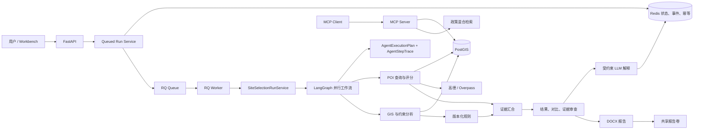
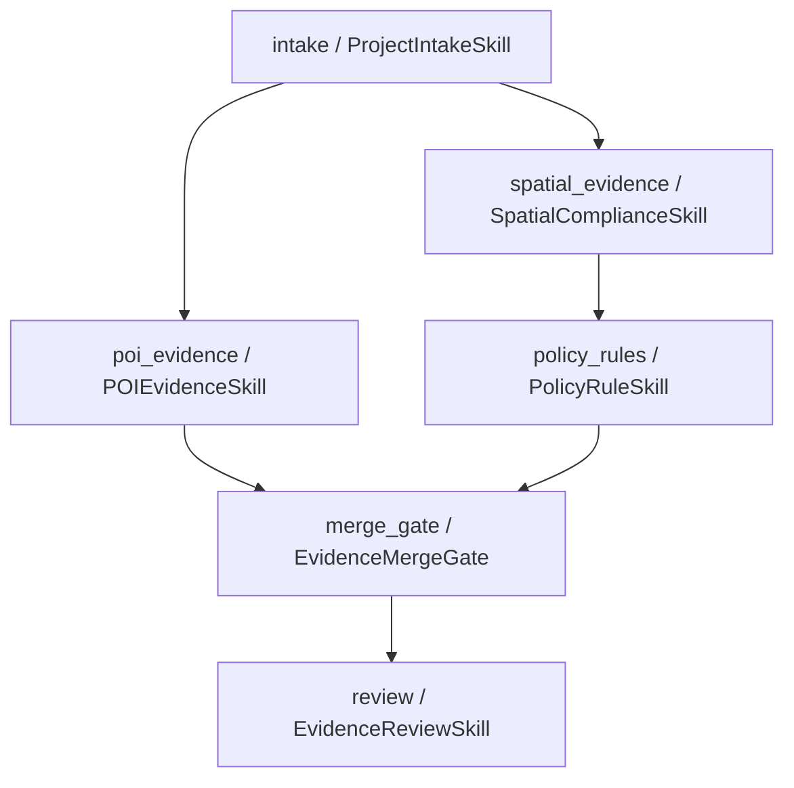
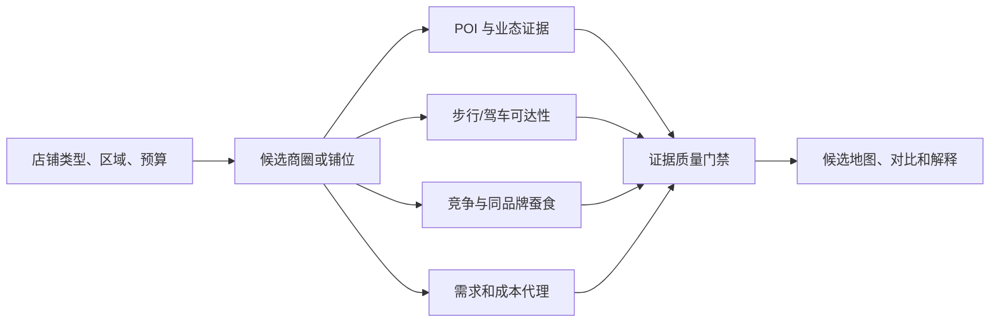

# GIS Agent 实现详解与源码导读

> 对应代码基线：`4c110cc`（Agent DAG、丰富候选与 POI 可信度增量）
>
> 最近完整回归：`473 passed in 10.20s`，冻结评测 `24/24`

本文是对现有架构说明的补充，面向需要真正读懂、调试和继续开发本项目的人。它回答以下问题：

- 当前系统到底完成了什么；
- 所谓 Agent 分别由哪些类和工作流节点实现；
- 一次选址请求如何经过 API、Redis、RQ Worker、LangGraph、PostGIS、POI、规则、审查、LLM 和报告；
- 每个核心文件负责什么，主要类和函数怎样协作；
- 哪些能力已经接入当前演示，哪些只是实现并测试、尚未生产装配；
- 当前结果为什么不能被表述为真实合规结论或自动选址推荐。

## 1. 当前完成情况

系统目前已经形成一条可运行、可测试、可追踪的 GIS 选址证据链，而不再只是一个聊天接口或单文件算法示例。

| 能力域 | 已完成内容 | 当前使用方式 |
|---|---|---|
| 项目受理 | 商场、物流园两类 Profile，输入完整性检查，项目类型路由 | HTTP、Workbench、领域服务 |
| Agent 编排 | 五类 Agent 角色、六个白名单 Skill 节点、版本化 DAG 与节点 Trace | LangGraph 默认业务工作流 |
| 并行执行 | POI 与 Spatial 同组并行，Policy 依赖 Spatial，Merge 同时等待 POI 与 Policy | `AgentExecutionPlan` 强制依赖 |
| GIS | CRS、单位、几何、字段校验；面积、相交、缓冲、最近距离 | GeoPandas 与 PostGIS |
| 空间存储 | 项目、图层、要素的 PostGIS Schema、迁移、Repository、空间索引 | Fixture 启动时写入并读取 |
| POI | 12 个候选、478 条合成 POI；Fixture/高德/Overpass；缓存、重试、熔断、降级、去重入库 | Compose 可选 `fixture/auto/amap/overpass` |
| 坐标治理 | WGS84 与 GCJ-02 显式转换；禁止把 GCJ-02 冒充 EPSG:4326 | 在线高德 Adapter 边界 |
| 规则 | YAML/JSON 规则包、有效期、版本冲突检查、空间观察映射 | 两类 Fixture 规则包 |
| 政策检索 | BM25、向量相似度、RRF 融合、来源引用 | MCP `policy_search` 工具 |
| 证据审查 | 检查 GIS、POI、政策、评分、来源、截断和合成数据边界 | 工作流完成前强制执行 |
| 人工复核 | `not_required/pending/acknowledged`，确认已阅写审计事件 | API 与 Workbench |
| LLM | 只解释已经完成的结构化证据，验证引用，不改分数和规则结果 | 可选 OpenAI 兼容接口 |
| 报告 | DOCX、来源、规则、评分、复核边界、SHA-256 | Worker 生成，共享卷下载 |
| 运行态 | Redis 状态、事件、幂等键、POI 缓存、TTL | API 与 Worker 共享 |
| 异步任务 | RQ 入队、独立 Worker、取消、超时、失败回调、原子状态转换 | Compose 默认异步 |
| 接口 | FastAPI、MCP、Streamlit Workbench | 8000、8001、8501 |
| 质量保障 | 单元、集成、契约、Smoke、冻结评测、性能记录 | 当前完整回归 473 tests |

当前已验证基线是 `473 passed`、冻结评测 `24/24`。真实 Docker/RQ Smoke 已验证 HTTP `202`、Worker 消费、Redis 事件链、共享 DOCX 报告；浏览器已验证任务自动从 `queued -> running -> completed`、候选标记、分类 POI 和 Agent 运行页签。测试数量只表示当前代码回归范围，不代表真实数据覆盖率或生产容量。

## 2. 这个项目中的 Agent 到底是什么

这里的 Agent 不是一个大模型拿到问题后自由选择所有动作。系统采用的是“结构化 Agent + 确定性工作流”：

1. 输入输出由 Pydantic 模型约束；
2. 每个 Agent 只承担一个清晰职责；
3. LangGraph 决定节点依赖、并行和失败路由；
4. GIS、POI 指标、评分和规则全部由普通 Python/PostGIS 代码计算；
5. LLM 只在分析完成后解释证据，不参与硬规则判断；
6. 任何关键证据缺失都会 fail-closed，而不是让模型猜测。

### 2.1 五类 Agent 角色与六个 Skill 节点

| Agent 角色 | 当前实现 | 输入 | 输出 | 不负责什么 |
|---|---|---|---|---|
| Orchestrator | `OrchestratorAgent` | 可能不完整的 `SiteSelectionDraft` | `PreflightDecision` | 不访问 GIS、POI、数据库或 LLM |
| POI | `POIEvidenceSkill`（由查询与评分函数组成） | Profile 生成的 `POIQuery[]` | `POIEvidence[]` | 不判断政策合规，不把合成数据伪装为真实数据 |
| Spatial | `SpatialAgent` | 带 Manifest 的 `AgentState` | GIS 指标和空间约束观察 | 不做政策合规结论 |
| Policy | `PolicyAgent` | 已有 READY GIS 证据的状态 | 版本化 `PolicyEvidence` | 不检索或编造规则，不更改 GIS 数据 |
| Review | `ReviewAgent` | POI、GIS、Policy 均已汇合的状态 | 结果、候选对比、证据审查 | 不把最高分变成自动推荐 |

执行计划中共有六个节点：`intake`、`poi_evidence`、`spatial_evidence`、`policy_rules`、`merge_gate`、`review`。角色数、类数和节点数不是同一概念：POI 角色有独立输入输出和失败边界，但当前没有为了形式增加一个只做代理调用的 `POIAgent` 类；Orchestrator 则同时承担 Intake 路由和 Merge Gate 两个节点。

### 2.2 版本化计划如何约束 Agent

`agent_orchestration.py` 把业务图从“代码里隐含的调用顺序”提升为可返回、可校验的契约：

- `AgentSkillManifest`：声明 `node_id`、角色、Skill 名称/版本、依赖、并行组、关键性、LLM 权限和输出契约；
- `AgentExecutionPlan`：保存 `plan_id`、版本和全部节点，启动时拒绝重复节点、未知依赖和循环依赖；
- `AgentStepTrace`：记录每个实际节点的状态、耗时和脱敏异常类型；
- `order_agent_traces()`：按计划顺序整理异步完成的 Trace，并拒绝计划外节点或 Skill 版本不一致。

当前全部业务节点均为 `llm_allowed=false`。这不是说系统不用 LLM，而是明确禁止 LLM 进入面积、距离、POI 指标、规则命中和排序的事实计算链。

### 2.3 LLM 的真实位置

`OpenAISiteSelectionEvidenceExplainer` 在核心工作流完成之后运行。它收到的是经过压缩的结构化证据，不是数据库连接、原始密钥或任意文件。返回结果还要经过以下检查：

- 候选地编号必须存在；
- 引用必须属于允许的证据引用集合；
- 不能生成新的评分、排序、政策发现或推荐；
- 解释失败只把 explanation 标为 `failed`，不会把已经完成的分析改掉。

因此这个项目的主要工程价值是可验证证据编排，LLM 是受约束的展示增强，而不是事实来源。

## 3. 总体架构



### 3.1 六个 Compose 服务

| 服务 | 端口 | 作用 |
|---|---:|---|
| `api` | 8000 | 校验请求、创建运行、入队、查询状态、下载报告 |
| `worker` | 无外部端口 | 从 RQ 取任务，执行完整工作流、解释和报告 |
| `mcp` | 8001 | 暴露 GIS、POI 和政策检索工具 |
| `workbench` | 8501 | Streamlit 人工操作与证据展示 |
| `postgis` | 5432 | 项目、空间图层、要素和 POI 持久化 |
| `redis` | 6379 | 运行状态、幂等、缓存、事件以及 RQ 队列 |

API 和 Worker 使用同一套业务代码，但启动模式不同：API 的 `SITE_SELECTION_RUN_MODE=async`，Worker 强制 `sync`，避免 Worker 执行任务时再次把自己入队。

## 4. 一次异步选址请求的完整调用过程

### 4.1 Workbench 生成请求

`workbench/app.py` 把项目类型和候选地表格转换为：

```json
{
  "project_type": "shopping_mall",
  "candidate_parcels": [
    {
      "parcel_id": "MALL-A01",
      "name": "商场候选 A",
      "longitude": 121.47,
      "latitude": 31.23,
      "geometry_dataset_id": "demo-mall-candidates"
    }
  ]
}
```

`SiteSelectionAPIClient.create_run()` 向 `/site-selection/runs` 发送请求，并生成新的 `Idempotency-Key`。

### 4.2 FastAPI 校验与创建运行

`SiteSelectionAnalysisCreate` 完成第一层 Schema 校验：

- 项目类型只能是已定义枚举；
- 至少包含一个候选地；
- `parcel_id` 不能重复；
- 经纬度必须在合法范围；
- 请求不能包含未声明字段。

路由调用 `QueuedSiteSelectionRunService.create_run()`：

1. `SiteSelectionRunService.prepare_run()` 解析 Runtime；
2. 对规范化请求计算 SHA-256 指纹；
3. Redis 原子声明幂等键；
4. 写入 `queued` 状态和 `created` 事件；
5. 生成确定性 Job ID：`site-selection-{run_id}`；
6. 写入 `enqueued` 事件；
7. 把 `run_id` 和业务命令放入 RQ；
8. 返回 HTTP `202 Accepted`。

任务载荷不包含 Redis 密码、数据库 URL、LLM Key 或其他凭据。

### 4.3 Worker 恢复运行环境

`scripts/run_site_selection_worker.py` 启动 RQ Worker。收到任务后，RQ 调用 `execute_site_selection_job()`：

1. 复制 Worker 自身环境变量；
2. 把运行模式强制改为 `sync`；
3. 调用 `build_site_selection_bootstrap_from_environment(include_mcp=False)`；
4. 连接 PostGIS 和 Redis；
5. 装配两类 Fixture Runtime、报告存储和可选 LLM Explainer；
6. 重新用 `SiteSelectionAnalysisCreate` 校验队列载荷；
7. 调用 `SiteSelectionRunService.execute_run()`。

Worker 不构建 MCP Server，因为分析任务不需要再次启动工具服务。

### 4.4 LangGraph 执行业务图

默认执行器是 `run_parallel_site_selection_workflow()`。它先构造 `site-selection-agent-dag@2026.08-agent-v1`，再执行与计划一致的 LangGraph：



POI 与 Spatial 都属于 `evidence_collection` 并行组，使用 `asyncio.gather()` 执行；Policy 不能与 Spatial 并行，因为政策规则依赖空间约束观察。Merge 内部继续执行可选 GIS+POI 组合评分；Review 内部完成结果组装、候选比较和证据审查。

成功时六个节点均写 `succeeded`。如果 Spatial 失败，POI 仍可能完成，但 `policy_rules=skipped`、`merge_gate=failed`、`review=skipped`，最终结果为空。异常正文不会进入 Trace，只保留例如 `SpatialAgentBlockedError` 的类型名。

### 4.5 POI 分支

1. `ProjectIntakeSkill` 根据 Profile，为每个地块的每个 POI 分组生成 `POIQuery`；
2. `execute_poi_queries()` 调用 Provider 无关的 `POIGateway.search()`；运行时根据 `SITE_SELECTION_POI_PROVIDER` 选择 Fixture、高德或 Overpass；
3. Adapter 返回标准化 `POIFeatureSet`；
4. `calculate_poi_metrics()` 计算数量、密度、最近距离、平均距离；
5. `score_poi_state()` 按版本化配置把指标归一化到软分；
6. 来源元数据保留 Provider、数据集版本、查询时间、CRS、降级原因、实际返回数、查询可用数和截断状态；
7. 在线结果可进入 Redis TTL 缓存，并按 `source + source_id` 参数化 upsert 到 PostGIS。

以商场 Profile 为例，每个地块会生成公共交通、住宅、办公、餐饮、公共服务和竞争设施六组查询。物流园使用高速入口、货运枢纽、物流服务、产业仓储、车辆服务和敏感目标六组查询。

Provider 装配顺序是：在线 Adapter -> 有界重试/熔断 -> 可选 Fixture 降级 -> 可选 PostGIS 持久化 -> Redis 缓存。`auto` 模式在存在 `AMAP_API_KEY` 时选择高德，否则选择 Overpass。只有上游可用性错误允许降级；响应结构畸形会直接失败，避免用 Fixture 掩盖数据契约错误。

`record_count` 是实际返回数，`available_record_count` 是应用 `limit` 前已确认的可用数。当后者更大时必须 `is_truncated=true`。因此界面出现“100 条”时，系统能说明它是查询上限内的下界，而不是声称周边总共只有 100 条。

### 4.6 Spatial 分支

`SpatialAgent.run()` 顺序执行：

1. `collect_gis_evidence()` 根据候选地的 `geometry_dataset_id` 查找 Manifest；
2. Gateway 加载 GeoDataFrame；
3. `validate_spatial_dataset()` 校验 CRS、投影单位、字段和几何；
4. `run_gis_analysis()` 计算面积、周长、缓冲区面积等指标；
5. `run_spatial_constraint_analysis()` 加载约束图层；
6. 对相交或距离阈值生成 `ConstraintObservation`。

如果缺少 Manifest、图层、CRS、必需字段、有效几何或米制投影，证据不会被伪装成 READY，工作流将被阻断。

### 4.7 Policy 分支

`PolicyAgent.run()` 调用 `evaluate_policy_rules()`：

1. 选择项目类型匹配、已启用且在有效期内的规则；
2. 阻止同一 `rule_id` 同时存在多个有效版本；
3. 检查每个规则引用的空间约束观察都存在；
4. 把观察值与 `expected_triggered` 比较；
5. 生成带规则版本、政策条款、管辖区、来源 URI 和数据版本的 `PolicyFinding`。

没有命中规则时只记录“当前已评估规则未命中”，不会生成“整体合规”。

### 4.8 汇合、评分与审查

`ReviewAgent` 负责三件事：

1. `assemble_analysis_results()`：按地块合并 GIS、POI、Policy 和组合评分；
2. `compare_candidate_results()`：只按版本化软评分排序，同时并列展示政策结果；
3. `review_site_selection_evidence()`：检查证据来源、规则、评分、降级、合成来源和 POI 截断信息是否完整。

Evidence Review 的 blocker 会让运行失败；warning 会让 `HumanReviewState` 进入 `pending`。`poi_synthetic_source` 提醒当前证据不能代表真实城市现状，`poi_result_truncated` 提醒数量、密度和相关评分输入只能解释为下界。人工确认只能变成 `acknowledged`，不存在 `approved` 状态。

### 4.9 解释、报告和终态

核心分析完成后，`SiteSelectionRunService.execute_run()`：

1. 创建人工复核状态；
2. 调用可选 LLM Explainer；
3. 生成 DOCX 报告；
4. 计算报告 SHA-256；
5. 写入阶段 Trace；
6. 用 Redis 原子状态转换写入 `completed`；
7. 追加 `completed` 事件。

Workbench 每 2 秒通过 `GET /site-selection/runs/{run_id}` 自动轮询。只有状态为 `completed` 且 `analysis` 非空时才渲染结果标签页。`Agent 运行`页签分别展示执行计划、节点轨迹和质量门禁；地图用红色大标记和文本标签显示候选地，用分类颜色小标记显示 POI。

## 5. 四套状态不要混淆

### 5.1 领域分析状态

`AnalysisStatus` 描述一次业务分析内部是否准备好：

```text
data_pending -> analyzing -> completed
        |           |
        +----------> failed
```

它存在于 `AgentState` 中。

### 5.2 基础设施运行状态

`RunStatus` 描述队列与 Worker 生命周期：

```text
queued -> running -> completed
   |         |      -> failed
   |         |      -> timed_out
   |         +------> cancelled
   +----------------> cancelled
   +----------------> failed (enqueue failure)
```

关键转换使用 Redis Lua 比较并更新，防止 Worker 完成、超时回调和用户取消互相覆盖。

### 5.3 人工复核状态

```text
not_required
pending -> acknowledged
```

`acknowledged` 仅表示已查看证据，固定审计边界为 `acknowledgement_not_compliance_approval`。

### 5.4 Agent 节点执行状态

每个计划节点只允许以下状态：

```text
succeeded
failed  -> 必须包含脱敏 error_type
skipped -> 依赖未满足，不伪装成成功
```

`RunStageTrace` 描述应用层的 `workflow/explanation/report/total` 等粗粒度阶段；`AgentStepTrace` 描述领域图中六个 Agent/Skill 节点。两者观察层级不同，不能互相替代。

## 6. 核心文件逐一说明

### 6.1 HTTP、Schema 与启动装配

| 文件 | 主要类/函数 | 作用与调用关系 |
|---|---|---|
| `app/main.py` | `create_app()`、`create_app_from_environment()` | 创建 FastAPI，注入分析服务、运行服务、队列、MCP 和 lifespan 资源关闭器；没有配置时使用 fail-closed 服务 |
| `app/api/site_selection.py` | preflight、analysis、run、cancel、events、report、POI preview 路由 | 只做 HTTP 校验、依赖获取、错误到状态码映射和响应序列化，不实现 GIS 或规则逻辑 |
| `app/schemas/site_selection.py` | `CandidateParcelInput`、`SiteSelectionAnalysisCreate`、`SiteSelectionRunResponse` 等 | 外部 API 契约；把 HTTP 输入转换为领域对象，并把 Redis `RunState` 转换为响应 |
| `app/site_selection_bootstrap.py` | `SiteSelectionBootstrap`、`build_site_selection_bootstrap_from_environment()` | 读取环境变量，迁移/播种 PostGIS，创建 Redis Store、Runtime Registry、RQ Queue、MCP 和 Explainer |
| `app/api/health.py` | `get_health()` | 容器健康检查入口 |
| `app/api/chat.py` | `create_chat()` | 早期聊天示例接口，不是当前选址工作流主入口 |
| `app/api/documents.py` | `create_document()` | 早期文档登记示例接口，当前政策 RAG 没有通过此接口自动入库 |

### 6.2 应用服务层

| 文件 | 主要类/函数 | 具体职责 |
|---|---|---|
| `app/services/site_selection_service.py` | `SiteSelectionRuntime`、`SiteSelectionRuntimeRegistry`、`SiteSelectionAnalysisService` | 把项目类型映射到数据集和工作流依赖；提供同步分析入口；Registry 返回防御性副本 |
| `app/services/site_selection_run_service.py` | `prepare_run()`、`execute_run()`、`mark_*()`、`preview_poi()` | Redis 生命周期中枢；幂等、执行、取消、超时、报告、解释、人工复核、Trace、缓存都从这里协调 |
| `app/services/site_selection_queue.py` | `RQQueueSettings`、`RQSiteSelectionJobQueue`、`QueuedSiteSelectionRunService` | 把应用服务接到 RQ；确定 Job ID、入队、取消排队任务、停止运行中任务 |
| `app/services/site_selection_worker.py` | `execute_site_selection_job()`、`record_site_selection_job_failure()` | Worker 任务函数和失败回调；重新装配环境，区分普通失败与超时，保护已有终态 |
| `app/services/site_selection_poi_provider.py` | `build_configured_poi_provider()`、`ConfiguredPOIProvider` | 解析 `fixture/auto/amap/overpass`，装配在线 Adapter、重试熔断、显式降级、PostGIS 持久化和 Redis 缓存 |
| `app/services/site_selection_explanation.py` | `OpenAISiteSelectionEvidenceExplainer`、`failed_explanation()` | 构造受限证据载荷，调用 OpenAI 兼容接口，校验返回引用并隔离失败 |
| `app/services/site_selection_artifacts.py` | `FileSystemSiteSelectionReportStore` | 在受控根目录生成、解析 DOCX；临时文件原子替换；返回 URL 和 SHA-256 |

### 6.3 领域契约、受理和 Profile

| 文件 | 主要类/函数 | 具体职责 |
|---|---|---|
| `practice/site_selection/__init__.py` | 公共对象再导出 | 作为领域包的公开门面，让应用层不需要了解每个内部模块路径；不承载业务执行逻辑 |
| `practice/site_selection/domain.py` | `ProjectType`、`CandidateParcel`、`ProjectRequest`、`DatasetManifest` | 最基础的项目、候选地和数据清单模型；拒绝未知字段、重复地块和无时区时间 |
| `profiles.py` | `ProjectProfile`、两类 Profile、`get_project_profile()` | 定义每类项目的 POI 分组、半径、指标和权重；返回深拷贝避免运行时修改全局配置 |
| `intake.py` | `ProfileRegistry`、`ProjectTypeRouter`、`build_poi_queries()`、`ProjectIntakeSkill` | 完成项目路由并为每个地块生成确定性 POI 查询，创建初始 `data_pending` 状态 |
| `preflight.py` | `SiteSelectionDraft`、`PreflightDecision`、`evaluate_site_selection_draft()` | 面向不完整输入，返回 ready/needs_input/unsupported，不猜缺失值 |
| `constraints.py` | `ConstraintLayerSpec`、`ConstraintObservation` | 定义相交/距离空间约束及其可审计观察结果 |

### 6.4 Agent 与工作流

| 文件 | 主要类/函数 | 具体职责 |
|---|---|---|
| `agents.py` | `OrchestratorAgent`、`SpatialAgent`、`PolicyAgent`、`ReviewAgent` | 四类职责明确的结构化 Agent；每个 Agent 输入输出都经过 Pydantic 校验 |
| `agent_orchestration.py` | `AgentSkillManifest`、`AgentExecutionPlan`、`AgentStepTrace` | 定义五类角色和六节点 DAG；校验闭合、无环、Skill 版本、并行组、LLM 权限和 Trace 一致性 |
| `workflow.py` | `SiteSelectionWorkflowDependencies`、`build_site_selection_graph()`、`run_site_selection_workflow()` | 串行参考图；每个节点使用 `_safe_node()` 统一处理预期错误和未知异常 |
| `parallel_workflow.py` | `build_parallel_site_selection_graph()`、`run_parallel_site_selection_workflow()` | 当前默认执行图；执行版本化计划，为成功、失败和跳过节点记录 Trace，按依赖显式 fan-in |
| `evidence.py` | `GISEvidence`、`POIEvidence`、`PolicyEvidence`、`AnalysisResult`、`AgentState` | 整条业务图共享的强类型状态；绑定 `execution_plan/agent_trace`，拒绝重复或计划外节点 |
| `results.py` | `assemble_analysis_results()` | 要求每个地块拥有三类 READY 证据，合并为最终 `AnalysisResult` |
| `comparison.py` | `compare_candidate_results()` | 生成软评分排名；政策结果独立展示，不允许缺分或重复排名数据 |
| `evidence_review.py` | `review_site_selection_evidence()` | 检查来源、规则、评分、降级、截断、合成来源和引用完整性，生成 blocker/warning |
| `review_contracts.py` | Review 枚举与模型 | 定义审查状态、问题严重级别和报告一致性约束 |
| `run_reliability.py` | `RunStageTrace`、`HumanReviewState`、`build_human_review_state()` | 从审查问题生成复核状态，并限制 Trace 只保存脱敏阶段信息 |

### 6.5 GIS 与空间数据

| 文件 | 主要类/函数 | 具体职责 |
|---|---|---|
| `spatial/validate.py` | `parse_crs()`、`validate_spatial_dataset()` | 阻断缺 CRS、地理坐标系直接量算、非米制投影、缺字段、空/无效几何和空数据集 |
| `spatial/hashing.py` | `stable_spatial_hash()` | 对 CRS、字段、属性和标准化几何做稳定 SHA-256；不受行顺序、索引和 Polygon 起点影响 |
| `spatial/gateway.py` | `SpatialDatasetGateway`、`MockSpatialDatasetGateway`、`collect_gis_evidence()` | Provider 无关加载边界；把数据缺失、访问失败和校验失败映射成结构化证据状态 |
| `spatial/file_gateway.py` | `FileSpatialDatasetGateway` | 只允许受控根目录内的 GeoJSON/JSON/GPKG/SHP；拒绝绝对路径和目录穿越 |
| `spatial/postgis_gateway.py` | `PostGISSpatialDatasetGateway`、`StoredPostGISSpatialDatasetGateway` | 前者读取白名单关系；后者从规范化 `site_selection` 表恢复图层和源属性 |
| `spatial/analysis.py` | `calculate_spatial_metrics()`、`run_gis_analysis()` | 计算面积、公顷、周长、缓冲、相交数、最近距离并写回 GIS 证据 |
| `spatial/constraint_analysis.py` | `run_spatial_constraint_analysis()` | 按约束配置加载上下文图层，统一 CRS，生成相交或邻近观察 |
| `spatial/query_engine.py` | `GeoPandasSpatialQueryEngine`、`PostGISSpatialQueryEngine` | 用同一返回契约实现内存和数据库计算；PostGIS 参数化地块、图层和 SRID 值 |

### 6.6 POI、标准化与可靠性

| 文件 | 主要类/函数 | 具体职责 |
|---|---|---|
| `poi.py` | `POIQuery`、`POIRecord`、`POISourceMeta`、`POIFeatureSet` | Provider 无关契约；区分返回数、可用数、数据集总量，强制截断标记与计数一致 |
| `poi_service.py` | `POIGateway`、`calculate_poi_metrics()`、`execute_poi_queries()` | 执行标准化查询并计算数量、密度和距离指标 |
| `poi_adapters.py` | `FixturePOIAdapter`、`haversine_distance_m()` | 从 478 条确定性 Fixture 过滤类别和半径，在切片前统计可用数并记录截断 |
| `online_poi_adapters.py` | `AmapPOIAdapter`、`OverpassPOIAdapter`、`GCJ02CoordinateTransformer` | 在线分页、类别映射、速率限制、响应校验和坐标转换 |
| `online_poi_adapters.py` | `RetryingCircuitBreakerPOIAdapter`、`FallbackPOIAdapter`、`CachedPOIAdapter`、`PersistingPOIAdapter` | 只对可用性错误重试/熔断/显式降级；缓存复用、入库和畸形响应阻断 |
| `fixture_catalog.py` | `FixtureCandidateCatalog`、`load_fixture_candidate_catalog()` | 按项目类型加载各 6 个候选并移除仅用于生成数据的场景字段，向 Workbench 提供质量声明 |
| `poi_normalizer.py` | `RawPOI`、`NormalizedPOI`、`POINormalizer` | 入库前统一 source、source_id、类别、地址、时间和 WGS84；拒绝未经转换的 GCJ-02 |
| `poi_metrics.py` | `build_poi_metrics_report()` | 生成更适合报告展示的距离分段与统计摘要 |
| `poi_scoring.py` | 评分配置模型、`normalize_metric_value()`、`score_poi_feature_sets()` | 按方向和上下界归一化指标，处理缺失策略，生成版本化分组和总分 |
| `poi_scoring_service.py` | `score_poi_state()` | 把 POI 评分器应用到每个候选地并写回 `POIEvidence` |

### 6.7 综合评分、规则、政策和审查

| 文件 | 主要类/函数 | 具体职责 |
|---|---|---|
| `site_scoring_contracts.py` | `GISMetricScoringRule`、`SiteScoringConfig`、`SiteScoreReport` | 定义 GIS+POI 组合软评分及版本、权重、指标来源 |
| `site_scoring_service.py` | `score_site_state()` | 要求 READY GIS/POI 和版本化 POI 分数，再计算组合软分 |
| `rules.py` | `RuleDefinition`、`PolicyReference`、`PolicyFinding` | 定义规则有效期、适用项目、期望观察和政策来源 |
| `rule_pack.py` | `RulePack`、`load_rule_pack()`、`dump_rule_pack_json()` | 从 YAML/JSON 加载规则包并检查版本、ID 和引用一致性 |
| `rule_engine.py` | `evaluate_policy_rules()` | 根据空间观察执行确定性规则，输出可追溯 Finding |
| `policy_rag.py` | `load_policy_corpus()`、`chunk_policy_documents()`、`PolicyHybridRetriever` | 政策切块、BM25、向量相似度和 RRF 融合，返回页码/条款/片段引用 |

RAG 和规则引擎不是同一件事：RAG 用来找相关原文，规则引擎执行已经审核、版本化的机器规则。当前核心分析使用规则包；RAG 通过 MCP 提供辅助检索。

### 6.8 PostGIS 与 Redis 存储

| 文件 | 主要类/函数 | 具体职责 |
|---|---|---|
| `storage/postgres.py` | `PostgresSpatialRepository` | 项目 upsert/read、图层校验/哈希/重投影/整体替换、要素读取；业务值全部参数化 |
| `storage/poi_repository.py` | `PostgresPOIRepository` | 按 `source + source_id` 批量 upsert 去重；使用 geography 执行米制半径查询 |
| `storage/redis_state.py` | `RunState`、`RedisRunStateStore`、`transition()` | 校验运行终态与 error 一致性；命名空间、TTL；Lua 原子比较并更新 |
| `storage/redis_runtime.py` | `RedisSiteSelectionRuntimeStore` | 封装运行状态、幂等请求指纹、POI 缓存、事件列表及各自 TTL |
| `deploy/migrations/001_initial.sql` | 四张业务表与索引 | 创建 `projects`、`spatial_layers`、`spatial_features`、`pois`，Geometry 统一存 EPSG:4326 |
| `deploy/init_postgis.sql` | 初始化入口 | 为首次容器初始化准备 PostGIS Schema |

### 6.9 MCP、报告、评测与界面

| 文件 | 主要类/函数 | 具体职责 |
|---|---|---|
| `mcp_tools.py` | `create_site_selection_tool_registry()` | 注册 GIS 面积、相交、最近距离、POI 查询、POI 指标和政策检索六个类型化工具 |
| `mcp_server.py` | `create_site_selection_mcp_server()` | 把内部 Tool Registry 包装成 MCP 2.0 Server |
| `mcp_client.py` | `SiteSelectionMCPClient` | 校验服务端工具集合白名单，阻止未知工具，映射超时和错误 |
| `reporting.py` | `generate_site_selection_report()` | 生成包含对比、GIS、POI、规则、来源和复核边界的 DOCX；截断时明确返回/可用数和下界声明 |
| `evaluation.py` | `Day26EvaluationRunner` | 离线执行冻结案例，比较期望子集，记录实际、耗时和异常类型 |
| `performance.py` | `measure_day26_performance()` | 在 Fixture 规模下测量 GIS、POI、RAG 和评测批次；不声称生产 SLA |
| `workbench/app.py` | Streamlit 页面主体 | 自动轮询、编辑候选地、分层地图、POI 过滤、Agent 计划/轨迹/门禁、确认已阅和报告下载 |
| `workbench/site_selection_client.py` | `SiteSelectionAPIClient`、`agent_plan_rows()`、`agent_trace_rows()` 等 | HTTP 调用、错误清洗、报告下载和候选/POI/Agent 展示数据整理 |

### 6.10 脚本、容器与交付入口

| 文件 | 入口 | 具体职责 |
|---|---|---|
| `Dockerfile` | 容器构建 | 安装统一 requirements，复制 API、领域、数据、迁移、脚本和 Workbench 代码；多个 Compose 服务复用同一构建上下文 |
| `compose.yaml` | `docker compose up` | 定义六服务、环境变量、端口、健康依赖和报告/PostGIS/Redis 命名卷 |
| `scripts/apply_postgis_migrations.py` | `main()` | 按版本执行 PostGIS 迁移并验证已应用版本 |
| `scripts/run_site_selection_worker.py` | `main()` | 连接 Redis、监听配置队列并启动 RQ Worker |
| `scripts/run_fixture_mcp_server.py` | `main()` | 检查 Fixture 模式和数据库，启动 Streamable HTTP MCP Server |
| `scripts/run_site_selection_mcp.py` | `main()` | 较早的 MCP 本地启动入口，供工具开发调试 |
| `scripts/generate_site_selection_report.py` | `main()` | 从受支持输入生成选址 DOCX 报告 |
| `scripts/run_day26_evaluations.py` | `main()` | 运行 24 条冻结评测并写机器可读 JSON |
| `scripts/benchmark_day26.py` | `main()` | 运行 Fixture 性能采样并写结果，不代表生产容量 |
| `scripts/generate_rich_fixtures.py` | `build_payloads()`、`main()` | 从同一场景配置确定性生成候选、478 条 POI 和空间图层，防止多份 Fixture 漂移 |
| `scripts/smoke_postgis_gateway.py` | `main()` | 用真实 PostGIS 临时空间表验证 Gateway |
| `scripts/smoke_storage_repositories.py` | `main()` | 验证项目、图层、要素、POI 写读和去重 |
| `scripts/smoke_spatial_query_parity.py` | `main()` | 比较 GeoPandas 和 PostGIS 面积/相交/距离语义 |
| `scripts/smoke_redis_state.py` | `main()` | 验证 Redis namespace、状态和 TTL |
| `scripts/smoke_site_selection_redis_runtime.py` | `main()` | 验证运行状态、事件、缓存和 Compose 密码加载 |
| `scripts/smoke_day24_fixture_runtime.py` | `main()` | 验证双 Profile、多候选、报告、六个 MCP 工具和异步轮询 |
| `scripts/smoke_day27_async_runtime.py` | `main()` | 专门验证 HTTP 202、RQ Worker、完整事件链和共享 DOCX |

## 7. 数据文件和运行配置

| 文件 | 内容 | 边界 |
|---|---|---|
| `data/fixtures/candidates.json` | 商场 6 个、物流园 6 个差异化候选 | 场景画像只用于确定性数据生成，不是现实地块调查 |
| `data/fixtures/poi.json` | 478 条、25 类合成 POI | 用于回归与候选差异比较，不代表城市真实覆盖 |
| `data/fixtures/spatial_layers.json` | 12 个候选要素和两类约束场景 | 用于启动播种和稳定演示 |
| `data/fixtures/rules.shopping_mall.yaml` | 商场 Fixture 规则 | 阈值和政策均非生产配置 |
| `data/fixtures/rules.logistics_park.yaml` | 物流园 Fixture 规则 | 同上 |
| `data/fixtures/policies.json` | 合成政策语料 | 用于演示 RAG 引用链 |
| `.env.example` | 本地环境模板 | 不包含真实密钥 |
| `compose.yaml` | 六服务拓扑、健康依赖、共享卷和 API/Worker 一致的 POI 配置 | 默认 Fixture + 异步运行，可显式切换在线 Provider |
| `requirements.txt` | FastAPI、LangGraph、GIS、PostGIS、Redis、RQ、MCP、Streamlit 等依赖 | 修改后 Docker 会重建 pip 层 |

关键 POI 配置：

| 环境变量 | 作用 | 默认值/约束 |
|---|---|---|
| `SITE_SELECTION_POI_PROVIDER` | 选择来源 | `fixture`；可选 `auto/amap/overpass` |
| `AMAP_API_KEY` | 高德 Web 服务 Key | 空；显式 `amap` 时必填 |
| `SITE_SELECTION_POI_FALLBACK_ENABLED` | 在线可用性错误时是否显式回退 Fixture | `true` |
| `SITE_SELECTION_POI_PERSIST_ENABLED` | 在线结果是否 upsert 到 PostGIS | `true` |
| `SITE_SELECTION_POI_TIMEOUT_SECONDS` | 单次在线请求超时 | `15` |
| `SITE_SELECTION_POI_REQUESTS_PER_SECOND` | Provider 速率限制 | `1` |
| `SITE_SELECTION_POI_MAX_ATTEMPTS` | 可用性错误最大尝试次数 | `2` |
| `SITE_SELECTION_POI_FAILURE_THRESHOLD` | 熔断失败阈值 | `2` |
| `SITE_SELECTION_POI_RECOVERY_SECONDS` | 熔断恢复探测间隔 | `30` |

## 8. API 说明

| 方法 | 路径 | 成功语义 | 常见失败 |
|---|---|---|---|
| `POST` | `/site-selection/preflight` | 返回 ready/needs_input/unsupported | 422 Schema 错误 |
| `POST` | `/site-selection/analyses` | 显式同步分析 | 409 业务阻断、503 未配置 |
| `POST` | `/site-selection/runs` | Compose 异步模式返回 202 queued | 409 幂等冲突、500 未处理异常、503 未配置 |
| `GET` | `/site-selection/runs/{run_id}` | 返回运行、分析、执行计划、节点 Trace、解释、复核和阶段 Trace | 404 不存在 |
| `POST` | `/site-selection/runs/{run_id}/cancel` | queued/running 变 cancelled | 404 不存在、409 已终态 |
| `GET` | `/site-selection/runs/{run_id}/events` | 返回有序审计事件 | 404/503 |
| `POST` | `/site-selection/runs/{run_id}/human-review/acknowledge` | 记录已阅 | 409 不需要复核或状态不完整 |
| `GET` | `/site-selection/runs/{run_id}/report` | 下载 DOCX | 404 未完成或文件不存在 |
| `POST` | `/site-selection/poi/preview` | 返回 POI FeatureSet，并标记 cache hit | 503 Runtime 未配置 |

## 9. PostGIS 数据模型

### 9.1 `projects`

保存项目编号、类型、名称和时间。`project_type` 由数据库 CHECK 限制为当前两种 Profile。

### 9.2 `spatial_layers`

保存图层级元数据：原始 CRS、标准化 CRS、版本、稳定哈希、必需字段和扩展 metadata。它回答“这批几何从哪里来、是什么版本、是否与上次相同”。

### 9.3 `spatial_features`

保存标准化 EPSG:4326 几何和 JSONB 属性。`layer_id + source_feature_id` 唯一，Geometry 建 GiST 索引。

### 9.4 `pois`

保存标准化 WGS84 点、原始 CRS、地址、抓取时间和原始负载。`source + source_id` 唯一，重复写入执行更新而不是新增重复行。

入库统一 EPSG:4326 不代表源数据都是 WGS84。`source_crs` 保留真实语义，高德数据必须先从 GCJ-02 转换。

## 10. Redis Key 与运行细节

| Key | 内容 | 默认 TTL |
|---|---|---:|
| `{ns}:run_state:{run_id}` | `RunState` JSON | 86400 秒 |
| `{ns}:idempotency:{sha256(key)}` | run_id + 请求指纹 | 86400 秒 |
| `{ns}:poi_cache:{sha256(query+scope)}` | `POIFeatureSet` | 3600 秒 |
| `{ns}:events:{run_id}` | `RunEvent` 列表 | 86400 秒 |

幂等 TTL 和事件 TTL 不允许长于运行状态 TTL。POI 缓存键不仅包含查询，还包含 Runtime 数据集版本和 Adapter `cache_token`，避免 Provider 或数据版本变化后误用旧缓存。

RQ 的 `rq:*` Key 由 RQ 管理，不作为领域数据契约。业务状态仍以 `RunState` 为准。

## 11. 取消、超时和失败恢复

### 11.1 取消

只有 `queued` 和 `running` 可以取消：

- queued：先原子写入 `cancelled`，再调用 `job.cancel()`；
- running：先原子写入 `cancelled`，再发送 `send_stop_job_command()`；
- 重复取消：返回已有 cancelled 状态；
- completed/failed/timed_out：返回 409。

先写终态是为了防止 Worker 的失败回调抢先把用户取消覆盖成 `failed`。取消不是数据库事务回滚，已经完成的只读查询或临时报告写入不会被时间倒流式撤销。

### 11.2 超时

RQ `job_timeout` 控制单任务上限。失败回调根据异常类型名是否包含 `Timeout` 写入 `timed_out`，并只保存异常类型，不保存可能含密钥的异常正文。

### 11.3 未知异常

工作流、Adapter、Worker 和 API 都遵循相同原则：已审核的业务异常可以暴露结构化说明；未知异常只暴露 `type(exc).__name__`。

## 12. 测试体系怎样覆盖这些功能

测试不是按“一个文件一个 happy path”组织，而是分层验证。

| 测试组 | 主要覆盖 |
|---|---|
| `test_site_selection_contracts.py` | 领域模型、跨字段一致性、非法枚举和重复 ID |
| `test_site_selection_preflight_agents.py` | 前置检查和四 Agent 边界 |
| `test_site_selection_workflow.py` | 串行图、证据阻断、规则、结果组装 |
| `test_site_selection_agent_orchestration.py` | DAG 闭合/无环、并行组、依赖、Trace 排序和 Manifest 一致性 |
| `test_parallel_site_selection_workflow.py` | POI/Spatial 并发、六节点成功轨迹和分支失败后的 skipped/failed 传播 |
| `test_spatial_*.py` | CRS、几何、哈希、File/PostGIS Gateway、查询一致性 |
| `test_poi_*.py` | Fixture、指标、评分、标准化、Repository |
| `test_rich_fixture_catalog.py` | 12 个候选、478 条 POI、生成器一致性和差异化评分 |
| `test_site_selection_poi_provider.py` | `fixture/auto/amap/overpass` 选择、缓存、持久化和配置错误 |
| `test_online_poi_adapters.py` | 高德/Overpass、GCJ-02、重试、熔断、降级和截断计数 |
| `test_rule_*.py`、`test_policy_rag.py` | 规则版本、政策发现和混合检索引用 |
| `test_redis_*.py` | TTL、幂等、缓存、事件和原子状态转换 |
| `test_site_selection_run_service.py` | 运行生命周期、人工复核、解释、报告和 Trace |
| `test_site_selection_async_queue.py` | 只入队不内联执行、幂等入队、取消和入队失败 |
| `test_site_selection_worker.py` | Worker 执行、超时回调、失败脱敏、终态保护 |
| `test_site_selection_run_api.py` | HTTP 201/202/404/409/503 契约 |
| `test_site_selection_workbench.py` | 自动轮询、地图层、POI 截断、Agent 计划/轨迹/门禁和展示转换 |
| `test_day24_container_contract.py` | 六服务 Compose 契约 |
| `test_day25_reliability_e2e.py` | 可靠性和人工复核端到端 |
| `test_day26_evaluation.py` | 24 条冻结案例 |
| `test_day27_smoke_contract.py` | 异步 Smoke 必须包含完整事件链 |

真实运行还使用以下脚本：

- `smoke_storage_repositories.py`：真实 PostGIS 项目/图层/POI 写读和去重；
- `smoke_redis_state.py`：真实 Redis namespace 与 TTL；
- `smoke_spatial_query_parity.py`：GeoPandas/PostGIS 结果一致性；
- `smoke_day24_fixture_runtime.py`：双项目、多候选、报告和 MCP；
- `smoke_day27_async_runtime.py`：HTTP 202、RQ Worker、事件链和共享报告。

当前提交 `4c110cc` 在 Windows/Python 3.12 下完整回归为 `473 passed in 10.20s`。其中新增覆盖不是为了追求测试数量，而是固定三类高风险语义：Agent 依赖不能被绕过、POI 上限不能冒充完整总量、合成来源不能冒充现实证据。

## 13. 当前确实存在的边界

### 13.1 当前不是现实选址数据产品

478 条 Fixture POI、12 个候选、合成图层、规则和政策能证明多候选工程链路与差异化比较，但仍不足以支持真实密度、竞争度、可达性或合规判断。数量更多解决的是测试代表性，不会自动产生现实可信度。

### 13.2 在线 POI 已接入运行时，但默认仍是可复现 Fixture

API 与 Worker 已通过统一 Provider 工厂接入高德和 Overpass；配置 `auto/amap/overpass` 后每次分析会自动加载在线 POI，并经过缓存、重试、熔断、显式降级和可选入库。默认仍为 `fixture`，因为在线服务受网络、配额和数据变化影响。用于真实决策前还需要类别治理、完整分页、覆盖率抽检、授权审计、多源交叉验证和成本控制。

### 13.3 RAG 没有自动决定政策规则

MCP `policy_search` 能检索合成政策，但核心规则来自已审核 RulePack。把 RAG 结果直接变成规则会引入不可控政策解释风险，因此当前没有这样做。

### 13.4 单 Worker 不是高可用生产队列

当前已处理入队、取消、超时和状态竞态，但还没有验证多 Worker 扩容、Redis Sentinel/Cluster、失败任务重放、滚动升级和长期审计存储。

### 13.5 Workbench 是演示与人工审查界面

它没有用户登录、权限、租户隔离、操作审批流和生产地图服务。地图已使用 PyDeck 分层展示候选标签与分类 POI，但仍不是支持图层编辑、空间选择和制图输出的完整 GIS 编辑器。

### 13.6 尚未实现的 Agent 能力

以下内容属于下一阶段路线，不应在面试中描述成现成功能：

- 从自然语言生成结构化执行意图的 `PlanningIntentAgent`；
- 会话短期记忆、项目长期记忆和不可变 `ScenarioVersion`；
- 支持约束追加、覆盖、删除和冲突确认的 `ConstraintAgent`；
- 把政策 RAG 作为主 DAG 的强制节点，而不是 MCP 辅助工具；
- 让确定性结果先完成、LLM 解释异步补充的双阶段终态。

## 14. 调试时从哪里开始

| 现象 | 优先检查 |
|---|---|
| API 503 | `SITE_SELECTION_RUNTIME_MODE`、数据库/Redis URL、`app/site_selection_bootstrap.py` |
| 一直 queued | `docker compose ps`、Worker 日志、RQ queue name 是否一致 |
| running 后失败 | Redis events、RunState error、Worker 日志、阶段 Trace |
| GIS invalid | Manifest CRS、`spatial/validate.py` 错误码、源几何和字段 |
| POI 为空 | 查询类别/半径、Fixture 覆盖、Provider 来源和 queried_at |
| POI 总是恰好 100 条 | `record_count/available_record_count/is_truncated/query.limit`，不要把上限当总量 |
| POI 降级 | `fallback_from`、`fallback_reason`、熔断状态和上游错误类别 |
| Agent 节点没有执行 | `execution_plan` 依赖、`agent_trace` 状态、上游节点是否 failed/skipped |
| 规则未命中 | active rule 有效期、constraint_id、观察的 triggered 值 |
| Evidence Review blocked | review issue code、来源版本、引用和评分报告是否完整 |
| 报告 404 | Run 是否 completed、report_url、API/Worker 是否共享报告卷 |
| 取消变失败 | Redis 原子 transition 是否生效、失败回调是否使用同一 namespace |

## 15. 推荐阅读顺序

第一次读代码不建议从 800 行的运行服务开始。按下面顺序更容易建立整体认识：

1. `domain.py`：先理解请求和 Manifest；
2. `profiles.py` 与 `intake.py`：理解项目类型怎样变成 POI 查询；
3. `agent_orchestration.py`：先看六节点计划、角色、依赖和 Trace 契约；
4. `evidence.py`：理解工作流共享状态怎样绑定计划与轨迹；
5. `agents.py`：理解四个 Agent 类和 POI Skill 的职责边界；
6. `parallel_workflow.py`：看真实并发、失败传播和 fan-in；
7. `site_selection_poi_provider.py`：看在线 POI Adapter 链怎样装配；
8. `spatial/gateway.py`、`poi_service.py`、`rule_engine.py`：看三类证据怎样生成；
9. `results.py`、`comparison.py`、`evidence_review.py`：看怎样汇合和阻断；
10. `site_selection_run_service.py`：理解 Redis 生命周期、解释和报告；
11. `site_selection_queue.py` 与 `site_selection_worker.py`：理解异步化；
12. `site_selection_bootstrap.py` 与 `compose.yaml`：理解对象怎样真正连接起来；
13. 对照相应测试阅读成功路径和失败路径。

## 16. 面试时怎样讲这套 Agent 设计

建议从“为什么不是一个自由调用工具的大模型”开始，而不是先罗列技术栈：

1. **任务性质**：GIS 面积、距离和硬规则属于可验证事实，不能让 LLM 自由推理；
2. **职责拆分**：POI、Spatial 可并行，Policy 必须依赖 Spatial，Merge 必须等待两条证据链，Review 只审查不改事实；
3. **执行约束**：每个节点都在版本化 Manifest 中声明 Skill、依赖、输出和 LLM 权限，计划必须闭合且无环；
4. **失败语义**：关键证据失败后下游只能 failed/skipped，不能拿部分结果生成貌似完整的推荐；
5. **可观测性**：API 返回计划和节点 Trace，能回答“计划执行了什么、实际执行了什么、哪里失败、耗时多少”；
6. **数据可信度**：在线、降级、合成、截断分别留痕，100 条上限不会被讲成完整 POI 总量；
7. **LLM 边界**：模型只解释已经完成的证据，不能改变 GIS、规则、评分或排名。

一个适合面试的简短表述是：

> 我没有把 Agent 设计成一个可以任意调用工具的聊天机器人，而是把它实现为版本化、可审计的 Agent/Skill DAG。POI 与 GIS 无依赖并行，政策规则严格依赖 GIS 观察，Merge 和 Review 作为证据门禁；每个节点都有 Pydantic 输入输出、Skill 版本、失败状态和耗时 Trace。LLM 被隔离在确定性工作流之后，只负责证据说明，不参与空间计算和硬规则判定。

## 17. 产品价值、竞品差异与门店选址扩展

### 17.1 面试官问“这个选址 Agent 有什么用”

当前系统解决的不是“在地图上搜几个地点”，而是选址前期预筛中反复出现的四类问题：

1. 把项目类型、候选位置和约束条件转换成结构化空间分析任务；
2. 自动收集 GIS、POI 和政策规则证据，批量比较多个候选；
3. 把评分、硬规则、数据来源和人工复核分开展示，避免黑盒推荐；
4. 保存可复现的执行计划、节点轨迹和报告，便于复核、协作和追责。

适合直接回答的 30 秒版本：

> 这个 Agent 用于选址前期的候选预筛和证据整理。用户提交项目类型与候选位置后，系统会自动校验空间数据，查询周边 POI，计算交通、配套、竞争设施和空间约束指标，执行版本化规则与评分，最后输出候选对比、风险证据和报告。它不替用户做行政审批或投资决策，而是把原本分散、重复、依赖人工 GIS 操作的流程变成可复现、可审计的 Agent 工作流。

如果面试官继续追问实际收益，可以回答：

- 对政府或规划咨询：提高材料预审、空间核验和候选比选的一致性；
- 对园区和开发企业：快速排除明显不适合的方案，把分析依据沉淀成报告；
- 对连锁品牌和小微经营者：比较商圈、交通、竞品和互补业态，减少只凭感觉看店的盲目性；
- 对技术团队：通过 Profile、RulePack、Adapter 和 Skill 扩展新行业，而不必重写整条链路。

### 17.2 相比现有工具的优势是什么

不能笼统回答“比现有产品更智能”。应明确比较对象和边界：

| 对比对象 | 对方擅长什么 | 当前 Agent 的差异 | 当前不足 |
|---|---|---|---|
| 普通地图搜索 | 查找地点、导航、查看单点周边 | 批量比较候选，计算指标、评分、规则和来源证据 | 地图数据丰富度和消费级体验不如成熟地图产品 |
| 传统桌面 GIS | 专业空间编辑和复杂分析 | 把固定流程自动编排，降低重复操作成本，并提供 API/Worker/报告 | 仍不能替代专业制图、数据治理和高级 GIS 分析 |
| 通用 LLM Agent | 自然语言交互和灵活工具调用 | GIS、POI 指标和规则由确定性工具执行，LLM 不修改事实结果 | 自然语言 PlanningIntentAgent 尚未完成 |
| 商业选址 SaaS | 人口、消费、客流、租金和品牌数据库 | 开放可扩展、可私有部署、规则可配置、执行过程可审计 | 当前真实商业数据、模型校准和行业积累明显不足 |

真正有说服力的优势包括：

1. **可审计**：计划和实际执行都有版本、节点、状态、耗时和错误类型；
2. **确定性计算**：面积、距离、POI 指标、规则和排序不交给 LLM 猜测；
3. **数据诚实**：在线、缓存、降级、合成和截断状态全部留痕；
4. **失败关闭**：关键证据缺失时阻断，不用部分结果伪装完整结论；
5. **场景可配置**：Profile 定义分析需求，RulePack 定义规则，Adapter 隔离数据来源；
6. **工程完整**：不仅有算法，还包括 PostGIS、Redis、RQ、MCP、API、Workbench、评测和报告。

面试时也要主动承认：成熟商业平台的数据资产比本项目强。当前项目的竞争力主要是 Agent 架构、可审计性和扩展方式，而不是宣称拥有更准确的市场数据。

### 17.3 这是 To G 项目吗

当前实现确实偏向 To G 和专业 To B，因为商业综合体、物流园、空间合规与人工复核都属于专业决策流程。但这不意味着架构只能服务政府用户。

更准确的产品定位是：

> 城市空间智能选址与合规决策 Agent，以同一证据编排内核服务政府预审、企业园区选址和门店经营选址。

三类场景应同时保留：

| 场景 | 主要用户 | 分析对象 | 重点证据 |
|---|---|---|---|
| 商业综合体选址 | 开发商、规划咨询、政府部门 | 大型候选地块 | 用地条件、公共交通、人口与商业配套、竞争设施、政策约束 |
| 物流园选址 | 物流企业、园区开发方 | 园区候选地块 | 高速、铁路、港口、产业配套、敏感目标、土地与交通条件 |
| 门店选址 | 连锁品牌、小微经营者 | 商圈、街区或具体铺位 | 步行可达性、目标客群代理、竞品、互补业态、租金和经营成本 |

`shopping_mall` 不能直接代替门店选址。大型商业综合体关注土地、规划与城市级影响；咖啡店、便利店等小型门店关注步行商圈、竞争密度、需求代理和成本。正确做法是保留现有两种 Project Profile，再新增 `retail_store` 及其业务子类型。

```text
retail_store
  coffee_shop
  convenience_store
  restaurant
  pharmacy
  gym
```

### 17.4 普通用户怎样使用门店选址

面向普通经营者时，应提供轻量模式，让用户只输入：

- 想开的店铺类型；
- 目标城市或区域；
- 租金预算与期望面积；
- 目标顾客，例如居民、办公人群、学生或游客；
- 必须满足和必须避开的条件；
- 已有候选铺位，或者请求系统自动发现候选区域。

系统再执行：



界面可以分为：

- **轻量模式**：店铺类型、预算和区域表单，地图展示候选及“为什么”；
- **专业模式**：保留数据版本、CRS、规则、Agent Trace、权重和人工复核。

### 17.5 门店选址需要增加哪些能力

建议按以下顺序实现，而不是继续单纯增加 Fixture 数量：

1. 新增 `retail_store` Profile 和咖啡店、便利店等子类型配置；
2. 增加 Candidate Discovery，从城市网格、商圈或铺位数据生成候选，而不只接受用户手工输入；
3. 用路网等时圈代替简单圆形半径，计算 5/10/15 分钟步行或驾车覆盖；
4. 增加竞品、同品牌蚕食和互补业态指标；
5. 接入人口、办公、居住、租金和历史经营数据；
6. 增加权重敏感性分析，说明排名是否对参数变化稳定；
7. 为不同店铺类型建立独立评测集和校准记录。

在 Agent 图中可以新增 `CandidateDiscoverySkill`、`MarketEvidenceSkill`、`CompetitionSkill`、`AccessibilitySkill` 和 `CostEvidenceSkill`。这些节点仍应由版本化计划选择和约束，不应允许 LLM 任意拼接未经审核的工具。

### 17.6 “客流”必须怎样表述

当前 POI 数量、交通站点、道路可达性和周边居住/办公设施只能作为潜在需求或客流代理指标，不能直接称为真实客流。

真实客流通常需要：

- 手机信令或合规地图热力数据；
- 地铁、公交进出站量；
- 支付、消费或订单数据；
- 门店历史销量和到店数据；
- 人口、办公、居住和游客统计；
- 租金、空置率与经营成本。

因此当前正确表述是“交通便利度与潜在需求代理分析”，不能表述为“准确预测门店客流、营业额或投资回报”。即使未来接入真实客流，也必须保留来源、时间范围、样本偏差、授权和置信度说明。

### 17.7 面试回答的完整版本

> 我做的不是一个在地图上搜索 POI 的聊天机器人，而是一套可审计的空间选址决策 Agent。当前它支持商业综合体和物流园：用户提交多个候选后，系统自动校验空间数据，并行收集 POI 与 GIS 证据，在 GIS 结果基础上执行政策规则，再完成候选评分、证据审查和报告。相比地图搜索，它能批量比较并解释依据；相比传统 GIS，它把重复流程自动化；相比通用大模型，它把面积、距离、规则和评分交给确定性工具，LLM 只解释证据。项目目前偏 To G 和专业 To B，下一步会保留两种现有场景并增加 `retail_store`，让咖啡店、便利店等经营者输入店铺类型、预算和目标区域，分析交通、潜在需求代理、竞争门店和互补业态。不过我不会把 POI 直接包装成真实客流，成熟商业平台在数据资产上仍然更强；这个项目的核心优势是可扩展、可私有部署和全过程可追踪。

## 18. 一句话总结

这个项目当前实现的是一个“以结构化证据为核心、以版本化 Agent/Skill DAG 为骨架、以 PostGIS/Redis/RQ 为运行基础、以 LLM 为受限解释层”的 GIS 选址分析原型。它已经证明输入校验、节点级可观测性、数据血缘、空间计算、自动 POI、版本化评分、规则评估、人工复核、报告和异步运行可以组成一条可审计链路；它尚未证明 Fixture 或单一在线 Provider 能支持真实选址决策，也没有声称自动合规或自动推荐。
