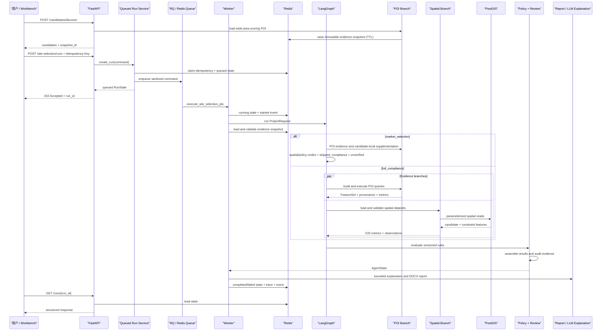
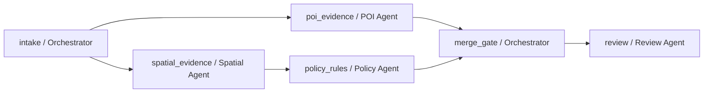
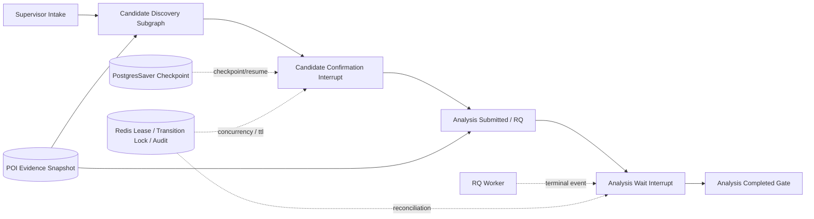
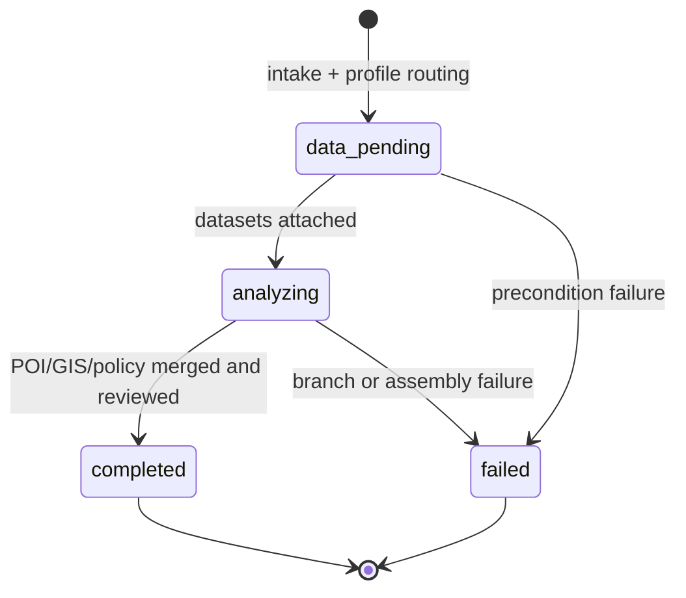
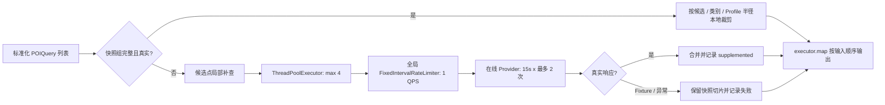

# 选址系统架构

## 候选发现前置 Agent

零售选址在正式分析 DAG 前增加候选发现 DAG：`discovery_intake` 后并行执行 `land_use_gate` 与 `poi_market_evidence`，`rank_diversify` 汇合证据并执行空间去重，`discovery_review` 输出必须确认的候选集合。该五节点图与正式分析六节点图共用 `compile_agent_plan_graph()`，节点和边都由审核 Plan 生成。用地门禁是确定性硬约束，POI 是软评分证据；LLM 不参与用地放行或数值计算。完整契约见 [候选位置自动发现](candidate-discovery.md)。

`land_use_gate` 内部按权威 PostGIS 图层、OSM 公开用地观察、商业用地代理、市场网格四级来源执行。OSM Provider 查询商业/零售用地和商业建筑多边形，使用投影面积与质心生成候选，并通过 Redis TTL 缓存；它的证据等级固定为 `public_observation`，不能放行 GIS/政策合规结论。`formal_analysis_allowed=false` 只关闭合规结论，不再关闭整个零售选址任务。Supervisor 将权威登记用地路由到 `full_compliance`，将公开观察、商业代理或市场网格路由到 `market_selection`；后者继续运行候选局部 POI 补采、评分、排序、审查和报告，同时把 GIS/政策节点记录为 `skipped/not_run`，并明确标记用地合规待核验。`poi_market_evidence` 对在线降级、截断或缺类别的评分组执行有界 2x2 分区补查，只合并真实在线记录并保留剩余不完整状态。

Workbench 将“任意区域商业选址分析”“完整工作流演示”和“生产合规审查”显式分开。第一条保留用户输入区域，即使用地缺失也能产出市场分析；第二条必须由用户主动触发版本化合成用地，仅用于作品集演示；第三条要求经治理的真实用地数据。UI 不再把演示范围作为解决普通用户需求的前提。

候选排序完成后，系统把评分用宽域 POI 保存为 Redis 证据快照。Workbench 确认候选时提交 `poi_evidence_snapshot_id`；两种分析范围都注入 `SnapshotReusingPOIGateway`。来源真实、完整、非截断的评分组按候选/类别/Profile 半径本地裁剪并重算指标；宽域结果被截断、缺组、缺类别、使用合成来源或发生在线降级时，只对受影响候选调用运行时 Gateway 补查。只有真实 Provider 响应才算补查成功；Fixture 再降级或异常只记录失败，并优先保留同一快照的局部切片。快照缺失、过期或错配时在入队前 fail-closed；补查失败且存在局部快照时保留不完整证据与错误，完全缺组时仍 fail-closed。

候选级覆盖诊断汇总每个候选的真实、合成、截断和补查失败组；评分组级 cohort 诊断再比较同组所有候选。只有整个 cohort 都是真实、非截断且无补查失败时，POI 数量差异才标记为可横向比较。系统不人为补齐不同候选的 POI 数量，也不允许把 Provider 故障造成的缺口解释成真实商业密度差异。

## 1. 分层职责

| 层 | 主要目录 | 职责 |
|---|---|---|
| 交互层 | `workbench/` | 输入项目与候选地、查看结果、确认人工复核、下载报告 |
| HTTP 层 | `app/api/`, `app/schemas/` | 请求校验、状态码映射、响应序列化，不实现业务判断 |
| 应用层 | `app/services/` | 运行编排、幂等、缓存、报告、解释和资源生命周期 |
| 装配层 | `app/site_selection_bootstrap.py` | 从环境变量装配 PostGIS、Redis、Fixture、MCP 与可选 LLM |
| 领域层 | `practice/site_selection/` | Profile、证据、评分、规则、审查及工作流 |
| 基础设施层 | `spatial/`, `storage/`, POI/LandUse Provider | 文件/PostGIS/Redis/HTTP 等外部边界 |
| 交付与验证 | `deploy/`, `scripts/`, `tests/`, `evals/` | Schema、迁移、Smoke、回归、冻结评测与性能记录 |

依赖方向从交互层指向领域接口，领域模型不依赖 FastAPI 或 Streamlit。外部系统通过 Gateway、Repository、Adapter 和 Store 接口接入。

## 2. 完整调用链

## 3. 工作流状态

主业务图不是自由对话式 Agent，而是一个版本化、可验证的 Agent/Skill DAG。`agent_orchestration.py` 定义白名单节点、角色、Skill 版本、依赖、并行组、关键性、LLM 使用权限和输出契约；启动时拒绝未知依赖、重复节点、循环依赖和非拓扑顺序。当前计划为：

`poi_evidence` 与 `spatial_evidence` 属于同一 `evidence_collection` 并行组。`full_compliance` 中，`policy_rules` 必须等待 READY GIS 证据；`market_selection` 中，空间和政策节点按计划显式标记 `skipped`，并生成 `NOT_RUN` 占位证据说明待核验，不调用 GIS 或规则工具。`merge_gate` 在两条分支中都要求 POI 完整，不能把缺失市场证据包装成结果。

正式分析、候选发现和上层 Supervisor 都由 `agent_graph_runtime.py` 的 `compile_agent_plan_graph()` 从各自 Plan 编译。运行时只提供与 `node_id` 一一对应的 Handler；缺少计划节点或增加计划外 Handler 都会在编译阶段失败。无依赖节点自动连接 `START`，多依赖节点自动形成 LangGraph fan-in，终点自动连接 `END`。因此 Manifest、实际 LangGraph 节点与 UI Trace 使用同一份拓扑来源，不再分别手写连边。

Supervisor 组合 `supervisor_intake -> candidate_discovery -> candidate_confirmation -> analysis_submitted -> analysis_wait -> analysis_completed`。两个等待节点都使用 LangGraph `interrupt()`。确认前校验候选属于发现报告；登记用地进入 `full_compliance`，零售市场网格进入 `market_selection`，非零售项目仍不能绕过用地门禁。API 与 Worker 通过共享工厂构造同一拓扑，PostgresSaver 持久化 checkpoint，Redis 保存 session TTL、转换锁、RunState 和审计事件。

每次运行返回按计划顺序排列的 `AgentStepTrace`，字段包括节点、Agent 角色、Skill 名称/版本、依赖、并行组、状态、耗时和脱敏异常类型。业务图中的所有节点当前均为 `llm_allowed=false`：LLM 只在确定性 Evidence Review 之后的可选 Harness/协作层解释和复核已完成证据，不参与 GIS 数值、POI 指标、规则命中或排序。

启用多 Agent 复核时，`AgentHarness` 先解析活动 Prompt 版本，将 `AgentState` 投影为结构化证据上下文并执行字符数、引用白名单和预算门禁，再装配 Supervisor、POI、Spatial、Policy、Review 五角色协作图。Harness 与协作图分别返回 `agent_harness_report` 和 `collaboration_report`；前者记录版本、上下文、预算和阶段 Trace，后者记录角色消息、委派、反思和终态。Prompt 候选只允许在线下同冻结集对照，通过门禁并经人工批准后晋级，支持审计回滚。

### Supervisor 状态与子图边界

检查点只允许保存结构化业务模型、ID、版本和 Trace。数据库连接、Redis Client、HTTP Client、Gateway、锁、线程池和 `SiteSelectionRuntime` 必须在节点执行时重新装配，不能进入可序列化状态。宽域 POI 正文继续由专用 Redis Snapshot Store 保存，Supervisor 只保存发现报告和快照引用，避免检查点体积随 POI 数量膨胀。

应用层运行状态经历 `queued -> running -> completed|failed|timed_out`，`queued` 和 `running` 还可以转为 `cancelled`。取消先写 Redis 终态，再尽力撤销排队任务或停止运行中任务，避免失败回调把取消覆盖成失败。领域分析状态与 Redis 运行状态分开，避免把工作流内部状态误当成基础设施状态。

## 4. 关键组件

### Profile 与前置检查

`profiles.py` 定义四类项目的六组 POI 查询、半径、指标和软评分权重。咖啡店与便利店作为独立叶子场景注册，因此门店类型会真实改变查询类别、半径和权重，而不是只改变 UI 名称。`preflight.py` 只判断输入是否完整、项目类型是否支持，不执行 GIS 或规则判断。

### 空间分析

`spatial/validate.py` 阻断缺少 CRS、非米制投影、空/无效几何和字段缺失。`query_engine.py` 提供 GeoPandas 与 PostGIS 等价查询接口；`postgis_gateway.py` 从已入库图层恢复 GeoDataFrame。面积与距离使用投影坐标系，持久化几何标准化为 SRID 4326。

### POI

`poi.py` 定义 Provider 无关的查询、记录、来源和指标契约。`fixture_catalog.py` 从版本化目录加载每类项目 6 个候选，在进入严格 API Schema 前移除仅供场景生成使用的 `scenario_profile`，并为用户主动触发的零售全流程演示推导数据覆盖范围。`poi_adapters.py` 实现确定性 Fixture；它区分实际返回数、查询可用数和完整数据集记录数，并透传合成标记与质量说明。`online_poi_adapters.py` 实现高德、Overpass、限流、重试、熔断、Redis 缓存、坐标转换、PostGIS 入库和显式 Fixture 降级。`site_selection_poi_provider.py` 根据 `fixture / auto / amap / overpass` 环境配置组装同一条 Adapter 链，API 与 Worker 使用相同 Provider。`evidence_snapshot.py` 冻结候选发现评分证据并通过同一 `POIGateway` 协议复用。来源元数据记录 Provider、数据版本、查询时间、CRS、合成状态、降级原因、快照复用以及结果是否被查询上限截断。

当 `available_record_count > record_count` 时，来源必须标记 `is_truncated=true`。Evidence Review 添加 `poi_result_truncated` 警告，Workbench 与 DOCX 报告将数量和密度声明为下界；主来源为合成 Fixture 时添加 `poi_synthetic_source` 警告。这样“返回数达到查询上限”不会被误读为“周边总量就只有这些”。

正式 POI 执行分为本地快照裁剪和候选局部补查两条路径：

`execute_poi_queries()` 最多让 4 个逻辑查询同时等待网络，但所有在线请求仍经过同一个线程安全的 1 QPS 限速器。`executor.map` 保证结果顺序与输入查询一致，因此性能优化不会改变候选、评分组与结果的对应关系。完整组不联网，不完整组才消耗 Provider 预算。

`scripts/generate_rich_fixtures.py` 是候选目录、POI 和空间图层的单一生成源。同一场景配置同时驱动候选中心、POI 类别数量和候选多边形，避免三份 Fixture 手工漂移。生成结果目前包含 24 个候选、1,157 条 POI 和 30 个类别；这些数量用于回归与比较，不声明真实覆盖率或客流。

### 规则、RAG 与 LLM

规则引擎只执行版本化结构化规则。RAG 返回可定位引用，但不直接生成合规结论。LLM 解释器只复述已经完成的证据；解释失败被单独记录，不回写评分、排序或规则发现。

自然语言交互位于 Supervisor 之前。`ScenarioInterpreter` 只产生 `add / replace / remove` 动作，`SiteSelectionConversationService` 再执行类型、范围、冲突和数据就绪校验。用户确认后得到不可变 `ScenarioVersion`；零售场景可生成 `CandidateDiscoveryRequest`，商场和物流园继续使用人工候选录入。原始聊天记录只用于交互追溯，已确认版本才是下游可执行记忆。

区域解析采用 Provider 边界。`auto` 在存在高德 Key 时调用行政区接口，否则回退到明确标记的离线演示目录；两者都把解析中心和用户半径转换为 `DiscoveryBounds`，继续接受 20 公里对角线门禁。行政区名称不等于项目红线，响应必须披露来源、置信度和复核警告。

### 可靠性与人工复核

Redis 保存运行状态、幂等记录、POI 查询缓存、候选发现证据快照和事件，每类键都有命名空间与 TTL。在线 POI 缓存键忽略运行 ID，但包含坐标、类别、半径、数量和 Provider 版本；命中后重新绑定当前查询身份。证据快照默认保留 2 小时，绑定一次发现到确认的业务窗口。RQ 使用独立 Redis 连接和固定队列名；任务载荷只有 `run_id` 与经过 Schema 序列化的业务请求，不包含数据库、Redis、POI Key、快照正文或 LLM 凭据。规则命中、POI Fixture 降级等警告进入 `pending` 人工复核。`acknowledged` 只表示操作员已阅，事件中固定记录 `acknowledgement_not_compliance_approval` 边界。

RQ 的 180 秒任务超时是主执行预算。正常情况下，Worker 完成、失败或超时回调通过原子 RunState 转换写入终态；若进程被强制终止且回调未能落状态，`QueuedSiteSelectionRunService.get_run()` 会在任务年龄超过 `180 + 30` 秒时尝试写入 `timed_out / StaleWorkerTimeout`。Redis 只允许一个终态胜出，迟到 Worker 在发布前检查外部终态，不能覆盖已取消或已超时 Run。Supervisor GET 对终态执行幂等 reconciliation，因此控制流最终从 `analysis_wait` 收敛，而不是永久停留在“分析中”。

## 5. 失败策略

- 输入不完整：返回 `needs_input`，不启动分析。
- 项目类型不支持：返回 `unsupported` 或 `runtime_unavailable`。
- 空间数据无效：工作流失败，结果列表为空。
- 在线 POI 暂时不可用：有配置时重试/熔断并显式降级；响应格式错误直接失败。
- 证据血缘缺失：证据审查 `blocked`，不能进入人工确认。
- 报告生成失败：运行失败，保留已完成分析和清洗后的阶段 Trace。
- 入队失败：运行写为 `failed`，只记录异常类型，不泄露 Redis 连接信息。
- Worker 超时：RQ 180 秒预算和失败回调是主路径；API GET 在额外 30 秒宽限后把陈旧 `running` 原子收敛为 `timed_out / StaleWorkerTimeout`。
- 用户取消：`queued/running` 转为 `cancelled`；完成、失败或超时任务拒绝取消。
- LLM 解释失败：分析仍可完成，解释状态单独标记为 `failed`。
- 未配置运行时：系统 fail-closed，不自动启用 Fixture。

## 6. 部署拓扑

Compose 启动六个服务：API `8000`、RQ Worker、MCP `8001`、Workbench `8501`、PostGIS `5432`、Redis `6379`。API 负责校验、幂等与入队，Worker 独立执行工作流。API 与 Worker 等待 PostGIS、Redis 健康，并共享报告命名卷；MCP 和 Workbench 等待 API 健康。

当前拓扑用于本地演示。生产化仍需反向代理、TLS、密钥管理、网络隔离、备份恢复、数据库连接池容量评估、集中日志和监控告警。

## 7. 当前 Agent 边界与下一阶段

当前已实现确定性 Agent/Skill DAG、五角色 LLM 协作图、统一 Harness、节点级 Trace、失败门禁、MCP 工具白名单、政策检索组件、异步运行时、带双 interrupt 的 Supervisor，以及位于 Supervisor 前的自然语言场景与约束版本层。对话层支持约束追加、覆盖、删除、冲突提示、区域转换、人工确认和 Redis 恢复；确认版本可直接提供零售候选发现边界。Supervisor 已完成 PostgresSaver、Redis session 协调、HTTP、Worker 与 Workbench 接入；正式分析复用原 `/runs` RQ 链，Worker 终态恢复为主路径，GET 对账为兜底。Prompt 进化目前是离线候选、冻结集门禁、人工晋级与回滚，不是运行时自改代码或在线训练。多 API 竞争、数据库故障切换、Prompt Registry 持久化和滚动升级仍需单独验证。

尚未实现的部分不得作为现成功能表述：

- 更开放的多轮 `PlanningIntentAgent` 及 LLM 结构化输出自动修复；当前实现采用严格 Schema 并在 LLM 失败时回退规则解析；
- 跨用户、跨租户的永久项目记忆、认证身份和访问控制；当前 `ScenarioVersion` 是带 TTL 的项目会话记忆；
- 租金、真实客流、预算和经营数据的执行消费者；这些约束目前会保存为 `missing_data`，不参与评分；
- 将政策混合检索作为主业务图的强制依赖节点；
- 将 LLM 解释从运行终态彻底解耦，使确定性结果先返回。

后续扩展应继续遵守同一边界：LLM 生成结构化意图和证据说明，注册 Skill 执行确定性计算，硬规则与数据质量门禁拥有最终阻断权。
