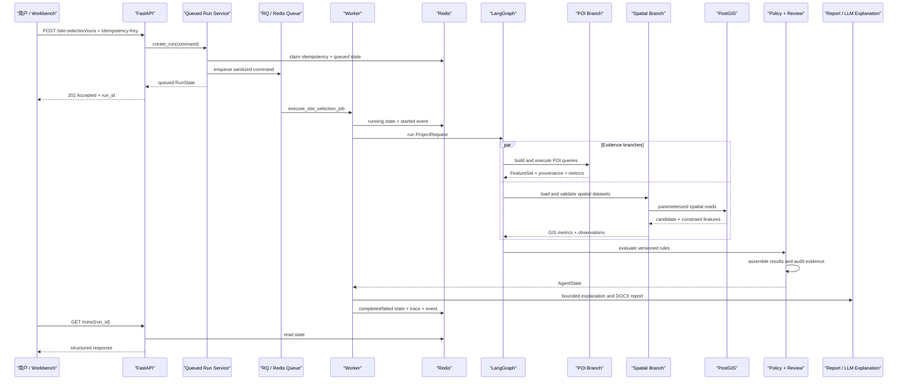
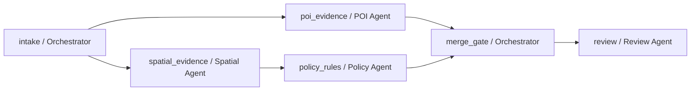
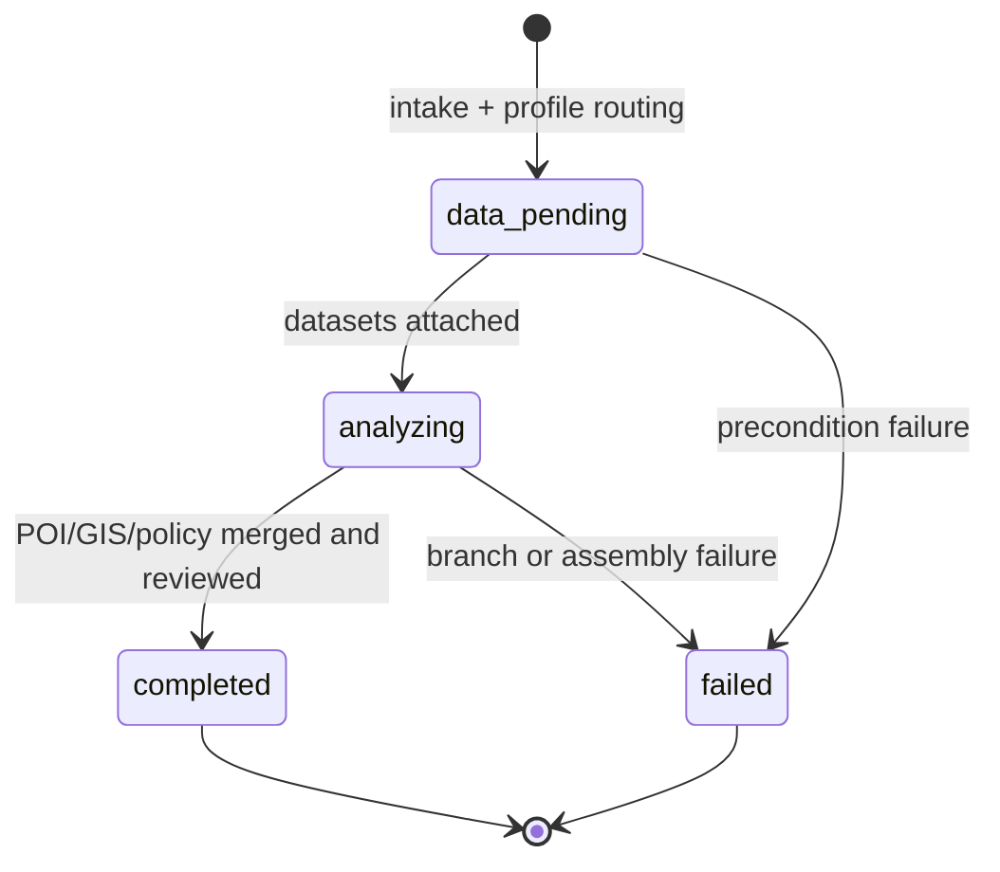

# 选址系统架构

## 1. 分层职责

| 层 | 主要目录 | 职责 |
|---|---|---|
| 交互层 | `workbench/` | 输入项目与候选地、查看结果、确认人工复核、下载报告 |
| HTTP 层 | `app/api/`, `app/schemas/` | 请求校验、状态码映射、响应序列化，不实现业务判断 |
| 应用层 | `app/services/` | 运行编排、幂等、缓存、报告、解释和资源生命周期 |
| 装配层 | `app/site_selection_bootstrap.py` | 从环境变量装配 PostGIS、Redis、Fixture、MCP 与可选 LLM |
| 领域层 | `practice/site_selection/` | Profile、证据、评分、规则、审查及工作流 |
| 基础设施层 | `spatial/`, `storage/`, POI Adapter | 文件/PostGIS/Redis/HTTP 等外部边界 |
| 交付与验证 | `deploy/`, `scripts/`, `tests/`, `evals/` | Schema、迁移、Smoke、回归、冻结评测与性能记录 |

依赖方向从交互层指向领域接口，领域模型不依赖 FastAPI 或 Streamlit。外部系统通过 Gateway、Repository、Adapter 和 Store 接口接入。

## 2. 完整调用链

## 3. 工作流状态

主业务图不是自由对话式 Agent，而是一个版本化、可验证的 Agent/Skill DAG。`agent_orchestration.py` 定义白名单节点、角色、Skill 版本、依赖、并行组、关键性、LLM 使用权限和输出契约；启动时拒绝未知依赖、重复节点和循环依赖。当前计划为：

`poi_evidence` 与 `spatial_evidence` 属于同一 `evidence_collection` 并行组。`policy_rules` 必须等待 GIS 证据；`merge_gate` 必须同时等待 POI 和政策分支；任一关键依赖失败时，下游节点只能标记为 `failed` 或 `skipped`，不能绕过门禁继续生成结果。

每次运行返回按计划顺序排列的 `AgentStepTrace`，字段包括节点、Agent 角色、Skill 名称/版本、依赖、并行组、状态、耗时和脱敏异常类型。业务图中的所有节点当前均为 `llm_allowed=false`：LLM 仍只在图外解释已完成证据，不参与 GIS 数值、POI 指标、规则命中或排序。

应用层运行状态经历 `queued -> running -> completed|failed|timed_out`，`queued` 和 `running` 还可以转为 `cancelled`。取消先写 Redis 终态，再尽力撤销排队任务或停止运行中任务，避免失败回调把取消覆盖成失败。领域分析状态与 Redis 运行状态分开，避免把工作流内部状态误当成基础设施状态。

## 4. 关键组件

### Profile 与前置检查

`profiles.py` 定义四类项目的六组 POI 查询、半径、指标和软评分权重。咖啡店与便利店作为独立叶子场景注册，因此门店类型会真实改变查询类别、半径和权重，而不是只改变 UI 名称。`preflight.py` 只判断输入是否完整、项目类型是否支持，不执行 GIS 或规则判断。

### 空间分析

`spatial/validate.py` 阻断缺少 CRS、非米制投影、空/无效几何和字段缺失。`query_engine.py` 提供 GeoPandas 与 PostGIS 等价查询接口；`postgis_gateway.py` 从已入库图层恢复 GeoDataFrame。面积与距离使用投影坐标系，持久化几何标准化为 SRID 4326。

### POI

`poi.py` 定义 Provider 无关的查询、记录、来源和指标契约。`fixture_catalog.py` 从版本化目录加载每类项目 6 个候选，并在进入严格 API Schema 前移除仅供场景生成使用的 `scenario_profile`。`poi_adapters.py` 实现确定性 Fixture；它区分实际返回数、查询可用数和完整数据集记录数，并透传合成标记与质量说明。`online_poi_adapters.py` 实现高德、Overpass、限流、重试、熔断、Redis 缓存、坐标转换、PostGIS 入库和显式 Fixture 降级。`site_selection_poi_provider.py` 根据 `fixture / auto / amap / overpass` 环境配置组装同一条 Adapter 链，API 与 Worker 使用相同 Provider。来源元数据记录 Provider、数据版本、查询时间、CRS、合成状态、降级原因以及结果是否被查询上限截断。

当 `available_record_count > record_count` 时，来源必须标记 `is_truncated=true`。Evidence Review 添加 `poi_result_truncated` 警告，Workbench 与 DOCX 报告将数量和密度声明为下界；主来源为合成 Fixture 时添加 `poi_synthetic_source` 警告。这样“返回 100 条”不会被误读为“周边总共只有 100 条”。

`scripts/generate_rich_fixtures.py` 是候选目录、POI 和空间图层的单一生成源。同一场景配置同时驱动候选中心、POI 类别数量和候选多边形，避免三份 Fixture 手工漂移。生成结果目前包含 24 个候选、1,157 条 POI 和 30 个类别；这些数量用于回归与比较，不声明真实覆盖率或客流。

### 规则、RAG 与 LLM

规则引擎只执行版本化结构化规则。RAG 返回可定位引用，但不直接生成合规结论。LLM 解释器只复述已经完成的证据；解释失败被单独记录，不回写评分、排序或规则发现。

### 可靠性与人工复核

Redis 保存运行状态、幂等记录、POI 缓存和事件，每类键都有命名空间与 TTL。在线 POI 缓存键忽略运行 ID，但包含坐标、类别、半径、数量和 Provider 版本；命中后重新绑定当前查询身份。RQ 使用独立 Redis 连接和固定队列名；任务载荷只有 `run_id` 与经过 Schema 序列化的业务请求，不包含数据库、Redis、POI Key 或 LLM 凭据。规则命中、POI Fixture 降级等警告进入 `pending` 人工复核。`acknowledged` 只表示操作员已阅，事件中固定记录 `acknowledgement_not_compliance_approval` 边界。

## 5. 失败策略

- 输入不完整：返回 `needs_input`，不启动分析。
- 项目类型不支持：返回 `unsupported` 或 `runtime_unavailable`。
- 空间数据无效：工作流失败，结果列表为空。
- 在线 POI 暂时不可用：有配置时重试/熔断并显式降级；响应格式错误直接失败。
- 证据血缘缺失：证据审查 `blocked`，不能进入人工确认。
- 报告生成失败：运行失败，保留已完成分析和清洗后的阶段 Trace。
- 入队失败：运行写为 `failed`，只记录异常类型，不泄露 Redis 连接信息。
- Worker 超时：RQ 终止任务，失败回调写入 `timed_out` 和审计事件。
- 用户取消：`queued/running` 转为 `cancelled`；完成、失败或超时任务拒绝取消。
- LLM 解释失败：分析仍可完成，解释状态单独标记为 `failed`。
- 未配置运行时：系统 fail-closed，不自动启用 Fixture。

## 6. 部署拓扑

Compose 启动六个服务：API `8000`、RQ Worker、MCP `8001`、Workbench `8501`、PostGIS `5432`、Redis `6379`。API 负责校验、幂等与入队，Worker 独立执行工作流。API 与 Worker 等待 PostGIS、Redis 健康，并共享报告命名卷；MCP 和 Workbench 等待 API 健康。

当前拓扑用于本地演示。生产化仍需反向代理、TLS、密钥管理、网络隔离、备份恢复、数据库连接池容量评估、集中日志和监控告警。

## 7. 当前 Agent 边界与下一阶段

当前已实现的是结构化、确定性的多 Agent 执行图、节点级 Trace、失败门禁、MCP 工具白名单、政策检索组件和异步运行时。尚未实现的部分不得作为现成功能表述：

- 自然语言 `PlanningIntentAgent` 及结构化计划修复；
- 会话短期记忆、项目长期记忆和不可变 `ScenarioVersion`；
- 负责约束追加、覆盖、删除与冲突检测的 `ConstraintAgent`；
- 将政策混合检索作为主业务图的强制依赖节点；
- 将 LLM 解释从运行终态彻底解耦，使确定性结果先返回。

后续扩展应继续遵守同一边界：LLM 生成结构化意图和证据说明，注册 Skill 执行确定性计算，硬规则与数据质量门禁拥有最终阻断权。
