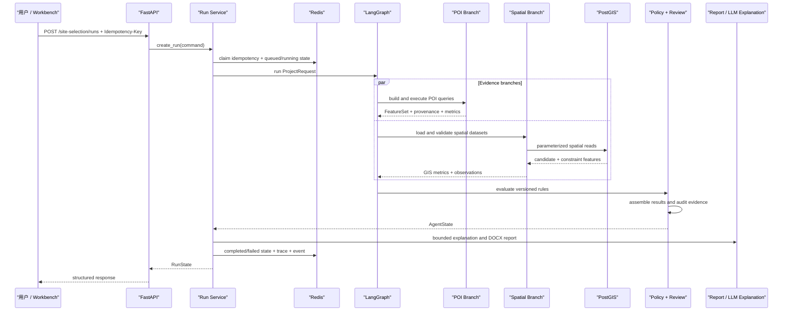
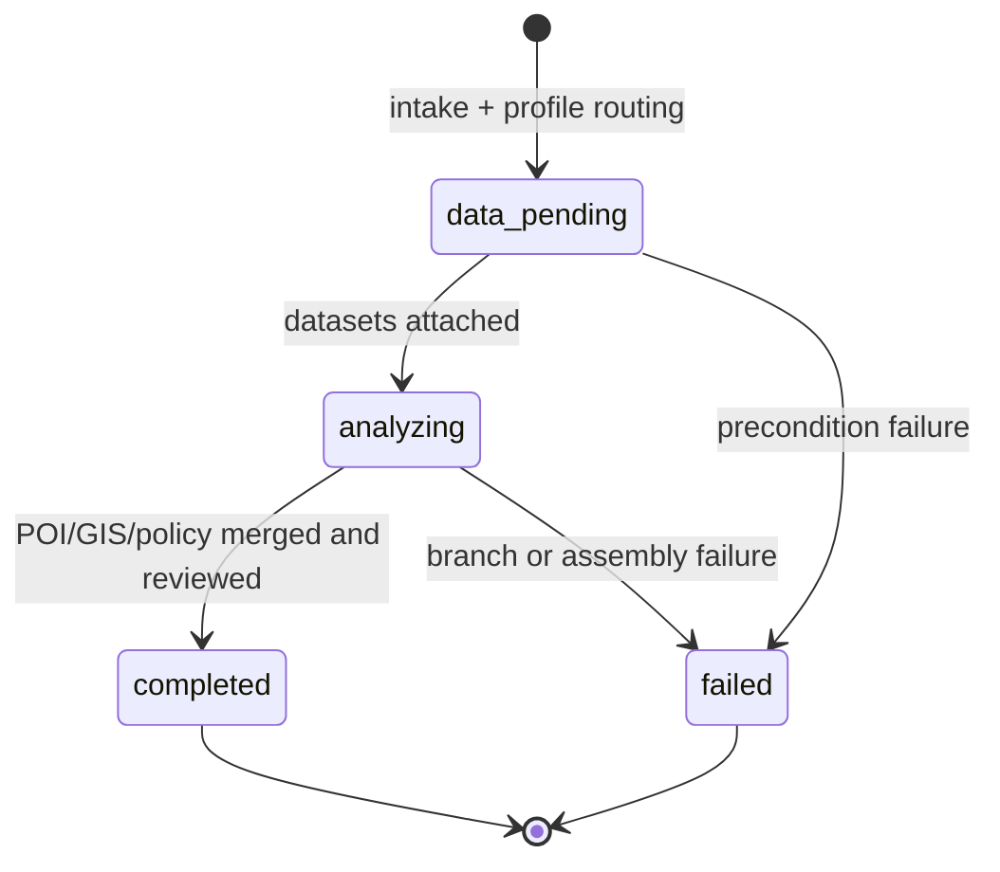

# 选址系统架构

## 1. 分层职责

| 层 | 主要目录 | 职责 |
|---|---|---|
| 交互层 | `workbench/` | 输入项目与候选地、查看结果、确认人工复核、下载报告 |
| HTTP 层 | `app/api/`, `app/schemas/` | 请求校验、状态码映射、响应序列化，不实现业务判断 |
| 应用层 | `app/services/` | 运行编排、幂等、缓存、报告、解释和资源生命周期 |
| 装配层 | `app/site_selection_bootstrap.py` | 从环境变量装配 PostGIS、Redis、Fixture、MCP 与可选 LLM |
| 领域层 | `practice/site_selection/` | Profile、证据、评分、规则、审查及工作流 |
| 基础设施层 | `spatial/`, `storage/`, POI Adapter | 文件/PostGIS/Redis/HTTP 等外部边界 |
| 交付与验证 | `deploy/`, `scripts/`, `tests/`, `evals/` | Schema、迁移、Smoke、回归、冻结评测与性能记录 |

依赖方向从交互层指向领域接口，领域模型不依赖 FastAPI 或 Streamlit。外部系统通过 Gateway、Repository、Adapter 和 Store 接口接入。

## 2. 完整调用链

## 3. 工作流状态

应用层运行状态另外经历 `queued -> running -> completed|failed`。领域分析状态与 Redis 运行状态分开，避免把工作流内部状态误当成基础设施状态。

## 4. 关键组件

### Profile 与前置检查

`profiles.py` 定义两类项目的六组 POI 查询、半径、指标和软评分权重。`preflight.py` 只判断输入是否完整、项目类型是否支持，不执行 GIS 或规则判断。

### 空间分析

`spatial/validate.py` 阻断缺少 CRS、非米制投影、空/无效几何和字段缺失。`query_engine.py` 提供 GeoPandas 与 PostGIS 等价查询接口；`postgis_gateway.py` 从已入库图层恢复 GeoDataFrame。面积与距离使用投影坐标系，持久化几何标准化为 SRID 4326。

### POI

`poi.py` 定义 Provider 无关的查询、记录、来源和指标契约。`poi_adapters.py` 实现确定性 Fixture。`online_poi_adapters.py` 实现高德、Overpass、限流、重试、熔断、坐标转换和显式 Fixture 降级。来源元数据记录 Provider、数据版本、查询时间、CRS 及降级原因。

### 规则、RAG 与 LLM

规则引擎只执行版本化结构化规则。RAG 返回可定位引用，但不直接生成合规结论。LLM 解释器只复述已经完成的证据；解释失败被单独记录，不回写评分、排序或规则发现。

### 可靠性与人工复核

Redis 保存运行状态、幂等记录、POI 缓存和事件，每类键都有命名空间与 TTL。规则命中、POI Fixture 降级等警告进入 `pending` 人工复核。`acknowledged` 只表示操作员已阅，事件中固定记录 `acknowledgement_not_compliance_approval` 边界。

## 5. 失败策略

- 输入不完整：返回 `needs_input`，不启动分析。
- 项目类型不支持：返回 `unsupported` 或 `runtime_unavailable`。
- 空间数据无效：工作流失败，结果列表为空。
- 在线 POI 暂时不可用：有配置时重试/熔断并显式降级；响应格式错误直接失败。
- 证据血缘缺失：证据审查 `blocked`，不能进入人工确认。
- 报告生成失败：运行失败，保留已完成分析和清洗后的阶段 Trace。
- LLM 解释失败：分析仍可完成，解释状态单独标记为 `failed`。
- 未配置运行时：系统 fail-closed，不自动启用 Fixture。

## 6. 部署拓扑

Compose 启动五个服务：API `8000`、MCP `8001`、Workbench `8501`、PostGIS `5432`、Redis `6379`。API 等待 PostGIS 与 Redis 健康；MCP 和 Workbench 等待 API 健康。报告通过命名卷持久化。

当前拓扑用于本地演示。生产化仍需反向代理、TLS、密钥管理、网络隔离、备份恢复、数据库连接池容量评估、集中日志和监控告警。
