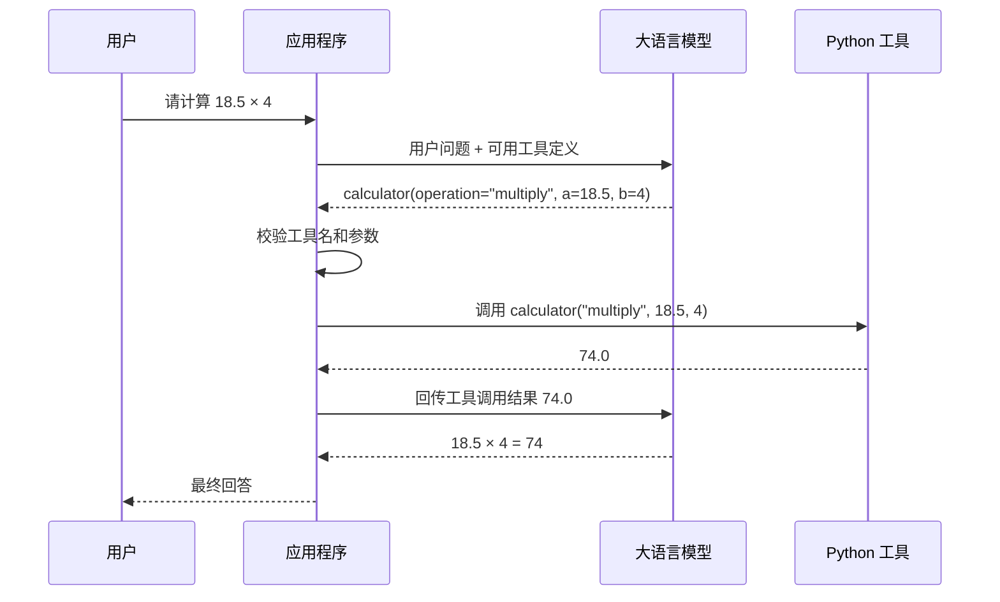

# 2026-08-13 Function Calling 学习笔记

## 1. Function Calling 是什么

### 英文名与中文名

- **Function Calling**：函数调用机制，也常称为**工具调用**。
- **Tool**：工具。
- **Function**：函数。
- **Arguments**：调用参数。
- **JSON Schema**：描述 JSON 数据结构和约束的规范。

Function Calling 是让大语言模型连接外部工具的一种机制。调用程序先向模型说明有哪些工具、每个工具能做什么、需要哪些参数。模型阅读用户问题后，可以选择一个合适的工具，并生成工具名称和结构化参数。

最重要的边界是：

> 模型只提出工具调用请求，不直接执行 Python 函数。参数校验、权限判断和函数执行都由调用模型的程序负责。

---

## 2. 前辈资料的核心内容

前辈资料说明了以下流程：

1. 调用方向 LLM 描述可用函数。
2. 描述函数的功能、请求参数和响应信息。
3. LLM 根据用户输入选择合适函数。
4. LLM 把自然语言转换为 JSON 参数。
5. 调用方使用函数名称和参数执行真正函数。
6. 如有需要，把函数结果再传给 LLM，由 LLM 组织自然语言回复。

这个理解基本正确。工程上还需要补充：

- 模型生成的函数名和参数都属于不可信输入。
- 程序必须检查函数是否在允许列表中。
- 参数必须通过 JSON Schema 或 Pydantic 校验。
- 工具可能执行失败，必须处理异常。
- 工具结果也要限制长度并按数据处理，不能当成新的系统指令。
- 涉及写入、删除、付款或外部发送等副作用时，还需要权限或人工确认。

---

## 3. 六步调用链路

```text
用户请求
  ↓
模型选择工具并生成参数
  ↓
程序校验工具名称和参数
  ↓
程序执行真实工具
  ↓
程序把工具结果回传模型
  ↓
模型生成最终回答
```

也可以画成时序流程：



### 第 1 步：用户提出请求

```text
请帮我计算 18.5 乘以 4。
```

用户使用自然语言表达目标，不需要知道 Python 函数名或参数结构。

### 第 2 步：模型选择工具并生成参数

应用程序把用户问题和可用工具定义一起发给模型。模型可能生成类似请求：

```json
{
  "name": "calculator",
  "arguments": {
    "operation": "multiply",
    "a": 18.5,
    "b": 4
  }
}
```

此时模型只是输出“建议调用 `calculator`”，还没有执行计算器。

如果用户说“你好”，模型可以不选择任何工具，直接生成普通回答。

### 第 3 步：程序校验参数

程序需要校验：

- 工具名称是否在允许列表中。
- `operation` 是否只能是 `add/subtract/multiply/divide`。
- `a` 和 `b` 是否是数字。
- 是否缺少必填参数。
- 是否出现额外参数。
- 除法中的除数是否为 0。

模型输出的 JSON 不能直接交给函数执行。

### 第 4 步：程序执行工具

校验成功后，由 Python 程序调用真正函数：

```python
result = calculator(
    operation="multiply",
    a=18.5,
    b=4,
)
```

真正完成计算的是 Python，不是模型。

### 第 5 步：程序回传工具结果

程序将：

- 工具调用的唯一标识；
- 工具执行结果；
- 必要的错误信息；

按当前 API 要求回传给模型。

例如结果值是：

```text
74.0
```

模型只有看到回传结果后，才能基于真实工具结果继续回答。

### 第 6 步：模型生成最终回答

模型结合原始问题和工具结果，组织自然语言：

```text
18.5 × 4 = 74。
```

如果工具执行失败，最终回答应如实说明失败原因，而不是编造一个结果。

---

## 4. 每个参与者负责什么

| 参与者 | 负责 | 不负责 |
|---|---|---|
| 用户 | 提出自然语言需求 | 不需要构造 Python 参数 |
| 模型 | 理解意图，建议工具和参数，组织最终回答 | 不直接执行 Python，不决定最终权限 |
| JSON Schema | 描述工具参数名称、类型、枚举和必填项 | 不执行工具，不代替运行时校验 |
| Pydantic | 在程序端校验实际参数 | 不选择工具，不完成业务计算 |
| 工具注册表 | 限定允许调用哪些函数 | 不理解自然语言 |
| Python 函数 | 执行加减乘除等确定性逻辑 | 不自由解释用户意图 |
| 应用程序 | 编排调用、权限检查、异常处理、结果回传 | 不把控制权直接交给模型 |

一句话记忆：

> 模型负责“建议”，程序负责“验证和执行”。

---

## 5. 工具定义包含什么

一个工具通常包含：

### 5.1 名称

```text
calculator
```

名称应该稳定、明确，并与程序工具注册表中的名称一致。

### 5.2 描述

```text
执行两个数字的加、减、乘、除运算。
只有用户明确要求算术计算时才使用。
```

描述会帮助模型判断什么时候使用工具。描述不应夸大能力。

### 5.3 参数 JSON Schema

```json
{
  "type": "object",
  "properties": {
    "operation": {
      "type": "string",
      "enum": ["add", "subtract", "multiply", "divide"]
    },
    "a": {
      "type": "number"
    },
    "b": {
      "type": "number"
    }
  },
  "required": ["operation", "a", "b"],
  "additionalProperties": false
}
```

### 5.4 Python 实现

```python
def calculator(operation: str, a: float, b: float) -> float:
    if operation == "add":
        return a + b
    if operation == "subtract":
        return a - b
    if operation == "multiply":
        return a * b
    if operation == "divide":
        if b == 0:
            raise ValueError("除数不能为 0")
        return a / b

    raise ValueError(f"不支持的运算：{operation}")
```

这段代码没有使用 `eval()`，只能执行明确允许的四种运算。

---

## 6. 为什么禁止使用 `eval()`

不安全写法：

```python
def calculator(expression: str):
    return eval(expression)
```

`eval()` 会把字符串当作 Python 表达式执行。模型或用户可能传入的内容不只是算术表达式，还可能尝试访问文件、环境变量或执行其他代码。

安全做法是：

```text
operation + a + b
```

然后程序使用 `if`、`match` 或受控函数映射执行允许的运算。

---

## 7. JSON Schema 与 Pydantic 的区别

### JSON Schema

JSON Schema 主要用于向模型和接口描述工具参数合同：

```text
operation 是字符串且只能取四个值；
a 和 b 是数字；
三个字段都必须提供。
```

### Pydantic

Pydantic 在 Python 程序中校验模型实际返回的参数：

```python
class CalculatorArguments(BaseModel):
    model_config = ConfigDict(extra="forbid")

    operation: Literal[
        "add",
        "subtract",
        "multiply",
        "divide",
    ]
    a: float
    b: float
```

工程上两者可以来自同一个 Pydantic 模型，减少重复定义，但运行时校验不能省略。

---

## 8. 三种测试场景

### 8.1 计算问题

输入：

```text
请计算 18.5 乘以 4。
```

预期：

```text
模型选择 calculator
→ 参数为 multiply、18.5、4
→ 程序执行得到 74.0
→ 模型基于工具结果回答
```

### 8.2 普通对话

输入：

```text
你好，请介绍一下你能做什么。
```

预期：

- 模型不选择计算器。
- 程序不执行任何工具。
- 模型直接返回普通回答。

### 8.3 缺少参数

模拟模型返回：

```json
{
  "operation": "add",
  "a": 10
}
```

预期：

- Pydantic 明确指出缺少 `b`。
- 计算器函数不执行。
- 程序返回明确错误，或者让模型向用户追问缺失参数。

### 8.4 建议增加的边界测试

- `operation="power"`：拒绝非法操作。
- `divide, b=0`：明确报告除数不能为 0。
- 出现额外参数：拒绝。
- 模型选择不存在的工具：拒绝。
- 工具执行异常：回传明确错误，不能伪造结果。

---

## 9. Function Calling 不是什么

### 不是模型直接执行函数

模型只生成调用请求。应用程序是否执行，取决于白名单、参数校验、权限和业务规则。

### 不是普通 JSON 输出的别名

普通结构化输出用于返回业务对象；Function Calling 的输出用于表达“希望应用程序调用某个工具”。两者都可以使用 JSON Schema，但目的不同。

### 不是 RAG

RAG 负责检索知识文档；Function Calling 是通用工具连接机制。检索器可以被包装成一个工具，但二者概念不能混为一谈。

### 不是 MCP

- **MCP**：Model Context Protocol，模型上下文协议。
- Function Calling 描述单次模型与工具调用的交互模式。
- MCP 进一步规范工具、资源和提示如何被客户端发现和调用。

当前计算器练习只需要 Function Calling，不需要引入 MCP。

---

## 10. 当前项目中的应用位置

计算器是学习工具调用机制的最小练习。正式选址 Agent 中，未来可能注册：

- 获取候选地块元数据。
- 检查坐标参考系。
- 执行空间相交。
- 计算相交面积。
- 检索政策条款。
- 生成候选地比较数据。

但必须保持职责边界：

- LLM 选择和编排工具。
- GIS/PostGIS 计算空间关系和面积。
- RuleEngine 根据结构化结果执行规则。
- LLM 不自行计算几何，也不自由决定最终合规结论。

---

## 11. 当前 Responses 接口的实测结论

当前项目使用公司模型提供的 Responses 兼容接口。实测已经确认：

- 请求可以携带 `type="function"` 的工具定义。
- 模型能够返回 `function_call`，其中包含工具名、JSON 参数和 `call_id`。
- 程序能够依据工具白名单和 Pydantic 模型校验参数并执行计算器。
- 程序可以通过 `function_call_output` 回传工具执行结果。
- 模型能够依据真实工具结果生成最终自然语言回答。

第一次真实联调时，第二次请求使用了 `previous_response_id`，接口返回：

```text
previous_response_id is only supported on Responses WebSocket v2
```

这说明当前公司接口不支持在普通 HTTP Responses 请求中使用该字段串联上下文。修复方法不是跳过上下文，而是在第二次请求的 `input` 中显式携带：

```text
原始用户消息
+ 模型返回的 function_call
+ 程序生成的 function_call_output
```

修改后真实调用成功，模型最终回答：

```text
18.5 × 4 = 74。
```

因此，本项目目前已经完成真实的 Function Calling 闭环。这个结论只适用于当前实际测试过的公司 Responses 兼容端点和计算器工具，不代表所有 Responses API 能力均已得到支持。

本次访问 OpenAI Docs 的 Function Calling 页面时仍受到 403/Cloudflare 拦截，具体字段同时对照了本机 OpenAI Python SDK 2.53.0 的类型定义，并以公司端点的实际响应作为最终兼容性依据。

---

## 12. 闭卷画图模板

先不看前文，写出下面六个节点：

```text
用户请求
→ 模型选工具并生成参数
→ 程序校验工具名和参数
→ 程序执行 Python 函数
→ 程序回传工具结果
→ 模型生成最终回答
```

然后在每条箭头旁写出传递的数据：

```text
自然语言
→ 工具定义与用户问题
→ 工具名与 JSON 参数
→ 校验后的 Python 参数
→ 确定性工具结果
→ 最终自然语言
```

---

## 13. 闭卷自测题

1. 模型会不会直接执行 Python 函数？
2. 为什么模型生成的参数必须再次校验？
3. JSON Schema 与 Pydantic 分别在哪一侧发挥作用？
4. 为什么普通对话不应强制调用计算器？
5. 工具执行结果为什么还要传回模型？
6. 为什么禁止使用 `eval()`？
7. 如果模型返回不存在的工具名，程序应该怎么做？
8. 如果除数为 0，错误应该在哪一层产生？
9. Function Calling 与普通结构化输出有什么区别？
10. 为什么模型不能代替 GIS 工具计算空间相交面积？

---

## 14. 最低验收答案

- **谁选择工具？** 模型根据用户问题和工具描述提出选择。
- **谁生成参数？** 模型生成结构化参数。
- **谁校验参数？** 应用程序使用 JSON Schema/Pydantic 校验。
- **谁执行函数？** Python 程序执行真实函数。
- **谁回传结果？** 应用程序将工具结果交回模型。
- **谁生成最终回答？** 模型结合用户问题和真实工具结果生成回答。
- **最重要原则：** 模型负责建议，程序负责控制、校验和执行。

---

## 15. 实现与测试记录

### 已实现文件

- `practice/llm_api/calculator.py`：参数模型、工具定义、安全四则运算和工具白名单。
- `practice/llm_api/tool_calling.py`：模型请求、工具调用识别、参数校验、工具执行、结果回传和最终回答。
- `tests/test_calculator.py`：计算器正常与异常边界测试。
- `tests/test_tool_calling.py`：使用模拟模型响应测试完整编排流程。

### 离线测试

共通过 10 项测试，覆盖：

- 正常乘法。
- 缺少参数。
- 非法运算类型。
- 除数为 0。
- 额外参数。
- 未注册工具。
- 计算问题的完整调用循环。
- 普通对话不调用工具。
- 参数错误回传模型。
- 空用户输入。

### 真实接口测试

输入：

```text
请计算 18.5 乘以 4。
```

执行链路：

```text
模型选择 calculator 并生成参数
→ Pydantic 校验通过
→ Python 计算得到 74.0
→ 程序回传 function_call_output
→ 模型生成最终回答
```

输出：

```text
18.5 × 4 = 74。
```
