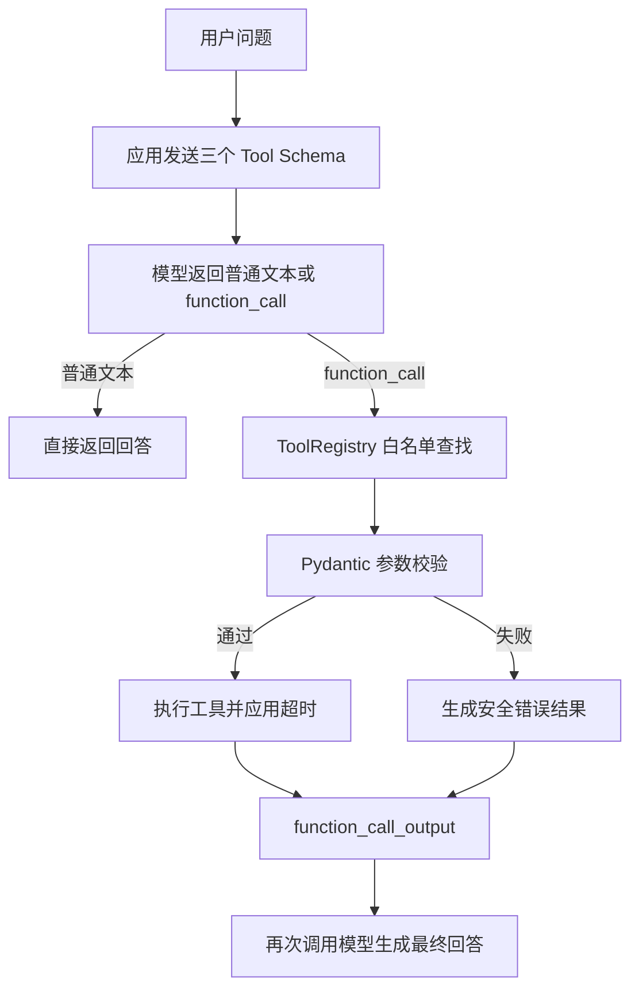

# ToolRegistry 与多工具 Function Calling 实现记录

> 日期：2026-08-15
>
> 项目：建设项目选址与国土空间合规审查 Agent 学习仓库
>
> 验收结果：38 项全量测试通过；真实模型成功调用日期与项目类型查询工具。

## 1. 今日目标

今天在已有计算器 Function Calling 闭环上完成以下扩展：

1. 将单一计算器白名单重构为通用 `ToolRegistry`。
2. 统一注册计算器、日期查询、项目类型查询三个 Tool。
3. 让三个 Tool 共用声明、参数校验、查找、执行和超时接口。
4. 保持原有 Function Calling 循环兼容。
5. 拦截未知工具、非法参数、重复注册和超时。
6. 使用假模型测试路由和结果回传。
7. 使用真实模型验证 `current_date` 和 `project_type_profile` 路由。

## 2. 最终实现结构

```text
practice/llm_api/
|- calculator.py       # 计算器参数模型与确定性实现
|- tool_registry.py    # ToolDefinition、ToolRegistry、三个工具注册
`- tool_calling.py     # 原生 Responses Function Calling 循环

tests/
|- test_calculator.py
|- test_tool_calling.py
|- test_tool_registry.py
`- test_tool_calling_registry.py
```

## 3. 三个工具

### 3.1 calculator

职责：对两个数字执行加、减、乘、除。

参数：

```json
{
  "operation": "add | subtract | multiply | divide",
  "a": 18.5,
  "b": 4
}
```

安全边界：

- 不使用 `eval()`。
- 只允许四个枚举操作。
- 拒绝缺失参数和额外字段。
- 除数为 0 时明确失败。

### 3.2 current_date

职责：查询指定支持时区的当前日期。

参数：

```json
{
  "timezone": "Asia/Shanghai"
}
```

当前只允许：

- `Asia/Shanghai`，固定偏移 UTC+8。
- `UTC`，固定偏移 UTC+0。

选择固定偏移的原因：Windows Python 默认可能没有 IANA `tzdata`。本次第一次测试使用 `ZoneInfo("Asia/Shanghai")` 时出现 `ZoneInfoNotFoundError`，因此改为只对已允许的两个时区使用标准库 `datetime.timezone`，避免新增运行依赖。

### 3.3 project_type_profile

职责：查询当前示例系统支持的项目类型及其基础审查重点。

参数：

```json
{
  "project_type": "logistics_park"
}
```

当前支持：

| 项目类型 | 中文名称 | 基础审查重点 |
|---|---|---|
| `shopping_mall` | 商场 | 规划用地性质、交通可达性、公共服务承载 |
| `logistics_park` | 物流园 | 规划用地性质、货运交通条件、生态与耕地约束 |

该 Tool 只返回基础 Profile，不读取真实规划数据，也不生成项目合规结论。

## 4. ToolDefinition

`ToolDefinition` 把一个工具需要的元数据和实现放在同一个稳定合同中：

```text
name
description
arguments_model
handler
timeout_seconds
```

它提供两个核心能力：

- `schema()`：生成发给模型的 Function Tool 声明。
- `validate_arguments()`：把模型返回的 JSON 交给 Pydantic 校验。

Tool 声明和真实实现必须成对存在。只有声明、没有实现时程序无法执行；只有实现、没有声明时模型不知道如何选择和传参。

## 5. ToolRegistry

`ToolRegistry` 是工具白名单和统一执行边界，当前负责：

```text
register(tool)
  -> 检查名称是否重复

schemas()
  -> 返回允许暴露给模型的三个 Tool Schema

get(tool_name)
  -> 按名称查找
  -> 未注册名称默认拒绝

execute(tool_name, arguments)
  -> 白名单查找
  -> Pydantic 校验
  -> 在线程中执行
  -> 超时则返回 ToolTimeoutError
```

### 为什么要有 Registry

之前 `execute_tool()` 使用：

```text
if tool_name != "calculator":
    raise ValueError(...)
```

这种方式适合一个工具，但增加工具后会出现大量 `if/elif`，工具声明、参数模型和函数也容易分散。Registry 把它们组织为统一接口，同时明确白名单边界。

### Registry 不负责什么

- 不理解用户自然语言。
- 不决定完整业务流程。
- 不自动导入模型指定的 Python 模块。
- 不使用 `eval()` 或 `exec()`。
- 不把未知工具名称猜成相似名称后执行。
- 不替代 Agent、Skill、Workflow 或 RuleEngine。

## 6. 多工具 Function Calling 流程



`run_tool_calling()` 新增可选 `registry` 参数：

```python
run_tool_calling(
    user_message,
    client,
    model,
    max_tool_rounds=3,
    registry=None,
)
```

不传 Registry 时自动创建默认的三工具注册表，因此原有调用代码仍然可以运行。

## 7. 安全和可靠性措施

### 7.1 工具白名单

只有 Registry 中明确注册的名称可以执行。模型返回 `python` 等未知名称时，程序返回“未注册的工具”，不会尝试运行。

### 7.2 Pydantic 参数校验

每个 Tool 有独立的参数模型：

- 字段缺失时拒绝。
- 类型错误时拒绝。
- 枚举值之外的参数拒绝。
- `extra="forbid"` 拒绝额外字段。

### 7.3 超时

每个 `ToolDefinition` 有 `timeout_seconds`。执行超过限制时抛出 `ToolTimeoutError`，调用循环把它转换为结构化错误。

当前线程超时只能让主调用及时返回，无法强制终止已经开始运行的 Python 线程。未来接入真实网络、GIS 或数据库任务时，应优先使用底层客户端超时、可取消任务或独立 worker 进程。

### 7.4 安全错误摘要

Pydantic 错误只保留字段位置和必要说明，不记录完整输入值；未知异常对模型返回通用说明，避免泄露堆栈、密钥或敏感数据。

### 7.5 有界工具循环

`max_tool_rounds` 限制工具调用轮数，防止模型持续重复调用。

### 7.6 调用记录

当前记录：

- 工具名称；
- `success` 或 `error` 状态；
- `elapsed_ms`；
- `error_type`。

不记录 API Key，也不默认记录完整 arguments。

## 8. 测试结果

### 8.1 Pydantic 结构化输出

```text
5 passed
```

覆盖：合法 JSON、非法 JSON、缺字段、错误类型和额外字段。

### 8.2 多工具定向测试

```text
21 passed
```

包括原计算器和 Function Calling 测试，以及新增的：

- 默认 Registry 包含三个工具；
- 三个 Schema 正确暴露；
- 计算器通过统一接口执行；
- 日期工具返回合法日期；
- 物流园 Profile 正确；
- 未知项目类型被拒绝；
- 未知工具被拒绝；
- 重复工具注册被拒绝；
- 工具执行超时；
- 项目类型结果正确回传给模型。

### 8.3 全量回归

```text
38 passed, 1 warning
```

唯一 warning 来自 FastAPI `TestClient` 当前依赖组合中的 Starlette 弃用提示，与本次 ToolRegistry 功能无关。

## 9. 真实模型验证

### 9.1 日期查询

输入：

```text
请告诉我今天的日期。
```

实际回答：

```text
今天是 2026年8月15日（Asia/Shanghai 时区）。
```

说明模型选择了 `current_date`，应用执行工具并将结果回传后，模型生成最终回答。

### 9.2 项目类型查询

输入：

```text
当前系统是否支持物流园项目类型？请查询工具后回答。
```

实际回答说明系统支持物流园，并列出：

- 规划用地性质；
- 货运交通条件；
- 生态与耕地约束。

这验证了 `project_type_profile` 的真实模型路由。它只说明当前示例配置支持的类型和审查重点，没有生成合规结论。

### 9.3 计算器

计算器真实调用已在前一阶段验证：`18.5 × 4 = 74`。

## 10. 当前真实边界

当前可以准确表述为：

```text
实现原生 Responses Function Calling 多工具循环，
通过 ToolRegistry 统一注册计算器、日期和项目类型查询三个工具，
加入 Pydantic 参数校验、白名单、超时、错误映射和调用记录，
完成 38 项自动化测试与日期、项目类型真实模型路由验证。
```

当前仍然没有实现：

- `ProjectIntakeSkill`；
- PlanningIntentAgent；
- 选址工作流或 LangGraph DAG；
- GeoPandas、PyProj、PostGIS 空间分析；
- 政策 RAG；
- RuleEngine；
- `/chat` 与真实工具循环集成。

项目类型查询 Tool 返回的是静态示例 Profile，不能把它描述为完成真实项目分类数据库、政策查询或空间合规分析。

## 11. 今日问题与解决

### 问题：Windows 找不到 Asia/Shanghai

首次实现使用：

```python
ZoneInfo("Asia/Shanghai")
```

测试报错：

```text
ZoneInfoNotFoundError: No time zone found with key Asia/Shanghai
```

原因是 Windows Python 环境没有安装 IANA `tzdata` 包。

解决方式：当前工具只允许上海和 UTC 两个时区，因此直接使用标准库固定偏移，不新增依赖：

```text
Asia/Shanghai -> UTC+8
UTC           -> UTC+0
```

这适用于当前“查询今天日期”的范围。如果未来需要历史时区、夏令时或更多地区，应安装并锁定 `tzdata`，重新使用 `ZoneInfo`。

## 12. 知识卡

### 卡片 1

**问：ToolRegistry 的核心作用是什么？**

答：维护 Tool 白名单，并统一完成 Schema 暴露、名称查找、Pydantic 校验、执行和错误处理。

### 卡片 2

**问：为什么模型返回的 arguments 仍要校验？**

答：arguments 是模型生成的不可信输入，可能缺字段、类型错误、取值越界或包含额外字段。

### 卡片 3

**问：ToolRegistry 是 Agent 吗？**

答：不是。Registry 是确定性执行边界，不理解自然语言，也不负责业务规划。

### 卡片 4

**问：为什么工具要使用白名单？**

答：防止模型通过虚构名称触发任意代码、模块或外部能力；未注册工具必须默认拒绝。

### 卡片 5

**问：当前线程超时有什么局限？**

答：可以让调用方及时获得超时错误，但不能强制杀死已经开始执行的线程；真实外部服务还要配置客户端或任务级超时。

## 13. 下一步

1. 检查 Git 差异，只提交本次相关代码、测试、文档和进度。
2. 后续为工具调用增加结构化持久化审计，而不只使用日志。
3. 在接入真实 GIS 工具前定义数据版本、CRS、几何有效性和错误合同。
4. 将 Skill 与 Tool 保持分层：Skill 负责业务过程，Tool 负责确定性动作。
5. 等 `/chat` 的会话、超时和错误协议明确后，再接入真实模型循环。
