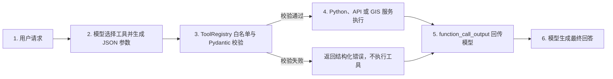
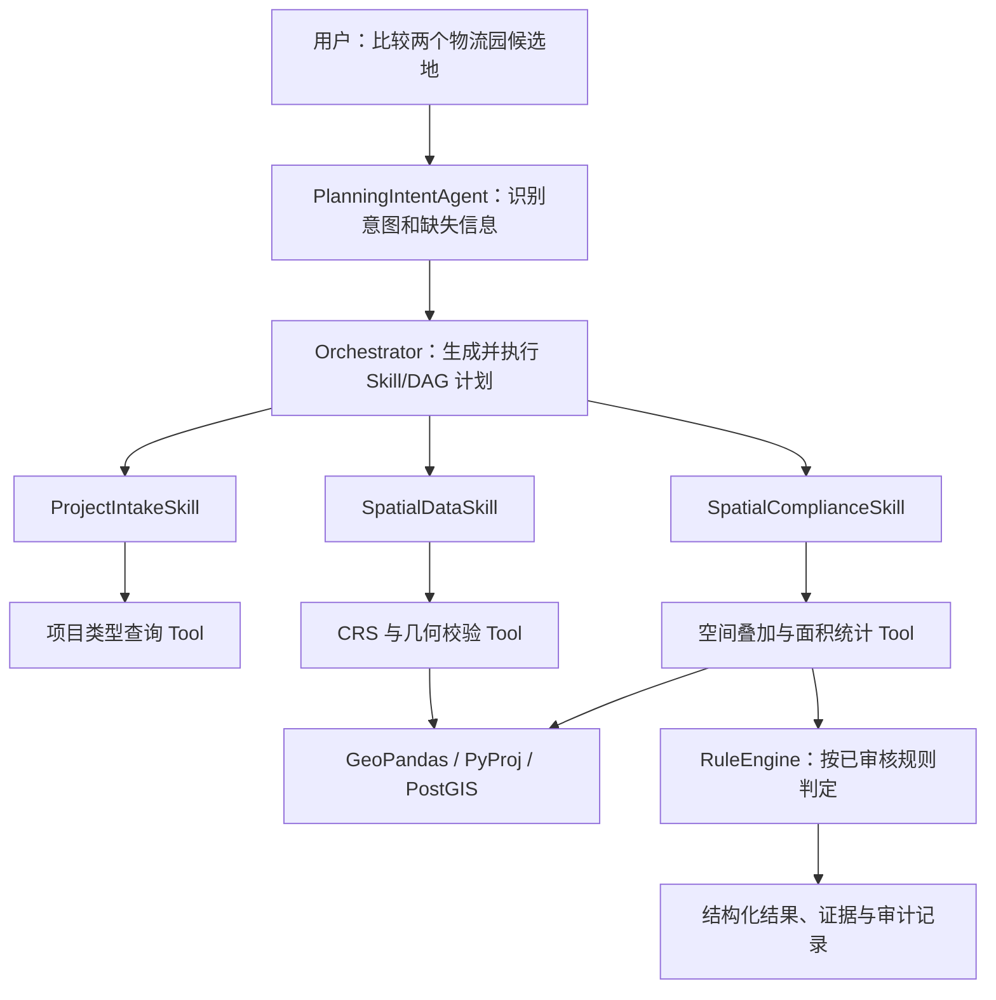

# Tool、Skill 与 Function Calling 学习笔记

> 日期：2026-08-15
>
> 项目：建设项目选址与国土空间合规审查 Agent
>
> 学习目标：理解 Tool、Skill、Function Calling 的职责、关系和工程边界，并能结合当前代码进行解释。

## 1. 一句话结论

```text
Skill 定义“某类业务任务怎样完成”，
Tool 执行“一个确定性动作”，
Function Calling 负责“让模型提出调用哪个 Tool 及其参数”。
```

三者不是并列的三个功能模块，而是位于不同层次：

- **Skill** 位于业务层，描述一个业务任务的标准处理过程。
- **Tool** 位于执行层，真正访问函数、API、数据库或 GIS 引擎。
- **Function Calling** 位于模型与程序的交互层，把自然语言意图转换成结构化的工具调用请求。

最重要的边界是：**模型只提出工具调用，程序负责校验和执行；模型不会因为返回了一个 `function_call` 就自动运行 Python 函数。**

## 2. 名词全称与中文含义

| 名词 | 英文全称或常用名称 | 中文理解 |
|---|---|---|
| Tool | Tool | 工具、可执行能力 |
| Skill | Skill | 技能、业务能力或标准作业流程 |
| Function Calling | Function Calling | 函数调用机制、工具调用机制 |
| Function | Function | 函数 |
| API | Application Programming Interface | 应用程序编程接口 |
| JSON | JavaScript Object Notation | JavaScript 对象表示法，常用于结构化传参 |
| JSON Schema | JSON Schema | 描述 JSON 字段、类型、必填项和取值约束的规范 |
| Agent | Agent | 智能体，负责理解、决策、规划或编排 |
| Orchestrator | Orchestrator | 编排器，负责执行步骤、维护状态和处理失败 |
| Registry | Registry | 注册表，保存允许调用的工具及其元数据 |
| Allowlist | Allowlist | 白名单，只允许调用明确注册的能力 |

本文所说的 **Skill** 是选址 Agent 项目中的业务 Skill，例如 `ProjectIntakeSkill`。它不等同于某个开发平台中用于扩展助手能力的产品级 Skill。

## 3. 核心区别对比

| 维度 | Tool | Skill | Function Calling |
|---|---|---|---|
| 本质 | 一个可执行能力 | 一套业务任务的处理方法和契约 | 模型与应用之间的结构化调用机制 |
| 回答的问题 | “具体执行什么动作？” | “这类业务任务怎样完成？” | “模型怎样提出要调用哪个工具？” |
| 所在层次 | 执行层 | 业务流程层 | 模型与程序交互层 |
| 是否真正执行代码 | 是，由应用程序执行 | Skill 本身通常组织流程，可调用多个 Tool | 否，只产生工具名称和参数 |
| 输入 | 已校验的结构化参数 | 业务请求、状态、上下文和依赖结果 | 用户消息、工具描述、参数 Schema |
| 输出 | 确定性结果或明确错误 | 业务状态、结构化结果、证据和下一步 | 普通文本，或 `function_call` 请求 |
| 是否依赖 LLM | 不一定 | 不一定，但 Agent Skill 常由模型参与规划 | 是，由模型决定是否建议调用工具 |
| 示例 | 计算器、日期查询、空间相交计算 | 项目受理、空间数据检查、合规分析 | 模型返回 `calculator` 和参数 JSON |
| 主要风险 | 越权、参数非法、超时、执行异常 | 流程跳步、职责混乱、缺少验收门禁 | 模型选错工具、参数不完整、循环调用 |
| 主要控制 | 白名单、Pydantic、超时、错误映射 | 输入输出契约、DAG、状态机、ReviewGate | Schema、最大调用轮数、调用结果回传 |

## 4. Tool：真正执行动作的能力

### 4.1 Tool 是什么

Tool 是程序能够执行的一个确定性能力。它可以是：

- 一个 Python 函数；
- 一个 HTTP API；
- 一次数据库查询；
- 一个 GIS 空间计算；
- 一次文件读取或文档检索；
- 一个封装好的外部服务。

“确定性”并不表示任何情况下结果都完全相同，而是指：**工具按照明确的代码、参数和数据执行，不由 LLM 临时编造结果。**

### 4.2 一个完整 Tool 应包含什么

一个可供模型调用的 Tool 通常至少包含：

1. `name`：稳定、唯一的工具名称。
2. `description`：说明什么时候应该使用这个工具。
3. `parameters`：JSON Schema，描述参数、类型和必填项。
4. 实现函数：真正执行操作的 Python 代码或服务。
5. 参数校验：拒绝缺字段、错误类型和越界取值。
6. 权限控制：只允许调用白名单内的工具。
7. 超时与错误处理：把失败转换成可控的结构化结果。
8. 调用记录：保存工具名、状态、耗时和安全的错误摘要。

### 4.3 当前项目中的计算器 Tool

当前 `calculator` 已包含工具声明：

```python
CALCULATOR_TOOL = {
    "type": "function",
    "name": "calculator",
    "description": "对两个数字执行加、减、乘、除运算。",
    "parameters": CalculatorArguments.model_json_schema(),
    "strict": True,
}
```

其参数通过 Pydantic 模型约束：

```python
class CalculatorArguments(BaseModel):
    model_config = ConfigDict(extra="forbid")

    operation: Literal["add", "subtract", "multiply", "divide"]
    a: float
    b: float
```

这些约束意味着：

- `operation` 只能是四个允许值之一；
- `a`、`b` 必须能够校验为数字；
- 多余字段会被拒绝；
- 除数为 0 会在执行函数中被拒绝；
- 计算器没有使用危险的 `eval()`。

### 4.4 Tool 不等于普通 Python 函数

每个 Tool 背后可能有一个 Python 函数，但不是每个 Python 函数都应该暴露为 Tool。

普通函数只需要被程序内部正确调用；面向模型的 Tool 还必须考虑：

- 模型能否从描述中判断何时调用；
- 参数能否用 JSON Schema 表达；
- 是否允许模型触发这个操作；
- 非法参数是否会在执行前被拒绝；
- 是否需要超时、重试、审计和权限检查；
- 结果是否适合安全地回传给模型。

因此，**Tool 是经过声明、约束和授权后暴露给模型的可执行能力。**

## 5. Function Calling：模型提出工具调用的机制

### 5.1 Function Calling 是什么

Function Calling 是让模型连接外部工具的一种交互机制。应用程序把工具说明和用户问题一起发给模型，模型可以返回：

- 普通自然语言回答；或
- 一个结构化的函数调用请求，包含工具名称和 JSON 参数。

模型返回调用请求后，仍然必须由应用程序完成参数校验、权限检查和实际执行。

### 5.2 六步完整链路

```text
用户请求
  -> 模型选择工具并生成参数
  -> 程序检查白名单并校验参数
  -> 程序执行真实函数或服务
  -> 程序把工具结果回传给模型
  -> 模型根据结果生成最终回答
```



### 5.3 每一步分别由谁负责

| 步骤 | 负责者 | 具体职责 |
|---|---|---|
| 1. 接收用户请求 | 应用程序 | 收集问题和上下文 |
| 2. 选择工具 | LLM | 根据用户意图与工具描述，返回工具名和参数 |
| 3. 参数校验 | 应用程序 | 校验白名单、JSON、字段、类型和业务规则 |
| 4. 执行工具 | 应用程序 | 调用 Python、API、数据库或 GIS 服务 |
| 5. 回传结果 | 应用程序 | 使用对应 `call_id` 回传成功结果或安全错误 |
| 6. 最终回答 | LLM | 把工具结果组织为用户可理解的自然语言 |

### 5.4 模型返回的 Function Call 大致是什么

概念上可以理解为：

```json
{
  "type": "function_call",
  "name": "calculator",
  "arguments": "{\"operation\":\"multiply\",\"a\":18.5,\"b\":4}",
  "call_id": "call_001"
}
```

注意，`arguments` 仍然是不可信的模型输出，不能直接执行。应用程序必须先校验它。

执行完成后，应用程序回传：

```json
{
  "type": "function_call_output",
  "call_id": "call_001",
  "output": "{\"ok\":true,\"result\":74.0}"
}
```

`call_id` 用于把工具结果与模型此前发出的调用请求对应起来。

### 5.5 Function Calling 不是什么

Function Calling 不是：

- 模型自己执行 Python；
- 模型获得任意系统权限；
- 一种保证模型永远选对工具的机制；
- 一种替代 Pydantic 校验的机制；
- 一个完整 Agent；
- 一个完整工作流或状态机；
- Swagger 的另一种叫法。

Swagger 用于展示和手工调用 HTTP API；Function Calling 用于让模型以结构化方式建议应用调用工具。两者可以配合，但职责完全不同。

## 6. Skill：完成一类业务任务的标准方法

### 6.1 Skill 是什么

Skill 是一项稳定、可复用的业务能力，描述“这一类任务应该怎样完成”。它通常包含：

- 适用条件；
- 输入和输出契约；
- 前置条件；
- 处理步骤；
- 可以调用的 Tool 白名单；
- 失败与停止条件；
- 验收标准；
- 审计与证据要求。

Skill 可以调用一个或多个 Tool，也可能包含确定性的规则和少量 LLM 推理。

### 6.2 选址项目中的 Skill 示例

以规划中的 `ProjectIntakeSkill` 为例，它可能负责：

1. 接收项目类型、建设规模和候选地信息。
2. 使用 Pydantic 校验结构化字段。
3. 判断关键资料是否缺失。
4. 调用项目类型查询 Tool，加载对应项目档案模板。
5. 缺少候选地时返回 `needs_input`。
6. 信息完整时输出标准化的 `ProjectProfile`。

这里的整个受理流程是 Skill；其中“查询项目类型配置”只是一个 Tool。

### 6.3 Skill 的输入输出应该稳定

概念示例：

```text
Skill: ProjectIntakeSkill

输入：
- ProjectRequest
- 当前 ProjectState

前置条件：
- 请求已经通过 API 基础校验

允许调用的 Tool：
- get_project_type_profile
- validate_candidate_metadata

输出：
- ProjectProfile
- status: success | needs_input | failed
- missing_fields
- evidence_refs

停止条件：
- 项目类型未知
- 候选地为空
- 关键字段无法确认
```

### 6.4 Skill 不一定通过 Function Calling 执行

Skill 与 Function Calling 没有一对一绑定关系。Skill 内部调用 Tool 可以有多种方式：

- 普通 Python 代码直接调用；
- 由 Orchestrator 按固定 DAG 调用；
- 由规则引擎选择；
- 由 LLM 通过 Function Calling 提出调用；
- 上述方式组合使用。

对于 CRS 校验、几何有效性检查、硬约束规则等固定步骤，通常应由工作流确定性执行，而不是每次让模型自由决定是否执行。

## 7. 三者如何协作

### 7.1 通用关系

```text
用户提出业务请求
  -> Agent 理解意图
  -> Agent 或 Orchestrator 选择 Skill
  -> Skill 按业务步骤运行
  -> Skill 直接调用 Tool，或通过 Function Calling 让模型建议 Tool
  -> 应用校验并执行 Tool
  -> Tool 结果进入后续业务步骤
  -> Skill 输出结构化业务结果
```

### 7.2 选址合规项目关系



这个架构中：

- `PlanningIntentAgent` 是理解和规划者；
- `Orchestrator` 是调度和状态管理者；
- `ProjectIntakeSkill` 是业务处理流程；
- CRS 校验、空间叠加是 Tool；
- `RuleEngine` 是确定性规则组件；
- Function Calling 只是模型与 Tool 之间可选的调用通道。

## 8. Tool、Skill、Agent、Workflow 的边界

| 概念 | 主要职责 | 不应该承担的职责 |
|---|---|---|
| Agent | 理解意图、推理、规划、决定下一步 | 不应直接编造工具执行结果 |
| Skill | 固化某类业务任务的流程和契约 | 不应把所有底层实现都塞进一个巨大函数 |
| Tool | 执行单一、明确、可测试的动作 | 不应自行决定完整业务流程 |
| Workflow/DAG | 规定节点依赖、执行顺序和状态流转 | 不负责自然语言推理 |
| Orchestrator | 执行工作流、维护状态、处理失败 | 不应绕过 Skill 的业务门禁 |
| RuleEngine | 根据事实和版本化规则做确定性判定 | 不应让 LLM 临时改写阈值 |
| Function Calling | 传递模型提出的工具名和参数 | 不负责真正执行或授权 |

可用一个公司协作比喻理解：

```text
Agent      = 判断应该做什么的人
Skill      = 某类工作的标准作业手册
Tool       = 执行动作的软件或设备
Workflow   = 工序先后顺序
Orchestrator = 调度每道工序的负责人
Function Calling = 人向执行系统提交规范工单的机制
```

## 9. 当前仓库代码映射

### 9.1 已经实现

截至 2026-08-15，当前仓库已有：

| 能力 | 文件 | 当前状态 |
|---|---|---|
| 计算器参数 Schema | `practice/llm_api/calculator.py` | 已实现 |
| 计算器 Tool 声明 | `practice/llm_api/calculator.py` | 已实现 |
| 加减乘除实现 | `practice/llm_api/calculator.py` | 已实现 |
| 通用工具注册表 | `practice/llm_api/tool_registry.py` | 已实现 |
| 三工具统一注册 | `create_default_registry()` | 已实现 |
| 日期查询 Tool | `current_date()` | 已实现 |
| 项目类型查询 Tool | `project_type_profile()` | 已实现 |
| 未注册工具拦截 | `ToolRegistry.get()` | 已实现，默认拒绝 |
| Pydantic 参数校验 | `ToolDefinition.validate_arguments()` | 已实现 |
| 工具超时控制 | `ToolRegistry.execute()` | 已实现 |
| Function Calling 循环 | `practice/llm_api/tool_calling.py` | 已实现 |
| 工具结果回传 | `_tool_output()` | 已实现 |
| 调用耗时记录 | `_tool_output()` | 已实现 |
| 安全错误摘要 | `_safe_error_message()` | 已实现 |
| 最大工具轮数限制 | `run_tool_calling()` | 已实现 |
| 多工具参数与路由测试 | `tests/test_tool_registry.py` 等 | 已实现 |

当前已经通过真实模型接口验证：

```text
用户提出 18.5 × 4
  -> 模型选择 calculator
  -> 程序校验并执行
  -> 结果 74 回传模型
  -> 模型生成“18.5 × 4 = 74”

用户询问当天日期
  -> 模型选择 current_date
  -> 程序按 Asia/Shanghai 的 UTC+8 计算日期
  -> 模型回答“今天是 2026 年 8 月 15 日”

用户询问系统是否支持物流园
  -> 模型选择 project_type_profile
  -> 程序返回物流园基础审查重点
  -> 模型说明支持范围，不生成合规结论
```

### 9.2 尚未实现或尚未验收

以下仍是后续规划，不能写成已完成：

- `ProjectIntakeSkill` 的可执行实现；
- `SpatialDataSkill`、`PolicyRAGSkill` 等业务 Skill；
- GeoPandas、PyProj 或 PostGIS 空间 Tool；
- PlanningIntentAgent 与业务 Skill 的真实路由；
- 选址合规 DAG 和 Orchestrator；
- RuleEngine 与版本化 RulePack。

因此，当前最准确的表述是：

```text
已完成 ToolRegistry，并统一注册 calculator、current_date、
project_type_profile 三个 Tool；
已具备参数校验、未知工具拦截、超时、结果回传、
安全错误摘要、耗时记录和多工具路由；
选址业务 Skill、GIS Tool、RuleEngine 和 Orchestrator 尚待实现。
```

## 10. ToolRegistry 负责什么

当前已经实现的 `ToolRegistry` 是工具执行边界，不是 Skill，也不是 Agent。

它应至少负责：

- 注册允许使用的 Tool；
- 保证工具名称唯一；
- 向模型提供 Tool 声明列表；
- 根据工具名称查找实现；
- 未知工具默认拒绝；
- 使用各自的 Pydantic 模型校验参数；
- 统一执行并映射错误；
- 记录工具名、状态和耗时；
- 避免把密钥、完整敏感输入或堆栈直接交给模型。

当前核心接口是：

```python
registry = create_default_registry()

tool_schemas = registry.schemas()
result = registry.execute(tool_name, arguments)
```

ToolRegistry 不应该：

- 让模型动态导入任意 Python 模块；
- 使用 `eval()` 或 `exec()` 执行模型文本；
- 自动信任模型返回的参数；
- 负责完整业务流程编排；
- 把未知工具名猜成一个相似工具后执行。

## 11. 安全与可靠性边界

### 11.1 永远把模型输出视为不可信输入

模型可能返回：

- 不存在的工具名；
- 缺少字段；
- 错误字段类型；
- 多余字段；
- 越界数值；
- 非法 JSON；
- 重复或循环调用；
- 与用户权限不符的操作。

所以正确顺序必须是：

```text
模型建议调用
  -> 白名单检查
  -> JSON/Pydantic 校验
  -> 权限与业务规则检查
  -> 执行
```

### 11.2 失败时不要伪造结果

当工具超时或报错时，应该把结构化错误交给模型，例如：

```json
{
  "ok": false,
  "status": "error",
  "error_type": "ValidationError",
  "error": "operation: Input should be ...",
  "elapsed_ms": 0.21
}
```

模型只能据此说明失败原因或请求用户补充信息，不能自行猜出计算结果。

### 11.3 对高风险 Tool 增加人工确认

查询日期和执行计算通常风险较低；发送邮件、修改数据库、删除文件、提交审批等有外部副作用的 Tool，应增加：

- 用户权限检查；
- 参数预览；
- 明确确认；
- 幂等键；
- 完整审计；
- 必要时的人工审批。

## 12. 常见误区

### 误区 1：模型返回函数名，就已经执行了函数

错误。模型只返回一个调用建议，程序还没有执行任何函数。

### 误区 2：Tool 就是 Function Calling

错误。Tool 是能力，Function Calling 是模型请求使用该能力的一种机制。

### 误区 3：Skill 就是一个更大的 Tool

不准确。Skill 可能组合多个 Tool，还包含业务状态、步骤、失败条件和验收标准。

### 误区 4：每个 Skill 都必须对应一个 Agent

错误。一个 Agent 或 Orchestrator 可以执行多个 Skill。增加 Agent 数量不是完成度指标。

### 误区 5：所有 Tool 都应交给模型自由选择

错误。固定的安全检查和强制业务步骤应由 Workflow 或 Skill 确定性执行。

### 误区 6：有 JSON Schema 就不需要 Pydantic

错误。模型侧的 Schema 可以提高输出规范性，应用侧仍必须重新校验。

### 误区 7：Function Calling 可以保证参数正确

错误。它提高结构化程度，但模型依然可能生成未知工具、非法参数或缺失字段。

### 误区 8：工具越多，Agent 越强

不一定。工具过多或描述相似会增加误选概率，也会扩大权限和测试范围。工具应按任务最小化暴露。

## 13. 应该怎样测试

### 13.1 Tool 单元测试

- 合法参数执行成功；
- 每个允许操作都覆盖；
- 缺字段被拒绝；
- 错误类型被拒绝；
- 多余字段被拒绝；
- 越界或非法业务值被拒绝；
- 未知工具不执行；
- 底层异常被转换为安全错误。

### 13.2 Function Calling 循环测试

- 计算问题触发计算器；
- 普通对话不触发工具；
- 模型返回缺少参数时不执行；
- 模型返回未知工具时不执行；
- 工具成功结果正确回传；
- 工具错误结果正确回传；
- 工具调用轮数超过限制时停止；
- 模型既无文本又无工具调用时明确失败。

### 13.3 Skill 测试

- 输入合同正确；
- 缺少前置数据时进入 `needs_input`；
- 必做 Tool 没有被跳过；
- Tool 失败后不会继续产生伪造结论；
- 输出合同稳定；
- 证据和审计字段完整；
- 状态流转符合 DAG；
- 同一输入和版本下，确定性结果可复现。

## 14. 什么时候用哪一个

```text
只是执行一个明确动作？
  -> 定义 Tool

需要描述一整类业务任务的步骤、输入输出和验收？
  -> 定义 Skill

希望模型根据自然语言决定是否建议调用某个 Tool？
  -> 使用 Function Calling

步骤固定且每次都必须执行？
  -> 使用普通代码、Workflow 或 DAG 直接调用 Tool

需要维护多个步骤的状态、依赖、重试和失败分支？
  -> 使用 Orchestrator / 状态机 / Workflow
```

## 15. 面试或闭卷复述模板

### 15.1 30 秒版本

Tool 是真正执行确定性动作的函数或服务；Skill 是完成一类业务任务的标准流程，它可以组合多个 Tool；Function Calling 是模型和应用之间的交互机制，模型根据自然语言返回工具名称和 JSON 参数，但不直接执行工具。应用程序必须做白名单和参数校验，执行工具后再把结果回传给模型生成最终回答。

### 15.2 结合当前项目的 1 分钟版本

我目前实现了一个原生多工具 Function Calling 闭环。应用通过 ToolRegistry 把计算器、日期查询和项目类型查询三个 Tool 的名称、描述及 Pydantic JSON Schema 发给模型；模型返回工具名称和参数后，程序先检查白名单，再校验参数并执行确定性函数，将结构化结果和对应 `call_id` 回传给模型，最后生成自然语言回答。当前三个示例 Tool 已实现并通过真实路由验证，但选址业务 Skill、GIS Tool、RuleEngine 和 Orchestrator 仍是下一阶段，不能描述为已经实现。

## 16. 知识卡

### 卡片 1：Tool

**正面：** 什么是 Tool？

**背面：** Tool 是经过声明、约束和授权后暴露给程序或模型的可执行能力，负责完成一个明确动作，并返回确定性结果或明确错误。

### 卡片 2：Skill

**正面：** 什么是 Skill？

**背面：** Skill 是完成一类业务任务的稳定流程和输入输出契约，可包含提示词、规则、状态、验收标准，并组合一个或多个 Tool。

### 卡片 3：Function Calling

**正面：** 什么是 Function Calling？

**背面：** 它是模型向应用程序结构化提出工具名称和 JSON 参数的机制；模型不执行函数，应用负责校验、授权、执行和结果回传。

### 卡片 4：三者关系

**正面：** Tool、Skill、Function Calling 如何区分？

**背面：** Skill 定义业务任务怎样完成，Tool 执行确定性动作，Function Calling 负责让模型提出调用哪个 Tool 及其参数。

### 卡片 5：六步链路

**正面：** Function Calling 六步是什么？

**背面：** 用户请求 -> 模型选工具 -> 程序校验 -> 程序执行 -> 结果回传 -> 模型最终回答。

### 卡片 6：为什么仍需 Pydantic

**正面：** 有 JSON Schema 后为什么仍要 Pydantic？

**背面：** Schema 只能约束或引导模型输出，模型输出仍是不可信输入；应用必须重新校验字段、类型、取值和多余参数。

### 卡片 7：ToolRegistry

**正面：** ToolRegistry 的职责是什么？

**背面：** 维护工具白名单和 Schema，根据名称查找实现，统一校验、执行、错误映射和调用记录；它不负责完整业务流程。

### 卡片 8：Skill 与 Agent

**正面：** Skill 和 Agent 有什么区别？

**背面：** Agent 是运行时的理解、决策或编排者，Skill 是可复用的业务能力契约；一个 Agent 可以执行多个 Skill。

## 17. 自测题与答案

### 问题 1

模型返回 `calculator` 和参数后，为什么不能直接 `eval(arguments)`？

**答案：** 参数是模型生成的不可信文本，`eval()` 可能执行任意代码。必须先解析 JSON，通过白名单和 Pydantic 校验，再调用预先注册的实现。

### 问题 2

为什么 CRS 检查不应完全由模型自由决定是否执行？

**答案：** CRS 是空间分析的强制前置条件。如果把它交给模型自由选择，模型可能跳过关键检查。应由 `SpatialDataSkill` 或固定 DAG 确定性执行 CRS Tool。

### 问题 3

`ProjectIntakeSkill` 与“项目类型查询 Tool”是什么关系？

**答案：** `ProjectIntakeSkill` 负责完整的项目受理业务流程；项目类型查询 Tool 只负责其中一个确定性动作，Skill 可以调用它并结合其他校验产生标准化结果。

### 问题 4

Function Calling 与普通 API 调用有什么区别？

**答案：** 普通 API 调用通常由程序按预设逻辑直接发起；Function Calling 增加了模型根据自然语言提出工具名和参数的步骤。但最终 API 或函数仍由应用程序实际调用。

### 问题 5

当前项目是否已经有三个工具的 ToolRegistry？它能否完成真实选址合规分析？

**答案：** 已经有，当前统一注册 `calculator`、`current_date` 和 `project_type_profile`。但它们仍是本地示例 Tool，其中项目类型查询使用静态 Profile，不能完成 GIS、政策检索、规则判定或真实选址合规分析。

## 18. 当前学习结论

现在应该掌握的核心认识是：

```text
LLM 擅长理解自然语言、识别意图和组织回答；
Tool 擅长执行明确、可测试的动作；
Skill 把多个步骤组织成稳定的业务能力；
Function Calling 让 LLM 与 Tool 之间使用结构化请求协作；
Orchestrator 负责顺序、依赖、状态和失败；
Pydantic、白名单、超时和审计负责守住执行边界。
```

对于选址合规 Agent，不能让模型凭语言能力直接计算面积或给出合规结论。正确路径是：让 Agent 理解请求，让 Skill 固化业务过程，让确定性 Tool 产生空间事实，让 RuleEngine 按已审核规则判定，再由模型基于事实和证据解释结果。

## 19. 资料与代码依据

本笔记结合以下材料整理：

- 前辈资料《居丽叶 LLM 体系知识搭建》4.5.1 Function Call 摘要。
- 当前项目 `practice/llm_api/calculator.py`。
- 当前项目 `practice/llm_api/tool_calling.py`。
- 当前项目 `tests/test_calculator.py` 与 `tests/test_tool_calling.py`。
- `SPATIAL_COMPLIANCE_SKILL_ROUTING_AND_MULTI_AGENT_CN.md` 中的业务 Skill 规划。
- OpenAI Python SDK 当前类型定义中 Function Tool 与 Function Call 的字段结构。

说明：本次尝试访问官方 OpenAI Function Calling 文档页面时返回了 HTTP 403，因此没有把未成功读取的网页内容当作直接证据。有关当前代码行为的判断以本地 SDK 类型定义、仓库实现和已经完成的真实接口验证为准。
