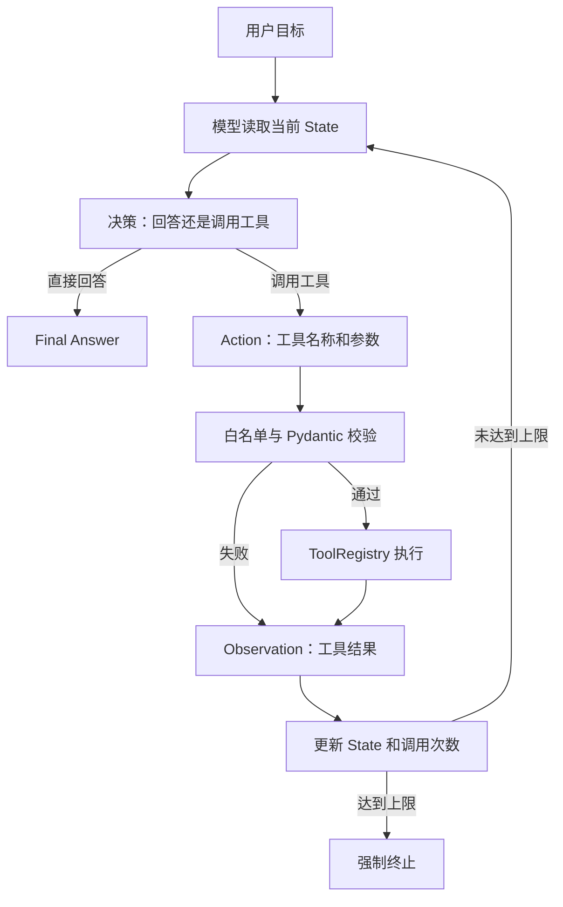
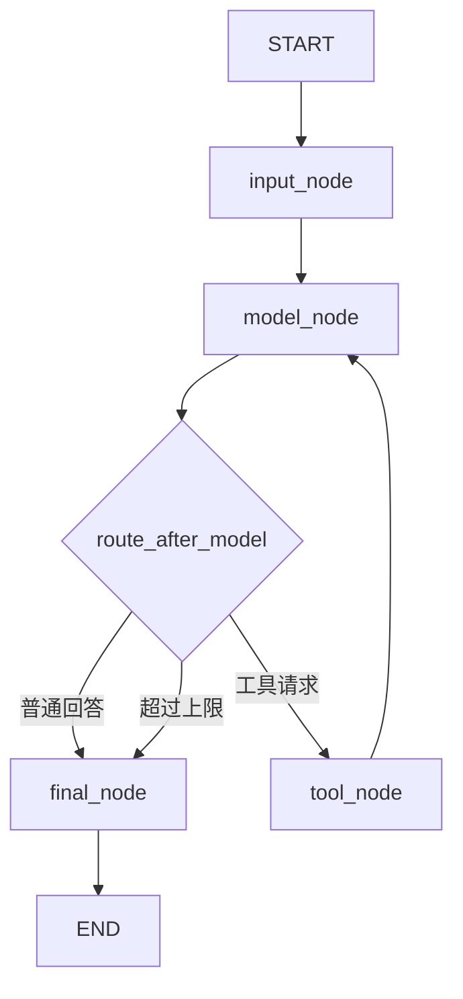

# Agent、ReAct 与 LangGraph 基础学习笔记

> 日期：2026-08-16
>
> 项目：建设项目选址与国土空间合规审查 Agent
>
> 资料来源：前辈 Agent 篇、ReAct 与 Function Calling 笔记，并结合当前项目的 ToolRegistry 实现进行整理。

## 1. 今日学习目标

完成本节后，需要能够回答：

1. 基于 LLM 的 Agent 是什么，与普通聊天模型有什么区别？
2. Planning、Memory、Tool 分别解决什么问题？
3. RAG、Function Calling、ReAct、LangGraph 分别处于哪一层？
4. ReAct 的 Thought、Action、Observation 如何形成循环？
5. LangGraph 的 State、Node、Edge 和条件路由分别是什么？
6. 当前 `ToolRegistry` 如何被 LangGraph 节点复用？
7. 哪些选址合规步骤必须由确定性流程执行，不能交给模型自由决定？

## 2. 先说结论

### 2.1 Agent 的核心定义

基于 LLM 的 Agent 是一个围绕目标运行的系统。它使用大模型理解请求和做出局部决策，通过状态、记忆、工具和流程控制采取行动，并根据行动结果决定下一步，直到完成、失败或需要人工补充信息。

可以用下面的公式帮助记忆：

```text
Agent System
  = LLM
  + State / Memory
  + Planning / Routing
  + Tools
  + Execution Loop
  + Guardrails / Evaluation
```

“LLM + Tool”不一定就是完整 Agent。只有当系统能够维护状态、根据结果继续决策并具有明确结束条件时，才更接近可运行的 Agent。

### 2.2 四个概念不要混淆

```text
Function Calling：模型提出调用哪个工具及其参数的交互机制
ReAct：推理、行动、观察交替进行的任务解决模式
LangGraph：用状态图实现节点、路由、循环和终止的编排框架
ToolRegistry：应用侧的工具白名单、校验和执行边界
```

它们可以组合，但不是同一个东西。

## 3. Agent 的 Perception、Brain、Action

从抽象结构看，一个 Agent 可以分为三个部分。

### 3.1 Perception：感知或输入

Perception 负责接收环境信息，例如：

- 用户文字请求；
- 图片、语音或视频；
- 文件与数据库记录；
- 工具执行结果；
- 当前任务状态；
- 外部系统事件。

在当前项目中，Perception 主要包括：

```text
FastAPI 请求
Pydantic 解析后的 ProjectRequest
候选地元数据
对话消息
Tool 执行结果
```

Perception 不只是用户第一次输入。每一次工具返回的 Observation 也是 Agent 对环境的新感知。

### 3.2 Brain：理解、状态与决策

Brain 是 Agent 的决策部分，通常包含：

- LLM 推理；
- 当前状态 State；
- 短期和长期记忆；
- 任务规划；
- 条件路由；
- 规则和安全限制；
- 反思或评估机制。

在工程中，不应把 Brain 全部理解成 LLM。状态机、Pydantic、RuleEngine、条件路由和人工门禁也属于决策系统的一部分。

### 3.3 Action：行动

Action 是系统对环境执行的动作，例如：

- 调用计算器；
- 查询当前日期；
- 查询项目类型 Profile；
- 调用搜索或 RAG；
- 查询数据库；
- 执行 GIS 空间分析；
- 返回最终回答；
- 请求用户补充资料。

LLM 负责提出 Action，不代表 LLM 自己执行 Action。应用程序仍需完成白名单检查、参数校验、权限检查和真实调用。

## 4. Agent 的核心模块

## 4.1 Planning：规划

Planning 负责决定“接下来做什么”，主要包括：

- 识别目标；
- 拆分任务；
- 确定先后依赖；
- 选择 Skill 或 Tool；
- 根据 Observation 调整下一步；
- 判断继续、结束、失败还是请求补充信息。

### 固定流程与模型规划的边界

实际系统通常不会把整个流程都交给模型自由生成，而是组合两种方法：

| 方法 | 适合场景 | 本项目示例 |
|---|---|---|
| 程序或 DAG 固定流程 | 合规、安全、顺序明确、必须执行 | CRS 校验通过后才能做空间叠加 |
| Prompt 驱动的局部规划 | 输入表达多样、需要语义理解 | 从用户描述中识别项目类型和比较意图 |

推荐原则：

```text
高风险、强规则、可确定的步骤 -> 程序、RuleEngine 或 DAG
需要理解、归纳、解释的步骤 -> LLM
```

## 4.2 Memory：记忆

Memory 用于保存 Agent 后续决策需要的信息。

### 短期记忆

短期记忆通常包括：

- 当前对话消息；
- 当前任务步骤；
- 最近工具结果；
- 未解决的问题；
- 当前执行次数。

它通常受上下文窗口限制。当前项目的 `ConversationContext` 按最近对话轮数裁剪，属于基础短期记忆。

### 长期记忆

长期记忆可以存放：

- 用户稳定偏好；
- 项目资料；
- 历史任务结果；
- 数据和规则版本；
- 人工确认记录；
- 可复用经验。

长期记忆不等于向量数据库。根据数据类型，也可以使用：

- 关系数据库；
- 文档数据库；
- 向量数据库；
- 对象存储；
- 事件日志；
- 结构化项目工作区。

向量库适合语义检索，不适合代替所有状态和业务数据存储。

## 4.3 Tools：工具

Tools 为 Agent 提供模型自身不具备或不应自行完成的能力，例如：

- 实时数据查询；
- 精确计算；
- 数据库访问；
- 文件解析；
- GIS 分析；
- 代码执行；
- 外部业务操作。

当前已经实现的三个 Tool：

```text
calculator
current_date
project_type_profile
```

这些 Tool 通过 `ToolRegistry` 统一完成：

- 注册；
- Schema 暴露；
- 名称白名单；
- Pydantic 参数校验；
- 超时；
- 执行；
- 错误映射；
- 调用记录。

## 4.4 Execution Loop：执行循环

Agent 与一次普通 LLM 请求的重要区别，是 Agent 可以根据行动结果继续运行：

```text
理解当前状态
  -> 决定下一步
  -> 执行动作
  -> 获取结果
  -> 更新状态
  -> 再次决定
```

执行循环必须有终止条件，例如：

- 已经获得最终回答；
- 用户信息不足；
- 工具失败且无法恢复；
- 调用次数达到上限；
- 进入人工审批；
- 任务被取消。

没有上限和终止条件的 Agent 可能发生无限循环、费用失控或重复副作用。

## 5. RAG 与 Agent 的关系

### 5.1 RAG 是什么

RAG 全称为 Retrieval-Augmented Generation，中文常译为“检索增强生成”。基本流程是：

```text
用户问题
  -> 检索相关资料
  -> 将资料片段放入模型上下文
  -> 模型基于资料回答
```

### 5.2 RAG 能缓解什么

RAG 可以：

- 提供模型训练后新增的信息；
- 引入企业或项目私有资料；
- 为回答提供可引用证据；
- 在一定程度上减少无依据回答。

### 5.3 RAG 不能自动保证真实

原资料中“先检查信息真实性，真实后再输出”的说法过于理想化。RAG 本身不能自动完成事实鉴定，因为：

- 可能没有检索到正确文档；
- 文档本身可能过期或错误；
- 切分可能破坏上下文；
- 排序可能选错片段；
- 模型仍可能误读证据。

可靠 RAG 还需要文档版本、来源、页码、检索评测、引用校验和拒答机制。

### 5.4 RAG 可以作为 Agent 的一个 Tool 或 Skill

```text
Agent
  -> 判断是否需要政策证据
  -> 调用 PolicyRAGSkill / search_policy Tool
  -> 获取带来源的片段
  -> 更新 State
  -> 决定继续分析或请求人工复核
```

因此，RAG 是 Agent 可以使用的能力之一，不等于完整 Agent。

## 6. Planning 方法对比

| 方法 | 核心思想 | 是否使用外部行动 | 适合场景 | 主要风险 |
|---|---|---:|---|---|
| CoT | 将问题分步骤推理 | 否 | 数学、逻辑、解释 | 推理可能基于错误事实 |
| ToT | 生成并搜索多条候选思路 | 通常否 | 需要探索多个方案 | 成本和搜索空间较大 |
| ReAct | 推理、行动、观察循环 | 是 | 需要工具和动态反馈 | 循环、误选工具、状态膨胀 |
| Reflexion | 根据反馈生成反思并用于下次尝试 | 可以 | 多次尝试和自我改进 | 错误反思可能被长期保留 |
| Plan-and-Execute | 先规划，再逐步执行和修订 | 是 | 依赖关系清晰的复杂任务 | 初始计划可能失效 |
| 固定 Workflow | 人工定义步骤与条件 | 是 | 合规、审批、安全任务 | 灵活性较低 |

### 6.1 CoT：Chain of Thought

CoT 强调把复杂问题拆成中间推理步骤。它可以改善部分推理任务，但：

- 不会自动获得外部实时信息；
- 不能替代工具执行；
- 推理步骤多会增加 Token、延迟和成本；
- 产生了推理文本不等于推理一定正确。

工程系统不应把模型的全部内部推理原样写入日志或展示给用户。更合适的是记录简洁的决策摘要、工具请求、Observation 和状态变化。

### 6.2 ToT：Tree of Thoughts

ToT 不只沿着一条思路前进，而是：

1. 为当前步骤生成多个候选方案。
2. 对候选方案进行评价。
3. 使用 BFS、DFS 或其他搜索策略继续探索。
4. 选择更有希望的路径。

它适合需要方案探索的问题，但会带来更多模型调用和评估成本。

### 6.3 Reflexion

Reflexion 通常使用结果反馈生成文字反思，把反思保存在记忆中，为下一次尝试提供指导。它常被称为“语言式强化”或“verbal reinforcement”。

需要注意：它不一定更新模型参数，也不等于传统的强化学习训练。工程上还要防止错误反思污染长期记忆。

### 6.4 BabyAGI 与 AutoGPT

BabyAGI 的典型任务循环：

```text
任务列表
  -> 选择最高优先级任务
  -> 执行任务
  -> 根据结果创建新任务
  -> 重新排序
  -> 继续循环
```

AutoGPT 更强调目标、记忆、规划器和丰富的 Command/Tool 执行。

这类早期自主 Agent 项目适合学习任务循环，但生产系统还需要权限、幂等、预算、审计、人工确认、超时和可恢复状态。

## 7. ReAct 深入讲解

## 7.1 名称与含义

ReAct 来自：

```text
Reasoning + Acting
```

论文标题常写为：

```text
ReAct: Synergizing Reasoning and Acting in Language Models
```

这里的 ReAct 与前端 JavaScript 框架 React 无关。

## 7.2 Thought、Action、Observation

ReAct 的经典轨迹是：

```text
Thought -> Action -> Observation -> Thought -> ... -> Final Answer
```

### Thought

根据当前目标和已有 Observation，判断下一步需要什么信息或动作。

### Action

选择一个允许的 Tool，并生成参数；或者决定直接输出最终答案。

### Observation

应用程序执行 Tool 后得到的结果，包括成功数据或结构化错误。

Observation 会写回状态，成为下一轮决策的新输入。

## 7.3 ReAct 运行图



## 7.4 用当前项目举例

用户输入：

```text
当前系统是否支持物流园项目？
```

概念轨迹：

```text
Decision Summary:
需要查询系统支持的项目类型，不能凭模型记忆回答。

Action:
project_type_profile({"project_type": "logistics_park"})

Observation:
supported=true，审查重点包括规划用地性质、货运交通条件、生态与耕地约束。

Final Answer:
当前示例系统支持物流园项目类型，并列出基础审查重点；
该结果不代表具体项目已经合规。
```

项目中现在保留了两种实现：`run_tool_calling()` 使用普通 Python 循环，适合解释原生 Function Calling；`run_agent_graph()` 使用 LangGraph 显式管理 State、Node、Edge、条件路由、循环和终止状态。

## 7.5 ReAct 与 CoT 的区别

```text
CoT：主要在模型内部进行多步推理
ReAct：推理过程中可以行动，并使用外部结果修正下一步
```

ReAct 并不能自动保证可信。可信度仍取决于：

- Tool 是否可靠；
- 参数是否校验；
- 数据来源是否正确；
- State 是否完整；
- 路由和循环是否受控；
- 最终结论是否经过业务规则和人工门禁。

## 8. Function Calling、ReAct 与 LangGraph

| 概念 | 解决的问题 | 本项目对应 |
|---|---|---|
| Function Calling | 模型如何提出工具名和参数 | Responses API 返回 `function_call` |
| ToolRegistry | 应用如何安全找到并执行工具 | 三工具注册、校验、超时和执行 |
| ReAct | 如何根据 Observation 多轮决定下一步 | 模型 -> 工具 -> 模型循环 |
| LangGraph | 如何显式管理 State、节点、路由、循环和结束 | 8 月 16 日最小图 |

一次 Function Calling 可以不构成 Agent。例如模型调用计算器一次后直接结束。

ReAct 可以用普通循环实现，也可以用 LangGraph 实现。

LangGraph 也不只用于 ReAct。它还可以实现固定 Workflow、审批流、并行 DAG、人工中断和多 Agent 协作。

## 9. LangGraph 的核心概念

## 9.1 State：状态

State 是整张图共享的结构化任务数据。每个 Node 读取当前 State，并返回需要更新的部分。

本项目已经实现的最小 `AgentState` 为：

```python
from operator import add
from typing import Annotated, Any, Literal, TypedDict

class AgentState(TypedDict):
    messages: Annotated[list[dict[str, Any]], add]
    current_step: Literal["input", "model", "tool", "final", "done"]
    pending_tool_calls: list[ToolCallRecord]
    tool_results: Annotated[list[ToolResultRecord], add]
    error: str | None
    tool_call_count: int
    max_tool_calls: int
    status: Literal["running", "completed", "failed", "limit_reached"]
    final_answer: str | None
```

字段解释：

| 字段 | 作用 |
|---|---|
| `messages` | 用户、模型、工具消息 |
| `current_step` | 当前运行到哪个节点 |
| `pending_tool_calls` | 模型本轮提出、尚未执行的工具调用 |
| `tool_results` | 工具结果或安全错误 |
| `error` | 当前不可恢复错误 |
| `tool_call_count` | 防止无限工具循环 |
| `max_tool_calls` | 一次运行允许执行的工具调用数上限 |
| `status` | 运行中、完成、失败或达到上限 |
| `final_answer` | 最终回答 |

`messages` 和 `tool_results` 使用 `operator.add` reducer。节点只需返回本轮新增的数据，LangGraph 会将其追加到旧列表；`pending_tool_calls` 不使用 reducer，因为它表示当前待办集合，执行后必须被空列表覆盖。

State 不应该存放：

- API Key；
- 不必要的完整敏感数据；
- 大体量原始几何；
- 无法序列化的临时对象；
- 未经控制的完整内部推理文本。

## 9.2 Node：节点

Node 是图中的一个处理步骤，本质上通常是一个函数：

```text
输入：当前 State
处理：完成一个职责
输出：State 的增量更新
```

最小图建议包含：

| Node | 职责 |
|---|---|
| `input_node` | 初始化和校验输入状态 |
| `model_node` | 请求模型，获取文本或工具调用 |
| `tool_node` | 通过 ToolRegistry 校验并执行工具 |
| `final_node` | 整理最终回答和结束状态 |

一个 Node 应保持单一职责。不要在 `model_node` 中重新实现计算器，也不要让 `tool_node` 决定完整业务计划。

## 9.3 Edge：边

Edge 表示 Node 之间的执行方向。

普通 Edge：

```text
input_node -> model_node
tool_node -> model_node
final_node -> END
```

条件 Edge：

```text
model_node
  -> 有工具调用：tool_node
  -> 已有最终文本：final_node
  -> 达到循环上限：final_node
```

Edge 负责“下一步去哪”，Node 负责“当前这一步做什么”。

## 9.4 条件路由

条件路由函数不需要调用 LLM。它可以根据 State 中的明确字段做确定性判断：

```python
def route_after_model(state: AgentState) -> str:
    if state["tool_call_count"] >= MAX_TOOL_CALLS:
        return "limit"
    if state_has_tool_call(state):
        return "tool"
    return "final"
```

## 9.5 编译与执行

概念流程：

```python
builder = StateGraph(AgentState)
builder.add_node("input", input_node)
builder.add_node("model", model_node)
builder.add_node("tool", tool_node)
builder.add_node("final", final_node)

builder.add_edge(START, "input")
builder.add_edge("input", "model")
builder.add_conditional_edges("model", route_after_model, ...)
builder.add_edge("tool", "model")
builder.add_edge("final", END)

graph = builder.compile()
result = graph.invoke(initial_state)
```

`compile()` 把图定义转换为可执行对象；`invoke()` 使用初始 State 启动一次运行。

## 10. 当前项目的最小图设计



### 工具节点如何复用现有代码

```text
tool_node
  -> 从 State 读取 function_call
  -> registry.execute(tool_name, arguments)
  -> 将 result 或 error 写入 tool_results/messages
  -> tool_call_count + 1
  -> 返回 model_node
```

工具节点不能重新编写：

- 加减乘除；
- 日期逻辑；
- 项目类型静态映射；
- Pydantic 参数校验；
- 未知工具拦截。

这些职责已经属于 `ToolRegistry` 和具体 Tool。

## 11. 单 Agent、多 Agent 与人机混合

## 11.1 单 Agent

一个 Agent 负责主要理解和决策，由多个 Tool 或 Skill 提供能力。

优点：

- 架构简单；
- 状态和错误容易追踪；
- Token 与调用成本较低；
- 适合当前 MVP。

局限：

- 复杂任务可能导致 Prompt 和状态变大；
- 一个决策单元承担过多职责时难以维护。

## 11.2 多 Agent

多个 Agent 具有不同职责，通过结构化协议协作。

优点可能包括：

- 职责和工具权限隔离；
- 不同领域使用不同 Prompt 或模型；
- 部分任务可以并行。

代价包括：

- 通信和状态同步复杂；
- 调用成本更高；
- 错误传播更难分析；
- 需要解决循环、冲突和最终责任归属。

多 Agent 不会天然获得容错性。只有实现隔离、重试、幂等、超时和降级后，才可能提高系统鲁棒性。

## 11.3 人机混合

人机混合系统在关键节点要求人工确认，例如：

- 缺少候选地或规则版本时由用户补充；
- 数据修复由专业人员确认；
- 高风险规则结论进入人工复核；
- 正式报告发布前通过 ReviewGate。

对于选址合规项目，人机混合比完全自主更符合专业和责任边界。

## 12. 人机合作的三种模式

可以把人机合作理解成自主程度连续变化的三个区域：

| 模式 | 谁主导流程 | 示例 |
|---|---|---|
| SaaS + AI | 人类操作，AI完成局部能力 | OCR、分类、摘要 |
| Copilot | 人类主导，AI持续提出建议 | 编程助手、文档助手 |
| Agent | 人类给目标，系统执行多个步骤 | 工具调用、任务编排、状态循环 |

这些不是严格互斥的产品类别。一个系统可以在普通步骤使用 Agent 自动执行，在高风险步骤切换到 Copilot 或人工审批。

“Agent 是通往 AGI 的必经之路”属于观点，不是可验证的工程结论。在项目文档或面试中，应把重点放在可执行能力、状态管理、工具边界和实际效果上。

## 13. Agent 开发方式

### 13.1 低代码平台

示例：Coze、Dify、FastGPT、通义、文心、元器等。

适合：

- 快速原型；
- 标准问答和工作流；
- 非开发人员配置；
- 验证产品需求。

局限：

- 深度定制和调试受平台限制；
- 数据、模型、插件和部署能力依赖平台；
- 复杂状态和专业规则可能难以表达。

### 13.2 原生 API

使用模型 API、Function Calling、Pydantic 和自有代码构建。

当前项目已经完成这一层的多工具循环，优点是调用协议和安全边界清楚。

### 13.3 代码框架

| 框架类型 | 主要作用 |
|---|---|
| LangChain | 模型、Prompt、Tool、Retriever 等组件抽象 |
| LangGraph | 有状态图、循环、条件路由和持久化编排 |
| LlamaIndex | 数据接入、索引、检索和 RAG 能力 |
| CrewAI 等 | 多 Agent 角色与协作流程 |

选框架时应先确定问题，再选择最小必要框架，不能因为使用了 Agent 框架就宣称系统具备可靠的 Agent 能力。

## 14. Function Calling 能力与数据格式

### 14.1 Function Calling 让模型学会什么

核心能力包括：

1. 判断当前请求需要工具还是可以直接回答。
2. 在允许的工具中选择合适名称。
3. 从自然语言中提取参数。
4. 按约定格式生成结构化调用。
5. 根据工具结果继续调用或给出最终回答。

### 14.2 工具描述的核心字段

```json
{
  "name": "get_weather",
  "description": "查询指定城市和日期的天气信息",
  "parameters": {
    "type": "object",
    "properties": {
      "city": {
        "type": "string",
        "description": "城市名称"
      },
      "date": {
        "type": "string",
        "description": "查询日期"
      }
    },
    "required": ["city", "date"]
  }
}
```

工具描述解决的是“模型如何理解接口”，真实执行仍需要应用侧桥接：

```text
模型输出 function_call
  -> 应用解析
  -> 白名单
  -> Pydantic 校验
  -> 权限检查
  -> 执行
  -> function_call_output
  -> 模型继续处理
```

### 14.3 Function Calling 能力如何获得

监督微调数据通常可以教模型识别工具意图和生成结构化参数，但真实商业模型的能力还可能来自更广泛的预训练、指令微调、偏好优化、强化学习或其他后训练方式。

因此，“Function Calling 主要通过 SFT 获得”可以作为教学上的简化理解，但不能在不知道具体模型训练方案时断言其全部来源。

## 15. 原资料中的重要修正

### 修正 1：RAG 不等于事实核验器

RAG 提供检索证据，但不能自动保证检索结果和最终回答真实。

### 修正 2：Agent 不只是“LLM + 工具”

可运行 Agent 还需要 State、执行循环、路由、终止条件、错误处理和安全边界。

### 修正 3：长期记忆不等于向量数据库

向量数据库只是长期记忆的一种存储和检索方式。

### 修正 4：ReAct 的推理痕迹不应全部外露

工程系统更适合记录工具调用、Observation、状态变化和简洁决策摘要，不应依赖展示完整内部推理来证明可信。

### 修正 5：Reflexion 不等于更新模型参数

它通常通过文字反馈和记忆改善后续尝试，不一定执行传统 RL 参数训练。

### 修正 6：多 Agent 不天然容错

容错来自工程机制，而不是 Agent 数量。

### 修正 7：Prompt 不是唯一 Planning 方法

Planning 还可以来自固定工作流、状态机、DAG、搜索算法和程序规则。

### 修正 8：框架名称不代表能力已经完成

接入 LangGraph 只说明使用了状态图工具，仍需测试状态、路由、循环、恢复和业务正确性。

## 16. 三张核心知识卡

### 卡片 1：State

**正面：什么是 LangGraph State？**

**背面：** State 是整张图共享的结构化任务数据。Node 读取 State 并返回增量更新；它用于保存消息、当前步骤、工具结果、错误、调用次数和结束状态。

### 卡片 2：Node

**正面：什么是 LangGraph Node？**

**背面：** Node 是图中的一个处理步骤，通常是读取 State 并返回状态更新的函数，例如模型节点、工具节点和最终回答节点。Node 应保持单一职责。

### 卡片 3：Edge

**正面：什么是 LangGraph Edge？**

**背面：** Edge 定义 Node 之间的执行方向。普通 Edge 固定连接下一节点；条件 Edge 根据 State 决定进入工具节点、最终节点或强制终止。

## 17. 补充知识卡

### 卡片 4：Agent

**正面：基于 LLM 的 Agent 是什么？**

**背面：** 围绕目标运行的系统，使用 LLM 理解和局部决策，通过 State、Memory、Planning、Tools 和执行循环采取行动，并受终止条件和安全边界控制。

### 卡片 5：ReAct

**正面：ReAct 的核心循环是什么？**

**背面：** Thought/Decision -> Action -> Observation -> 更新状态 -> 再决策，直到最终回答或终止。

### 卡片 6：Function Calling

**正面：Function Calling 在 Agent 中负责什么？**

**背面：** 让模型结构化提出工具名称和参数；应用程序负责白名单、校验、执行和结果回传。

### 卡片 7：RAG

**正面：RAG 与 Agent 是什么关系？**

**背面：** RAG 是检索增强生成能力，可以作为 Agent 的 Tool 或 Skill，但不等于完整 Agent，也不能自动保证事实正确。

### 卡片 8：循环上限

**正面：Agent 为什么要设置工具调用上限？**

**背面：** 防止重复调用、无限循环、成本失控和副作用扩大；达到上限时应记录错误并强制结束或转人工。

## 18. 面试问题参考答案

### 18.1 谈谈你对 Agent 的理解

基于 LLM 的 Agent 不是单纯的聊天模型，而是围绕目标运行的系统。LLM 负责理解自然语言和做出局部决策，State 和 Memory 保存任务上下文，Planning 或 Workflow 决定执行顺序，Tool 执行模型自身无法可靠完成的查询和计算，执行循环根据 Observation 更新下一步。生产级 Agent 还必须包含参数校验、权限、超时、循环上限、审计和人工门禁。我的当前项目已经实现原生 Function Calling、三工具 ToolRegistry，以及使用 LangGraph 管理 State、工具路由、循环和结束条件的最小图；尚未进入 GIS、RAG、RuleEngine 和真实选址业务编排。

### 18.2 ReAct 和 Function Calling 有什么区别

Function Calling 是模型与应用之间传递工具名称和参数的机制；ReAct 是推理、行动、观察交替进行的任务解决模式。一次 Function Calling 可以直接结束，而 ReAct 通常会根据工具结果继续决策。Function Calling 可以作为 ReAct 的 Action 实现方式。

### 18.3 为什么使用 LangGraph

普通 Python 循环可以实现简单工具调用，但随着节点、条件、循环、错误分支和人工审批增多，状态会变得难以维护。LangGraph 可以把 State、Node、Edge、条件路由和 END 显式表示，便于测试每个节点和路由。不过使用框架本身不保证正确，仍需依赖 ToolRegistry、Pydantic、循环上限和业务测试。

### 18.4 为什么不全部让模型自由规划

模型适合处理语义理解和开放式推理，但合规、安全和确定性步骤不能依赖模型是否“想起来”。例如 CRS、几何有效性和规则版本检查必须由固定 DAG 强制执行，模型只能在规定边界内解释或选择局部动作。

## 19. 当前实现与下一步边界

### 当前已经完成

- 原生 Responses API 聊天调用；
- 环境变量读取配置；
- 按轮数的短期上下文；
- 选址任务分解练习；
- Pydantic 结构化输出校验；
- Function Calling 完整循环；
- ToolRegistry；
- 计算器、日期和项目类型三个 Tool；
- 参数校验、未知工具拦截、超时和循环上限；
- LangGraph `1.2.11` 依赖；
- 最小 `AgentState`，包含消息、待执行调用、工具结果、错误、计数和结束状态；
- `START -> input -> model -> tool/final -> END` 最小图；
- 普通回答与工具请求的条件路由；
- LangGraph 工具节点复用现有 `ToolRegistry`；
- 普通对话、正确工具、未知工具、非法参数和循环上限图测试；
- 53 项自动化测试；
- 真实模型通过 LangGraph 成功调用日期工具并生成最终回答。

### 8 月 16 日 LangGraph 验收结果

- [x] 安装并记录 LangGraph 依赖；
- [x] 定义最小 `AgentState`；
- [x] 建立 input、model、tool、final Node；
- [x] 建立普通回答和工具请求条件路由；
- [x] 复用现有 ToolRegistry；
- [x] 将实际工具调用次数写入 State；
- [x] 覆盖普通对话、正确工具、未知工具、非法参数和循环上限测试；
- [x] 使用真实模型完成一次日期工具调用；
- [ ] 完成本周周总结和知识卡抽查；
- [ ] 完成当天安排的算法题。

### 当前仍不能描述为完成

- PlanningIntentAgent；
- 真实选址业务 Skill；
- GeoPandas/PyProj/PostGIS 空间 Tool；
- 政策 RAG；
- RuleEngine；
- 多 Agent 协作；
- FastAPI `/chat` 接入 LangGraph；
- 正式项目报告闭环。

## 20. 今日闭卷复述提纲

不看资料回答下面五个问题：

1. Agent 与一次普通 LLM API 请求的根本区别是什么？
2. ReAct、Function Calling、ToolRegistry、LangGraph 分别负责什么？
3. State、Node、Edge 如何组成一个最小图？
4. 为什么工具结果必须写回 State？
5. 为什么空间合规项目不能让模型自由决定是否执行 CRS 校验？

最简复述：

```text
Agent 使用模型理解目标，用 State 保存任务信息，
通过 Node 执行模型或工具步骤，用 Edge 决定下一步；
ReAct 让决策、行动和观察形成循环，
Function Calling 传递工具名和参数，
ToolRegistry 负责应用侧的白名单、校验和执行，
LangGraph 负责把状态、路由、循环和终止显式组织起来。
```
