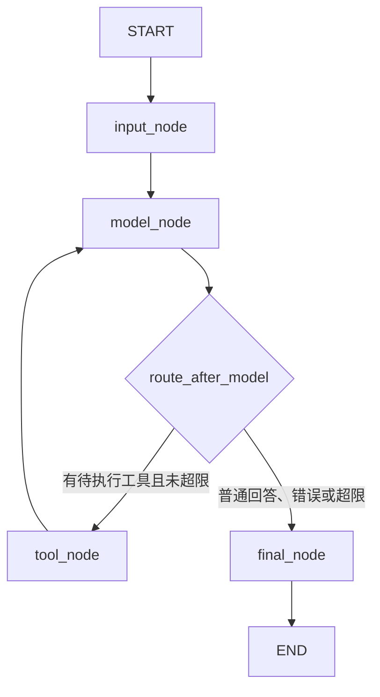

# LangGraph 最小 Agent 图实现笔记

> 日期：2026-08-16
>
> 项目：建设项目选址与国土空间合规审查 Agent 学习仓库

## 1. 本次实现结果

本次将此前的原生 Function Calling 循环改造成一张可执行的 LangGraph 状态图，同时复用已有 `ToolRegistry`，没有重复实现计算器、日期和项目类型查询逻辑。

已验证结果：

- LangGraph 版本为 `1.2.11`；
- 最小图可以编译和执行；
- 普通对话不经过工具节点直接结束；
- 模型可以选择已注册工具；
- 工具参数由现有 Pydantic 模型校验；
- 未知工具不会执行；
- 非法参数会变成安全的工具 Observation；
- 工具调用超过上限时会在执行前终止；
- AgentState 与图专项测试共 15 项通过；
- 项目全量测试 53 项通过，保留 1 条已有的 Starlette 弃用 warning；
- 真实模型通过图调用 `current_date`，返回 2026 年 8 月 16 日。

这说明“最小 Agent 图、现有工具层接入、条件路由、循环上限和五类测试”已经完成。它仍然不是完整的选址合规 Agent。

## 2. 为什么要从普通循环升级为状态图

此前的 `run_tool_calling()` 已经能完成：

```text
用户请求
  -> 模型返回 function_call
  -> 程序校验和执行工具
  -> 工具结果回传模型
  -> 模型生成最终回答
```

普通循环适合学习 Function Calling，但节点和分支增加后，消息、错误、次数和结束条件容易散落在局部变量中。LangGraph 把它们显式分为：

| 概念 | 当前项目中的职责 |
|---|---|
| State | 保存一次运行的全部可观察状态 |
| Node | 执行一个职责并返回状态增量 |
| Edge | 定义固定执行方向 |
| Conditional Edge | 根据 State 决定工具分支或结束分支 |
| Reducer | 定义新旧状态字段如何合并 |
| START / END | 图的统一入口和出口 |

LangGraph 负责流程编排，不负责工具的业务实现，也不会自动保证参数安全。

## 3. 当前图结构



固定边：

```text
START -> input
input -> model
tool -> model
final -> END
```

条件边：

```text
model -> route_after_model -> tool 或 final
```

工具执行后回到模型，是因为工具原始结果通常还需要模型组织成面向用户的自然语言回答。

## 4. AgentState 字段逐项解释

当前状态合同定义在 `practice/llm_api/agent_state.py`。

```python
class AgentState(TypedDict):
    messages: Annotated[list[dict[str, Any]], add]
    current_step: AgentStep
    pending_tool_calls: list[ToolCallRecord]
    tool_results: Annotated[list[ToolResultRecord], add]
    error: str | None
    tool_call_count: int
    max_tool_calls: int
    status: AgentStatus
    final_answer: str | None
```

| 字段 | 含义 | 更新方式 |
|---|---|---|
| `messages` | 发给模型的用户、模型工具调用和工具输出 | 使用 reducer 追加 |
| `current_step` | 当前或最近执行的阶段 | 覆盖 |
| `pending_tool_calls` | 本轮模型提出但尚未执行的工具调用 | 覆盖，执行后清空 |
| `tool_results` | 归一化后的工具成功结果或错误 | 使用 reducer 追加 |
| `error` | 当前运行的不可恢复错误或终止原因 | 覆盖 |
| `tool_call_count` | 已实际执行的工具调用数量 | 覆盖为新计数 |
| `max_tool_calls` | 本次运行允许执行的工具调用总数 | 初始化后保持不变 |
| `status` | `running/completed/failed/limit_reached` | 由终止逻辑覆盖 |
| `final_answer` | 最终自然语言答案 | 模型返回文本时写入 |

### 4.1 为什么 `messages` 使用 reducer

定义：

```python
messages: Annotated[list[dict[str, Any]], operator.add]
```

假设旧状态已有用户消息，模型节点只返回本轮新增的函数调用：

```python
{"messages": [function_call]}
```

`operator.add` 会得到“旧 messages + 新 messages”，不会覆盖用户消息。工具节点再返回 `function_call_output` 时，它也会被追加，下一次模型调用就能同时看到用户请求、工具请求和工具结果。

### 4.2 为什么 `pending_tool_calls` 不使用 reducer

它表示“当前仍待执行的调用”，不是历史记录。工具执行完成后必须更新为：

```python
{"pending_tool_calls": []}
```

如果也采用追加 reducer，已经执行过的调用会一直残留，可能被重复执行。历史结果应保存在 `messages` 和 `tool_results` 中。

### 4.3 TypedDict 不等于运行时校验

`TypedDict` 主要帮助类型检查器和开发者理解字段合同，运行时不会像 Pydantic 一样自动拒绝错误字典。因此入口使用 `create_initial_state()` 建立完整状态并校验：

- 用户消息去除首尾空白；
- 空消息抛出 `ValueError`；
- 最大工具调用次数必须是正整数；
- 每次调用创建独立列表，避免跨请求共享可变数据。

## 5. 四个 Node 的职责

### 5.1 input_node

职责：确认初始消息存在，并把阶段推进到模型节点。

正常更新：

```python
{"current_step": "model", "error": None}
```

通过公共入口 `run_agent_graph()` 调用时，空输入会更早被 `create_initial_state()` 拦截。

### 5.2 model_node

职责：调用 Responses API，并区分工具调用与最终文本。

请求的核心字段：

```python
client.responses.create(
    model=model,
    instructions=SYSTEM_MESSAGE,
    input=state["messages"],
    tools=registry.schemas(),
)
```

这里有两个重要边界：

1. Tool Schema 来自 Registry，模型只能看到注册工具的声明；
2. 模型返回仍是不可信输入，真正执行前还要经过 Registry 白名单与 Pydantic 校验。

模型返回 `function_call` 时，将调用追加到 `messages` 并写入 `pending_tool_calls`，等待条件路由决定是否允许执行。

模型返回普通文本时，将 assistant 消息追加到 `messages`，写入 `final_answer`，再路由到 final 节点。

模型调用异常，或既没有文本也没有工具调用时，图记录错误并结束，不编造回答。

### 5.3 tool_node

职责：逐个处理本轮待执行工具，但不实现工具业务逻辑。

核心委托：

```python
result = registry.execute(call["name"], call["arguments"])
```

现有 Registry 继续负责：

- 工具白名单；
- JSON 参数解析；
- Pydantic 参数校验；
- 计算器、日期和项目类型查询的真实执行；
- 工具超时与执行错误。

tool 节点将结果转换成两种记录：

1. `function_call_output`：回传给模型；
2. `ToolResultRecord`：供应用测试、审计和状态检查。

无论工具成功还是安全失败，结果都会作为 Observation 回到模型。模型可以据此生成最终回答，但不得把失败伪装成成功。

### 5.4 final_node

职责：把各种终止原因归一化为明确状态。

| 情况 | 最终状态 |
|---|---|
| 已有 `final_answer` | `completed` |
| 待执行数量会导致超限 | `limit_reached` |
| 模型失败或无有效输出 | `failed` |

所有路径最终都会将 `current_step` 设为 `done`、清空 `pending_tool_calls`，然后进入 LangGraph `END`。

## 6. 条件路由如何防止无限循环

路由读取三个关键信息：`status`、`pending_tool_calls`、`tool_call_count + pending_count`。

决策规则：

```text
状态不是 running -> final
没有待执行工具 -> final
执行本轮工具后会超过 max_tool_calls -> final
否则 -> tool
```

这里使用“已执行数量 + 本轮待执行数量”进行判断，而不是工具执行后才检查。因此超限调用不会被执行。

示例：上限为 1。

```text
第一次模型调用提出 call_1
0 + 1 <= 1，允许执行
tool_call_count 变为 1

第二次模型调用提出 call_2
1 + 1 > 1，直接进入 final
call_2 不执行
最终 status = limit_reached
```

## 7. 一次日期工具调用的完整轨迹

输入：

```text
请查询今天的日期。
```

状态变化：

```text
1. create_initial_state
   messages = [user]
   tool_call_count = 0
   status = running

2. input_node
   current_step = model

3. model_node
   模型返回 current_date 的 function_call
   pending_tool_calls = [current_date]

4. route_after_model
   有待执行工具，且未超限 -> tool

5. tool_node
   ToolRegistry 校验并执行 current_date
   messages 追加 function_call_output
   tool_results 追加成功记录
   tool_call_count = 1
   pending_tool_calls = []

6. model_node
   模型读取工具结果并生成自然语言答案
   final_answer = 今天是 2026年8月16日……

7. route_after_model
   没有待执行工具 -> final

8. final_node
   status = completed
   current_step = done

9. END
```

实际输出：

```text
今天是 **2026年8月16日**（Asia/Shanghai 时区）。
```

## 8. 五类图测试说明

| 测试 | 验证点 |
|---|---|
| 普通对话 | 一次模型请求后直接结束，工具次数为 0 |
| 正确工具调用 | 计算器经 Registry 执行，结果回传模型，最终得到 42 |
| 未知工具 | `python` 未注册，不执行，产生安全错误 Observation |
| 非法参数 | 计算器缺少字段 `b`，Pydantic 拦截，不执行实现 |
| 循环上限 | 第一个调用执行，第二个调用在执行前被拦截 |

测试使用 Fake Responses，不消耗真实 API，也能精确断言每次请求的输入和最终状态。真实 API 只用于额外的端到端冒烟验证。

## 9. 当前实现的安全边界

已经具备：

- 模型只能请求工具，不能直接执行 Python 函数；
- Registry 白名单阻止未知工具；
- Pydantic 拒绝缺字段和非法参数；
- 安全错误摘要不回传完整内部异常数据；
- 工具调用上限防止无界循环；
- 工具业务逻辑集中在 Registry 和 Tool 中；
- 测试不依赖真实网络和模型。

仍需注意：

- 当前 `input -> model` 是固定边。公共入口会拒绝空输入，但如果外部代码绕过公共入口、直接用畸形 State 调用已编译图，input 节点失败后仍可能进入 model 节点；后续可在 input 后增加条件路由；
- 当前线程型工具超时不能强制终止已经开始的底层工作；
- 尚未实现持久化 checkpoint、跨请求会话恢复和人工审批；
- 尚未接入真实 GIS 数据、政策 RAG 或 RuleEngine；
- 项目类型工具只是静态示例，不产生真实合规结论。

## 10. 与空间合规 Agent 的关系

当前最小图验证的是通用执行骨架：

```text
LLM 决策
  -> 确定性条件路由
  -> ToolRegistry 安全执行
  -> Observation 写回 State
  -> LLM 最终表达
```

未来空间合规流程不能只靠模型自由选择步骤。更合理的边界是：

| 组件 | 未来职责 |
|---|---|
| Agent / LLM | 理解需求、选择允许的局部动作、解释结果 |
| GIS Tool | CRS 转换、几何修复、叠加分析、距离计算 |
| RuleEngine | 根据版本化规则作确定性判断 |
| Workflow / DAG | 强制执行数据校验、空间分析、规则判断和报告顺序 |
| Human Gate | 对高风险或材料不足结论进行复核 |

因此，今天完成的是“可运行的最小 Agent 编排骨架”，不是空间合规业务 DAG。

## 11. 闭卷复述答案

### 11.1 State、Node、Edge 分别是什么

State 是整张图共享的数据合同；Node 是读取 State 并返回增量更新的处理步骤；Edge 决定节点之间的执行方向，条件 Edge 根据 State 选择分支。

### 11.2 为什么工具结果必须写回 messages

第一次模型调用只提出工具请求，不知道程序实际执行结果。只有把 `function_call_output` 写回消息并再次调用模型，模型才能依据真实 Observation 生成最终回答。

### 11.3 LangGraph 是否等于 Agent

不等于。LangGraph 是状态图编排框架。Agent 还需要目标理解、模型决策、工具、状态、安全边界和终止策略；LangGraph 只是把其中的流程显式组织起来。

### 11.4 为什么有 JSON Schema 仍需 Pydantic

Schema 帮助模型生成合适参数，但模型输出仍可能缺字段、类型错误或恶意构造。应用必须在执行工具前再次用 Pydantic 校验。

### 11.5 当前图和 ReAct 的关系

当前图实现了“模型决策 -> 工具行动 -> 工具结果 Observation -> 模型继续决策/回答”的受控循环，具有 ReAct 的行动与观察结构。系统不保存或展示模型的原始内部推理，只保存可审计的消息、工具调用、结果、错误和状态。

## 12. 当前完成与未完成

已完成：

- 最小 AgentState；
- input、model、tool、final 四个节点；
- 工具与最终回答条件路由；
- ToolRegistry 复用；
- 调用次数和循环上限；
- 五类图测试；
- 真实日期工具调用。

未完成：

- 当天算法题；
- 本周周总结和至少 10 张知识卡抽查；
- PlanningIntentAgent 与 ProjectIntakeSkill；
- ProjectRequest、ProjectProfile、DatasetManifest 领域合同；
- GIS、RAG、RuleEngine；
- FastAPI `/chat` 接入 LangGraph；
- checkpoint、人工审批和生产级审计。
