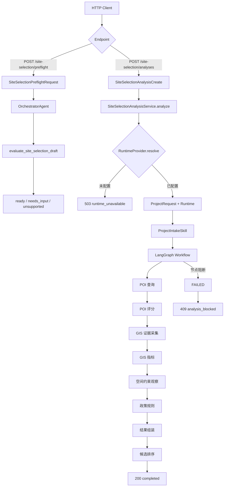

# 建设项目选址分析系统架构与代码详解

> 项目：`ai-agent-learning`
>
> 整理日期：2026-08-19
>
> 对应基线提交：`a571e41`，并包含 2026-08-19 空间存储批次
>
> 最近验证：`296 passed, 1 warning`

## 1. 报告目的

这份报告用于回答以下问题：

1. 当前仓库究竟已经实现了什么。
2. 系统整体采用什么架构。
3. 一次选址请求会经过哪些文件、类和函数。
4. 每个文件负责什么，不负责什么。
5. POI、GIS、空间约束、政策规则、结果排序如何连接。
6. 哪些能力已经真实验证，哪些仍是测试 Fixture 或安全关闭状态。
7. 后续接入生产数据时应该从哪里扩展。

## 2. 当前项目的真实状态

仓库根目录的 `README.md` 仍停留在早期学习阶段，里面关于“桩接口”“12 个测试”的描述已经过时。当前仓库实际上包含三组相对独立的能力：

### 2.1 早期 Python 与 LLM 学习代码

- `practice/layer_stats/`：图层 JSON 统计练习。
- `practice/llm_api/`：工具调用、AgentState、LangGraph 和 LLM 接口练习。
- `src/main.py`：最早期的命令行占位入口。

这些代码不是当前选址业务主链的一部分。

### 2.2 FastAPI 基础接口

- `GET /health`：健康检查。
- `POST /documents`：文档元数据接收桩接口。
- `POST /chat`：聊天问题接收桩接口。

其中 `/documents` 不保存文件，`/chat` 不执行真实选址分析。

### 2.3 当前重点：确定性选址分析系统

当前已经具备：

- 商场和物流园项目类型路由。
- 不完整输入前置检查。
- 结构化 Orchestrator、Spatial、Policy、Review Agent 边界。
- POI 统一查询、来源、指标和评分契约。
- 32 条固定 POI Fixture。
- 文件型空间数据 Gateway。
- PostGIS 空间数据 Gateway。
- GIS 数据质量校验。
- 面积、周长、缓冲区等空间指标。
- 空间约束观察。
- 版本化政策规则引擎。
- 地块级结果组装。
- 多候选地块软评分排序。
- FastAPI 前置检查和分析接口。
- 应用服务、运行时注册表和依赖注入。
- LangGraph 确定性工作流。
- 真实 PostGIS 容器连接冒烟测试。
- PostGIS 版本化 Schema、空间数据和 POI Repository。
- Redis 命名空间运行状态与 TTL。

当前系统没有在选址主链中调用 LLM。所有业务节点都是普通 Python 函数、Pydantic 模型、GeoPandas 运算和显式规则。

## 3. 架构风格

系统采用了以下几种架构思想：

### 3.1 分层架构

```text
HTTP/API 层
    ↓
应用服务与运行时配置层
    ↓
业务契约与确定性工作流层
    ↓
POI / 文件 / PostGIS 数据适配层
    ↓
PostGIS Repository / Redis 状态层
    ↓
外部数据与基础设施
```

### 3.2 Ports and Adapters

业务代码不直接依赖某个具体数据源，而是依赖协议：

- `POIGateway.search(query)`。
- `SpatialDatasetGateway.load(manifest)`。
- `SiteSelectionRuntimeProvider.resolve(project_type)`。
- `SQLConnection.execute(statement, parameters)`。
- `RedisClient.get/set/delete/ttl(...)`。

Fixture、内存 Mock、文件和 PostGIS 是这些协议的不同实现。

### 3.3 显式依赖注入

工作流需要的 POI Gateway、评分配置、空间 Gateway、约束配置、政策规则和缓冲距离，都装在 `SiteSelectionWorkflowDependencies` 中显式传入。

代码不会在业务函数中偷偷读取数据库连接、环境变量或测试配置。

PostGIS Repository 接收外部 SQLAlchemy Connection，Redis 状态存储接收外部 Redis Client。连接生命周期、事务提交和回滚均由应用层控制。

### 3.4 Fail Closed

缺少数据、缺少规则、版本冲突、CRS 错误、几何无效或运行配置未审核时，系统停止分析，而不是继续猜测。

默认 FastAPI 应用没有生产 Runtime，因此 `/site-selection/analyses` 返回 `503 runtime_unavailable`。

### 3.5 证据与结论分离

- GIS 模块只计算空间事实。
- 约束模块只产生 `ConstraintObservation`。
- 规则模块把事实映射为政策等级。
- POI 分数只是软评分。
- 候选排序不等于合规结论或推荐决定。
- `AnalysisResult.conclusion` 当前保持 `None`。

### 3.6 可追溯性

数据、评分和规则均携带版本与来源：

- `DatasetManifest.version`。
- `POISourceMeta.dataset_version`。
- `POIScoringConfig.version`。
- `RuleDefinition.version`。
- `PolicyReference.version`。
- `StoredSpatialLayer.source_crs / normalized_crs / data_hash`。

## 4. 总体调用图



## 5. 两条 API 调用链

## 5.1 前置检查调用链

入口：`POST /site-selection/preflight`

```text
JSON
→ SiteSelectionPreflightRequest
→ to_draft()
→ SiteSelectionDraft
→ OrchestratorAgent.run()
→ evaluate_site_selection_draft()
→ ProfileRegistry.get()
→ PreflightDecision
→ SiteSelectionPreflightResponse
```

可能返回：

- `ready`：项目类型受支持，候选地块和数据清单完整。
- `needs_input`：返回具体缺失字段。
- `unsupported`：保留不支持的原始项目类型并停止。

前置检查不会执行 POI、GIS、评分或政策规则。

## 5.2 完整分析调用链

入口：`POST /site-selection/analyses`

```text
JSON
→ SiteSelectionAnalysisCreate
→ SiteSelectionAnalysisService.analyze()
→ 创建 ProjectRequest、request_id、requested_at
→ RuntimeProvider.resolve(project_type)
→ run_site_selection_workflow()
→ ProjectIntakeSkill.run()
→ LangGraph 节点链
→ AgentState
→ SiteSelectionAnalysisResponse
```

`/analyses` 请求只提交项目类型和候选地块。权威数据清单、Gateway、评分配置、约束配置和政策规则由服务端 Runtime 提供，不能由客户端直接控制。

## 6. 中央数据模型：AgentState

文件：`practice/site_selection/evidence.py`

`AgentState` 是整个分析过程的中央状态容器，主要字段如下：

| 字段 | 含义 |
|---|---|
| `request` | 当前项目请求 |
| `profile` | 商场或物流园 Profile |
| `datasets` | 版本化数据清单 |
| `poi_queries` | 待执行 POI 查询 |
| `poi_feature_sets` | POI 返回结果与指标 |
| `gis_evidence` | GIS 数据状态、指标和约束观察 |
| `poi_evidence` | POI FeatureSet、软评分和评分报告 |
| `policy_evidence` | 已评估规则、命中规则和政策来源 |
| `results` | 每个候选地块的最终组合结果 |
| `comparison_report` | 多候选地块软评分排序 |
| `errors` | 工作流错误记录 |
| `status` | 当前分析状态 |

状态变化：

```text
INTAKE
→ DATA_PENDING
→ ANALYZING
→ COMPLETED
或 FAILED
```

业务函数通常采用以下方式更新状态：

```python
state_data = state.model_dump()
state_data["某字段"] = 新值
return AgentState.model_validate(state_data)
```

这样可以减少节点之间共享可变对象造成的污染，并在每一步重新执行 Pydantic 一致性校验。

## 7. 应用与 API 文件详解

### 7.1 `app/main.py`

核心函数：

- `create_app(runtime_provider=None)`：创建 FastAPI 应用。
- `app = create_app()`：Uvicorn 默认加载的应用对象。

调用细节：

1. 没有传入 Provider 时创建 `UnconfiguredSiteSelectionRuntimeProvider`。
2. 创建 `SiteSelectionAnalysisService`。
3. 放入 `application.state.site_selection_analysis_service`。
4. 注册 health、documents、chat 和 site-selection 路由。

这使测试或未来部署代码可以通过 `create_app(registry)` 注入审核后的 Runtime。

### 7.2 `app/api/site_selection.py`

核心函数：

- `get_site_selection_analysis_service()`：从 `request.app.state` 取得服务。
- `evaluate_site_selection_preflight()`：运行 Orchestrator 前置检查。
- `create_site_selection_analysis()`：执行完整分析并生成 HTTP 响应。
- `_raise_api_error()`：统一构造结构化 `HTTPException`。

HTTP 映射：

| 情况 | HTTP 状态 | 业务码 |
|---|---:|---|
| Pydantic 请求错误 | 422 | FastAPI 默认校验响应 |
| Runtime 未配置 | 503 | `runtime_unavailable` |
| 工作流状态为 FAILED | 409 | `analysis_blocked` |
| 服务抛出未处理异常 | 500 | `analysis_internal_error` |
| 返回非终态或不完整完成态 | 500 | `analysis_internal_error` |

### 7.3 `app/schemas/site_selection.py`

主要 DTO：

- `CandidateParcelInput`：HTTP 地块输入。
- `SiteSelectionAnalysisCreate`：严格分析请求。
- `SiteSelectionPreflightRequest`：可不完整前置请求。
- `SiteSelectionPreflightResponse`：三态前置响应。
- `SiteSelectionAnalysisResponse`：完成结果。
- `SiteSelectionAnalysisErrorDetail`：结构化错误详情。
- `SiteSelectionAnalysisErrorResponse`：错误响应外壳。

所有模型使用 `extra="forbid"`，客户端传入未声明字段时直接返回 422。

### 7.4 `app/services/site_selection_service.py`

主要类型：

- `SiteSelectionRuntime`：某一项目类型的完整运行包。
- `SiteSelectionRuntimeProvider`：Runtime 提供接口。
- `UnconfiguredSiteSelectionRuntimeProvider`：默认关闭实现。
- `SiteSelectionRuntimeRegistry`：按项目类型查找 Runtime。
- `SiteSelectionAnalysisService`：HTTP 与业务工作流之间的应用边界。

`SiteSelectionAnalysisService.analyze()`：

1. 生成 `analysis-<uuid>` 请求编号。
2. 使用 UTC 带时区时间。
3. DTO 转换为 `ProjectRequest`。
4. 按项目类型解析 Runtime。
5. 再次检查 Runtime 与请求类型一致。
6. 调用 `run_site_selection_workflow()`。

## 8. 领域契约与入口文件详解

### 8.1 `practice/site_selection/domain.py`

- `ProjectType`：`shopping_mall`、`logistics_park`。
- `DatasetSource`：`api`、`postgis`、`file`。
- `CandidateParcel`：编号、名称、中心坐标、申报面积、几何数据集编号。
- `ProjectRequest`：严格项目请求，校验地块编号唯一和时间带时区。
- `DatasetManifest`：数据来源、位置、版本、CRS、必需字段和更新时间。

`DatasetManifest.location` 只能保存表名、文件路径或 API 资源标识，不保存数据库密码。

### 8.2 `practice/site_selection/profiles.py`

- `POICategoryConfig`：一个 POI 逻辑分组。
- `ProjectProfile`：某类项目的 POI 分组集合。
- `SHOPPING_MALL_PROFILE`：商场 Profile。
- `LOGISTICS_PARK_PROFILE`：物流园 Profile。
- `PROJECT_PROFILES`：内置注册表数据。
- `get_project_profile()`：返回 Profile 深拷贝。

每个分组声明：

- `group_key`。
- 展示名称。
- POI 类别集合。
- 查询半径。
- 所需指标。
- 分组软评分权重。

Profile 只定义分组权重；每个指标的上下界、方向和缺失策略由独立的 `POIScoringConfig` 定义。

### 8.3 `practice/site_selection/intake.py`

- `ProfileRegistry.get()`：安全解析项目类型并返回 Profile 副本。
- `ProjectTypeRouter.route()`：将严格请求路由到 Profile。
- `build_poi_queries()`：为每个地块和每个 Profile 分组生成一条查询。
- `ProjectIntakeSkill.run()`：创建最初的 `AgentState`。

若一个商场 Profile 有 6 个 POI 分组，两个候选地块会生成 12 条 POI 查询。

### 8.4 `practice/site_selection/preflight.py`

- `PreflightStatus`：三种前置状态。
- `SiteSelectionDraft`：允许不完整的草稿。
- `PreflightDecision`：前置检查结果。
- `evaluate_site_selection_draft()`：主前置检查函数。
- `_collect_missing_fields()`：收集精确缺失路径。

当前检查项包括：

- 项目类型。
- 候选地块列表。
- 每个地块的 `area_hectares`。
- 每个地块的 `geometry_dataset_id`。
- 数据清单。
- 地块引用但清单中不存在的数据集。

### 8.5 `practice/site_selection/agents.py`

四个 Agent 都有 Pydantic 输入输出：

| Agent | 输入 | 执行内容 | 输出 |
|---|---|---|---|
| `OrchestratorAgent` | `SiteSelectionDraft` | 路由和缺失信息判断 | `PreflightDecision` |
| `SpatialAgent` | `AgentState` | GIS 采集、指标、空间约束 | 更新后的 `AgentState` |
| `PolicyAgent` | `AgentState` | 版本化规则评估 | 政策证据 |
| `ReviewAgent` | `AgentState` | 结果组装和候选对比 | completed 状态 |

重要说明：完整 LangGraph 主链当前直接调用这些 Agent 内部复用的底层函数，并没有依次实例化 SpatialAgent、PolicyAgent 和 ReviewAgent。`agents.py` 提供的是可独立调用、可测试的角色边界。

### 8.6 `practice/site_selection/__init__.py`

这是包的公共导出表。它让外部代码可以写：

```python
from practice.site_selection import ProjectRequest, DatasetManifest
```

而不需要知道模型实际位于哪个子模块。该文件不包含业务算法。

## 9. POI 子系统详解

## 9.1 `practice/site_selection/poi.py`

主要模型：

- `POIMetric`：数量、密度、最近距离、平均距离。
- `POIProvider`：高德、百度、PostGIS、Mock。
- `POIQuery`：标准查询输入。
- `POIRecord`：标准 POI 记录。
- `POISourceMeta`：来源和版本血缘。
- `POIFeatureSet`：一次查询的记录、指标和来源。

`POIFeatureSet` 会校验 `source.record_count == len(records)`。

## 9.2 `practice/site_selection/poi_service.py`

- `POIGateway`：工作流依赖的结构化协议。
- `calculate_poi_metrics()`：计算标准指标。
- `MockPOIGateway`：按地块保存内存记录，供业务流测试使用。
- `execute_poi_queries()`：执行全部查询并按候选地块生成 `POIEvidence`。

指标算法：

```text
count = 记录数量
density = count / (π × radius_km²)
nearest = min(distance_m)
average = sum(distance_m) / n
```

## 9.3 `practice/site_selection/poi_adapters.py`

- `POISourceAdapter`：真实数据适配器的公共协议。
- `FixturePOIDataset`：固定 JSON 数据集契约。
- `FixturePOIAdapter.from_json()`：加载并校验 JSON。
- `FixturePOIAdapter.search()`：类别过滤、距离计算、半径过滤、稳定排序、数量限制。
- `haversine_distance_m()`：球面距离计算。

`POISourceAdapter` 和 `POIGateway` 都要求 `search(query) -> POIFeatureSet`。Python 的结构化 Protocol 使 `FixturePOIAdapter` 无需显式继承也可作为工作流 Gateway 使用。

## 9.4 `data/fixtures/poi.json`

包含 32 条合成 POI：

- 使用 `mock` provider。
- 使用 `EPSG:4326`。
- 带数据集版本和更新时间。
- 覆盖商场、物流园 Profile 所需类别。
- 原始记录不预置与查询中心相关的距离。

该文件只能用于测试和演示，不能作为真实业务数据。

## 9.5 `practice/site_selection/poi_scoring.py`

评分配置：

- `ScoreDirection`：越高越好或越低越好。
- `MissingMetricPolicy`：缺失时阻断或记零。
- `POIMetricScoringRule`：单指标上下界、方向和权重。
- `POIGroupScoringConfig`：一个分组的指标规则。
- `POIScoringConfig`：项目级版本化评分配置。

评分结果：

- `POIMetricScore`。
- `POIGroupScore`。
- `POIScoreReport`。

核心算法：

- `normalize_metric_value()`：线性归一化到 0–100，并截断到合法范围。
- `score_poi_feature_sets()`：校验 Profile、评分配置和 FeatureSet 分组完全一致，再生成评分报告。

## 9.6 `practice/site_selection/poi_scoring_service.py`

- `score_poi_state()`：对请求中的全部候选地块评分。
- `_index_poi_evidence()`：拒绝重复地块证据。
- `_score_parcel()`：要求 POI 证据 READY，写入 `soft_score` 和 `score_report`。

评分服务不会修改输入 State，而是返回新 State。

## 9.7 `practice/site_selection/poi_normalizer.py`

- `RawPOI`：带来源、原始 ID、类别、坐标系、抓取时间和原始载荷的输入模型。
- `NormalizedPOI`：统一为可写入 PostGIS 的 WGS84 POI，并提供 `(source, source_id)` 身份键。
- `POINormalizer`：规范来源大小写、类别别名和地址空白。
- `UnsupportedPOICRSError`：拒绝尚未实现真实转换的坐标系。

当前只接受 WGS84/EPSG:4326。GCJ-02 不会被伪装成 EPSG:4326；未来接入高德时必须先增加经过审核的真实坐标转换。

## 10. GIS 子系统详解

## 10.1 `practice/site_selection/spatial/validate.py`

- `SpatialValidationCode`：结构化错误类型。
- `SpatialValidationError`：携带错误码、行号和缺失字段。
- `SpatialValidationResult`：成功校验审计结果。
- `parse_crs()`：解析 CRS。
- `validate_spatial_dataset()`：数据进入 GIS 分析之前的统一门禁。

检查内容：

- 必须是 GeoDataFrame。
- 数据不能为空。
- 必须有活动 geometry 列。
- 必需字段必须存在。
- CRS 必须存在且可解析。
- 实际 CRS 必须与 Manifest 一致。
- 距离和面积分析要求投影 CRS。
- 投影坐标系的线性单位必须为米。
- 不能有 null、empty 或 invalid geometry。

## 10.1.1 `practice/site_selection/spatial/hashing.py`

- `stable_spatial_hash()`：为校验通过的空间数据生成稳定 SHA-256。
- 几何先执行标准化，再使用固定 WKB 表达。
- CRS、排序后的字段、属性和几何都参与哈希。
- 行顺序和 DataFrame 索引变化不影响结果。
- NaN 或无穷属性被拒绝，避免产生不可重复的序列化结果。

## 10.2 `practice/site_selection/spatial/gateway.py`

- `SpatialDatasetGateway`：统一 `load(manifest)` 协议。
- `MockSpatialDatasetGateway`：内存 GeoDataFrame 实现。
- `collect_gis_evidence()`：按候选地块加载并校验数据。

加载结果映射：

- 文件或数据集不存在：`MISSING`。
- 来源、路径、读取或数据质量不合法：`INVALID`。
- 数据可用且包含目标地块：`READY`。

## 10.3 `practice/site_selection/spatial/file_gateway.py`

- `FileSpatialDatasetGateway(root)`：限定一个允许读取的根目录。
- `load()`：通过 GeoPandas 读取数据。
- `_resolve_manifest_path()`：执行路径安全检查。

支持：

- `.geojson`
- `.json`
- `.gpkg`
- `.shp`

拒绝：

- 非 FILE 来源。
- 绝对路径。
- `..` 目录穿越。
- 解析后位于根目录之外的路径。
- 根目录外符号链接目标。
- 不支持的后缀。

## 10.4 `practice/site_selection/spatial/postgis_gateway.py`

- `PostGISSpatialDatasetGateway(connection, ...)`：接收外部创建的数据库连接。
- `load()`：生成受限 SELECT 并调用 `geopandas.read_postgis()`。
- `_relation_for()`：解析 `table` 或 `schema.table`。
- `_require_identifier()`：严格校验 SQL 标识符。

安全约束：

- 不从 Manifest 读取连接串。
- 不接受任意 SQL。
- schema 必须位于白名单。
- schema、table、geometry column 必须匹配安全正则。
- 错误只保留 dataset_id 和异常类型。
- 返回 GeoDataFrame 深拷贝。

当前 SQL 是：

```sql
SELECT * FROM "schema"."table"
```

生产阶段还应增加只读数据库角色、正式表白名单，以及按业务需要进行字段和空间范围裁剪。

## 10.5 `practice/site_selection/spatial/analysis.py`

- `SpatialMetrics`：面积、周长、缓冲面积、相交数量和最近距离。
- `calculate_spatial_metrics()`：纯 GIS 指标计算。
- `run_gis_analysis()`：对全部候选地块执行指标计算。

面积除以 10,000 转换为公顷。输入 CRS 必须是投影坐标系，地块几何必须是 Polygon 或 MultiPolygon。

## 10.6 `practice/site_selection/constraints.py`

- `ConstraintLayerType`：用地、生态保护、永久基本农田、开发边界、敏感目标。
- `SpatialConstraintRelation`：相交或指定距离内。
- `ConstraintLayerSpec`：约束如何计算。
- `ConstraintObservation`：计算后的空间事实。

`ConstraintLayerSpec` 校验规则：

- `within_distance` 必须有距离阈值。
- `intersects` 不能有距离阈值。

## 10.7 `practice/site_selection/spatial/constraint_analysis.py`

- `run_spatial_constraint_analysis()`：选择适用于当前项目类型的约束。
- `_evaluate_parcel_constraints()`：逐地块计算。
- `_evaluate_spec()`：逐约束计算。
- `_require_manifest()`：要求约束数据存在于清单。
- `_load_valid_frame()`：统一加载和验证。

触发逻辑：

```text
INTERSECTS      → 相交要素数 > 0
WITHIN_DISTANCE → 最近距离 <= distance_threshold_m
```

如果约束图层 CRS 与地块 CRS 不同，会转换到地块 CRS 后再计算。

## 11. 政策规则、结果和排序详解

## 11.1 `practice/site_selection/rules.py`

- `RuleOutcome`：`notice`、`review_required`、`restricted`、`prohibited`。
- `PolicyReference`：政策文件、发布机构、文号、条款、版本、辖区和来源地址。
- `RuleDefinition`：一个空间观察到政策结果的版本化映射。
- `PolicyFinding`：命中规则的完整审计记录。

`RuleDefinition.is_effective_on(date)` 用于判断请求日期是否位于规则有效期。

## 11.2 `practice/site_selection/rule_engine.py`

- `evaluate_policy_rules()`：主规则评估函数。
- `_validate_active_rules()`：拒绝同一 rule_id 同时存在多个有效版本。
- `_index_gis_evidence()`：拒绝重复 GIS 证据。
- `_evaluate_parcel()`：要求所需空间观察完整。
- `_build_finding()`：组合规则、政策和数据血缘。

规则只有在以下条件全部满足时才参与评估：

- `enabled=True`。
- 适用于当前项目类型。
- 请求日期位于有效期。

观察值与 `expected_triggered` 相等时生成 Finding。没有命中只表示这些规则未命中，不表示整体合规。

## 11.3 `practice/site_selection/results.py`

- `assemble_analysis_results()`：为每个候选地块组装结果。
- `_index_by_parcel()`：拒绝重复证据。
- `_assemble_parcel_result()`：要求 GIS、POI、Policy 全部 READY。

输出包含证据、软评分和警告，但不生成自动结论。

## 11.4 `practice/site_selection/comparison.py`

- `compare_candidate_results()`：创建请求级候选对比报告。
- `_index_results()`：拒绝重复结果。
- `_required_score()`：要求软评分存在。
- `_build_ranked_items()`：生成稳定名次。

排序规则：

1. 软评分降序。
2. 同分按 `parcel_id` 稳定排序。
3. 使用标准竞赛排名，例如 `90, 90, 80 → 1, 1, 3`。
4. 所有地块必须使用同一个评分版本。
5. 政策结果随地块展示，但不参与软分名次。

## 12. LangGraph 工作流详解

文件：`practice/site_selection/workflow.py`

## 12.1 依赖对象

`SiteSelectionWorkflowDependencies` 包含：

```text
poi_gateway
poi_scoring_config
spatial_gateway
constraint_specs
rules
buffer_distance_m
```

约束配置和规则不能为空，缓冲距离必须大于零。

## 12.2 节点顺序

| 顺序 | 节点 | 核心函数 | State 变化 |
|---:|---|---|---|
| 1 | `poi` | `execute_poi_queries()` | 写入 FeatureSet 和 POI 证据 |
| 2 | `poi_scoring` | `score_poi_state()` | 写入软评分和评分报告 |
| 3 | `gis_collection` | `collect_gis_evidence()` | 写入 GIS READY/MISSING/INVALID |
| 4 | `gis_metrics` | `run_gis_analysis()` | 写入面积、周长、缓冲指标 |
| 5 | `spatial_constraints` | `run_spatial_constraint_analysis()` | 写入空间约束观察 |
| 6 | `policy_rules` | `evaluate_policy_rules()` | 写入政策证据和命中记录 |
| 7 | `results` | `assemble_analysis_results()` | 写入地块结果并设为 COMPLETED |
| 8 | `comparison` | `compare_candidate_results()` | 写入候选对比报告 |

## 12.3 安全节点

`_safe_node(step_name, operation)` 包装每个节点：

1. 调用节点函数。
2. 捕获异常。
3. 已知业务异常保留清理后的业务信息。
4. 未知异常只记录异常类型，不泄露原始内容。
5. 将状态设为 FAILED。
6. 条件边进入 `failed` 节点。

`failed` 节点会清空不完整的 `results` 和 `comparison_report`。

## 13. Runtime 如何组装

完整可执行示例位于 `tests/test_site_selection_fixture_http.py`。核心结构如下：

```python
dependencies = SiteSelectionWorkflowDependencies(
    poi_gateway=poi_gateway,
    poi_scoring_config=scoring_config,
    spatial_gateway=spatial_gateway,
    constraint_specs=constraint_specs,
    rules=rules,
    buffer_distance_m=200,
)

runtime = SiteSelectionRuntime(
    project_type=ProjectType.SHOPPING_MALL,
    datasets=manifests,
    dependencies=dependencies,
)

registry = SiteSelectionRuntimeRegistry(
    {ProjectType.SHOPPING_MALL: runtime}
)

app = create_app(registry)
```

未来生产部署需要新增一个启动层，负责：

1. 从环境变量创建只读数据库连接。
2. 加载审核后的数据清单。
3. 加载审核后的 POI 评分配置。
4. 加载审核后的约束和政策规则。
5. 构造 Gateway 和 RuntimeRegistry。
6. 调用 `create_app(registry)`。

## 14. 基础设施文件

### 14.1 `compose.yaml`

包含三个服务：

- `api`：FastAPI/Uvicorn。
- `postgis`：PostgreSQL 16 + PostGIS 3.4。
- `redis`：带密码和 AOF 的 Redis 7。

现状：

- PostGIS 容器、Gateway、迁移和 Repository 已完成真实冒烟验证。
- Compose 提供 `DATABASE_URL`，但默认 `create_app()` 尚未读取并组装生产 Runtime。
- Redis 状态存储已完成真实冒烟验证，但尚未注入选址工作流。
- LLM 环境变量尚未被选址工作流使用。

### 14.2 `Dockerfile`

当前镜像：

1. 基于 `python:3.12-slim`。
2. 安装 `requirements.txt`。
3. 复制 `app/` 和 `practice/`。
4. 启动 Uvicorn。

当前没有复制 `data/`、`scripts/` 或生产配置目录。这对默认关闭的应用没有影响；将来如果容器运行时需要文件数据或配置，需要显式调整 COPY。

### 14.3 `requirements.txt`

关键依赖：

- FastAPI、Uvicorn：HTTP 服务。
- Pydantic：数据契约和校验。
- LangGraph：确定性节点编排。
- GeoPandas、PyProj、Shapely：空间分析。
- SQLAlchemy、psycopg：PostGIS 连接。
- redis：运行状态客户端。
- pytest、httpx：测试。
- OpenAI、python-dotenv：已有学习代码和环境加载。

### 14.4 `scripts/smoke_postgis_gateway.py`

执行过程：

1. 将项目根目录加入 `sys.path`。
2. 从 `.env` 读取数据库参数。
3. 使用 SQLAlchemy URL 安全组合连接地址。
4. 查询 `PostGIS_Version()`。
5. 创建 `TEMP TABLE ... ON COMMIT DROP`。
6. 插入一条 EPSG:32651 Polygon。
7. 构造 DatasetManifest。
8. 使用 `PostGISSpatialDatasetGateway.load()` 读取。
9. 使用 `validate_spatial_dataset()` 校验。
10. 事务结束自动删除临时表。

实际输出：

```text
PostGIS smoke OK: rows=1, crs=EPSG:32651, geometry=Polygon
```

### 14.5 `deploy/init_postgis.sql` 与 `deploy/migrations/001_initial.sql`

版本化迁移建立：

- `projects`：项目主记录；
- `spatial_layers`：图层元数据、CRS、版本和数据哈希；
- `spatial_features`：SRID 4326 的通用空间要素；
- `pois`：SRID 4326 的标准化点要素；
- `schema_migrations`：迁移版本记录。

`spatial_features.geometry` 和 `pois.geometry` 均建立 GIST 索引。POI 通过数据库唯一约束 `(source, source_id)` 保证并发写入也不会产生重复记录。

### 14.6 PostGIS Repository

`practice/site_selection/storage/postgres.py` 提供：

- 项目 upsert 和按 ID 读取；
- 空间图层校验、哈希、重投影和整体替换；
- 按图层 ID 和源要素 ID 读取要素；
- 参数化 SQL 和调用方控制的事务边界。

`practice/site_selection/storage/poi_repository.py` 提供：

- POI 批量 upsert；
- 按 `source + source_id` 去重和读取；
- 使用 PostGIS geography 的米制半径和距离查询；
- 可选类别过滤和稳定结果顺序。

### 14.7 Redis 运行状态

`practice/site_selection/storage/redis_state.py` 提供：

- `queued/running/completed/failed` 四种结构化状态；
- `failed` 与错误信息的一致性校验；
- 安全 namespace 和 run ID；
- JSON 往返模型校验；
- 每次写入同时设置显式 TTL。

它是短期运行状态存储，不代替 PostGIS 长期业务和审计数据。

## 15. 测试文件与覆盖关系

| 测试文件 | 主要覆盖 |
|---|---|
| `test_site_selection_contracts.py` | 领域模型和 AgentState 契约 |
| `test_site_selection_intake.py` | Profile 路由和 POIQuery 生成 |
| `test_poi_service.py` | POI Gateway、指标和证据生成 |
| `test_poi_scoring.py` | 指标归一化和版本化评分报告 |
| `test_poi_scoring_service.py` | 多地块评分 State 更新 |
| `test_spatial_validation.py` | CRS、字段、空数据和几何校验 |
| `test_spatial_gateway.py` | 内存 Gateway 和 GIS 证据状态 |
| `test_spatial_analysis.py` | 面积、周长、缓冲和分析阻断 |
| `test_spatial_constraints.py` | 相交、邻近和约束观察 |
| `test_rule_engine.py` | 规则版本、有效期、命中和血缘 |
| `test_site_selection_workflow.py` | LangGraph 主链和失败路由 |
| `test_candidate_comparison.py` | 软评分排序、并列和版本一致性 |
| `test_site_selection_preflight_agents.py` | 三态前置检查和四 Agent 边界 |
| `test_poi_fixture_adapter.py` | JSON Fixture、半径、类别和来源 |
| `test_site_selection_application_service.py` | RuntimeRegistry 和应用服务 |
| `test_site_selection_api.py` | HTTP 200、409、422、500、503 |
| `test_site_selection_fixture_http.py` | 从 HTTP 到最终对比报告的完整链路 |
| `test_spatial_file_gateway.py` | 文件格式和路径安全 |
| `test_spatial_postgis_gateway.py` | SQL 标识符、schema 白名单和异常清理 |
| `test_spatial_hashing.py` | 空间哈希稳定性、行序无关和属性变化 |
| `test_poi_normalizer.py` | WGS84 标准化、类别映射、时区和 GCJ-02 阻断 |
| `test_postgres_repository.py` | 参数化项目、图层和空间要素持久化 |
| `test_poi_repository.py` | POI 去重、读取和米制附近查询 |
| `test_redis_state.py` | namespace、TTL、状态一致性和删除 |
| `test_storage_migrations.py` | 表、SRID、空间索引和唯一约束 |

最近全量测试：

```text
296 passed, 1 warning in 3.13s
```

warning 来自 FastAPI/Starlette TestClient 的第三方弃用提示，与选址业务逻辑无关。

## 16. 当前已经真实完成的能力

- 领域契约和状态校验。
- 商场与物流园 Profile 路由。
- 不完整信息前置检查。
- 四个结构化 Agent 角色边界。
- POI 统一接口和固定 Fixture。
- 确定性 POI 指标与评分算法。
- 空间数据质量门禁。
- 文件 Gateway。
- PostGIS Gateway。
- 稳定空间数据哈希。
- PostGIS 版本化 Schema 和 Repository。
- POI 标准化、唯一身份去重和附近查询。
- Redis 命名空间运行状态与 TTL。
- 面积、周长、缓冲和邻近分析。
- 空间约束观察。
- 版本化政策规则引擎。
- 多地块结果与软评分排序。
- FastAPI 应用服务边界。
- LangGraph 失败路由。
- 296 项全量测试通过。
- PostGIS Gateway、迁移和 Repository 真实容器验证。
- Redis 状态存储真实容器验证。

## 17. 尚未完成或尚未接生产的能力

### 17.1 默认生产 Runtime 尚未组装

`app = create_app()` 使用未配置 Provider，因此完整分析默认返回 503。这是安全设计，不是程序故障。

### 17.2 没有真实 POI Adapter

目前只有：

- `MockPOIGateway`。
- `FixturePOIAdapter`。

高德、OSM、百度或正式 PostGIS POI Adapter 尚未实现。

### 17.3 评分参数尚未业务审核

测试中的上下界、方向和缺失策略均带 Fixture/Test 标识。不能把测试值当作生产评分标准。

### 17.4 政策规则尚未业务审核

规则引擎已经完成，但尚无正式政策文件解析、条款复核、规则审批和发布流程。

### 17.5 PostGIS 尚未装配到默认 API

Gateway 和实连验证已完成，但默认 App 没有使用 `DATABASE_URL` 创建连接和 Runtime。

### 17.6 Redis 尚未注入业务工作流

`RedisRunStateStore` 已实现并通过真实容器测试，但应用服务尚未为每次分析生成 run ID，也没有把 LangGraph 节点状态写入 Redis。当前选址主链仍不依赖 Redis。

### 17.7 没有自动合规结论

当前输出证据、规则命中和排序，但 `conclusion=None`。这是为了避免在规则和数据未审核时生成误导性结论。

### 17.8 申报面积尚未与 GIS 实测面积比对

前置检查要求 `area_hectares`，GIS 分析会重新计算面积，但当前还没有定义两者允许偏差和复核规则。

## 18. 建议的阅读顺序

第一次阅读代码建议按以下顺序：

1. `domain.py`：理解输入数据。
2. `profiles.py`：理解商场和物流园差异。
3. `evidence.py`：理解中央 State。
4. `workflow.py`：看到完整流程。
5. `poi.py`、`poi_service.py`：理解 POI。
6. `spatial/validate.py`、`spatial/gateway.py`：理解 GIS 数据门禁。
7. `spatial/analysis.py`、`constraint_analysis.py`：理解空间计算。
8. `rules.py`、`rule_engine.py`：理解政策映射。
9. `results.py`、`comparison.py`：理解输出。
10. `site_selection_service.py`、API 路由：理解 HTTP 如何调用业务。
11. `test_site_selection_fixture_http.py`：看一套完整可运行配置。
12. `poi_normalizer.py`、`storage/`、`001_initial.sql`：理解标准化与持久化边界。

## 19. 常用验证命令

激活环境后执行：

```powershell
python -m pytest -q --basetemp .\.venv\pytest-tmp
```

真实基础设施验收：

```powershell
docker compose up -d --wait postgis redis
python .\scripts\smoke_postgis_gateway.py
python .\scripts\apply_postgis_migrations.py
python .\scripts\smoke_storage_repositories.py
python .\scripts\smoke_redis_state.py
docker compose stop postgis redis
```

启动默认 API：

```powershell
python -m uvicorn app.main:app --reload
```

默认 API 行为：

- `/health` 正常返回 200。
- `/site-selection/preflight` 可以正常执行。
- `/site-selection/analyses` 因生产 Runtime 未配置而返回 503。

## 20. 总结

当前系统的本质不是一个自由对话的 AI Agent，而是一套为未来 Agent 调用准备好的、确定性、可测试、可追溯的选址业务内核。

它已经解决了“如何组织输入、如何加载数据、如何计算证据、如何执行规则、如何组装结果以及遇错如何停止”的工程问题。

下一阶段不应继续堆叠抽象类，而应把现有 PostGIS Repository 和 Redis 状态存储接入应用服务，明确事务与状态转换；同时解决真实 POI 来源、评分依据、政策条款版本、配置审批和部署装配。
