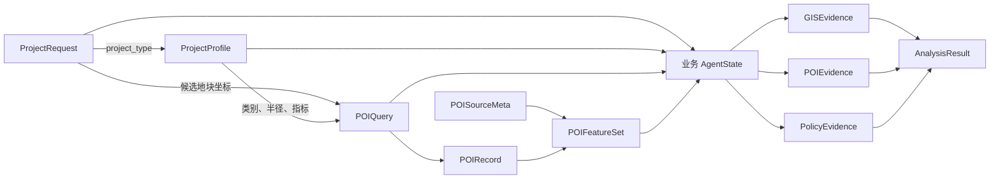
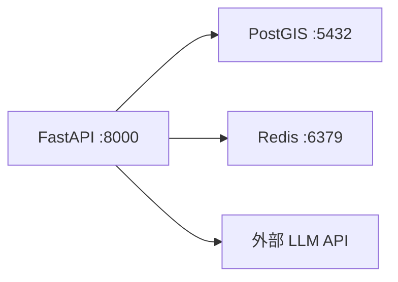

# 项目、POI 数据契约与 Compose 骨架学习笔记

> 项目：建设项目选址与国土空间合规审查 Agent

## 1. 今日目标与结果

今天建立选址业务的第一层数据合同，让后续 Profile 路由、POI 查询、GIS 证据、政策证据和分析结果使用稳定字段，而不是在节点之间传递无约束字典。

已完成：

- 定义 `ProjectType`、`ProjectRequest`、`CandidateParcel`、`DatasetManifest`；
- 定义 `POIQuery`、`POIRecord`、`POISourceMeta`、`POIFeatureSet`；
- 配置商场和物流园两个 `ProjectProfile`；
- 每个 Profile 包含 6 组 POI 规则、查询半径、指标和软评分权重；
- 定义业务 `AgentState`、`GISEvidence`、`POIEvidence`、`PolicyEvidence`、`AnalysisResult`；
- 建立 API、PostGIS、Redis 的 Compose 骨架；
- 模型密钥、数据库密码和 Redis 密码只从环境变量读取；
- 新增 14 项数据契约测试并全部通过；
- 使用 YAML 解析器确认 Compose 包含三个服务，且三个服务均配置健康检查。

尚未完成：

- 真实 POI API 请求；
- PostGIS 或 Redis 客户端连接；
- 软评分计算函数；
- GIS 几何分析；
- 政策 RAG 与 RuleEngine；
- 将业务状态接入 LangGraph；
- Docker 容器启动验收。

## 2. 数据流



用一句话复述：

```text
请求确定项目类型和候选地块，项目类型选择 Profile，
Profile 与地块坐标共同生成 POIQuery，查询结果和来源元数据组成 POIFeatureSet，
业务 AgentState 保存这些中间数据，GIS/POI/政策证据最后汇总为 AnalysisResult。
```

## 3. 目录设计

```text
practice/
  site_selection/
    __init__.py       # 对外导出稳定的数据合同
    domain.py         # 项目、候选地块和数据集合同
    poi.py            # POI 查询、记录、来源和特征集
    profiles.py       # 商场与物流园 Profile
    evidence.py       # 业务状态、证据和分析结果

tests/
  test_site_selection_contracts.py

compose.yaml
Dockerfile
.dockerignore
.env.compose.example

notes/
  2026-08-17-project-poi-contracts-and-compose-notes.md
```

这个目录与已有 `practice/llm_api` 并列：

- `practice/llm_api` 负责模型、Function Calling、工具注册和最小 LangGraph；
- `practice/site_selection` 负责选址业务数据合同；
- 后续空间计算可放入独立的 `practice/spatial` 或正式 `app` 业务层；
- 不在数据模型中直接访问 API、数据库或执行 GIS 计算。

## 4. 核心项目合同

### 4.1 ProjectType

```python
class ProjectType(StrEnum):
    SHOPPING_MALL = "shopping_mall"
    LOGISTICS_PARK = "logistics_park"
```

使用枚举的作用：

- 只允许系统明确支持的项目类型；
- 未知类型在进入路由和分析前失败；
- Profile Registry 可以使用枚举作为稳定键；
- 避免同一类型出现多个拼写。

当前只支持商场和物流园。增加新类型必须同时增加 Profile 和测试。

### 4.2 CandidateParcel

| 字段 | 类型 | 校验与用途 |
|---|---|---|
| `parcel_id` | 非空字符串 | 地块稳定标识 |
| `name` | 可选非空字符串 | 展示名称 |
| `longitude` | `float` | `-180` 至 `180`，作为 POI 查询中心 |
| `latitude` | `float` | `-90` 至 `90`，作为 POI 查询中心 |
| `area_hectares` | 可选正数 | 地块面积，单位公顷 |
| `geometry_dataset_id` | 可选非空字符串 | 指向真正的地块几何数据集 |

经纬度只是 POI 查询中心，不代替地块多边形。真实空间分析仍需通过 `geometry_dataset_id` 读取几何。

### 4.3 ProjectRequest

| 字段 | 作用 |
|---|---|
| `request_id` | 一次分析请求的唯一业务标识 |
| `project_type` | 选择项目 Profile |
| `candidate_parcels` | 至少一个候选地块 |
| `requested_at` | 带时区的请求时间 |

模型级校验：

- 地块列表不能为空；
- 地块编号不能重复；
- 请求时间必须包含时区；
- 额外字段被拒绝。

### 4.4 DatasetManifest

`DatasetManifest` 保存数据集的来源、版本和字段要求，用于复现和审计。

| 字段 | 作用 |
|---|---|
| `dataset_id` | 数据集稳定标识 |
| `name` | 数据集名称 |
| `source` | `api/postgis/file` 三选一 |
| `location` | 表名、文件路径或不含密钥的 API 资源标识 |
| `version` | 数据版本 |
| `crs` | 坐标参考系，可在前置校验中要求必填 |
| `required_fields` | 后续节点依赖的字段列表 |
| `updated_at` | 带时区的数据更新时间 |

`DatasetManifest` 不保存密码、Token 或带认证信息的连接 URL。实际凭据属于环境配置。

## 5. POI 数据合同

### 5.1 POIQuery

`POIQuery` 是发送给 POI Tool 的标准输入：

```text
query_id
parcel_id
longitude / latitude
categories
radius_m
limit
```

关键校验：

- 类别至少一项；
- 类别不能重复；
- 半径范围为 100 至 50,000 米；
- 返回条数范围为 1 至 1,000；
- 坐标必须在合法经纬度范围内。

### 5.2 POIRecord

不同上游 POI 服务应先归一化为：

- `poi_id`；
- `name`；
- `category`；
- `longitude/latitude`；
- 可选 `distance_m`；
- 其他非核心字段放入 `attributes`。

后续分析不应直接依赖某家供应商的原始响应字段。

### 5.3 POISourceMeta

记录 POI 结果从哪里来、何时查询：

- 供应商只允许 `amap/baidu/postgis/mock`；
- `dataset_id` 关联数据版本；
- `queried_at` 必须带时区；
- `crs` 默认 `EPSG:4326`；
- `record_count` 不能为负数。

### 5.4 POIFeatureSet

`POIFeatureSet` 将四类内容放在一起：

```text
原始 POIQuery
归一化 POIRecord 列表
POISourceMeta
计算后的 metrics
```

它会校验 `source.record_count == len(records)`，避免元数据声称返回 10 条、实际只保存 8 条。

当前指标枚举：

- `count`；
- `density_per_sq_km`；
- `nearest_distance_m`；
- `average_distance_m`。

## 6. 两类 ProjectProfile

### 6.1 Profile 合同

每个 Profile 至少包含 5 个 `POICategoryConfig`。每组配置包括：

- 稳定 `group_key`；
- 中文展示名称；
- 非空 POI 类别；
- 100 至 50,000 米查询半径；
- 至少一个指标；
- 大于 0 的软评分权重。

同一 Profile 内：

- 分组标识不能重复；
- 类别与指标不能重复；
- 所有软评分权重之和必须为 1。

### 6.2 商场 Profile

| 分组 | 类别示例 | 半径 | 指标 | 权重 |
|---|---|---:|---|---:|
| 公共交通 | 地铁站、公交站 | 1,500 m | 数量、最近距离 | 0.25 |
| 居住人口载体 | 住宅小区、公寓 | 3,000 m | 数量、密度 | 0.20 |
| 办公客群 | 写字楼、产业园 | 3,000 m | 数量、密度 | 0.15 |
| 餐饮配套 | 餐厅、咖啡馆 | 1,500 m | 数量、平均距离 | 0.15 |
| 公共服务 | 医院、学校、文化场馆 | 3,000 m | 数量、最近距离 | 0.10 |
| 同类商业设施 | 购物中心、百货商场 | 5,000 m | 数量、最近距离 | 0.15 |

### 6.3 物流园 Profile

| 分组 | 类别示例 | 半径 | 指标 | 权重 |
|---|---|---:|---|---:|
| 高速公路入口 | 高速收费站、高速出入口 | 15,000 m | 数量、最近距离 | 0.25 |
| 货运枢纽 | 铁路货运站、港口、货运机场 | 50,000 m | 数量、最近距离 | 0.25 |
| 物流服务 | 物流公司、快递网点 | 10,000 m | 数量、密度 | 0.15 |
| 产业与仓储配套 | 工业园、仓储基地 | 20,000 m | 数量、最近距离 | 0.15 |
| 车辆服务 | 加油站、充电站、货车维修 | 8,000 m | 数量、最近距离 | 0.10 |
| 敏感目标 | 住宅小区、学校、医院 | 3,000 m | 数量、最近距离 | 0.10 |

这些权重只是静态示例配置。当前没有实现指标归一化、正负方向、缺失值处理和最终得分公式，因此不能输出真实选址优劣结论。

## 7. 业务状态与证据模型

### 7.1 为什么又有一个 AgentState

项目中现在有两个不同命名空间的 `AgentState`：

| 类型 | 职责 |
|---|---|
| `practice.llm_api.agent_state.AgentState` | 昨天的通用工具调用图运行状态，保存 messages、工具调用和循环次数 |
| `practice.site_selection.evidence.AgentState` | 今天的选址业务状态，保存请求、Profile、数据集、POI 和证据 |

它们不互相替代。后续正式业务图可以组合两类字段，或把业务状态改名为更明确的 `SiteSelectionState`；今天先通过独立 Python 包隔离。

### 7.2 三类证据

`GISEvidence`：

- 地块编号；
- 证据状态；
- 使用的数据集；
- CRS；
- 几何有效性；
- 空间指标和说明。

`POIEvidence`：

- 地块编号；
- POIFeatureSet；
- 可选软评分；
- 说明。

`PolicyEvidence`：

- 地块编号；
- 政策或规则标识；
- 发现和说明。

证据状态枚举为：`ready/missing/invalid/not_run`。缺数据和无效数据必须显式表示，不能用空字符串假装分析成功。

### 7.3 AnalysisResult

一个结果只对应一个候选地块，并组合 GIS、POI、政策三类证据。模型会检查三类证据的 `parcel_id` 与结果地块一致。

`overall_soft_score` 是可选字段，范围为 0 至 100。`conclusion` 同样可选；证据不足时应保留警告而不是生成确定结论。

### 7.4 业务 AgentState 的交叉校验

- 请求项目类型必须与 Profile 类型一致；
- 查询、证据和结果引用的地块必须存在于请求中；
- 结果 `request_id` 必须与请求一致；
- 结果项目类型必须与请求一致。

这些属于确定性合同，不能交给 LLM 自觉遵守。

## 8. Compose 骨架

服务结构：



### 8.1 API

- 使用项目 `Dockerfile` 构建；
- 启动 `uvicorn app.main:app`；
- 健康检查请求 `/health`；
- 等待 PostGIS 和 Redis 健康后启动；
- 通过环境变量读取 LLM、数据库和 Redis 配置。

### 8.2 PostGIS

- 镜像：`postgis/postgis:16-3.4`；
- 使用命名卷保存数据；
- 使用 `pg_isready` 健康检查；
- 用户、密码、数据库和端口从环境变量读取。

### 8.3 Redis

- 镜像：`redis:7-alpine`；
- 开启 AOF；
- 密码来自环境变量；
- 使用 `redis-cli ... ping` 健康检查；
- 使用命名卷保存数据。

### 8.4 环境变量安全

`.env.compose.example` 只能放占位符。真实值继续写入已被 `.gitignore` 忽略的 `.env`。

需要的变量：

```text
LLM_API_KEY
LLM_BASE_URL
LLM_MODEL
POSTGRES_USER
POSTGRES_PASSWORD
POSTGRES_DB
REDIS_PASSWORD
```

`.dockerignore` 排除 `.env`，防止构建镜像时把真实密钥复制到镜像层。

本次已使用 YAML 解析器检查：`api/postgis/redis` 三个服务存在，且每个服务都有 healthcheck。当前 Codex 执行环境没有 Docker CLI，所以没有运行 `docker compose config/up`，容器状态不能标记为已验收。

## 9. 自动化测试

新增 14 项：

1. 合法商场请求；
2. 合法物流园请求；
3. 未知项目类型；
4. 候选地块缺字段；
5. 重复候选地块编号；
6. 请求时间没有时区；
7. 非法 POI 半径；
8. 空 POI 类别；
9. 未知 Dataset 来源；
10. 未知 POI Provider；
11. 商场和物流园 Profile 配置不同且权重合法；
12. POI 来源记录数与实际记录不一致；
13. 请求与 Profile 项目类型不一致；
14. AgentState 引用请求外地块。

隔离验证结果：

```text
14 passed
```

原有项目基线为 53 项。复制到项目后应运行完整测试，预期总数为 67；只有实际得到 `67 passed` 才能将合并回归标记为完成。

## 10. 当前边界

- Profile 配置不能代替行业研究和真实业务标定；
- POI 数量与距离不能单独决定项目合规性；
- 软评分不是法定合规判断；
- 经纬度中心不能代替地块几何；
- `geometry_valid` 字段存在不代表已经运行几何有效性检查；
- `PolicyEvidence` 模型存在不代表已经接入政策文件；
- Compose 服务定义存在不代表数据库、缓存和 API 已完成联调；
- 所有最终合规结论仍需确定性规则、证据版本和人工复核。

## 11. 下一步

1. 复制代码到项目并运行 67 项完整测试；
2. 安装并启动 Docker Desktop 后运行 `docker compose config`；
3. 使用占位开发密码启动三个容器并检查健康状态；
4. 实现从 `ProjectRequest + ProjectProfile` 生成 POIQuery 的纯函数；
5. 定义 `ProjectTypeRouter` 与 `ProfileRegistry`；
6. 让非法请求和未知项目类型在进入 Agent 节点前失败；
7. 再进入真实 POI Tool、CRS 和几何有效性校验。
