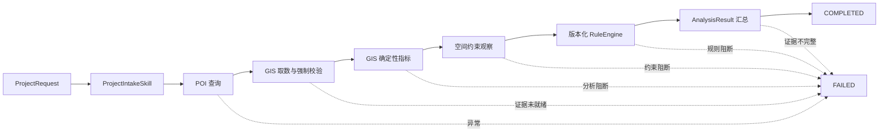

# 建设项目选址端到端 LangGraph 工作流

> 项目：建设项目选址与国土空间合规审查 Agent

## 一、目标

本阶段把已经独立测试的业务组件编排成一个不依赖 LLM 的确定性 LangGraph：



工作流负责控制执行顺序、失败路由和状态更新，不重新实现 POI、GIS 或规则逻辑。

## 二、为什么首个业务图不调用 LLM

当前链路中的核心判断都可以确定性执行：

- Pydantic 校验项目请求和配置。
- POI Gateway 执行规范化查询。
- GeoPandas/Shapely 计算面积、距离和相交。
- RuleEngine 按版本化规则映射政策证据。
- 结果节点按固定契约汇总证据。

在这些节点中加入 LLM 不会提高计算正确性，反而可能造成字段漂移、事实改写或法规幻觉。因此首个业务图把 LLM 留在边界之外。未来如需自然语言报告，LLM 只能读取最终结构化结果并生成解释，不能修改指标、规则命中或政策来源。

## 三、State、Node 与 Edge

### 3.1 State

图使用现有业务 `AgentState` 作为共享状态，其中包括：

- `request`：经过校验的项目请求。
- `profile`：项目类型对应的 Profile。
- `datasets`：带版本和 CRS 的数据清单。
- `poi_queries/poi_feature_sets/poi_evidence`：POI 查询与证据。
- `gis_evidence`：GIS 校验、指标和约束观察。
- `policy_evidence`：已评估规则版本和规则命中。
- `results`：每个候选地块的最终结构化结果。
- `errors`：节点失败摘要。
- `status`：流程状态。

每个业务函数返回新的 Pydantic 状态，图节点再将其转换为 LangGraph 状态更新，不原地修改输入对象。

### 3.2 Node

图包含六个业务节点和一个失败节点：

| 节点 | 调用的既有能力 | 主要输出 |
|---|---|---|
| `poi` | `execute_poi_queries()` | `POIFeatureSet`、`POIEvidence` |
| `gis_collection` | `collect_gis_evidence()` | GIS 数据状态、CRS 和几何校验结果 |
| `gis_metrics` | `run_gis_analysis()` | 面积、周长和缓冲指标 |
| `spatial_constraints` | `run_spatial_constraint_analysis()` | `ConstraintObservation` |
| `policy_rules` | `evaluate_policy_rules()` | `PolicyEvidence`、`PolicyFinding` |
| `results` | `assemble_analysis_results()` | `AnalysisResult` |
| `failed` | 终止失败流程 | `status=FAILED`、清空结果 |

### 3.3 Edge

每个业务节点后都有条件边：

```text
status != FAILED -> 下一个业务节点
status == FAILED -> failed -> END
```

这样可以保证一旦强制证据或规则执行失败，后续节点不会继续运行。例如 GIS 数据缺少 CRS 时，工作流不会进入面积计算、空间约束或规则判断。

## 四、显式依赖注入

`SiteSelectionWorkflowDependencies` 集中声明运行时依赖：

- `poi_gateway`
- `spatial_gateway`
- `constraint_specs`
- `rules`
- `buffer_distance_m`

工作流不在节点内部创建真实 API 客户端或数据库连接。这使测试可以注入 `MockPOIGateway` 与 `MockSpatialDatasetGateway`，生产环境以后可以替换为高德/百度 POI、PostGIS 或文件 Gateway，而不修改图结构。

依赖对象在编译图前校验：

- 至少存在一个空间约束配置。
- 至少存在一条版本化规则。
- 缓冲距离必须大于零。

API Key、数据库密码和 Redis 密码仍只从环境变量读取，不进入依赖模型、日志或 `AgentState`。

## 五、GIS 强制证据门

`collect_gis_evidence()` 的职责是把数据问题转换为 `READY/MISSING/INVALID`，它本身不一定抛异常。工作流增加 `_collect_ready_gis_evidence()` 强制门：只要任一候选地块不是 `READY`，立即停止全图。

该设计避免出现以下错误链路：

```text
缺少 CRS
-> 仍计算米制距离
-> 生成 ConstraintObservation
-> RuleEngine 输出看似合法的政策结论
```

正确链路为：

```text
缺少 CRS
-> GISEvidence.INVALID
-> WorkflowEvidenceBlockedError
-> AgentState.FAILED
```

## 六、节点异常与信息安全

`_safe_node()` 将节点执行统一包装为状态更新：

- 已知业务阻断异常：保留可操作的错误说明。
- 未知异常：只记录异常类型，不把原始异常文本写入 `AgentState`。

这可以防止第三方 SDK、数据库驱动或 Gateway 在异常消息中携带 Token、连接串等敏感信息。真实部署仍应在受控服务端日志中记录异常堆栈和关联 ID，但不能把敏感堆栈直接返回给最终用户。

## 七、AnalysisResult 汇总

`assemble_analysis_results()` 要求每个候选地块同时具备：

- `GISEvidence.READY`
- `POIEvidence.READY`
- `PolicyEvidence.READY`

缺失证据、非 READY 状态或同类证据重复都会抛出 `ResultAssemblyBlockedError`。

结果模型保持三类信息分离：

```text
GIS 硬事实 -> gis_evidence
POI 便利性/偏好 -> poi_evidence + overall_soft_score
政策规则 -> policy_evidence
```

当前 Profile 虽然定义了 POI 分组权重，但尚未定义每个指标的归一化区间、方向和封顶规则。因此工作流不会随意把 POI 数量换算为 0-100 分：

- `overall_soft_score=None`
- `warnings` 记录“尚未配置归一化评分规则”

如果上游以后提供经过验证的 `POIEvidence.soft_score`，汇总节点会原样写入 `overall_soft_score`，不会与政策规则命中混算。

## 八、状态语义

`AnalysisStatus.COMPLETED` 只表示：

- 所有图节点正常执行结束。
- 必需证据已经形成。
- `AnalysisResult` 已成功组装。

它不表示：

- 项目已经合规。
- 已经取得行政许可。
- 没有遗漏尚未配置的法规规则。
- POI 评分足以推翻硬约束。

因此当前结果中的 `conclusion` 保持 `None`。命中规则时写入警告并保留结构化 `PolicyFinding`；未命中时同样明确“未命中已配置规则不等于整体合规”。

## 九、运行入口

`run_site_selection_workflow()` 执行三个入口动作：

1. 使用 `ProjectIntakeSkill` 建立 Profile 和 POI 查询。
2. 将调用方提供的 `DatasetManifest` 写入初始状态。
3. 编译并执行端到端业务图，最后重新校验返回的 `AgentState`。

调用方必须显式提供数据清单和依赖，避免工作流隐式读取全局对象或开发机文件。

## 十、测试验收

新增 10 项测试，覆盖：

- 从项目请求到 `AnalysisResult` 的完整成功链路。
- GIS 指标、空间观察、规则版本和 POI 证据进入最终结果。
- 未命中规则时不生成合规结论。
- 缺 CRS 时进入失败状态且后续规则不执行。
- 规则所需空间观察缺失时进入失败状态。
- 未知 Gateway 异常消息脱敏。
- 约束、规则和缓冲距离依赖校验。
- 结果汇总必须具备 GIS、POI 和政策三类证据。
- 已有 POI 软评分可以被保留。

工作流、规则和空间约束组合测试为 `38 passed`；项目全量测试为 `157 passed, 1 existing warning`。现有 warning 来自 FastAPI 测试依赖的 Starlette/httpx 兼容性提示，与本次业务图无关。

## 十一、下一步

下一阶段优先定义 POI 评分契约，而不是立即接入 LLM：

```text
POI 指标
-> 指标方向与归一化区间
-> 分组得分
-> Profile 权重汇总
-> POIEvidence.soft_score
```

评分公式需要对商场和物流园分别配置，并保留指标原值、归一化参数和 Profile 版本，保证分数可解释、可复现。
